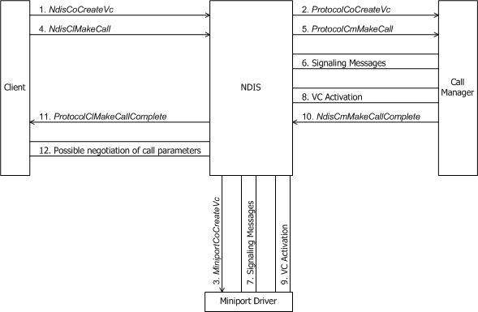
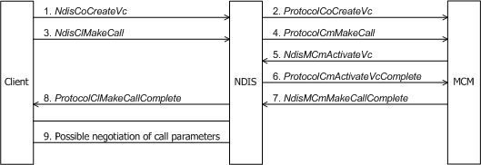

# Making a Call

The following figure shows a client making an outgoing call through a call manager.

The following figure shows a client making an outgoing call through an MCM driver.

Before making an outgoing call, a connection-oriented client must:

-   Initialize call parameters in a structure of type [**CO\_CALL\_PARAMETERS**](https://msdn.microsoft.com/library/windows/hardware/ff545384). The call manager or MCM driver typically uses the call parameters the client specifies to set up the call and to derive media parameters for use by the miniport driver.

-   Initiate the [creation of a VC](creating-a-vc.md) with [**NdisCoCreateVc**](https://msdn.microsoft.com/library/windows/hardware/ff561696).

On the successful return of **NdisCoCreateVc**, the client calls [**NdisClMakeCall**](https://msdn.microsoft.com/library/windows/hardware/ff561635) to initiate the call (see the two figures in this section).

In its call to **NdisClMakeCall**, the client passes a pointer to the CO\_CALL\_PARAMETERS structure initialized previously. The client also passes an *NdisVcHandle* (returned by **NdisCoCreateVc**) that identifies the VC on which the client will transmit (and perhaps receive) data for the call. If the client is making a multipoint call (a call to more than one remote party), it also passes a *ProtocolPartyContext* that specifies a handle to a client-allocated resident context area in which the client will maintain per-party state for the initial party on the multipoint VC.

The call to **NdisClMakeCall** causes NDIS to forward this request to the [**ProtocolCmMakeCall**](https://msdn.microsoft.com/library/windows/hardware/ff570246) function of the call manager or MCM driver with which the client shares the given *NdisVcHandle* . *ProtocolCmMakeCall* must validate the input call parameters that were set up by the client.

*ProtocolCmMakeCall* communicates (exchanges signaling messages) with network control devices to make a connection. A call manager calls [**NdisCoSendNetBufferLists**](https://msdn.microsoft.com/library/windows/hardware/ff561728) to initiate such an exchange (see [Sending NET\_BUFFER Structures from CoNDIS Drivers](sending-net-buffer-structures-from-condis-drivers.md)). An MCM driver never calls **NdisCoSendNetBufferLists**. Instead, it transmits the data directly across the network.

The call manager or MCM driver can modify the client-supplied call parameters while negotiating with relevant network components and can return different traffic parameters than the client originally gave to **NdisClMakeCall**(see [Incoming Request to Change Call Parameters](incoming-request-to-change-call-parameters.md)).

An explicit *NdisPartyHandle* passed to *ProtocolCmMakeCall* indicates that the VC created by the client will be used for a multipoint call. The call manager or MCM driver must allocate and initialize any necessary resources required to maintain per-party state information and control the multipoint call.

After a call manager has done all the necessary communication with its networking hardware as required by its medium, it must call [**NdisCmActivateVc**](https://msdn.microsoft.com/library/windows/hardware/ff561649) to initiate the [activation of the VC](activating-a-vc.md) on which call data will be sent and perhaps received. An MCM driver must call [**NdisMCmActivateVc**](https://msdn.microsoft.com/library/windows/hardware/ff562792).

When the underlying miniport driver is ready to make data transfers on the VC (that is, after the VC has been activated), a call manager calls [**NdisCmMakeCallComplete**](https://msdn.microsoft.com/library/windows/hardware/ff561677), and an MCM driver calls [**NdisMCmMakeCallComplete**](https://msdn.microsoft.com/library/windows/hardware/ff563544). At this point, the call manager or MCM driver should have negotiated with the network to establish call parameters for the VC, and the underlying miniport driver should have completed activation of the VC.

In the call to **Ndis(M)CmMakeCallComplete**, the call manager or MCM driver passes the call parameters for the VC as a pointer to a structure of type CO\_CALL\_PARAMETERS. If the call manager has modified the call parameters as originally specified by the client, it can notify the client by setting the CALL\_PARAMETERS\_CHANGED flag in the CO\_CALL\_PARAMETERS structure.

A call to **Ndis(M)CmMakeCallComplete** causes NDIS to call the [**ProtocolClMakeCallComplete**](https://msdn.microsoft.com/library/windows/hardware/ff570232) function of the client that originated the outgoing call. A call to *ProtocolClMakeCallComplete* indicates that the call manager has completed processing the client's request to establish a virtual connection with **NdisClMakeCall**.

If the client's attempt to establish an outgoing call was successful, *ProtocolClMakeCallComplete* should check the CALL\_PARAMETERS\_CHANGED flag to determine whether the call parameters originally specified by the client were modified. If the flag is set, indicating that the call parameters were changed, *ProtocolClMakeCallComplete* should examine the returned call parameters to determine whether they are acceptable for this connection.

If the call parameters are acceptable, *ProtocolClMakeCallComplete* simply returns control. If the call parameters are not acceptable and if the signaling protocol allows renegotiation at this point, the client can call [**NdisClModifyCallQoS**](https://msdn.microsoft.com/library/windows/hardware/ff561636) to request a change in call parameters (see [Client-Initiated Request to Close a Call](client-initiated-request-to-close-a-call.md)). If the signaling protocol does not allow renegotiation of unacceptable call parameters, *ProtocolClMakeCallComplete* must tear down the call with **NdisClCloseCall**(see Client-Initiated Request to Close a Call).

 

 

