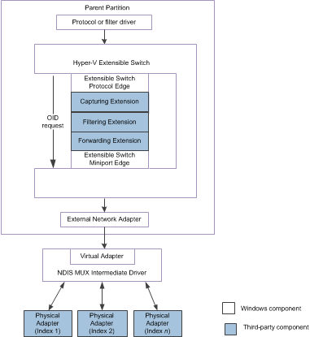

# Managing Hardware Offload OID Requests to Physical Network Adapters

This topic discusses how a Hyper-V extensible switch forwarding extension manages object identifier (OID) requests for hardware offload technologies on underlying physical adapters over the extensible switch control path.

For example, the external network adapter can be bound to the virtual miniport edge of an NDIS multiplexer (MUX) intermediate driver. The MUX driver is bound to a team of one or more physical networks on the host. This configuration is known as an *extensible switch team*.

In this configuration, an extensible switch extension is exposed to every network adapter in the team. This allows the extension to manage the configuration and use of individual network adapters in the team. For example, a forwarding extension can provide support for a load balancing failover (LBFO) solution over the team by forwarding outgoing packets to individual adapters. A forwarding extension that manages an extensible switch team is known as a *teaming provider*. For more information about teaming providers, see [Teaming Provider Extensions](teaming-provider-extensions.md).

The following figure shows an example of an extensible switch team for NDIS 6.40 (Windows Server 2012 R2) and later.

The following figure shows an example of an extensible switch team for NDIS 6.30 (Windows Server 2012).

**Note**  In the extensible switch interface, NDIS filter drivers are known as *extensible switch extensions* and the driver stack is known as the *extensible switch driver stack*.

 

By handling the OID request of [OID\_SWITCH\_NIC\_REQUEST](https://msdn.microsoft.com/library/windows/hardware/hh598266), a forwarding extension can participate in the configuration of the extensible switch team for hardware offloads. For example, if the extension manages the physical network adapters of an extensible switch team, it can forward the OID\_SWITCH\_NIC\_REQUEST request to a physical adapter that supports the hardware offload.

NDIS and overlying protocol and filter drivers can issue OID requests for hardware offload technologies to the underlying physical network adapter. When these OID requests arrive at the extensible switch interface, it encapsulates the OID request inside an [**NDIS\_SWITCH\_NIC\_OID\_REQUEST**](https://msdn.microsoft.com/library/windows/hardware/hh598214). Then, the protocol edge of the extensible switch issues an OID request of [OID\_SWITCH\_NIC\_REQUEST](https://msdn.microsoft.com/library/windows/hardware/hh598266) that contains this structure.

The extensible switch interface encapsulates OIDs for the following hardware offload technologies:

Internet Protocol security (IPsec) offload (version 2)  
The following IPsec OID requests are encapsulated:

-   [OID\_TCP\_TASK\_IPSEC\_OFFLOAD\_V2\_ADD\_SA](https://msdn.microsoft.com/library/windows/hardware/ff569812)

-   [OID\_TCP\_TASK\_IPSEC\_OFFLOAD\_V2\_ADD\_SA\_EX](https://msdn.microsoft.com/library/windows/hardware/hh451937)

-   [OID\_TCP\_TASK\_IPSEC\_OFFLOAD\_V2\_DELETE\_SA](https://msdn.microsoft.com/library/windows/hardware/ff569813)

-   [OID\_TCP\_TASK\_IPSEC\_OFFLOAD\_V2\_UPDATE\_SA](https://msdn.microsoft.com/library/windows/hardware/ff569814)

The forwarding extension must not fail, or *veto*, these OID requests.

For more information about version 2 of the IPsec hardware offload technology, see [IPsec Offload Version 2](ipsec-offload-version-2.md).

Single root I/O virtualization (SR-IOV)  
The following SR-IOV OID requests are encapsulated:

-   [OID\_NIC\_SWITCH\_ALLOCATE\_VF](https://msdn.microsoft.com/library/windows/hardware/hh451814)

-   [OID\_NIC\_SWITCH\_CREATE\_VPORT](https://msdn.microsoft.com/library/windows/hardware/hh451816)

-   [OID\_NIC\_SWITCH\_DELETE\_VPORT](https://msdn.microsoft.com/library/windows/hardware/hh451818)

-   [OID\_NIC\_SWITCH\_FREE\_VF](https://msdn.microsoft.com/library/windows/hardware/hh451822)

-   [OID\_RECEIVE\_FILTER\_CLEAR\_FILTER](https://msdn.microsoft.com/library/windows/hardware/ff569785)

-   [OID\_RECEIVE\_FILTER\_MOVE\_FILTER](https://msdn.microsoft.com/library/windows/hardware/hh451845)

The forwarding extension can veto OID requests of [OID\_NIC\_SWITCH\_ALLOCATE\_VF](https://msdn.microsoft.com/library/windows/hardware/hh451814) and [OID\_NIC\_SWITCH\_CREATE\_VPORT](https://msdn.microsoft.com/library/windows/hardware/hh451816) by completing the request with a status code other than NDIS\_STATUS\_SUCCESS. However, the extension must not veto the other SR-IOV OID requests.

For more information about the SR-IOV hardware offload technology, see [Single Root I/O Virtualization (SR-IOV)](single-root-i-o-virtualization--sr-iov-.md).

Virtualized machine queue (VMQ)  
The following VMQ OID requests are encapsulated:

-   [OID\_RECEIVE\_FILTER\_ALLOCATE\_QUEUE](https://msdn.microsoft.com/library/windows/hardware/ff569784)

-   [OID\_RECEIVE\_FILTER\_CLEAR\_FILTER](https://msdn.microsoft.com/library/windows/hardware/ff569785)

-   [OID\_RECEIVE\_FILTER\_FREE\_QUEUE](https://msdn.microsoft.com/library/windows/hardware/ff569789)

-   [OID\_RECEIVE\_FILTER\_QUEUE\_ALLOCATION\_COMPLETE](https://msdn.microsoft.com/library/windows/hardware/ff569793)

-   [OID\_RECEIVE\_FILTER\_SET\_FILTER](https://msdn.microsoft.com/library/windows/hardware/ff569795)

The forwarding extension can veto OID requests of [OID\_RECEIVE\_FILTER\_ALLOCATE\_QUEUE](https://msdn.microsoft.com/library/windows/hardware/ff569784) and [OID\_RECEIVE\_FILTER\_SET\_FILTER](https://msdn.microsoft.com/library/windows/hardware/ff569795) by completing the request with a status code other than NDIS\_STATUS\_SUCCESS. However, the extension must not veto the other VMQ OID requests.

For more information about the VMQ hardware offload technology, see [Virtual Machine Queue (VMQ)](virtual-machine-queue--vmq-.md).

The forwarding extension must follow these guidelines for handling hardware offload OID requests:

-   The Microsoft IM platform advertises only the common offload capabilities for the overall team. However, the extension can generate OID requests to query the capabilities of each adapter in the team.

    Once the extension has determined the hardware capabilities of the physical adapters in the team, it can forward OID set requests for hardware offloads to an adapter that is best suited for the offload.

-   All hardware offload OID requests that are originated by overlying protocol or filter drivers will be encapsulated within a [**NDIS\_SWITCH\_NIC\_OID\_REQUEST**](https://msdn.microsoft.com/library/windows/hardware/hh598214) structure. All hardware offload OID requests that are originated by the forwarding extension must also be encapsulated in an **NDIS\_SWITCH\_NIC\_OID\_REQUEST** structure.

    The extension forwards the encapsulated OID request to an underlying physical network adapter through an OID set request of [OID\_SWITCH\_NIC\_REQUEST](https://msdn.microsoft.com/library/windows/hardware/hh598266). For more information on this procedure, see [Forwarding OID Requests to Physical Network Adapters](forwarding-oid-requests-to-physical-network-adapters.md).

-   The extension must not modify or fail hardware offload OID requests to clear, free, or complete the allocation of offload resources. For example, the extension must not fail OID requests of [OID\_RECEIVE\_FILTER\_CLEAR\_FILTER](https://msdn.microsoft.com/library/windows/hardware/ff569785) or [OID\_NIC\_SWITCH\_DELETE\_VPORT](https://msdn.microsoft.com/library/windows/hardware/hh451818). The extensible switch interface must handle these OID requests to clean up state information for these resources.

    The extension can modify or fail hardware offload OID requests to allocate, move, or set offload resources. For example, the extension can fail or modify OID requests of [OID\_NIC\_SWITCH\_ALLOCATE\_VF](https://msdn.microsoft.com/library/windows/hardware/hh451814) or [OID\_TCP\_TASK\_IPSEC\_OFFLOAD\_V2\_ADD\_SA](https://msdn.microsoft.com/library/windows/hardware/ff569812).

-   The extension can originate any hardware offload OIDs to an underlying physical network adapter. However, the extension must not originate a hardware offload OID that clears or frees offload resources that the extension did not allocate.

    For example, the extension must not originate a hardware offload OID request of [OID\_RECEIVE\_FILTER\_FREE\_QUEUE](https://msdn.microsoft.com/library/windows/hardware/ff569789) if it did not originate an [OID\_RECEIVE\_FILTER\_ALLOCATE\_QUEUE](https://msdn.microsoft.com/library/windows/hardware/ff569784) request for the same queue.

    **Note**  The extension can only originate its own encapsulated hardware offload OID request if it is filtering the same OID request that was issued by overlying drivers. In this case, the extension must not forward the original OID request. Instead, the extension must call [**NdisFOidRequestComplete**](https://msdn.microsoft.com/library/windows/hardware/ff561833) to complete this request when NDIS calls its [*FilterOidRequestComplete*](https://msdn.microsoft.com/library/windows/hardware/ff549956) to complete the originated OID request.

     

-   If the extension is forwarding a hardware offload OID request to an underlying physical network adapter, the **DestinationNicIndex** member of the [**NDIS\_SWITCH\_NIC\_OID\_REQUEST**](https://msdn.microsoft.com/library/windows/hardware/hh598214) structure must be set to the nonzero index value of the adapter. For more information on these index values, see [Network Adapter Index Values](network-adapter-index-values.md).

    Also, the **DestinationPortId** member must be set to the identifier of the extensible switch port to which the external network adapter is connected.

-   If the extension is originating a hardware offload OID request to allocate resources for a Hyper-V child partition, the **SourcePortId** member of the [**NDIS\_SWITCH\_NIC\_OID\_REQUEST**](https://msdn.microsoft.com/library/windows/hardware/hh598214) structure must be set to the identifier of the extensible switch port to which the partition is connected.

    The **SourceNicIndex** member must be set to **NDIS\_SWITCH\_DEFAULT\_NIC\_INDEX**.

-   When the extension calls [**NdisFOidRequest**](https://msdn.microsoft.com/library/windows/hardware/ff561830) to forward the OID request, it must set the *OidRequest* parameter to a pointer to an [**NDIS\_OID\_REQUEST**](https://msdn.microsoft.com/library/windows/hardware/ff566710) structure for an [OID\_SWITCH\_NIC\_REQUEST](https://msdn.microsoft.com/library/windows/hardware/hh598266) OID request.

For more information on how the extension filters OID requests, see [Filtering OID Requests in an NDIS Filter Driver](filtering-oid-requests-in-an-ndis-filter-driver.md).

For more information on MUX drivers, see [NDIS MUX Intermediate Drivers](ndis-mux-intermediate-drivers.md).

 

 

