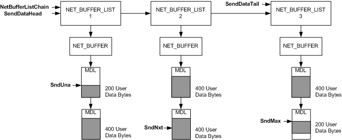

# Mapping SndUna, SndNxt, and SndMax to the MDLs

\[The TCP chimney offload feature is deprecated and should not be used.\]

The following figure shows how an offload target maps the bytes that are indicated by the **SndUna**, **SndNxt**, and **SndMax** members of the [**TCP\_OFFLOAD\_STATE\_DELEGATED**](https://msdn.microsoft.com/library/windows/hardware/ff570939) structure to the send data.

In the preceding figure, the linked list that is referenced by the pointer in the **NetBufferListChain** member contains three NET\_BUFFER\_LIST structures. There is a NET\_BUFFER structure associated with each NET\_BUFFER\_LIST structure. The send data is distributed across MDLs that are associated with these NET\_BUFFER structures.

Note the pointers in the **SendDataHead** and **SendDataTail** members at the top of the figure:

-   The pointer in **SendDataHead** points to the first NET\_BUFFER\_LIST structure whose NET\_BUFFER structure has associated send data. This pointer and the pointer in the **NetBufferListChain** member reference the same NET\_BUFFER\_LIST structure.

-   The pointer in **SendDataTail** points to the last NET\_BUFFER\_LIST structure whose NET\_BUFFER structure has associated send data.

The **SendDataHead** and **SendDataTail** members are in the [**TCP\_OFFLOAD\_STATE\_DELEGATED**](https://msdn.microsoft.com/library/windows/hardware/ff570939) structure that the host stack offloaded for the connection. The TCP\_OFFLOAD\_STATE\_DELEGATED structure immediately follows in memory the [**NDIS\_MINIPORT\_OFFLOAD\_BLOCK\_LIST**](https://msdn.microsoft.com/library/windows/hardware/ff566469) structure that contains the **NetBufferListChain** member.

The byte that is indicated by **SndUna** maps to the first byte of data in the linked list. The offload target obtains the location of this byte by calling the [**NET\_BUFFER\_CURRENT\_MDL\_OFFSET**](https://msdn.microsoft.com/library/windows/hardware/ff568380) macro. The value that is returned by this macro specifies the offset, in bytes, to the beginning of the used data space in the MDL that is specified by the **CurrentMdl** member of the [**NET\_BUFFER**](https://msdn.microsoft.com/library/windows/hardware/ff568376) structure.

To locate the first byte of send data to be transmitted, the offload target subtracts the sequence number in **SndUna** from the sequence number in **SndNxt** and then traverses the MDL chain ( **SndNxt**- **SndUna**) bytes from the byte that is indicated by **SndUna**. For example, if **SndNxt**- **SndUna**= 1000, the offload target traverses the MDL chain **SndUna**+ 1000 bytes to find the byte that is indicated by **SndNxt**.

To find the byte that is indicated by **SndMax**, the offload target subtracts the sequence number in **SndUna** from the sequence number in **SndMax** and then traverses the MDL chain ( **SndMax**- **SndUna**) bytes from the byte that is indicated by **SndUna**. For example, if **SndMax**- **SndUna**= 1600, the offload target traverses the MDL chain **SndUna**+ 1600 bytes to find the byte that is indicated by **SndMax**.

 

 

