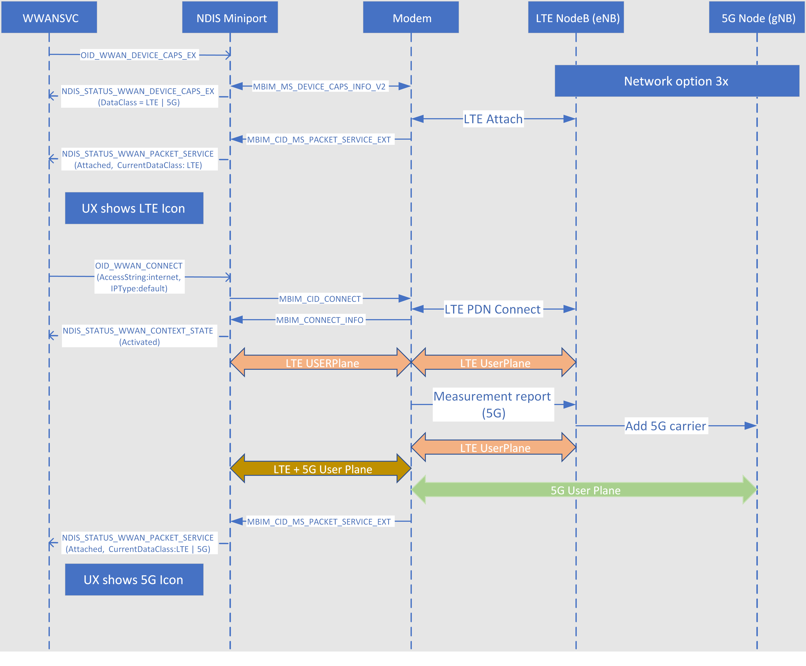

# MB 5G data class support

## Terminology

This topic uses the following terms:

| Term | Definition |
| --- | --- |
| NR | New Radio. NR is the term used in 3GPP when referring to 5G. |
| MBB | Mobile broadband. |
| NGC | Next Generation Core. The core of 5G. |
| DC | Dual Connectivity. The network can support both LTE and 5G NR, including dual connectivity with which devices have simultaneous connections to LTE and NR. |
| SA | Standalone. The device can set up a call on 5G. |
| NSA | Non-standalone. The device sets up a call on LTE and adds a new 5G carrier for data traffic. |
| gNB | A node that supports NR as well as connectivity to NGC. |

## Overview

Windows 10, version 1903 is the first Windows release to support 5G mobile broadband drivers for IHV partners. The name *5G* is friendly name for New Radio (NR), which was introduced in the [3GPP Release 15 specification](http://www.3gpp.org/release-15). Comprehensive specifications on the NR air interface, radio access network (RAN) technology and interface, basic network slicing concepts, and other aspects of NR are defined in the [3GPP TS 38.xx series of specifications](http://www.3gpp.org/DynaReport/38-series.htm). These specifications form the foundation for the wider ecosystem to prepare for the first phase of end-to-end 5G deployment around the world in 2019.

NR is a comprehensive set of standards that provide true long-term evolution to existing 4th-generation LTE technologies, covering everything from narrowband to ultra-broadband, and from nominal-latency to ultra-reliable/low-latency communications. As a technology, 5G is expected to develop over a decade-long time frame. This topic describes the first steps for Windows support of 5G in Windows 10, version 1903, starting with 5G enhanced mobile broadband (eMBB).

## Windows 5G architectural considerations

### MBIM interface

As of Windows 10, version 1903, 5G on the whole is still developing and all future requirements are not known. Therefore, 5G support in Windows is easily extensible and, in parallel, is fully backward compatible with legacy modems. If possible, existing services and MBIM CID messages are used for 5G services. If it is not possible to use existing CID messages without breaking backwards compatibility, new CIDs are defined under the preexisting UUID_BASIC_CONNECT_EXT service group. Thus, all new or modified CIDs are optional and no new CIDs are sent to the modem unless the modem has explicitly stated support for them.

For existing CID messages, there is no option to add version information. Typically, a CID message has a static body followed by a dynamic buffer for invariant fields. Unless the static part of the message has reserved fields, it is not possible to use that existing CID for 5G extension.

For a clean design that is open for future enhancements, Windows defines new CIDs for 5G and adds a version field in those new CIDs for future expansion.

### NDIS interface

NDIS supports a revision number in the NDIS_HEADER. This permits adding new members to an OID message, although not all miniport drivers respect version numbering and cannot tolerate new revisions. In this case, the miniport driver version can be used to determine if the driver supports the newer version of the OID or not. However, because this adds a dependency to the IHV driver, instead NDIS uses the optional service caps table in [OID_WWAN_DEVICE_CAPS_EX](oid-wwan-device-caps-ex.md).

## 5G dual connectivity support

In the the 3GPP release 15 phase of 5G, 5G networks are non-standalone (NSA) NR. This enables NSA NR deployment for fast adoption of 5G NG and performance robustness. [3GPP TS 38.801](https://portal.3gpp.org/desktopmodules/Specifications/SpecificationDetails.aspx?specificationId=3056) specifies the three architecture options (3/3A/3X) for how the gNB is connected to the evolved packet core (EPC). These three options are illustrated in the [Carrier Aggregation and Dual Connectivity](https://www.its.bldrdoc.gov/media/66437/ratasuk_isart2017.pdf) document.

Windows must know if dual connectivity (DC) is supported by the modem and the network. If DC is supported, Windows can use existing OID and MBIM messages to communicate with the modem. This is because the modem registers to the LTE EPC and existing OIDs and MBIM messages support it.

> [!IMPORTANT]
> For Windows 10, version 1903, this topic assumes only DC with NSA NR is supported, and that standalone (SR) NR is not supported. For older modems that don't support DC, functionality is the same as it was in Windows 10, version 1809.

### 5G data class

For MBIM, two new data classes have been defined.

| Type | Mask | Description |
| --- | --- | --- |
| MBIMDataClass5G_NSA | 40h | Non-standalone NR support. |
| MBIMDataClass5G_SA | 80h | Standalone NR support. |

For the NDIS interface, these two new data classes have been added to the [**WWAN_DEVICE_CAPS_EX**](https://docs.microsoft.com/windows-hardware/drivers/ddi/content/wwan/ns-wwan-_wwan_device_caps_ex) structure.

The `WWANSVC` queries modem capabilities during the early phase of boot by sending the [OID_WWAN_DEVICE_CAPS_EX](oid-wwan-device-caps-ex.md) OID to the miniport driver.

### 5G dual connectivity mode

The `WWANSVC` must know if the modem has registered with a 5G DC-capable network. This information is needed after initial packet registration is complete. To support this, in Windows 10, version 1903 a new CID is defined called MBIM_CID_MS_PACKET_SERVICE_V2 that contains information for the available data classes and current data class. If the modem has registered to a DC-capable network, it must set **CurrentDataClass** to MBIM_DATA_CLASS_5G_NSA. This tells the `WWANSVC` that DC NSA is used.

The following table shows how the **CurrentDataClass** field is reported by the modem based on available network topology and modem capabilities. There can be only one network topology, but modems can support multiple capabilities. Note that data classes lower than LTE have been left out to simplify the table.

| Modem capabilitiy | LTE only network topology | Non-standalone (NSA) network topology | Standalone (SA) network topology |
| --- | --- | --- | --- |
| Dual connectivity (NSA) | LTE | 5G_NSA | LTE |
| 5G only (SA) | LTE | LTE | 5G_SA |
| 5G + dual connectivity (NSA + SA) | LTE | 5G_NSA | 5G_SA |

### 5G icon

The data icon shown by the Windows UX is based on the **CurrentDataClass** field of the [**WWAN_PACKET_SERVICE**](https://docs.microsoft.com/windows-hardware/drivers/ddi/content/wwan/ns-wwan-_wwan_packet_service) structure, which is updated based on [OID_WWAN_PACKET_SERVICE](oid-wwan-packet-service.md). 

The 5G data icon is shown when the modem triggers an unsolicited MBIM_CID_MS_PACKET_SERVICE_V2 event, where the **CurrentDataClass** is set to either MBIMDataClass5G_NSA (NSA mode) or MBIMDataClass5G_SA (SA mode). The miniport driver converts this to an [NDIS_STATUS_WWAN_PACKET_SERVICE](ndis-status-wwan-packet-service.md) notification and sends it to the `WWANSVC`. The UX interprets both **WWAN_DATA_CLASS_5G_NSA** and **WWAN_DATA_CLASS_5G_SA** in the **CurrentDataClass** field as the 5G interface object.

The following diagram illustrates the flow for 5G icon availability, after a 5G carrier has been added.

Additionally, some mobile operators or OEMs require that they can differentiate between a modem that is camped on frequency range (FR) FR1 or FR2 in 5G. Tu support this, the MBIM_CID_MS_PACKET_SERVICE_V2 message contains a new field called **FrequencyRange**. This field is only valid if **CurrentDataClass** has been set to either **MBIMDataClassLTE | MBIMDataClass5G** or **MBIMDataClass5G**.

### Signal strength

Signal strength is reported using new reference signal received power (RSRP) and Signal-to-Noise (SNR) fields. Currently, the received signal strength indicator (RSSI) is calculated by the modem, then reported to the miniport driver using an unsolicited MBIM_SIGNAL_STATE_INFO event. The UX uses the [**WWAN_SIGNAL_STATE*](https://docs.microsoft.com/windows-hardware/drivers/ddi/content/wwan/ns-wwan-_wwan_signal_state) structure that the miniport driver sends in an [NDIS_STATUS_WWAN_SIGNAL_STATE](ndis-status-wwan-signal-state.md) notification to fetch the RSSI reading. The `WWANSVC` converts the RSRP/SNR to the RSSI in Windows 10, version 1903.

By default, the `WWANSVC` maps RSSI coded values to signal bars based on the following table.

| Signal strength (in dBm) | Coded values (0-31) | Number of signal bars |
| --- | --- | --- |
| \<= -110 | 0-1 | 0 |
| \<= -107 | 2-3 | 1 |
| \<= -101 | 4-6 | 2 |
| \<= -91 | 7-11 | 3 |
| \<= -81 | 12-16 | 4 |
| \<= -51 | 17-31 | 5 |

[Desktop COSA](../mobilebroadband/planning-your-desktop-cosa-apn-database-submission.md) can be used to change the RSSI to signal bar mappings per mobile operator requirements. However, desktop COSA does not support mapping per technology, so each radio access technology (RAT) uses the same mappings. Because scaling is limited, this might not meet each operator's requirements.

To make the signal more scalable, the new MBIM_CID_MS_SIGNAL_STATE_V2 message has been defined. This message is backwards compatible and introduces RSRP and SNR for both LTE and 5G. It enables sending signal events per technology.

The signal strength reported by the modem is based on the current data class. If the modem is connected to both LTE and 5G (DC), then the 5G RSSI is reported. If the 5G icon is displayed, then the signal strength indicator reported by the modem is based on a 5G carrier.

## MBIM Extensions release 2.0

## MBIM service and CID values

| Service name | UUID | UUID value |
| --- | --- | --- |
| Microsoft Basic IP Connectivity Extensions | UUID_BASIC_CONNECT_EXTENSIONS | 3D01DCC5-FEF5-4D05-9D3A-BEF7058E9AAF |

## MBIM_CID_VERSION

## MBIM_CID_MS_DEVICE_CAPS_V2

## MBIM_CID_REGISTER_STATE

## MBIM_CID_PACKET_SERVICE

## MBIM_CID_SIGNAL_STATE