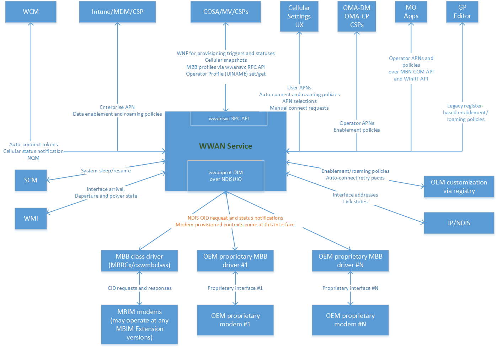
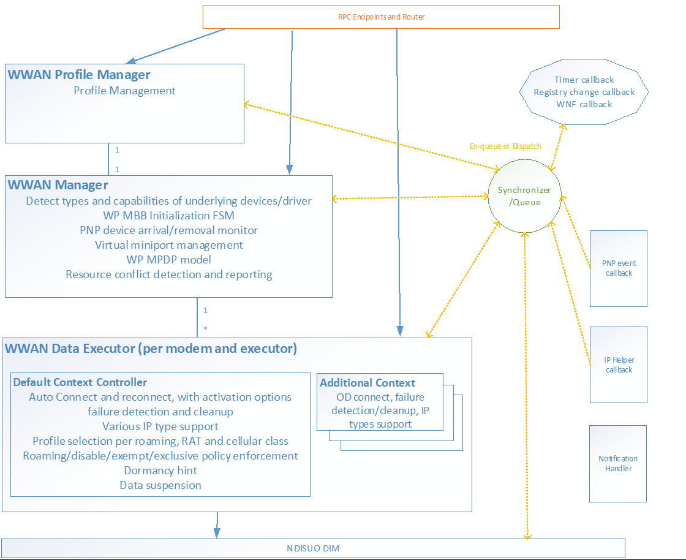
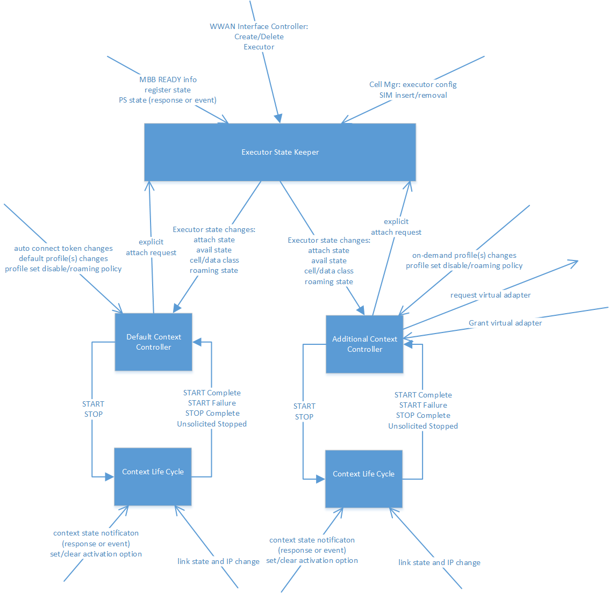
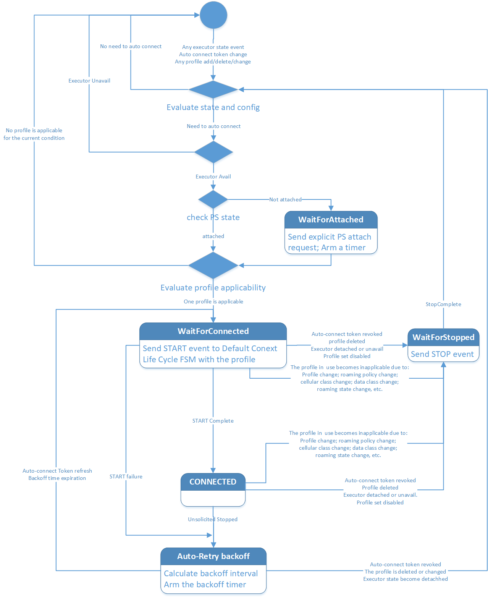
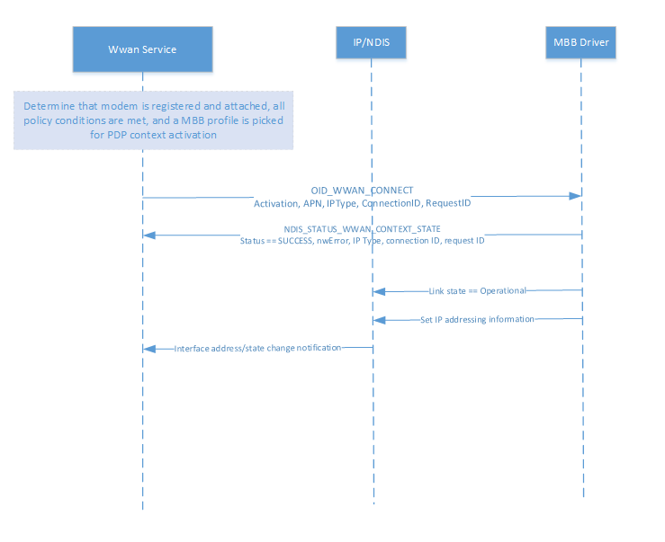
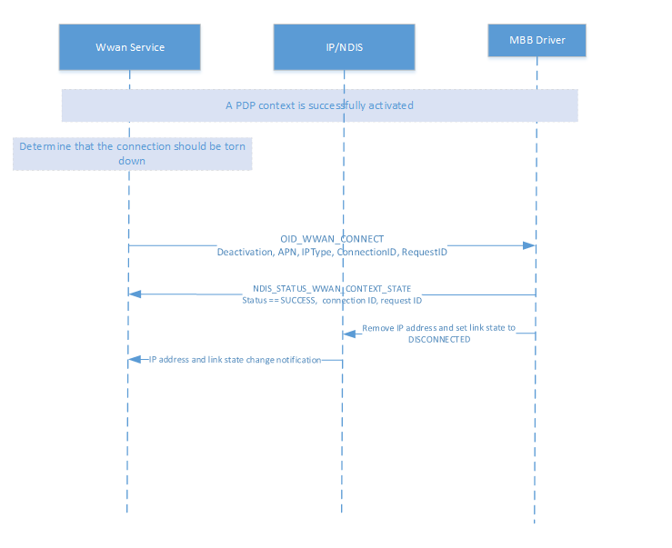
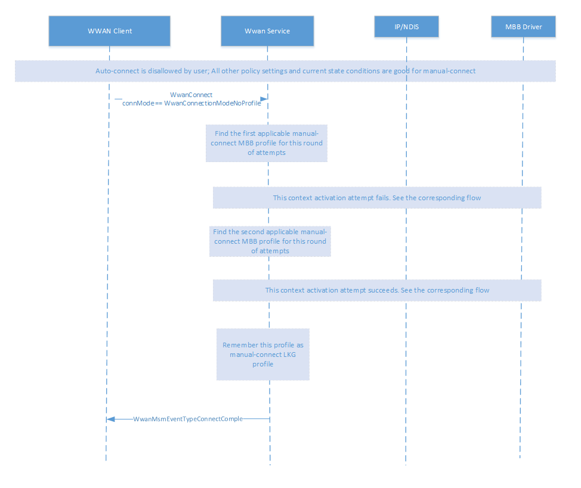

# MB Data Connectivity

## Summary

- How data connectivity components interact 
  - [Cellular Architecture in Windows](#cellular-architecture-in-windows)
  - [General block diagram of components involved in basic data connectivity](#general-block-diagram-of-components-involved-in-basic-data-connectivity)
  - [Interactions between the Default Context Controller and its immediate neighbors](#interactions-between-the-default-context-controller-and-its-immediate-neighbors)
- How the [Default Context Controller](#default-context-controller) manages the internet data connection
- The [data connectivity flows](#mb-data-connectivity-flows) between WWAN Service and the modem
- [Hardware Lab Kit (HLK) tests](#hardware-lab-kit-hlk-tests)
- [Manual Tests](#manual-tests) for cellular connection
- [MB data connectivity troubleshooting guide](#mb-data-connectivity-troubleshooting-guide)

## Cellular Architecture in Windows
The main componment of the cellular stack in the OS is **WWAN Service (WwanSvc)** which controls and sets up all the data connection, states, and events.
It interacts with a couple of client drivers to enable activities across the OS.



The acronyms in the preceding image:

- **COSA:** Country & Operator Settings Asset
- **CSP:** Configuration Service Provider
- **GP Editor:** Group Policy Editor
- **MDM:** Mobile Device Management
- **MBBCx:**  Mobile Broadband WDF class extension
- **MO:** Mobile Operator
- **MV:** Multivariant (framework that associates SIMs with corresponding data from the COSA database)
- **NDISUIO:** NDIS Usermode I/O
- **NQM:** Network Quiet Mode
- **OEM:** Original Equipment Manufacturer
- **OMA-DM:** Open Mobile Alliance – Device Management
- **OMA-CP:** Open Mobile Alliance – Client Provisioning
- **SCM:** Service Control Manager
- **WCM:** Windows Connection Manager
- **WMI:** Windows Management Instrumentation
- **WNF:** Windows Notification Facility
- **wwanprot DIM:** WWAN Protocol Driver Interface Model
- **wwansvc:** WWAN Service

For more information on individual components, see [Cellular architecture](cellular-architecture-and-driver-model.md).

## General block diagram of components involved in basic data connectivity

The main state machines resides in the Default Context Controller and its associated Context Life Cycle object.



## Interactions between the Default Context Controller and its immediate neighbors


## Default Context Controller
The Default Context Controller controls the internet data connection.
It manages the cellular data connection base on either auto-connect or manual connect, with or without a profile.

The Default Context Controller performs the following tasks:

-  Performs auto-connect, back-off, and auto-retry for cell internet connection
-  There is one instance of the Default Context Controller for each primary/physical interface, where each instance:
   - Receives and keeps related policy settings from various sources
   - Receives and keeps related state information (SIM state, reg state, packet service state, iWLAN state, ICCID/IMSI, etc.)
-  MBB profile evaluation
   - Evaluates whether an MBB profile is applicable for the current policy settings and cellular states

-  In the Vibranium release or older:
   - Keeps track of add/delete/update of related MBB profiles and keeps a list of them
   - Selects profiles for activation (priority rings, previous profile, auto-connect order, LKG profile, purchase profile, provisioned context profile, etc.)

-  In the Manganese release:
   - Profile Administrator handles the profile selection for activation 
-  Back-off interval calculation and timer
-  Handles cellular Internet manual connect requests (profile or no-profile mode)
-  Uses an instance of  the class CWwanContextLifeCycle to activate a connection with an MBB profile
 
The Default Context Controller uses a finite state machine to manage its tasks. 

### Finite state machine transitions of the Default Context Controller


### Auto-connect
#### Policy settings that need to be met for auto-connect
|Policy Setting|Config from|Config Unit|
|---|---|---|
|EnabledInternet|from users via UI in phones| per system|
|highestConnCategory | from Admin/User/Operator/Device via UI|  per interface
|ClientDisableAutoConnect | from user via UI in desktops| per interface
|OperatorServiceEnablement| from MO via OTA|per interface
|GPolicyDisableAutoConnect |group policy via registry| per system
|mdmDataEnablementPolicy | from MDM, notified via WNF (OnEnforced/OffEnforced/NoPolicy)| per system
|mdmRoamingPolicy | from MDM, notified via WNF (DisabledEnforced/EnabledEnforced/NoPolicy)| per system

#### States that need to be concerned about auto-connect
|State|Value|
|---|---|
|System power state | S0/S3/S4/D0/D3/D4
|device power state | D0/D3/D4
|Ready state | Initialized/ICCID 
|IMSI | affects applicability of IMSI-conditioned profiles
|IWLAN state | affect applicability of IWLAN only/OK profiles
|Registration state | Home/Roam/Partner
|provider ID | may cancel back-off and trigger immediate retry
|Packet service state | Detached/Attached
|Current data class | may trip highestConnCategory policy and affect applicability of data class conditioned profiles
|RnR State | RnR in progress

#### MB profile applicability for auto-connect
-  SimIccID: Must match the ICCID of current SIM at the interface (except for AnyICCID)
-  IsAdditionalPdpContextProfile: Must be false (except for purchase profile)
-  ConnectionMode: Auto or auto-home
-  ProfileCreationType: At or below the highestConnCategory (Admin/User/Operator/Device)
-  CellularClass (v4): 3GPP/3GPP2 
-  RATApplicability (v4): LTE_eHRPD/3GPP_LEGACY
-  RoamApplicability (v4): NonPartnerOnly/PartnerOnly/HomeOnly/ HomeAndPartner/PartnerAndNonpartner/AllRoaming; except for iWLAN profile and iWLAN available
-  IMSI (v4): If present, must match current IMSI. For multi-app SIMs
-  AdminEnable (v4): Is not administratively disabled
-  AdminRoamControl (v4): Is not administratively roam-controlled out except for iWLAN profile and iWLAN available
####  Selection of MBB profiles for auto-connect in VB
- Priority rings:
    - Are based on [ProfileCreationType](/windows/win32/mbn/schema-profilecreationtype-mbnprofile-element): AdminProvisioned, UserProvisioned, OperatorProvisioned, and DeviceProvisioned.
	- An applicable profile in a higher priority ring excludes all profiles in lower priority rings.
- Modem provisioned profiles:
	- Are based on provisioned contexts.
	- Have the same ring as DeviceProvisioned profiles with subtle details.
- Purchase profiles are special.
- One round of auto-connect and retry attempts: 
	- Will try all applicable profiles in the highest priority ring with any applicable profile, plus all applicable purchase profiles.
	- Each profile in one round has at most one chance.
    - If connection with a profile succeeds with a valid IP, the round stops and the profile is designated the last known good (LKG) profile.
#### Order of profiles in one round of attempts in VB
If one round of attempts has multiple MBB profiles, the order is:
- LKG profile if it is present and is a non-purchase profile.
- Non-purchase modem provisioned profiles. If there are more than one, the order of these profiles is unspecified. 
- All non-purchase profiles with explicit AutoConnectOrder, in order of increasing AutoConnectOrder. If an AutoConnectOrder has more than one profiles, the order of these profiles is unspecified.
- All non-purchase profiles with no explicit AutoConnectOrder. If there are more than one, the order of these profiles is unspecified.
- All purchase profiles. If there are more than one, the order of these profiles is unspecified. 
#### Exponential back-off
-  Pause for a certain amount of time before retry after failures to activate all applicable MBB profiles in a retry round.
-  Commonly used technique in random access media to avoid re-collision after a collision.
-  Back-off happens after all profiles in one round of attempts fail to connect.
-  There is no back-off between retries of two profiles inside one round.
-  The base exponential back-off algorithm: Initial back-off 3 seconds, exponential factor 3, with cap of 24 hours. For example: 3, 9, 27, 81, ….
-  Special network cause codes for slow-pace retry (initial back-off 300 seconds):
	-  WWAN_ERR_3GPP_SO_NOT_SUBSCRIBED,                // 33
	-  WWAN_ERR_3GPP_AUTH_FAILURE,                     // 29
	-   WWAN_ERR_3GPP_INSUFFICIENT_RESOURCES,           // 26
	-   WWAN_ERR_3GPP_UNKNOWN_PDP_ADDRESS_TYPE,         // 28
	-   WWAN_ERR_3GPP_ACTIVATION_REJECT                 /
-  OEM can customize the initial back-off. Each code can have one of these three catagories:
	-  Normal-pace: the same as the base case (3 seconds)
	-  Slow-pace: 300 seconds
	-  Glacier-pace: 24 hours (practically no retry)

#### Back-off cancelation or back-off timer expiration
- Back-off can be cancelled and retry commenced immediately in these situations:
    - Auto-connect hint from WCM
	- Auto-connect MBB profiles are added or updated
	- Device roams to a different MO
	- Highest connection category policy is changed
	
- If a manual connect request comes during back-off, back-off is canceled and manual connect procedure commences.

- Back-off will be cancelled and no auto-connect occurs in these situations:
	- The SIM is removed.
	- Cellular state is no longer available for connect (such as during deregistration or detachment).
	- Auto-connect token is revoked.
	- Cellular data is disabled.
	- Other policy settings are changed such that auto-connect is no longer possible.
	- Later events may re-trigger auto-connect in the event that back-off is cancelled and no auto-connect occurs.

- When the back-off timer expires naturally, retry starts and does the same thing as the initial auto-connect.

### Manual Connect
- Bring-up of the data connection is initiated externally via the wwansvc RPC API:
	- In Cellular Setting UI or Network flyout, users uncheck the "let Windows keep this connected" box and then click the Connect button.
	- Starting with Windows 8, WCM may also bring-up the data connection.
	- Manual connect is only allowed if auto-connect is not in progress (idle or back-off).
	
- The connect request may be issued with or without a specific MBB profile. For Cellular UX since RS2:
	- If a specific MBB profile is given, only that MBB profile is used to connect.
	- If no specific MBB profile is given, the Default Context Controller picks MBB profiles and tries them one by one until the connection is either successfully activated with an MBB profile or all of them fail to connect.
	
- Is subject to similar set of policy settings as auto-connect.
	
- Is subject to similar set of cellular state information and restrictions as auto-connect.
	
- MBB profile applicability is subject to a similar set of rules as for auto-connect with one notable exception:
	- An MBB profile with a ConnectionMode of manual is applicable for manual connect. 
	
- MBB profile selection and order are the same as for auto-connect.
	
- If no specific MBB profile is given and the MBB profiles in the a round all fail to connect successfully, then the manual connect request is completed with failure. There is no back-off and no retry.
	
- If a specific MBB profile is given and the MBB profile fails to connect successfully, then the manual connect request is completed with failure. There is no back-off and no retry.
	
- If a successfully-connected manual connection gets disconnected later unsolicitedly, the state is reported but there is no back-off and no retry.

## MB data connectivity flows

[OID_WWAN_CONNECT](oid-wwan-connect.md) is used to initiate the connection with the modem. Below are flows describing the data connection with the modem.

### Successful Activation



### Successful Deactivation




### Manual Connect



## Hardware Lab Kit (HLK) tests

Connect the test machine with ATT SIM to HLK Server.

See [Steps for installing HLK](https://microsoft.sharepoint.com/teams/HWKits/SitePages/HWLabKit/Manual%20Controller%20Installation.aspx). 

In HLK Studio, connect to the device Cellular modem driver and run the test:
[Win6_4.MB.GSM.Data.TestConnect](/windows-hardware/test/hlk/testref/b5a998f3-bd1c-47aa-bcf3-6c9092935e1c).

Alternatively, run the **TestConnect** HLK testlist by [**netsh**](/windows-server/networking/technologies/netsh/netsh-mbn) and [**netsh-mbn-test-installation**](mb-netsh-mbn-test.md).

```
netsh mbn test feature=connectivity param="AccessString=internet"
```
The file showing the HLK test results should have been generated in the directory that the 'netsh mbn test' command was ran.

## Manual tests
### After reboot, Cellular auto-connects
1. With Wi-Fi toggled off, verify active cellular connection. Systray should show Cellular connection bars and internet browsing should work.
1. Reboot DUT. After reboot, verify there is an active cellular connection. Systray should show Cellular connection bars. 

### Browse Internet using Cellular data with new SIM
1. Insert SIM card with an active data plan. If the device already has a SIM card, pop out the SIM card and insert a different SIM card from another operator.
1. With Wi-Fi toggled off, verify an active cellular connection. Swipe down from top of screen to bring up quick action center and Systray should show Cellular connection bars and a data icon.

### Connect Cellular manually
1. With Ethernet unplugged and Wi-Fi toggled off, uncheck "Let Windows manage this connection" in Cellular settings.
1. Reboot DUT.
1. After boot, open Cellular settings and click Connect to Cellular. Cellular should connect and internet browsing should work.

### After wake from hibernation (S4), Cellular auto-connects
  1. Ensure "Let Windows manage this connection" is checked in Cellular settings.
  1. Put DUT into S4.
  1. Wake DUT and verify it automatically establishes a cellular connection. The user should be able to browse the internet.
### After wake from hibernation (S4), connect Cellular manually
  1. With Ethernet unplugged and Wi-Fi toggled off, uncheck "Let Windows manage this connection" in Cellular settings.
  1. In an admin CMD prompt run command:  shutdown -h 
  1. Machine will hibernate. After more than 30 seconds press the machine's power button to wake from hibernation. Log back in, open Cellular settings, and click Connect to Cellular.  Cellular should connect and the user should be able to browse the internet.
### After wake from screen sleep, Cellular auto-connects
  1. With Ethernet unplugged and Wi-Fi toggled off, verify an active cellular connection.
  1. (Optional) Allow the screen to sleep. You can set the screen sleep to 1 minute under Settings -> System -> Power & sleep. The setting should not be set to "Never".
  1. Wake the screen by using the mouse or keyboard and log back in. Cellular should stay connected and the user should be able to browse internet (also via container for VAIL/WCOS).

## MB data connectivity troubleshooting guide
1. Logs can be collected and decoded using these instructions: [MB Collecting Logs](mb-collecting-logs.md)
1. Open the .txt file in [TextAnalysisTool](mb-analyzing-logs.md)
1. Load the [Bacis Connectivity filter](mb-basic-connectivity-tat.md)

### Sample log for disconnect success:
```
TraceLog	Microsoft-Windows-WWAN-SVC-EVENTS	24:09.5	"FunctionCall: 	CWwanManager::EnumerateInterfaces Message: 	Number of interfaces returned: 1"
TraceLog	Microsoft-Windows-WWAN-SVC-EVENTS	24:09.5	"FunctionCall: 	CWwanDataExecutor::WwanDisconnect InterfaceGuid: 	{f1a7855c-27f0-433d-9bcd-55e1068c4f41} Message: 	connectionID 0x0"
TraceLog	Microsoft-Windows-WWAN-SVC-EVENTS	24:09.5	"FunctionCall: 	CWwanDefaultContextController::WwanDisconnect Message: 	Disconnect (connectionId:85) Invoked"
TraceLog	Microsoft-Windows-WWAN-SVC-EVENTS	24:09.5	"FunctionCall: 	CWwanDefaultContextController::fsmEventHandler InterfaceGuid: 	{f1a7855c-27f0-433d-9bcd-55e1068c4f41} Message: 	""entry with state: 4, event: 15 (EXEC 0)"""
TraceLog	Microsoft-Windows-WWAN-SVC-EVENTS	24:09.5	"FunctionCall: 	CWwanDefaultContextController::fsmEventHandler_Connected Message: 	manual disconnecting" 
TraceLog	Microsoft-Windows-WWAN-SVC-EVENTS	24:09.5	"FunctionCall: 	WwanNhTraceMsmNotification InterfaceGuid: 	{f1a7855c-27f0-433d-9bcd-55e1068c4f41} Message: 	""[NH] Dispatch WwanNotificationSourceMsm\WwanMsmEventTypeConnectionIStreamUpdated ConnectionIStream[Intf={F1A7855C-27F0-433D-9BCD-55E1068C4F41} Prfl[Name= Guid= Conn=] State[Ready=1 Register=3 Activation=4] contextState NwError = 0x0, apiInfoResult = 0x0]"""
TraceLog	Microsoft-Windows-WWAN-SVC-EVENTS	24:09.5	"FunctionCall: 	CWwanContextLifeCycle::fsmEventHandler Message: 	entry with state 4 Event 1"
TraceLog	Microsoft-Windows-WWAN-SVC-EVENTS	24:09.5	"FunctionCall: 	CWwanContextLifeCycle::CleanUpFull Message: 	Starting to Cleanup the Context LifeCyle"
TraceLog	Microsoft-Windows-WWAN-SVC-EVENTS	24:09.5	"FunctionCall: 	CWwanContextLifeCycle::SetProfileIndex InterfaceGuid: 	{f1a7855c-27f0-433d-9bcd-55e1068c4f41} Message: 	""set profile index, profile index 20000006"""
TraceLog	Microsoft-Windows-WWAN-SVC-EVENTS	24:09.5	"	InterfaceGuid={f1a7855c-27f0-433d-9bcd-55e1068c4f41},RequestId=0x8C,,cbPayload=131614,Payload=0x1C000000060000200118C01E340300000A000000C8000000983A0000,ErrorCode=The operation completed successfully."
TraceLog	Microsoft-Windows-WWAN-SVC-EVENTS	24:09.5	"FunctionCall: 	WwanTxSendReq Message: 	OID (Code: 23 Type: 0) sent and completed"
TraceLog	Microsoft-Windows-WWAN-SVC-EVENTS	24:09.5	"FunctionCall: 	wwanTxmAoAcRefHandler InterfaceGuid: 	{f1a7855c-27f0-433d-9bcd-55e1068c4f41} Message: 	Acquiring AoAc Ref for Parent Interface before sending a TX [0x8d]"
TraceLog	Microsoft-Windows-wmbclass	24:09.5	"Instance: 	1 request: 	0xFFFFCD067126BF00 OID: 	0xE01010C OID name: 	OID_WWAN_CONNECT RequestId: 	0x8D RequestHandle: 	0x0 Type: 	1 InformationLength: 	1260"
TraceLog	Microsoft-Windows-wmbclass	24:09.5	"Instance: 	1 Request: 	0xFFFFCD067126BF00 Status: 	The operation that was requested is pending completion." TraceLog	Microsoft-Windows-wmbclass	24:09.5	"CallerRequestId: 	0x8D DriverRequestId: 	0 ServiceId: 	{00000274-cc33-a289-bbbc-4f8bb6b0133e} CommandName: 	???¦????BASIC_CONNECT CommandId: 	12 InBufferSize: 	116 Payload: 	0x00000000000000003C0000001A000000580000000A00000064000000100000000000000000000000000000007E5E2A7E4E6F7272736B656E7E5E2A7E6D006900630072006F0073006F00660074002E0063006F006D000000610064006D0069006E000000700061007300730077006F0072006400" 
TraceLog	Microsoft-Windows-wmbclass	24:09.5	"Instance: 	1MessageType: 	0x3 MessageLength: 	164 MessageTransactionId: 	54TotalFragments: 	1CurrentFragment: 	0 ServiceId: 	{33cc89a2-bbbc-4f8b-b6b0-133ec2aae6df} CID: 	12 CommandType: 	1 InfoLength: 	116"
TraceLog	Microsoft-Windows-wmbclass	24:09.5	"CallerRequestId: 	0x8D DriverRequestId: 	0 ServiceId: 	{00000274-cc33-a289-bbbc-4f8bb6b0133e} CommandName: 	???¦????BASIC_CONNECT CommandId: 	12 InBufferSize: 	116 Payload: 	0x00000000000000003C0000001A000000580000000A00000064000000100000000000000000000000000000007E5E2A7E4E6F7272736B656E7E5E2A7E6D006900630072006F0073006F00660074002E0063006F006D000000610064006D0069006E000000700061007300730077006F0072006400 NdisStatus: 	STATUS_SUCCESS"
TraceLog	Microsoft-Windows-wmbclass	24:09.5	"Instance: 	1 Request: 	0xFFFFCD067126BF00 OID: 	0xE01010C OID name: 	OID_WWAN_CONNECT RequestId: 	0x8D RequestHandle: 	0x0 Type: 	1 BytesUsed: 	1260 BytesNeeded: 	0 Status: 	The request will be completed later by NDIS status indication."
TraceLog	Microsoft-Windows-WWAN-SVC-EVENTS	24:09.5	"FunctionCall: 	WwanTxSendReq Message: 	OID (Code: 12 Type: 0 timeoutInSec: 199) sent to dim and pending solicited notif"
TraceLog	Microsoft-Windows-WWAN-SVC-EVENTS	24:09.5	"FunctionCall: 	WwanTimerWrapper::StartTimer Message: 	Timer (ID = 0) Start Completed"
TraceLog	Microsoft-Windows-WWAN-SVC-EVENTS	24:09.5	"FunctionCall: 	WwanTxmEvaluateArmTimer InterfaceGuid: 	{f1a7855c-27f0-433d-9bcd-55e1068c4f41} Message: 	""TXM timer armed for 199 seconds expire 0x4e42f9, TxmHandle=(0x2)"""
TraceLog	Microsoft-Windows-WWAN-SVC-EVENTS	24:09.5	"FunctionCall: 	_sendReq Message: 	ASYNC OID (pTx->handle: 000000000000008D Code: 12) sent (time 0x4b39a1)"
TraceLog	Microsoft-Windows-WWAN-SVC-EVENTS	24:09.5	"FunctionCall: 	CWwanContextLifeCycle::SendMbbConnectReq InterfaceGuid: 	{f1a7855c-27f0-433d-9bcd-55e1068c4f41} Message: 	OID_WWAN_CONNECT (Deactivate): ReqHandle 0x8d ReqID 0x60 ConnID 0x55 APN [microsoft.com] IPType (sent 0 confg 0) Auth 0 PwdP 1 MediaPref 1 PrefSrc 4"
TraceLog	Microsoft-Windows-WWAN-SVC-EVENTS	24:09.5	"FunctionCall: 	CWwanContextLifeCycle::StartTimer Message: 	Timer Start Completed"
TraceLog	Microsoft-Windows-WWAN-SVC-EVENTS	24:09.5	"FunctionCall: 	CWwanContextLifeCycle::CleanUpFull Message: 	Completed Cleanup of the Context LifeCyle" 
TraceLog	Microsoft-Windows-WWAN-SVC-EVENTS	24:09.5	"FunctionCall: 	CWwanContextLifeCycle::fsmEventHandler Message: 	exit with state 6"
TraceLog	Microsoft-Windows-WWAN-SVC-EVENTS	24:09.5	"FunctionCall: 	CWwanDefaultContextController::fsmEventHandler InterfaceGuid: 	{f1a7855c-27f0-433d-9bcd-55e1068c4f41} Message: 	exit with state 5 (EXEC 0)" 
TraceLog	Microsoft-Windows-WWAN-SVC-EVENTS	24:09.5	"FunctionCall: 	CWwanResetRecovery::fsmEventHandler InterfaceGuid: 	{f1a7855c-27f0-433d-9bcd-55e1068c4f41} Message: 	"" entry with state: 3, event: 0"""
TraceLog	Microsoft-Windows-WWAN-SVC-EVENTS	24:09.5	"FunctionCall: 	CWwanResetRecovery::fsmEventHandler InterfaceGuid: 	{f1a7855c-27f0-433d-9bcd-55e1068c4f41} Message: 	"" exit with state: 1, event: 0, RnR stage: 0 Potent RnR: 0"""
TraceLog	Microsoft-Windows-WWAN-SVC-EVENTS	24:09.5	"InterfaceGuid: 	{f1a7855c-27f0-433d-9bcd-55e1068c4f41}"
TraceLog	Microsoft-Windows-WWAN-SVC-EVENTS	24:09.5	"FunctionCall: 	WwanNhTraceMsmNotification InterfaceGuid: 	{f1a7855c-27f0-433d-9bcd-55e1068c4f41} Message: 	[NH] Dispatch WwanNotificationSourceMsm\WwanMsmEventTypeIStreamChanged (RegistrationState: 3)"
TraceLog	Microsoft-Windows-WWAN-SVC-EVENTS	24:09.5	"FunctionCall: 	CWwanDataExecutor::GetConnectionInfo InterfaceGuid: 	{f1a7855c-27f0-433d-9bcd-55e1068c4f41} Message: 	isPhysi 1 PS 2 isIWLANAvail 0 isConnected 0"
TraceLog	Microsoft-Windows-WWAN-SVC-EVENTS	24:09.5	"interfaceGuid: 	{f1a7855c-27f0-433d-9bcd-55e1068c4f41}"
TraceLog	Microsoft-Windows-WWAN-SVC-EVENTS	24:09.5	"mbnInterface: 	{F1A7855C-27F0-433D-9BCD-55E1068C4F41} info: 	12301"
TraceLog	Microsoft-Windows-WWAN-SVC-EVENTS	24:09.5	"mbnInterface: 	{F1A7855C-27F0-433D-9BCD-55E1068C4F41} info: 	MS MBN"
TraceLog	Microsoft-Windows-WWAN-SVC-EVENTS	24:09.5	" Message: 	WWAN_INTERFACE_OBJECT::readyObject.readyInfo.ReadyState=1"
```

### Sample log for connect success:
```
TraceLog	Microsoft-Windows-WWAN-SVC-EVENTS	25:16.1	"FunctionCall: 	CWwanManager::EnumerateInterfaces Message: 	Number of interfaces returned: 1"
TraceLog	Microsoft-Windows-WWAN-SVC-EVENTS	25:16.1	"FunctionCall: 	CWwanDataExecutor::WwanConnect Message: 	""Connect (connMode:0, str:!!##MBIMModemProvisionedContextV2InternetProfile##098765432109876) Invoked"""
TraceLog	Microsoft-Windows-WWAN-SVC-EVENTS	25:16.1	"FunctionCall: 	CWwanDataExecutor::WwanConnect Message: 	""Connect (flags 0x0, apiStartTime 4996546 isUserStarted 1 isLowBoxMBAERequest 0"""
TraceLog	Microsoft-Windows-WWAN-SVC-EVENTS	25:16.1	"InterfaceGuid: 	{f1a7855c-27f0-433d-9bcd-55e1068c4f41} ModemIndex: 	0 ExecutorIndex: 	0 ProfileName: 	!!##MBIMModemProvisionedContextV2InternetProfile##098765432109876 ProfileSource: 	WwanProfileModemProvisioned connMode: 	WwanConnectionModeProfile"
TraceLog	Microsoft-Windows-WWAN-SVC-EVENTS	25:16.1	"FunctionCall: 	CWwanDefaultContextController::IsAllowedByRoamingPolicies Message: 	return TRUE"
TraceLog	Microsoft-Windows-WWAN-SVC-EVENTS	25:16.1	"FunctionCall: 	CWWANContextControllerBase::FillProfileGuidInCIS Message: 	[ConnectionIStream] Updated PrflGuid={64CFE041-9925-4109-B738-9C9F7EC95A92}"
TraceLog	Microsoft-Windows-WWAN-SVC-EVENTS	25:16.1	"FunctionCall: 	CWwanDefaultContextController::WwanConnect Message: 	manual connection request: temp conn ID 0x61 APN [microsoft.com]"
TraceLog	Microsoft-Windows-WWAN-SVC-EVENTS	25:16.1	"FunctionCall: 	CWwanDefaultContextController::fsmEventHandler InterfaceGuid: 	{f1a7855c-27f0-433d-9bcd-55e1068c4f41} Message: 	""entry with state: 0, event: 14 (EXEC 0)"""
TraceLog	Microsoft-Windows-WWAN-SVC-EVENTS	25:16.1	"FunctionCall: 	CWwanDefaultContextController::IsAllowedByRoamingPolicies Message: 	return TRUE"
TraceLog	Microsoft-Windows-WWAN-SVC-EVENTS	25:16.1	"FunctionCall: 	CWwanDataExecutor::DisconnectMatchingAdditionalPdpContexts Message: 	""Looking for APN: microsoft.com, IPType: 0"""
TraceLog	Microsoft-Windows-WWAN-SVC-EVENTS	25:16.1	"FunctionCall: 	CWwanDataResourceManager::CheckResourceMaxContextCountByOEM Message: 	non-CDMA"
TraceLog	Microsoft-Windows-WWAN-SVC-EVENTS	25:16.1	"FunctionCall: 	CWwanDataResourceManager::CheckResourceMaxContextCountByOEM Message: 	""per IMSI OEM configred MaxNumberOfPDPContexts not found, trying device settings."""
TraceLog	Microsoft-Windows-WWAN-SVC-EVENTS	25:16.1	"FunctionCall: 	CWwanDataResourceManager::CheckResourceMaxContextCountByOEM Message: 	""device OEM configred MaxNumberOfPDPContexts not found, using default settings."""
TraceLog	Microsoft-Windows-WWAN-SVC-EVENTS	25:16.1	"FunctionCall: 	CWwanDataResourceManager::SetPdpContextsOEMConfigured Message: 	OEMConfig using 8"
TraceLog	Microsoft-Windows-WWAN-SVC-EVENTS	25:16.1	"FunctionCall: 	CWwanDataResourceManager::UpdatePdpContexts Message: 	""OEMConfiged 8, Modem supports 17, using 8"""
TraceLog	Microsoft-Windows-WWAN-SVC-EVENTS	25:16.1	"FunctionCall: 	CWwanDataResourceManager::ExecutorAcquireResourceMessage: 	Acquired Resource Count 1"
TraceLog	Microsoft-Windows-WWAN-SVC-EVENTS	25:16.1	"FunctionCall: 	WwanNhTraceMsmNotification InterfaceGuid: 	{f1a7855c-27f0-433d-9bcd-55e1068c4f41} Message: 	""[NH] Dispatch WwanNotificationSourceMsm\WwanMsmEventTypeConnectionIStreamUpdated ConnectionIStream[Intf={F1A7855C-27F0-433D-9BCD-55E1068C4F41} Prfl[Name=!!##MBIMModemProvisionedContextV2InternetProfile##098765432109876 Guid={64CFE041-9925-4109-B738-9C9F7EC95A92} Conn=] State[Ready=1 Register=3 Activation=2] contextState NwError = 0x0, apiInfoResult = 0x0]"""
TraceLog	Microsoft-Windows-WWAN-SVC-EVENTS	25:16.1	"FunctionCall: 	CWwanDefaultContextController::StartContextLifeCycleWrapper Message: 	Manual connecting on profile !!##MBIMModemProvisionedContextV2InternetProfile##098765432109876 ConnID 97"
TraceLog	Microsoft-Windows-WWAN-SVC-EVENTS	25:16.1	"FunctionCall: 	CWwanContextLifeCycle::fsmEventHandler Message: 	entry with state 0 Event 0"
TraceLog	Microsoft-Windows-WWAN-SVC-EVENTS	25:16.1	"FunctionCall: 	CWwanContextLifeCycle::SetProfileIndex InterfaceGuid: 	{f1a7855c-27f0-433d-9bcd-55e1068c4f41} Message: 	""set profile index, profile index 20000006"""
TraceLog	Microsoft-Windows-WWAN-SVC-EVENTS	25:16.1	"	InterfaceGuid={f1a7855c-27f0-433d-9bcd-55e1068c4f41},RequestId=0x8E,,cbPayload=131614,Payload=0x1C000000060000200118C01E340300000A000000C8000000983A0000,ErrorCode=The operation completed successfully."
TraceLog	Microsoft-Windows-WWAN-SVC-EVENTS	25:16.1	"FunctionCall: 	WwanTxSendReq Message: 	OID (Code: 23 Type: 0) sent and completed"
TraceLog	Microsoft-Windows-WWAN-SVC-EVENTS	25:16.1	"FunctionCall: 	wwanTxmAoAcRefHandler InterfaceGuid: 	{f1a7855c-27f0-433d-9bcd-55e1068c4f41} Message: 	Acquiring AoAc Ref for Parent Interface before sending a TX [0x8f]"
TraceLog	Microsoft-Windows-wmbclass	25:16.1	"Instance: 	1 Request: 	0xFFFFCD06728F7160 OID: 	0xE01010C OID name: 	OID_WWAN_CONNECT RequestId: 	0x8F RequestHandle: 	0x0 Type: 	1 InformationLength: 	1260"
TraceLog	Microsoft-Windows-wmbclass	25:16.1	"Instance: 	1 Request: 	0xFFFFCD06728F7160 Status: 	The operation that was requested is pending completion."
TraceLog	Microsoft-Windows-wmbclass	25:16.1	"CallerRequestId: 	0x8F DriverRequestId: 	0 ServiceId: 	{00000281-cc33-a289-bbbc-4f8bb6b0133e} CommandName: 	ªæßBASIC_CONNECT CommandId: 	12 InBufferSize: 	116 Payload: 	0x00000000010000003C0000001A000000580000000A00000064000000100000000000000000000000000000007E5E2A7E4E6F7272736B656E7E5E2A7E6D006900630072006F0073006F00660074002E0063006F006D000000610064006D0069006E000000700061007300730077006F0072006400"
TraceLog	Microsoft-Windows-wmbclass	25:16.1	"Instance: 	1 MessageType: 	0x3 MessageLength: 	164 MessageTransactionId: 	55 TotalFragments: 	1 CurrentFragment: 	0 ServiceId: 	{33cc89a2-bbbc-4f8b-b6b0-133ec2aae6df} CID: 	12 CommandType: 	1 InfoLength: 	116"
TraceLog	Microsoft-Windows-wmbclass	25:16.1	"CallerRequestId: 	0x8F DriverRequestId: 	0 ServiceId: 	{00000281-cc33-a289-bbbc-4f8bb6b0133e} CommandName: 	ªæßBASIC_CONNECT CommandId: 	12InBufferSize: 	116Payload: 	0x00000000010000003C0000001A000000580000000A00000064000000100000000000000000000000000000007E5E2A7E4E6F7272736B656E7E5E2A7E6D006900630072006F0073006F00660074002E0063006F006D000000610064006D0069006E000000700061007300730077006F0072006400 NdisStatus: 	STATUS_SUCCESS"
TraceLog	Microsoft-Win dows-wmbclass	25:16.1	"Instance: 	1 Request: 	0xFFFFCD06728F7160 OID: 	0xE01010C OID name: 	OID_WWAN_CONNECT RequestId: 	0x8FRequestHandle: 	0x0Type: 	1BytesUsed: 	1260 BytesNeeded: 	0 Status: 	The request will be completed later by NDIS status indication."
TraceLog	Microsoft-Windows-WWAN-SVC-EVENTS	25:16.1	"FunctionCall: 	WwanTxSendReq Message: 	OID (Code: 12 Type: 0 timeoutInSec: 181) sent to dim and pending solicited notif"
TraceLog	Microsoft-Windows-WWAN-SVC-EVENTS	25:16.1	"FunctionCall: 	WwanTimerWrapper::StartTimer Message: 	Timer (ID = 0) Start Completed"
TraceLog	Microsoft-Windows-WWAN-SVC-EVENTS	25:16.1	"FunctionCall: 	WwanTxmEvaluateArmTimer InterfaceGuid: 	{f1a7855c-27f0-433d-9bcd-55e1068c4f41} Message: 	""TXM timer armed for 181 seconds expire 0x4f00ca, TxmHandle=(0x2)"""
TraceLog	Microsoft-Windows-WWAN-SVC-EVENTS	25:16.1	"FunctionCall: 	_sendReq Message: 	ASYNC OID (pTx->handle: 000000000000008F Code: 12) sent (time 0x4c3dc2)"
TraceLog	Microsoft-Windows-WWAN-SVC-EVENTS	25:16.1	"FunctionCall: 	CWwanContextLifeCycle::SendMbbConnectReq InterfaceGuid: 	{f1a7855c-27f0-433d-9bcd-55e1068c4f41} Message: 	OID_WWAN_CONNECT (Activate): ReqHandle 0x8f ReqID 0x62 ConnID 0x61 APN [microsoft.com] IPType (sent 0 confg 0) Auth 0 PwdP 1 MediaPref 1 PrefSrc 4"
TraceLog	Microsoft-Windows-WWAN-SVC-EVENTS	25:16.1	"FunctionCall: 	CWwanContextLifeCycle::StartTimer Message: 	Timer Start Completed"
TraceLog	Microsoft-Windows-WWAN-SVC-EVENTS	25:16.1	"FunctionCall: 	CWwanContextLifeCycle::fsmEventHandler Message: 	exit with state 2"
TraceLog	Microsoft-Windows-WWAN-SVC-EVENTS	25:16.1	"FunctionCall: 	CWwanDefaultContextController::fsmEventHandler InterfaceGuid: 	{f1a7855c-27f0-433d-9bcd-55e1068c4f41} Message: 	exit with state 3 (EXEC 0)
TraceLog	Microsoft-Windows-WWAN-SVC-EVENTS	25:16.1	"InterfaceGuid: 	{f1a7855c-27f0-433d-9bcd-55e1068c4f41}"
TraceLog	Microsoft-Windows-WWAN-SVC-EVENTS	25:16.1	"FunctionCall: 	WwanNhTraceMsmNotification InterfaceGuid: 	{f1a7855c-27f0-433d-9bcd-55e1068c4f41}Message: 	[NH] Dispatch WwanNotificationSourceMsm\WwanMsmEventTypeIStreamChanged (RegistrationState: 3)"
TraceLog	Microsoft-Windows-WWAN-SVC-EVENTS	25:16.1	"FunctionCall: 	CWwanDataExecutor::GetConnectionInfoInterfaceGuid: 	{f1a7855c-27f0-433d-9bcd-55e1068c4f41}Message: 	isPhysi 1 PS 2 isIWLANAvail 0 isConnected 0"
TraceLog	Microsoft-Windows-WWAN-SVC-EVENTS	25:16.1	"interfaceGuid: 	{f1a7855c-27f0-433d-9bcd-55e1068c4f41}"
TraceLog	Microsoft-Windows-WWAN-SVC-EVENTS	25:16.1	"mbnInterface: 	{F1A7855C-27F0-433D-9BCD-55E1068C4F41}info: 	12301"
TraceLog	Microsoft-Windows-WWAN-SVC-EVENTS	25:16.1	"mbnInterface: 	{F1A7855C-27F0-433D-9BCD-55E1068C4F41}info: 	MS MBN"
TraceLog	Microsoft-Windows-WWAN-SVC-EVENTS	25:16.1	"FunctionCall: 	_PublishSebNotificationMessage: 	WWAN_INTERFACE_OBJECT::readyObject.readyInfo.ReadyState=1"
```
