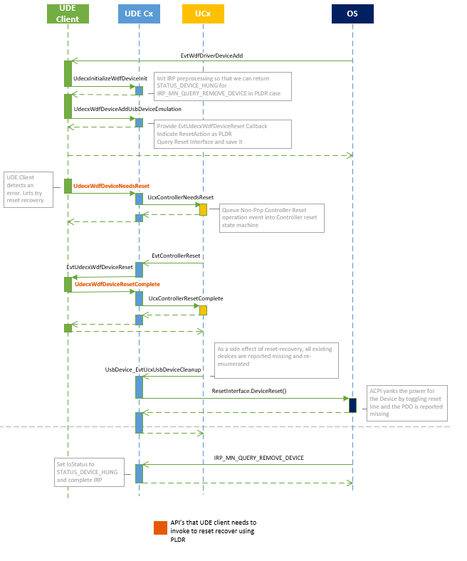

# MB Device-based Reset and Recovery

Mobile Broadband (MB or MBB) Device-based Reset and Recovery is a technology in Windows 10, version 1809 and later that introduces a robust reset recovery mechanism for MBB devices and drivers. This mechanism enables MBB devices to avoid failures that cause malfunction, loss of connectivity, or unresponsiveness to operational commands, ultimately making the user experience seamless if errors do occur and reducing the chance of having to restart the system. 

Device-based Reset and Recovery can be implemented with or without firmware dependencies. IHV or OEM partners can extend the software-based reset mechanisms available on all Windows PCs with supported device or firmware-level reset mechanisms to increase the rate of successful recovery.

## MB Device-based Reset and Recovery architecture overview

The Windows MBB service initializes and controls cellular devices using the standard [Mobile Broadband Interface Model](https://www.usb.org/document-library/mobile-broadband-interface-model-v10-errata-1-and-adopters-agreement) (MBIM) interface, which is built on top of the USB transport extending the NCM specifications. Each command sent to the IHV device is sent as an MBIM command via the inbox Windows MBB class driver. Once the cellular modem is initialized using the MBIM protocol exchange, the data path can start between the host, modem, and the network. Any additional controls sent to the cellular device continue via the MBIM protocol exchange in parallel. 

There are a number of failures that can occur on both the MBIM control path and the data path. In versions of Windows before Windows 10, version 1809, a simple error handling mechanism is built in. Whenever a MBIM command is sent and device becomes unresponsive, the mechanism attempts to reset the device by sending an MBIM reset command. However, because the failure is often due to an unresponsive MBIM interface in the first place, this reset does not always work. Furthermore, the mechanism doesn't address other failures that might occur such as the loss of connectivity due to data path failures. 

MB Device-based Reset and Recovery introduces a centralized framework to detect a larger set of failures and coordinates recovery with a set of progressively impactful resets. If the device supports device-level reset, MB Device-based Reset and Recovery will incorporate the device-level resets after all software-based resets are exhausted. The reset and recovery framework redefines and replaces the existing reset mechanism based on MBIM command responsiveness.  

MB Device-based Reset and Recovery detects and attempts to remedy the following types of failures:

| Area of failure        | Failure description                                         |
|------------------------|-------------------------------------------------------------|
| Control path           | <ul><li>A hang condition detected on MBIM protocol path. For more information about hang detection, see [MB hang detection](mb-hang-detection.md).</li><li>Failures due to MBB responding with incorrect state and/or information.</li></ul> |
| Data path              | <ul><li>Device-side failure resulting in data path failures. For example, endpoints not responding to data traffic, corrupted data from PHY, etc.</li><li>Modem/network-side failure. For example, the network not responding to IP traffic, DNS failure, packet loss, etc.</li></ul> |

Some failures are not actionable from a recovery perspective, including but not limited to:

- Provisioning- or activation-related issues such as missing COSA settings or MO-initiated service denial
- Control path issues due to driver initialization failure (power- or hardware-related) or software bugs

However, once an actionable failure is detected, MB Device-based Reset and Recovery will attempt the following reset mechanisms. The reset options are listed in the order Windows will perform, from least to most impactful. 

Software-based reset options, in the following table are available on all Windows 10, version 1809 MBB devices and can be disabled or configured by OEM patners.

| Reset sequence | Reset type    | Reset mechanism |
| ---------------|-------------- | --------------- |
| 1      		 | Software only | Deactivate and activate the PDP context |
| 2   			 | Software only | Toggle Airplane Mode (APM) ON/OFF |
| 3 			 | Sofware only  | Enable/disable the device at the Plug and Play (PnP) level |

The following device-based reset options are enabled by OEMs with MBB device/firmware capabilities. 

| Reset sequence | Reset type   | Reset mechanism |
| -------------- |------------- | --------------- |
| 4 			 | Device-based | Functional-level Device Reset (FLDR) |
| 5   			 | Device-based | Platform-level Device Reset (PLDR) |

The order of recovery is altered, and in some cases certain reset mechanisms bypassed altogether, for certain types of failures. For example, if a command timeout occurs while toggling airplane mode, the OS does not toggle Airplane Mode to fix it. If the MBB device does not respond to any MBIM commands, then the OS will engage the Device-based reset mechanisms directly.

For UDE client drivers that enable an MBIM function, Windows 10, version 1809 contains a new API that can be used to request a reset whenever the UDECx client driver detects an error. The following section describes these new device-based reset mechanims including FLDR, PLDR, and UDECx reset for PCI.

## Device-based resets

### Function-level Device Reset (FLDR)

Function-level Device Reset is the lightest device-based reset in terms of system impact. It happens inside the device and is not visible to other devices, and the device stays connected to the bus throughout the reset and returns to a valid state (in other words, an initial state) after the process. This can be provided by either the bus driver or by the firmware. The bus driver implements an FLDR handler if the bus specification defines an in-band reset mechanism that fits the requirement. Firmware writers might override a bus-defined FLDR with their own implementation of FLDR that uses out-of-band signals, such as reset line or power toggling, while still following the requirements of FLDR. 

### Platform-level Device Reset (PLDR)  

Platform-level Device Reset is for cases where FLDR cannot be used, or as a last-resort supplement to FLDR. This reset mechanism causes the device to be reported as missing from the bus (during a power cycle, for example) or affects multiple devices (such as a shared power rail or reset line among devices). The reset method is specified in the ACPI table, which might be implemented as toggling a dedicated reset line or power-cycling the D3 power resource. When PLDR is performed, the OS tears down and rebuilds the stacks of all affected devices to ensure everything starts from a pristine state.

### Reset recovery for UDE devices 

For UDE client drivers that enable an MBIM function, Windows 10, version 1809 includes an API that can be used to request a reset whenever the UDECx client driver detects an error. The client driver requests a reset by calling a new method, [**UdecxWdfDeviceNeedsReset**](/windows-hardware/drivers/ddi/udecxwdfdevice/nf-udecxwdfdevice-udecxwdfdeviceneedsreset), specifying the reset type that it wants the UDECx to attempt for the device (if supported). These reset types are **PlatformLevelDeviceReset** and **FunctionLevelDeviceReset** and are values of the [**UDECX_WDF_DEVICE_RESET_TYPE**](/windows-hardware/drivers/ddi/udecxwdfdevice/ne-udecxwdfdevice-_udecx_wdf_device_reset_type) enumeration. Once a reset is initiated, UDECx invokes the driver's [*EVT_UDECX_WDF_DEVICE_RESET*](/windows-hardware/drivers/ddi/udecxwdfdevice/nc-udecxwdfdevice-evt_udecx_wdf_device_reset) callback function and ensures that no other callback is invoked during this process. The client driver is expected to perform any reset related operations such as releasing any resources, then signal reset completion by invoking [**UdecxWdfDeviceResetComplete**](/windows-hardware/drivers/ddi/udecxwdfdevice/nf-udecxwdfdevice-udecxwdfdeviceresetcomplete).

The following flow diagram illustrates the UDE device reset process.




## RnR triggers
WWAN Service organizes actionable failures into RnR triggers:
1. Bad connectivity
2. Radio state set/query failures/time-outs
3. Consecutive OID request time-outs
4. Initialization failures

### RnR Trigger #1 - Bad connectivity
* Bad connectivity
* Limited Internet connectivity
* Lost Internet connectivity
* Routes not received correctly
* Routes unreachable
* Dead gateway
* DNS query failing
    
WCM detects based on various sources (NCSI etc.).

WCM publishes WNF_WCM_INTERFACE_CONNECTION_STATE.
```
struct WCM_WNF_INTERFACE_CONNECTION_STATE_INFO
{
    GUID InterfaceGuid;
    WCM_MEDIA_TYPE MediaType = wcm_media_unknown;
    // ConnectionState is one of the WCM_WNF_INTERFACE_CONNECTIVITY_STATE_* values
    DWORD ConnectionState = 0;
    // TimeInBadStateMs tracks how long a connection is in a Bad state
    // It will reset back to zero when in a good state
    DWORD TimeInBadStateMs = 0;
    // ConnectivityTriggers is a bitmask of WCM_WNF_INTERFACE_CONNECTIVITY_TRIGGER_* flags
    DWORD ConnectivityTriggers = 0; 
    // fWasConnectedGood will be TRUE if a connection is ever in a good state over the lifetime of an L2 connection
    // Once it is set to TRUE, it will never go FALSE until the interface disconnects
    BOOLEAN fWasConnectedGood = FALSE;
    // When processing the WNF, walk the array of WCM_WNF_INTERFACE_CONNECTION_STATE_INFO structs
    // until you reach the struct with afLastArrayValues == TRUE
    BOOLEAN fLastArrayValue = TRUE;
};
```
Recovery Process:
* Reset PDP context up to three times (see FSM transition diagram)
* Toggle APM once
* PnP disable and enable MBB device once
* Invoke FLDR once if supported
* Invoke PLDR once if supported

The process stops as soon as L3 connectivity is good.

Verification of outcome: L3 connectivity is good.
 
### RnR trigger #2  - Radio state set/query failure or time-out
* No response or failure response for setting or querying radio state.
* OID_WWAN_RADIO_STATE set or query requests.
* Should never happen.
* Once it happens, OS and modem may end up in an inconsistent state.
* Indicates serious problem(s) in the modem.
* CWwanExecutor detects it and internally reports to CWwanResetRecovery.

Recovery process:
* Invoke PLDR if supported
* Otherwise, invoke PnP disable/enable

Verification of outcome: Send OID_WWAN_RADIO_STATE query and verify response.

### RnR trigger #3 - Time-out of consecutive OID requests
* TXM times all outstanding OID requests and expects responses for each.
* If a “configurable” number of consecutive OID requests receive no response in time, TXM detects it and internally reports to CWwanResetRecovery.
* OIDs may be grouped in high/medium/low latency groups:
	* OID requests that are have no interaction with MO will have lower latency.
	* OID requests that result in interaction with MO will have medium latency.
	* OID_WWAN_CONNECT activation/deactivation request: ~180 seconds.

Recovery process:
* Invoke PLDR if supported
* Otherwise, invoke PnP disable/enable

Verification of outcome: Send OID_WWAN_RADIO_STATE query and verify response.

### RnR Trigger #4 - Initialization failures
* Time-out of the device caps or device capsEx query during the initialization upon MB device arrival
* CWwanManager detects and acts on it

Recovery process:
- Invoke PLDR if supported
- Otherwise, invoke PnP disable/enable

Verification of outcome: none

After PLDR or PnP disable/enable, the device departs and then re-arrives. Initialization upon arrival follows.

### Primary flows
#### RnR for bad connectivity

#### PLDR for radio power set failure

#### PnP disable/enable for radio state set failure

#### PLDR for time-outs of consecutive OID requests 

#### PnP disable/enable for time-outs of consecutive OID requests 

#### PLDR for initialization failure

#### PnP disable/enable for initialization failure


## Requirements for MB Device-based Reset and Recovery

### Requirements for FLDR

To support FLDR on a device, inside the Device() scope there must be a `_RST` method defined. When executed, the method must reset only that device, and should not touch another device. The device must also stay on the bus, connected. 

```cpp
Device(PCI0)  
{  
Device(USB0)  
{  
	Name(_ADR, 0x1d0000)  
	Name(_S4D, 0x2)  
	Name(_S3D, 0x2)  
	…  
	Method(_RST, 0x0, NotSerialized)  
	{  
			//  
			// Perform reset of the USB0 device  
			//  
	} 
} 
} 
```

### Requirements for PLDR

In PLDR, devices that are affected by the reset of other device are expressed as sharing a `PowerResource` for reset. The devices declare their dependency on the `PowerResource` for reset, and that `PowerResource` implements the `_RST` method. 

```cpp
Device(PCI0)  
{  
PowerResource(URST, 0x5, 0x0)  
{  
	//  
	// Dummy _ON and _OFF methods. All power resources must have these  
	// two defined.  
	// Method(_ON, 0x0, NotSerialized)  
	{  
	}  
	Method(_OFF, 0x0, NotSerialized)  
	{  
	}  
	Method(_RST, 0x0, NotSerialized)  
	{  
			//  
			// Perform reset of the USB0 and USB1 devices  
			//  
	} 
}  
Device(USB0)  
{  
	Name(_ADR, 0x1d0000)  
	Name(_S4D, 0x2)  
	Name(_S3D, 0x2)  
	…  
	Name(_PRR, Package(0x1) { ^URST })  
}  
Device(USB1)  
{  
	Name(_ADR, 0x1d0001)  
	Name(_S4D, 0x2)  
	Name(_S3D, 0x2)  
	…  
	Name(_PRR, Package(0x1) { ^URST })  
} 
} 
```

Alternatively, PLDR can be achieved by putting the device into the D3Cold power state and back to D0, essentially power cycling the device. In this case, having `_PR3` declared in the device scope is sufficient to support PLDR. ACPI will use `_PR3` to determine reset dependencies between devices if no `_PRR` is referenced in the device scope. For more information, see [Resetting and recovering a device](../kernel/resetting-and-recovering-a-device.md). 

## Sample Log
```
NTS]WWAN Service event: [Info] WwanTimerWrapper::StartTimer:  Timer (ID = 0) Start Completed
[0]0E98.34E4::11/27/2019-05:37:55.622 [Microsoft-Windows-WWAN-SVC-EVENTS]WWAN Service event: [Info] WwanTxmEvaluateArmTimer: TXM timer armed for 60 seconds Interface: {{8a664721-db25-4157-8395-5d21e0560fa4}}
[0]0E98.34E4::11/27/2019-05:37:55.622 [Microsoft-Windows-WWAN-SVC-EVENTS]WWAN Service event: [Info] _sendReq: ASYNC OID (pTx->handle: 00000000000000B0 Code: 1) sent
[0]0E98.34E4::11/27/2019-05:37:55.622 [Microsoft-Windows-WWAN-SVC-EVENTS]WWAN Service event: [Info] CWwanExecutor::RegWriteStoredRadioState: Try to set the subkey to 0x0 for ArrivalRadioState Interface: {{8a664721-db25-4157-8395-5d21e0560fa4}}
[0]0E98.34E4::11/27/2019-05:37:55.623 [Microsoft-Windows-WWAN-SVC-EVENTS]WWAN Service event: [Info] CWwanResetRecovery::EvaluateAndTryHighImpactRnRMethod:  Attempted to turn off radio via MBB (reqId 0x10c): request ID 0x1 prev stage 0 APMToggling 0; PnPDisabling 0; PLDR 0; FLDR 0 Interface: {{8a664721-db25-4157-8395-5d21e0560fa4}}
[0]0E98.34E4::11/27/2019-05:37:55.623 [Microsoft-Windows-WWAN-SVC-EVENTS]WWAN Service event: [Info] WwanTimerWrapper::StartTimer:  Timer (ID = 6) Start Completed
[0]0E98.34E4::11/27/2019-05:37:55.623 [Microsoft-Windows-WWAN-SVC-EVENTS]WWAN Service event: [Info] CWwanResetRecovery::fsmEventHandler:  exit with state: 7, event: 4, RnR stage: 2 Potent RnR: 0 Interface: {{8a664721-db25-4157-8395-5d21e0560fa4}}
```

## Related links

[MB hang detection](mb-hang-detection.md)

[**UDECX_WDF_DEVICE_RESET_TYPE**](/windows-hardware/drivers/ddi/udecxwdfdevice/ne-udecxwdfdevice-_udecx_wdf_device_reset_type)

[**UdecxWdfDeviceNeedsReset**](/windows-hardware/drivers/ddi/udecxwdfdevice/nf-udecxwdfdevice-udecxwdfdeviceneedsreset)

[*EVT_UDECX_WDF_DEVICE_RESET*](/windows-hardware/drivers/ddi/udecxwdfdevice/nc-udecxwdfdevice-evt_udecx_wdf_device_reset)

[**UdecxWdfDeviceResetComplete**](/windows-hardware/drivers/ddi/udecxwdfdevice/nf-udecxwdfdevice-udecxwdfdeviceresetcomplete)
