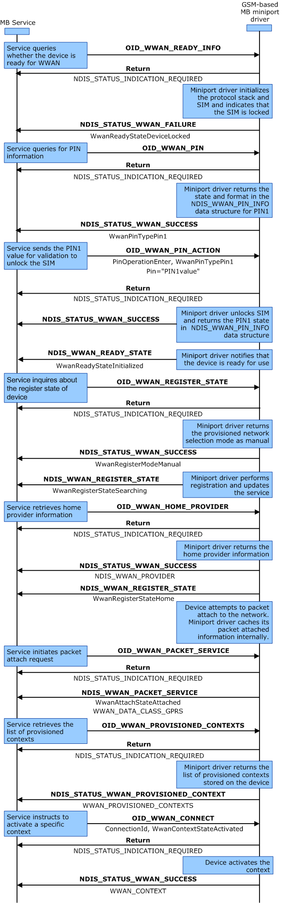

# MB Device Readiness

This topic describes the procedures to ensure that an MB device is accessible and ready to be used for network-related activities before the MB Service proceeds to setup data connections. The device is ready to use when the user subscription has been activated and subscriber-related information stored to the device or the Subscriber Identity Module (SIM card)

The MB Service assumes that a miniport driver automatically initializes its MB device's hardware (radio stack, SIM card or equivalent circuitry) after the system has loaded it, without waiting for any instruction from the service.

Miniport drivers set the initial ready-state of their MB device to **WwanReadyStateOff**. As they proceed with initializing, miniport drivers must send event notifications to inform the MB Service of changes to their device's ready state.

Miniport drivers must stop the initialization process if they run into any error conditions. After the error condition is cleared, miniport drivers can resume the initialization process until their device has reached the **WwanReadyStateInitialized** ready-state.

The following are examples of some error scenarios:

-   If the device requires a SIM card and the miniport driver detects that no SIM card is present, the miniport driver must send a **WwanReadyStateSimNotInserted** ready-state event notification, and the miniport driver must remain in that state until the user inserts a SIM card into the device.

-   If the device requires a SIM card and the miniport driver cannot read the SIM card that has been inserted (for example, a U-RIM is inserted into a GSM-based device or a USIM is inserted into a CDMA-based device) or the SIM card is not compatible with the device (for example, a 3G USIM is inserted into a 2G device, which cannot interpret the USIM format), the miniport driver must send a **WwanReadyStateBadSim** ready-state event notification, and the miniport driver must remain in that state until the user inserts a correct SIM card into the device.

-   If the device is locked by the PIN (for devices that use SIM cards) or by a password (for devices that do not use SIM cards) that prevents further device initialization progress, the miniport driver must send a **WwanReadyStateDeviceLocked** ready-state event notification, and the miniport driver must remain in that state until the user enters the correct PIN or password.

-   If the miniport driver detects that service activation is required to proceed, the miniport driver must send a **WwanReadyStateNotActivated** ready-state event notification, and it must remain in that state until the service has been activated. This is typical behavior for CDMA-based devices in North America.

-   If the miniport driver runs into failures other than the ones mentioned previously, the miniport driver must send a **WwanReadyStateFailure** ready-state event notification, and it must remain in that state until the problem has been identified and corrected.

Be aware that the MB Service does not assume that miniport drivers can detect all these errors. Nor does the service assume the order in which miniport drivers detect these error conditions. However, it is best to implement the error scenarios in the order listed previously.

Until a miniport driver sends a **WwanReadyStateInitialized** ready-state event notification, the service will not proceed any further with network-related activities until the problem has been identified and corrected. However, the service may still send OIDs to the miniport driver.

Miniport drivers do not need to wait for the SMS subsystem to be ready before reporting the **WwanReadyStateInitialized** ready-state. Instead, miniport drivers should send a separate [OID\_WWAN\_SMS\_CONFIGURATION](./oid-wwan-sms-configuration.md) notification when the SMS subsystem is ready to send and receive SMS messages.

### Emergency Mode Support

If the miniport driver indicates that it supports emergency call services while processing [OID\_WWAN\_READY\_INFO](./oid-wwan-ready-info.md) the miniport driver must set the **EmergencyMode** member of the [**WWAN\_READY\_INFO**](/windows-hardware/drivers/ddi/wwan/ns-wwan-_wwan_ready_info) structure to **WwanEmergencyModeOn**. In this case, the miniport driver should continue to send registration notifications to the MB Service, but the service will not invoke any automatic configuration related functionalities.

Miniport drivers can specify that they support emergency call services even in scenarios where they detect that the SIM is no longer valid, perhaps because the subscription is unpaid, or service has been deactivated because the device has been reported stolen.

## MB Miniport Driver Initialization

The following diagram represents the process taken to determine whether the interface is a qualified MB interface and to gather information about the device capabilities. These steps are performed for each enumerated MB interface when the MB Service starts up, as well as for each new interface arrival while the service is running. The labels in bold represent OID identifiers or transactional flow control. The labels in regular text represent the important flags within the OID structure.

To initialize an MB miniport driver, use the following procedure:

1.  The MB Service sends a synchronous (blocking) [OID\_GEN\_PHYSICAL\_MEDIUM](oid-gen-physical-medium.md) query request to identify the type of the MB device. The miniport driver responds with **NdisPhysicalMediumWirelessWan** to indicate that the MB device is a WWAN device.

2.  The MB Service sends a synchronous (blocking) [OID\_GEN\_MEDIA\_SUPPORTED](oid-gen-media-supported.md) query request to the miniport driver to identify what kind of medium the MB device uses. The miniport driver responds with **NdisMedium802\_3** to indicate that it uses Ethernet emulation.

3.  The MB Service sends a synchronous (blocking) [OID\_WWAN\_DRIVER\_CAPS](oid-wwan-driver-caps.md) query request to the miniport driver to identify what driver model version the miniport driver supports. The miniport driver responds with WWAN\_VERSION.

4.  The MB Service sends an asynchronous (non-blocking) [OID\_WWAN\_DEVICE\_CAPS](oid-wwan-device-caps.md) query request to the miniport driver to identify the capabilities of the MB device. The miniport driver responds with a provisional acknowledgement that it has received the request, and it will send a notification with the requested information in the future.

5.  The miniport driver sends an [**NDIS\_STATUS\_WWAN\_DEVICE\_CAPS**](ndis-status-wwan-device-caps.md) notification to the MB Service that indicates the capabilities of the MB device that the miniport driver supports. For example, if the miniport driver supports a GSM-based device, it should specify the **WwanCellularClassGsm** value in the **DeviceCaps.WwanCellularClass** member of the [**NDIS\_WWAN\_DEVICE\_CAPS**](/windows-hardware/drivers/ddi/ndiswwan/ns-ndiswwan-_ndis_wwan_device_caps) structure. If the miniport driver supports a CDMA-based device, it should specify **WwanCellularClassCdma**.

## Initialization of SIM-Locked GPRS Device with a User-Defined Context

The following diagram illustrates the scenario in which the user enters a SIM PIN and manually configures an access point name string. The labels in bold are OID identifiers or transactional flow control, and the labels in regular text are the important flags within the OID structure.

To initialize a GSM-based device with PIN1 locked, implement the following steps:

1.  The MB Service sends an asynchronous (non-blocking) [OID\_WWAN\_READY\_INFO](oid-wwan-ready-info.md) query request to the miniport driver to identify the ready state of the device. The miniport driver responds with a provisional acknowledgment (NDIS\_STATUS\_INDICATION\_REQUIRED) that it has received the request, and that it will send a notification with the requested information in the future.

2.  The miniport driver sends an NDIS\_STATUS\_WWAN\_FAILURE notification to the MB Service to indicate to the MB Service that the subscriber identity module (SIM) is locked.

3.  The MB Service sends an asynchronous (non-blocking) [OID\_WWAN\_PIN](oid-wwan-pin.md) query request to the miniport driver. The miniport driver responds with a provisional acknowledgment (NDIS\_STATUS\_INDICATION\_REQUIRED) that it has received the request, and that it will send a notification with the requested information in the future.

4.  The miniport driver sends an NDIS\_STATUS\_WWAN\_SUCCESS notification to the MB Service.

5.  The MB Service sends an asynchronous (non-blocking) [OID\_WWAN\_PIN](oid-wwan-pin.md) set request to the miniport driver. The miniport driver responds with a provisional acknowledgment (NDIS\_STATUS\_INDICATION\_REQUIRED) that it has received the request, and that it will send a notification with the requested information in the future.

6.  The miniport driver sends an NDIS\_STATUS\_WWAN\_SUCCESS notification to the MB Service.

7.  The miniport driver sends an [**NDIS\_STATUS\_WWAN\_READY\_INFO**](ndis-status-wwan-ready-info.md) notification to the MB Service that indicates to the MB Service that the state of the MB device is **WwanReadyStateInitialized**.

8.  The MB Service sends an asynchronous (non-blocking) [OID\_WWAN\_REGISTER\_STATE](oid-wwan-register-state.md) query request to the miniport driver. The miniport driver responds with a provisional acknowledgment (NDIS\_STATUS\_INDICATION\_REQUIRED) that it has received the request, and it will send a notification with the requested information in the future.

9.  The miniport driver sends an NDIS\_STATUS\_WWAN\_SUCCESS notification to the MB Service.

10. The miniport driver sends an [**NDIS\_STATUS\_WWAN\_REGISTER\_STATE**](ndis-status-wwan-register-state.md) notification to the MB Service.

11. The MB Service sends an asynchronous (non-blocking) [OID\_WWAN\_HOME\_PROVIDER](oid-wwan-home-provider.md) query request to the miniport driver. The miniport driver responds with a provisional acknowledgment (NDIS\_STATUS\_INDICATION\_REQUIRED) that it has received the request, and it will send a notification with the requested information in the future.

12. The miniport driver sends an NDIS\_STATUS\_WWAN\_SUCCESS notification to the MB Service.

13. The miniport driver sends an [**NDIS\_STATUS\_WWAN\_REGISTER\_STATE**](ndis-status-wwan-register-state.md) notification to the MB Service.

14. The MB Service sends an asynchronous (non-blocking) [OID\_WWAN\_PACKET\_SERVICE](oid-wwan-packet-service.md) request to the miniport driver. The miniport driver responds with a provisional acknowledgment (NDIS\_STATUS\_INDICATION\_REQUIRED) that it has received the request, and that it will send a notification with the requested information in the future.

15. The miniport driver sends an [**NDIS\_STATUS\_WWAN\_PACKET\_SERVICE**](ndis-status-wwan-packet-service.md) notification to the MB Service.

16. The MB Service sends an asynchronous (non-blocking) [OID\_WWAN\_PROVISIONED\_CONTEXTS](oid-wwan-provisioned-contexts.md) query request to the miniport driver. The miniport driver responds with a provisional acknowledgment (NDIS\_STATUS\_INDICATION\_REQUIRED) that it has received the request, and it will send a notification with the requested information in the future.

17. The miniport driver sends [**NDIS\_STATUS\_WWAN\_PROVISIONED\_CONTEXTS**](ndis-status-wwan-provisioned-contexts.md) to the MB Service.

18. The MB Service sends an asynchronous (non-blocking) [OID\_WWAN\_PROVISIONED\_CONTEXTS](oid-wwan-provisioned-contexts.md) set request to the MB Service. The miniport driver responds with a provisional acknowledgment (NDIS\_STATUS\_INDICATION\_REQUIRED) that it has received the request, and it will send a notification with the requested information in the future.

19. The miniport driver sends NDIS\_STATUS\_WWAN\_SUCCESS to the MB Service.

## See Also

For more information about device readiness, see [OID\_WWAN\_READY\_INFO](oid-wwan-ready-info.md).

For more information about device initialization with provisioned contexts, see [MB Provisioned Context Operations](mb-provisioned-context-operations.md).

 

