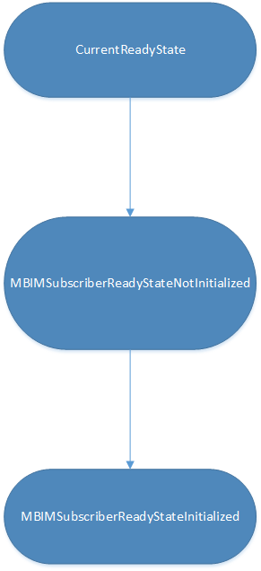

# MB eSIM MBIM ready state guidance

This topic provides guidance on the expected MBIM ready state for eSIM scenarios on Windows 10, version 1709 and later. Conforming to the correct ready state ensures that the OS handles all changes properly for that scenario. 

> [!IMPORTANT]
> All scenarios and states in this topic assume that the eSIM capable card is mapped to the default executor, executor 0, and is powered ON.

| Scenario | MBIM_MS_UICCSLOT_STATE | MBIM_SUBSCRIBER_READY_STATE |
| --- | --- | --- |
| eSIM with MF only (no profiles) | MBIMMsUICCSlotStateActiveEsimNoProfiles | MBIMSubscriberReadyStateNoEsimProfile |
| eSIM with no enabled profiles | MBIMMsUICCSlotStateActiveEsimNoProfiles | MBIMSubscriberReadyStateNoEsimProfile |
| eSIM with profile enabled | MBIMMsUICCSlotStateActiveEsim | MBIMSubscriberReadyStateInitialized |
| eSIM in passthrough mode | MBIMMsUICCSlotStateActiveEsimNoProfiles | MBIMSubscriberReadyStateNotInitialized |

When a change in both MBIM_MS_UICCSLOT_STATE and MBIM_SUBSCRIBER_READY_STATE is needed, the slot state change should precede the ready state change. 

When enabling a new profile or switching between profiles, the ready state should have the following flow:

For more info about MBIM_MS_UICCSLOT_STATE, see the MBIM_MS_UICCSLOT_STATE table on [MB Multi-SIM Operations (MBIM_CID_MS_SLOT_INFO_STATUS)](mb-multi-sim-operations.md).

For more info about MBIM_SUBSCRIBER_READY_STATE, see Section 10.5.2.3 of [the public USB MBIM standard](https://go.microsoft.com/fwlink/p/?linkid=842064).

