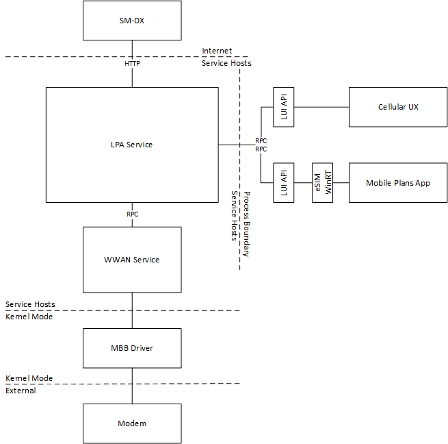
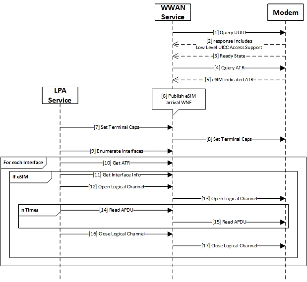
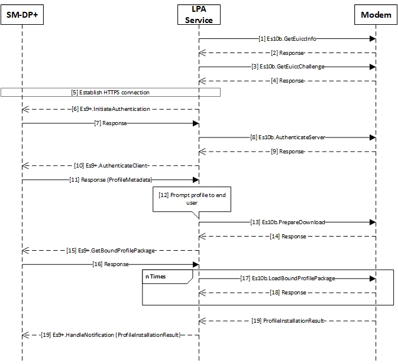
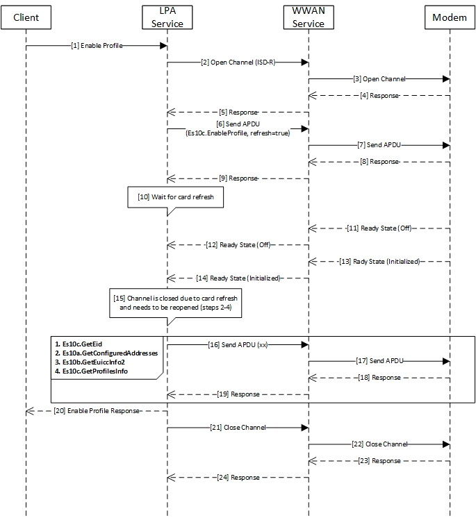

# MB eSIM Operations

## eSIM Architecture

The Local Profile Assitant (LPA) component of the Windows operating system is the LPA Service while the low level UICC access is exposed through the WWAN Service. The LPA Service handles profile discovery, downloading profiles, and profile management.



## MB Interface Update for eSIM Operations

The modem needs to support the following [MB Low Level UICC access CIDs](mb-low-level-uicc-access.md) for eSIM functionality.

```
 MBIM_CID_MS_UICC_ATR 
 MBIM_CID_MS_UICC_OPEN_CHANNEL
 MBIM_CID_MS_UICC_CLOSE_CHANNEL 
 MBIM_CID_MS_UICC_APDU
 MBIM_CID_MS_UICC_TERMINAL_CAPABILITY
 MBIM_CID_MS_UICC_RESET
 ```

## eSIM Service Initialization



## eSIM Profile Download and Install



## eSIM Profile Operations

eSIM Profile Operations include: 
```
Enable Profile
Disable Profile
Delete Profile
Wipe eSIM
Update NickName
```

Below is a sample flow for the Enable Profile operation. The other Profile Operations follow a similar flow except that MBIM_CID_MS_UICC_APDU will contain the Es10c command for the respective operation.



### Card Refresh
The eSIM Profile Operations expect that card refresh will be performed followed by the ready state change according to the [MB eSIM MBIM ready state guidance](mb-esim-mbim-ready-state-guidance.md).

## Hardware Lab Kit (HLK) Tests

The following tests in the HLK can be used to verify eSIM functionality:

[TestLowLevelUiccAccess](/windows-hardware/test/hlk/testref/104db926-5cc4-47ad-a7d0-ff476b0f57a1)

[TestReadyInfo](/windows-hardware/test/hlk/testref/c03b0771-5436-4ad5-a5b7-e08adb758a28)

[TestResetPassthrough](/windows-hardware/test/hlk/testref/b19d12ef-1beb-4ae5-bab5-cfa523c0c3dd)

Via netsh, we can run the **TestLowLevelUiccAccess** HLK testlist. For more information on using the netsh tool, see [**netsh-mbn**](/windows-server/networking/technologies/netsh/netsh-mbn) and [**netsh-mbn-test-installation**](mb-netsh-mbn-test.md).

```
netsh mbn test feature=esim testpath="C:\data\test\bin" taefpath="C:\data\test\bin" param="AccessString=internet"
```

The file showing the HLK test results should have been generated in the directory that the 'netsh mbn test' command was ran from: `TestLowLevelUiccAccess.htm`.

## Manual Tests

### Test eSIM profile management
1. Required resources: An eSIM and an activation code or a QR code for the profile download. The profile needs a confirmation code to download.
1. Open Settings->Network & Internet -> Cellular.
1. Click ***Manage eSIM profiles***.
1. Click ***Add a new profile***.
1. Choose ***Let me enter an activation code I have from my mobile operator*** and click ***Next***.
1. Scan the QR code or type in the activation code.
1. Wait until the confirmation page shows up. Fill in the confirmation code and click  ***Next***.
1. Dismiss the dialog and then enable the profile.
1. Change the name of the profile. The new name should be displayed for the profile.
1. Delete the profile.
1. Install the profile again (repeating steps 4-7), but this time with the wrong confirmation code. For example, when scanning a QR code the code hash displays for a second before contacting the server. Very quickly click anywhere inside of it and hit the back key to delete a single character before it talks to the server.
1. You should see an error message and eventually land at the confirmation page again. Type in the correct confirmation code this time and click ***Next***.
1. Dismiss the dialog and delete the profile.

### Test autoconnect after reboot
1. Make sure Ethernet is unplugged and Wi-Fi is toggled off. With a known good eSIM profile present on the physical eSIM in the device, browse to Settings -> Network & Internet -> Cellular -> Manage eSIM profiles -> eSIM profiles, select the profile, and click ***Use***. Verify that browsing the internet works normally.
1. Reboot the machine, login, and browse to Settings -> Network & Internet -> Cellular -> Manage eSIM profiles -> eSIM profiles. The profile should show as Active, systray should show Cellular connection bars, and browsing the internet should work normally.
1. Back in Manage eSIM profiles, select the profile, and click ***Stop using***. The profile should disconnect data.


## MB eSIM Troubleshooting Guide

Follow this guide to debug eSIM issues.

### Profile Download and Install Failures

1. Collect and decode the logs using the instructions in [MB Collecting Logs](mb-collecting-logs.md)
2. Open the .txt file generated in [TextAnalysisTool](mb-analyzing-logs.md)
3. Load the [eSIM Download and Install Filter](mb-esim-download-install-tat.md)

Here is sample success log for Profile Download and Install:

```
 37 24515    None    2020-03-04T08:54:48.6922406    0.0000922    8820    10356    Microsoft_Windows_Cellcore_LPA_Service    LuiAsyncResult: Component=LpaServiceLui,error=Dynamic: baseType=LPA_ERROR_DETAILS,dwParams=0,error=0,violation=0,hrResult=0,Location=LPA::Lui::OnLuiRpcRegisterForLpaNotifications,ulTransactionId=1    
 47 25637    None    2020-03-04T08:54:48.7058023    0.0000081    8820    10356    Microsoft_Windows_Cellcore_LPA_Service    LuiAsyncResult: Component=LpaServiceLui,error=Dynamic: baseType=LPA_ERROR_DETAILS,dwParams=0,error=0,violation=0,hrResult=0,Location=LPA::Lui::OnLuiRpcRegisterForEsimNotifications,ulTransactionId=2    
 48 25638    None    2020-03-04T08:54:48.7058116    0.0000093    8820    10356    Microsoft_Windows_Cellcore_LPA_Service    LuiAsyncResult: Component=LpaServiceLui,error=Dynamic: baseType=LPA_ERROR_DETAILS,dwParams=0,error=0,violation=0,hrResult=0,Location=LPA::Lui::OnLuiRpcRegisterForAllProfileNotifications,ulTransactionId=3    
 87 42955    None    2020-03-04T08:54:50.8459033    0.0000357    8820    3524    Microsoft_Windows_Cellcore_LPA_Service    LuiAsyncResult: Component=LpaServiceLui,error=Dynamic: baseType=LPA_ERROR_DETAILS,dwParams=0,error=0,violation=0,hrResult=0,Location=LPA::Lui::OnLuiRpcRegisterForLpaNotifications,ulTransactionId=1    
 96 43009    None    2020-03-04T08:54:50.8470189    0.0000401    8820    3524    Microsoft_Windows_Cellcore_LPA_Service    LuiAsyncResult: Component=LpaServiceLui,error=Dynamic: baseType=LPA_ERROR_DETAILS,dwParams=0,error=0,violation=0,hrResult=0,Location=LPA::Lui::OnLuiRpcRegisterForEsimNotifications,ulTransactionId=2    
104 43039    None    2020-03-04T08:54:50.8473061    0.0000092    8820    10356    Microsoft_Windows_Cellcore_LPA_Service    LuiAsyncResult: Component=LpaServiceLui,error=Dynamic: baseType=LPA_ERROR_DETAILS,dwParams=0,error=0,violation=0,hrResult=0,Location=LPA::Lui::OnLuiRpcRegisterForAllProfileNotifications,ulTransactionId=3    
110 43856    None    2020-03-04T08:55:10.1453397    19.2978242    8820    10356    Microsoft_Windows_Cellcore_LPA_Service    RpcDownloadProfile: Component=LuiApiServer,esimId=89033023**********************06,hr=0,Location=LuiApiProcessActivationCode,luicontext=2,strActivation=1$*******************************,ulTransactionId=4    
113 43861    None    2020-03-04T08:55:10.1459912    0.0000161    8820    1044    Microsoft_Windows_Cellcore_LPA_Service    DownloadSequenceEvent: Component=LpaServiceLpd,error=0,eventlabel=OnInitiateCommonMutualAuthentication,fsmevent=3,Location=LPA::Lpd::DownloadInstance::InitiateCommonMutualAuthentication,task=2,taskId=6    
115 43863    None    2020-03-04T08:55:10.1461554    0.0000022    8820    1044    Microsoft_Windows_Cellcore_LPA_Service    DownloadSequenceEvent: Component=LpaServiceLpd,error=0,eventlabel=ProcessActivation,fsmevent=1,Location=LPA::Lpd::DownloadInstance::ProcessActivationCode,task=3,taskId=6    
130 44745    None    2020-03-04T08:55:10.1901431    0.0000464    8820    10356    Microsoft_Windows_Cellcore_LPA_Service    DownloadSequenceEvent: Component=LpaServiceLpd,error=0,eventlabel=OnEs10bGetEuiccChallenge,fsmevent=4,Location=LPA::Lpd::DownloadInstance::OnEs10bGetChallengeComplete,task=2,taskId=6    
134 45589    None    2020-03-04T08:55:10.2226549    0.0000204    8820    10356    Microsoft_Windows_Cellcore_LPA_Service    DownloadSequenceEvent: Component=LpaServiceLpd,error=0,eventlabel=OnEs10bGetUiccInfo1,fsmevent=5,Location=LPA::Lpd::DownloadInstance::OnEs10bGetUiccInfo1Complete,task=2,taskId=6    
146 46509    None    2020-03-04T08:55:11.7773024    0.0002176    8820    3524    Microsoft_Windows_Cellcore_LPA_Service    DownloadSequenceEvent: Component=LpaServiceLpd,error=0,eventlabel=OnEs9OrEs11InitiateAuthentication,fsmevent=6,Location=LPA::Lpd::DownloadInstance::OnEs9OrEs11InitiateAuthentication,task=2,taskId=6    
153 50421    None    2020-03-04T08:55:12.9320399    0.0008653    8820    3524    Microsoft_Windows_Cellcore_LPA_Service    DownloadSequenceEvent: Component=LpaServiceLpd,error=0,eventlabel=OnEs10bAuthenticateServer,fsmevent=7,Location=LPA::Lpd::DownloadInstance::OnEs10bAuthenticateServerComplete,task=2,taskId=6    
164 51032    None    2020-03-04T08:55:13.3763368    0.0001906    8820    1044    Microsoft_Windows_Cellcore_LPA_Service    DownloadSequenceEvent: Component=LpaServiceLpd,error=0,eventlabel=OnEs9AuthenticateClient,fsmevent=8,Location=LPA::Lpd::DownloadInstance::OnEs9AuthenticateClient,task=2,taskId=6    
176 51183    None    2020-03-04T08:55:14.9352658    0.0000603    8820    1044    Microsoft_Windows_Cellcore_LPA_Service    DownloadSequenceEvent: Component=LpaServiceLpd,error=0,eventlabel=OnInstallProfile,fsmevent=11,Location=LPA::Lpd::DownloadInstance::DownloadAndInstallProfile,task=4,taskId=6    
190 54213    None    2020-03-04T08:55:18.1904783    0.0000651    8820    1044    Microsoft_Windows_Cellcore_LPA_Service    DownloadSequenceEvent: Component=LpaServiceLpd,error=0,eventlabel=OnEs10bPrepareDownload,fsmevent=14,Location=LPA::Lpd::DownloadInstance::OnEs10bPrepareDownloadComplete,task=4,taskId=11    
197 54784    None    2020-03-04T08:55:19.5200686    0.0013163    8820    1044    Microsoft_Windows_Cellcore_LPA_Service    DownloadSequenceEvent: Component=LpaServiceLpd,error=0,eventlabel=OnEs9BoundProfileDownloaded,fsmevent=15,Location=LPA::Lpd::DownloadInstance::OnEs9BoundProfileDownloaded,task=4,taskId=11    
407 257461    None    2020-03-04T08:55:36.3645723    0.0001640    8820    7812    Microsoft_Windows_Cellcore_LPA_Service    DownloadSequenceEvent: Component=LpaServiceLpd,error=0,eventlabel=OnEs10bLoadBoundProfilePackage,fsmevent=16,Location=LPA::Lpd::DownloadInstance::OnEs10bLoadBoundProfilePackageComplete,task=4,taskId=11    
412 258044    None    2020-03-04T08:55:36.6932923    0.3206194    8820    7812    Microsoft_Windows_Cellcore_LPA_Service    DownloadSequenceEvent: Component=LpaServiceLpd,error=0,eventlabel=OnEs9HandleNotification,fsmevent=17,Location=LPA::Lpd::DownloadInstance::OnEs9HandleNotification,task=4,taskId=11    
416 258628    None    2020-03-04T08:55:37.6234007    0.0000315    8820    1044    Microsoft_Windows_Cellcore_LPA_Service    DownloadSequenceEvent: Component=LpaServiceLpd,error=0,eventlabel=OnEs10bRemoveNotificationFromListComplete,fsmevent=18,Location=LPA::Lpd::DownloadInstance::OnEs10bRemoveNotificationFromListComplete,task=4,taskId=11    
426 258790    None    2020-03-04T08:55:37.6239355    0.0000168    8820    1044    Microsoft_Windows_Cellcore_LPA_Service    LuiAsyncResult: Component=LpaServiceLui,error=Dynamic: baseType=LPA_ERROR_DETAILS,dwParams=0,error=0,violation=0,hrResult=0,Location=LPA::Lui::CompleteLuiRpcOperation,ulTransactionId=4    
449 261202    None    2020-03-04T08:55:37.6883598    0.0000121    8820    1044    Microsoft_Windows_Cellcore_LPA_Service    LuiAsyncResult: Component=LpaServiceLui,error=Dynamic: baseType=LPA_ERROR_DETAILS,dwParams=0,error=0,violation=0,hrResult=0,Location=LPA::Lui::CompleteLuiRpcOperation,ulTransactionId=5    
509 326884    None    2020-03-04T08:55:45.5722501    0.0000155    8820    1044    Microsoft_Windows_Cellcore_LPA_Service    LuiAsyncResult: Component=LpaServiceLui,error=Dynamic: baseType=LPA_ERROR_DETAILS,dwParams=0,error=0,violation=0,hrResult=0,Location=LPA::Lui::CompleteLuiRpcOperation,ulTransactionId=6    
522 329627    None    2020-03-04T08:55:45.8306288    0.0000257    8820    1044    Microsoft_Windows_Cellcore_LPA_Service    DownloadSequenceEvent: Component=LpaServiceLpd,error=0,eventlabel=OnEs10bGetUiccInfo1,fsmevent=5,Location=LPA::Lpd::DownloadInstance::OnEs10bGetUiccInfo1Complete,task=2,taskId=27    
524 330152    None    2020-03-04T08:55:46.6963292    0.8655163    8820    10356    Microsoft_Windows_Cellcore_LPA_Service    DownloadSequenceEvent: Component=LpaServiceLpd,error=0,eventlabel=OnEs9HandleNotification,fsmevent=17,Location=LPA::Lpd::DownloadInstance::OnEs9HandleNotification,task=4,taskId=27    
528 330865    None    2020-03-04T08:55:46.7211677    0.0000375    8820    10356    Microsoft_Windows_Cellcore_LPA_Service    DownloadSequenceEvent: Component=LpaServiceLpd,error=0,eventlabel=OnEs10bRemoveNotificationFromListComplete,fsmevent=18,Location=LPA::Lpd::DownloadInstance::OnEs10bRemoveNotificationFromListComplete,task=4,taskId=27    
```


### Profile Operation Failures

1. Collect and decode the logs using the instructions in [MB Collecting Logs](mb-collecting-logs.md)
2. Open the .txt file generated in [TextAnalysisTool](mb-analyzing-logs.md)
3. Load the [eSIM Profile Operations Filter](mb-esim-profile-operations-tat.md)

Here is sample success log for the Enable Profile Operation:

```
 2 39    None    2020-03-04T09:06:12.6782819        11720    2720    Microsoft_Windows_Cellcore_LPA_Service    RpcEnableProfile: Component=LuiApiServer,esimId=89033023**********************06,hr=0,Location=LuiApiEnableProfile,luicontext=2,profileId=8935401************6,ulTransactionId=5    
12 209    None    2020-03-04T09:06:12.6937921    0.0152614    11720    2720    Microsoft_Windows_Cellcore_LPA_Service    OpenChannel: Component=LpaApduHelper,guidInterface=a549349a-2a86-4703-bebe-6f0d034f0ff3,Location=LPA::ApduHelper::OpenChannelOperation::Execute    
17 1003    None    2020-03-04T09:06:12.7248172    0.0309320    11720    2720    Microsoft_Windows_Cellcore_LPA_Service    ChannelOpened: Component=LpaApduHelper,guidInterface=a549349a-2a86-4703-bebe-6f0d034f0ff3,Location=LPA::ApduHelper::OnChannelOperationOpenChannelComplete,ulChannel=1    
18 1343    None    2020-03-04T09:06:12.7271141    0.0022969    11720    2720    Microsoft_Windows_Cellcore_LPA_Service    SendApdu: Component=LpaApduHelper,guidInterface=a549349a-2a86-4703-bebe-6f0d034f0ff3,Location=LPA::ApduHelper::ApduOperation::SendApdu,m_ulChannel=1,vCommandApdu.data()=[129,226,145,0,20,191,49,17,160,12,90,10,152,83,4,1,0,0,0,0,85,101,129,1,255,0],vCommandApdu.data().Count=26    
19 2067    None    2020-03-04T09:06:12.7489842    0.0218701    11720    2720    Microsoft_Windows_Cellcore_LPA_Service    SendApduResponse: Component=LpaApduHelper,guidInterface=a549349a-2a86-4703-bebe-6f0d034f0ff3,Location=LPA::ApduHelper::ApduOperation::OnWwapiSendApduComplete,pApduCompleteInfo->ApduInfo.Response=[191,49,3,128,1,0],pApduCompleteInfo->ApduInfo.Response.Count=6    
20 2445    None    2020-03-04T09:06:12.7505212    0.0015370    11720    2720    Microsoft_Windows_Cellcore_LPA_Service    SendApdu: Component=LpaApduHelper,guidInterface=a549349a-2a86-4703-bebe-6f0d034f0ff3,Location=LPA::ApduHelper::ApduOperation::SendApdu,m_ulChannel=1,vCommandApdu.data()=[129,226,145,0,16,191,45,13,92,11,90,79,159,112,144,145,146,147,148,149,153,0],vCommandApdu.data().Count=22    
23 4341    None    2020-03-04T09:06:12.7651848    0.0000718    11720    2720    Microsoft_Windows_Cellcore_LPA_Service    WwapiEsimUpdate: Component=LpaServiceEsimManager,fIsEsimInterface=True,fIsInterfaceRemoved=False,guidInterface=a549349a-2a86-4703-bebe-6f0d034f0ff3,Location=LPA::EsimManager::ProcessWwapiSimUpdate,readyState=0    
24 6343    None    2020-03-04T09:06:12.7870313    0.0218465    11720    4992    Microsoft_Windows_Cellcore_LPA_Service    WwapiAsyncResponseFailure: Component=LpaApduHelper,hr=-1073479677,Location=LPA::ApduHelper::ApduOperation::OnWwapiSendApduComplete    
27 11067    None    2020-03-04T09:06:13.1843659    0.0000080    11720    2720    Microsoft_Windows_Cellcore_LPA_Service    WwapiEsimUpdate: Component=LpaServiceEsimManager,fIsEsimInterface=True,fIsInterfaceRemoved=False,guidInterface=a549349a-2a86-4703-bebe-6f0d034f0ff3,Location=LPA::EsimManager::ProcessWwapiSimUpdate,readyState=6    
28 11070    None    2020-03-04T09:06:13.1843928    0.0000269    11720    2720    Microsoft_Windows_Cellcore_LPA_Service    CardResetComplete: Component=LpaServiceEsimManager,count=0,guidInterface=a549349a-2a86-4703-bebe-6f0d034f0ff3,hr=0,Location=LPA::EsimManager::ProcessWwapiSimUpdate,midoperation=True,readyState=6    
29 13752    None    2020-03-04T09:06:13.2040341    0.0196413    11720    2720    Microsoft_Windows_Cellcore_LPA_Service    OpenChannel: Component=LpaApduHelper,guidInterface=a549349a-2a86-4703-bebe-6f0d034f0ff3,Location=LPA::ApduHelper::OpenChannelOperation::Execute    
31 17057    None    2020-03-04T09:06:13.2232087    0.0133736    11720    2720    Microsoft_Windows_Cellcore_LPA_Service    WwapiEsimUpdate: Component=LpaServiceEsimManager,fIsEsimInterface=True,fIsInterfaceRemoved=False,guidInterface=a549349a-2a86-4703-bebe-6f0d034f0ff3,Location=LPA::EsimManager::ProcessWwapiSimUpdate,readyState=6    
33 33469    None    2020-03-04T09:06:13.3307557    0.0000034    11720    4992    Microsoft_Windows_Cellcore_LPA_Service    WwapiEsimUpdate: Component=LpaServiceEsimManager,fIsEsimInterface=True,fIsInterfaceRemoved=False,guidInterface=a549349a-2a86-4703-bebe-6f0d034f0ff3,Location=LPA::EsimManager::ProcessWwapiSimUpdate,readyState=6    
34 36738    None    2020-03-04T09:06:13.3658938    0.0351381    11720    4992    Microsoft_Windows_Cellcore_LPA_Service    ChannelOpened: Component=LpaApduHelper,guidInterface=a549349a-2a86-4703-bebe-6f0d034f0ff3,Location=LPA::ApduHelper::OnChannelOperationOpenChannelComplete,ulChannel=1    
35 37169    None    2020-03-04T09:06:13.3699437    0.0040499    11720    4992    Microsoft_Windows_Cellcore_LPA_Service    SendApdu: Component=LpaApduHelper,guidInterface=a549349a-2a86-4703-bebe-6f0d034f0ff3,Location=LPA::ApduHelper::ApduOperation::SendApdu,m_ulChannel=1,vCommandApdu.data()=[129,226,145,0,6,191,62,3,92,1,90,0],vCommandApdu.data().Count=12    
36 41856    None    2020-03-04T09:06:13.4055017    0.0355580    11720    4992    Microsoft_Windows_Cellcore_LPA_Service    SendApduResponse: Component=LpaApduHelper,guidInterface=a549349a-2a86-4703-bebe-6f0d034f0ff3,Location=LPA::ApduHelper::ApduOperation::OnWwapiSendApduComplete,pApduCompleteInfo->ApduInfo.Response=[191,62,18,90,16,137,3,48,35,66,67,32,0,0,0,0,4,86,35,54,6],pApduCompleteInfo->ApduInfo.Response.Count=21    
37 42027    None    2020-03-04T09:06:13.4073896    0.0018879    11720    4992    Microsoft_Windows_Cellcore_LPA_Service    SendApdu: Component=LpaApduHelper,guidInterface=a549349a-2a86-4703-bebe-6f0d034f0ff3,Location=LPA::ApduHelper::ApduOperation::SendApdu,m_ulChannel=1,vCommandApdu.data()=[129,226,145,0,3,191,60,0,0],vCommandApdu.data().Count=9    
38 44071    None    2020-03-04T09:06:13.4249377    0.0175481    11720    4992    Microsoft_Windows_Cellcore_LPA_Service    SendApduResponse: Component=LpaApduHelper,guidInterface=a549349a-2a86-4703-bebe-6f0d034f0ff3,Location=LPA::ApduHelper::ApduOperation::OnWwapiSendApduComplete,pApduCompleteInfo->ApduInfo.Response=[191,60,17,129,15,108,112,97,46,100,115,46,103,115,109,97,46,99,111,109],pApduCompleteInfo->ApduInfo.Response.Count=20    
39 44341    None    2020-03-04T09:06:13.4353474    0.0104097    11720    4992    Microsoft_Windows_Cellcore_LPA_Service    SendApdu: Component=LpaApduHelper,guidInterface=a549349a-2a86-4703-bebe-6f0d034f0ff3,Location=LPA::ApduHelper::ApduOperation::SendApdu,m_ulChannel=1,vCommandApdu.data()=[129,226,145,0,3,191,34,0,0],vCommandApdu.data().Count=9    
40 45644    None    2020-03-04T09:06:13.4574746    0.0221272    11720    4992    Microsoft_Windows_Cellcore_LPA_Service    SendApduResponse: Component=LpaApduHelper,guidInterface=a549349a-2a86-4703-bebe-6f0d034f0ff3,Location=LPA::ApduHelper::ApduOperation::OnWwapiSendApduComplete,pApduCompleteInfo->ApduInfo.Response=[191,34,129,134,129,3,2,1,0,130,3,2,2,0,131,3,3,2,0,132,15,129,1,0,130,4,0,13,186,0,131,4,0,0,105,233,133,4,5,127,50,224,134,3,9,2,0,135,3,2,3,0,136,2,4,208,169,22,4,20,129,55,15,81,37,208,177,212,8,212,195,178,50,230,210,94,121,91,235,251,170,22,4,20,129,55,15,81,37,208,177,212,8,212,195,178,50,230,210,94,121,91,235,251,139,1,2,153,2,6,64,4,3,0,0,2,12,20,71,79,45,80,65,45,48,52,49,57,32,32,32,32,32,32,32,32,32,32],pApduCompleteInfo->ApduInfo.Response.Count=138    
41 45763    None    2020-03-04T09:06:13.4628539    0.0053793    11720    4992    Microsoft_Windows_Cellcore_LPA_Service    SendApdu: Component=LpaApduHelper,guidInterface=a549349a-2a86-4703-bebe-6f0d034f0ff3,Location=LPA::ApduHelper::ApduOperation::SendApdu,m_ulChannel=1,vCommandApdu.data()=[129,226,145,0,16,191,45,13,92,11,90,79,159,112,144,145,146,147,148,149,153,0],vCommandApdu.data().Count=22    
42 47274    None    2020-03-04T09:06:13.5033394    0.0404855    11720    4992    Microsoft_Windows_Cellcore_LPA_Service    SendApduResponse: Component=LpaApduHelper,guidInterface=a549349a-2a86-4703-bebe-6f0d034f0ff3,Location=LPA::ApduHelper::ApduOperation::OnWwapiSendApduComplete,pApduCompleteInfo->ApduInfo.Response=[191,45,130,1,143,160,130,1,139,227,73,90,10,152,16,66,7,0,0,0,0,0,249,79,16,160,0,0,5,89,16,16,255,255,255,255,137,0,0,16,0,159,112,1,0,145,9,83,80,71,116,111,69,122,67,120,146,23,69,90,32,67,111,110,110,101,99,116,32,80,114,111,118,105,115,105,111,110,105,110,103,149,1,1,227,78,90,10,152,16,0,0,0,0,0,0,0,6,79,16,160,0,0,5,89,16,16,255,255,255,255,137,0,160,0,0,159,112,1,0,145,9,77,105,99,114,111,115,111,102,116,146,28,78,101,116,119,111,114,107,32,83,105,109,117,108,97,116,111,114,32,45,32,77,105,108,101,110,97,103,101,149,1,0,227,76,90,10,152,16,0,0,0,0,0,0,0,135,79,16,160,0,0,5,89,16,16,255,255,255,255,137,0,160,1,0,159,112,1,0,145,9,77,105,99,114,111,115,111,102,116,146,26,78,101,116,119,111,114,107,32,83,105,109,117,108,97,116,111,114,32,45,32,88,79,82,32,54,52,149,1,0,227,77,90,10,152,16,0,0,0,0,0,0,0,104,79,16,160,0,0,5,89,16,16,255,255,255,255,137,0,160,2,0,159,112,1,0,145,9,77,105,99,114,111,115,111,102,116,146,27,78,101,116,119,111,114,107,32,83,105,109,117,108,97,116,111,114,32,45,32,88,79,82,32,49,50,56,149,1,0,227,81,90,10,152,83,4,1,0,0,0,0,85,101,79,16,160,0,0,5,89,16,16,255,255,255,255,137,0,0,17,0,159,112,1,1,145,4,101,67,84,67,146,36,101,67,84,67,32,80,114,111,102,105,108,101,32,102,111,114,32,68,117,109,109,121,32,83,117,98,115,99,114,105,112,116,105,111,110,115,149,1,2],pApduCompleteInfo->ApduInfo.Response.Count=404    
57 47329    None    2020-03-04T09:06:13.5038992    0.0000179    11720    4992    Microsoft_Windows_Cellcore_LPA_Service    LuiAsyncResult: Component=LpaServiceLui,error=Dynamic: baseType=LPA_ERROR_DETAILS,dwParams=0,error=0,violation=0,hrResult=0,Location=LPA::Lui::CompleteLuiRpcOperation,ulTransactionId=5    
58 47419    None    2020-03-04T09:06:13.5057078    0.0018086    11720    4992    Microsoft_Windows_Cellcore_LPA_Service    SendApdu: Component=LpaApduHelper,guidInterface=a549349a-2a86-4703-bebe-6f0d034f0ff3,Location=LPA::ApduHelper::ApduOperation::SendApdu,m_ulChannel=1,vCommandApdu.data()=[129,226,145,0,3,191,43,0,0],vCommandApdu.data().Count=9    
74 50078    None    2020-03-04T09:06:13.7457319    0.2395537    11720    4992    Microsoft_Windows_Cellcore_LPA_Service    SendApduResponse: Component=LpaApduHelper,guidInterface=a549349a-2a86-4703-bebe-6f0d034f0ff3,Location=LPA::ApduHelper::ApduOperation::OnWwapiSendApduComplete,pApduCompleteInfo->ApduInfo.Response=[191,43,130,5,15,160,130,5,11,48,130,5,7,191,47,63,128,1,53,129,2,6,64,12,42,101,99,116,99,45,108,105,118,101,108,97,98,46,112,114,111,100,46,111,110,100,101,109,97,110,100,99,111,110,110,101,99,116,105,118,105,116,121,46,99,111,109,90,10,152,83,4,1,0,0,0,0,85,101,95,55,64,42,56,96,255,201,144,175,106,113,19,175,113,18,210,3,109,79,148,57,237,59,174,37,216,33,105,134,155,220,172,95,224,174,24,219,51,85,61,97,207,2,255,147,95,163,16,82,210,218,197,4,207,189,214,187,212,199,133,250,29,52,5,42,72,48,130,1,221,48,130,1,132,160,3,2,1,2,2,17,0,128,80,86,187,39,45,44,80,66,120,232,145,219,50,27,96,48,10,6,8,42,134,72,206,61,4,3,2,48,50,49,19,48,17,6,3,85,4,10,12,10,71,69,77,65,76,84,79,32,83,65,49,27,48,25,6,3,85,4,3,12,18,71,69,77,65,76,84,79,32,69,85,77,32,67,69,32,80,65,85,48,32,23,13,49,57,48,51,50,53,48,48,48,48,48,48,90,24,15,57,57,57,57,49,50,51,49,50,51,53,57,53,57,90,48,64,49,19,48,17,6,3,85,4,10,12,10,71,69,77,65,76,84,79,32,83,65,49,41,48,39,6,3,85,4,5,19,32,56,57,48,51,51,48,50,51,52,50,52,51,50,48,48,48,48,48,48,48,48,48,48,52,53,54,50,51,51,54,48,54,48,89,48,19,6,7,42,134,72,206,61,2,1,6,8,42,134,72,206,61,3,1,7,3,66,0,4,220,59,239,236,155,254,120,18,18,152,140,158,193,12,233,47,93,241,4,164,84,133,39,169,12,11,226,18,112,94,39,144,174,227,237,242,37,73,25,64,210,4,184,60,17,114,103,226,235,246,229,229,226,54,4,208,245,174,180,198,239,7,98,176,163,107,48,105,48,31,6,3,85,29,35,4,24,48,22,128,20,220,222,26,105,31,233,175,117,221,161,187,146,153,49,139,41,177,212,22,178,48,29,6,3,85,29,14,4,22,4,20,200,220,224,111,237,248,116,35,250,198,112,246,190,164,149,129,214,2,198,159,48,14,6,3,85,29,15,1,1,255,4,4,3,2,0,128,48,23,6,3,85,29,32,1,1,255,4,13,48,11,48,9,6,7,103,129,18,1,2,1,1,48,10,6,8,42,134,72,206,61,4,3,2,3,71,0,48,68,2,32,63,48,8,73,147,118,41,144,127,5,77,200,133,217,208,20,34,133,6,19,182,144,58,15,70,229,67,72,111,167,73,240,2,32,37,234,11,51,98,141,182,118,16,21,38,167,115,14,72,111,47,143,45,213,157,184,236,156,11,34,63,177,207,73,42,251,48,130,2,157,48,130,2,67,160,3,2,1,2,2,16,38,116,211,243,157,55,39,121,8,126,27,89,53,236,251,82,48,10,6,8,42,134,72,206,61,4,3,2,48,68,49,24,48,22,6,3,85,4,10,19,15,71,83,77,32,65,115,115,111,99,105,97,116,105,111,110,49,40,48,38,6,3,85,4,3,19,31,71,83,77,32,65,115,115,111,99,105,97,116,105,111,110,32,45,32,82,83,80,50,32,82,111,111,116,32,67,73,49,48,30,23,13,49,55,48,53,50,53,48,48,48,48,48,48,90,23,13,52,55,48,53,50,52,50,51,53,57,53,57,90,48,50,49,19,48,17,6,3,85,4,10,12,10,71,69,77,65,76,84,79,32,83,65,49,27,48,25,6,3,85,4,3,12,18,71,69,77,65,76,84,79,32,69,85,77,32,67,69,32,80,65,85,48,89,48,19,6,7,42,134,72,206,61,2,1,6,8,42,134,72,206,61,3,1,7,3,66,0,4,178,83,182,218,149,17,229,225,138,112,30,182,68,55,158,224,64,192,174,31,121,186,38,129,24,66,117,75,251,252,97,44,56,126,103,229,223,178,243,184,125,24,62,148,245,200,21,56,225,114,221,60,21,125,154,123,136,205,30,47,187,198,82,182,163,130,1,39,48,130,1,35,48,18,6,3,85,29,19,1,1,255,4,8,48,6,1,1,255,2,1,0,48,23,6,3,85,29,32,1,1,255,4,13,48,11,48,9,6,7,103,129,18,1,2,1,2,48,77,6,3,85,29,31,4,70,48,68,48,66,160,64,160,62,134,60,104,116,116,112,58,47,47,103,115,109,97,45,99,114,108,46,115,121,109,97,117,116,104,46,99,111,109,47,111,102,102,108,105,110,101,99,97,47,103,115,109,97,45,114,115,112,50,45,114,111,111,116,45,99,105,49,46,99,114,108,48,14,6,3,85,29,15,1,1,255,4,4,3,2,1,6,48,60,6,3,85,29,30,1,1,255,4,50,48,48,160,46,48,44,164,42,48,40,49,19,48,17,6,3,85,4,10,12,10,71,69,77,65,76,84,79,32,83,65,49,17,48,15,6,3,85,4,5,19,8,56,57,48,51,51,48,50,51,48,23,6,3,85,29,17,4,16,48,14,136,12,43,6,1,4,1,129,248,2,135,106,4,3,48,29,6,3,85,29,14,4,22,4,20,220,222,26,105,31,233,175,117,221,161,187,146,153,49,139,41,177,212,22,178,48,31,6,3,85,29,35,4,24,48,22,128,20,129,55,15,81,37,208,177,212,8,212,195,178,50,230,210,94,121,91,235,251,48,10,6,8,42,134,72,206,61,4,3,2,3,72,0,48,69,2,32,66,41,14,233,224,150,13,19,243,91,225,69,204,238,251,34,51,242,209,112,206,71,158,159,79,106,47,210,84,210,156,187,2,33,0,205,238,69,205,202,163,47,35,70,41,24,250,125,165,233,16,22,196,115,13,165,10,153,178,254,108,220,88,138,37,17,163],pApduCompleteInfo->ApduInfo.Response.Count=1300    
76 50290    None    2020-03-04T09:06:13.7503562    0.0032197    11720    4992    Microsoft_Windows_Cellcore_LPA_Service    SendApdu: Component=LpaApduHelper,guidInterface=a549349a-2a86-4703-bebe-6f0d034f0ff3,Location=LPA::ApduHelper::ApduOperation::SendApdu,m_ulChannel=1,vCommandApdu.data()=[129,226,145,0,3,191,32,0,0],vCommandApdu.data().Count=9    
77 51346    None    2020-03-04T09:06:13.7754287    0.0250725    11720    4992    Microsoft_Windows_Cellcore_LPA_Service    SendApduResponse: Component=LpaApduHelper,guidInterface=a549349a-2a86-4703-bebe-6f0d034f0ff3,Location=LPA::ApduHelper::ApduOperation::OnWwapiSendApduComplete,pApduCompleteInfo->ApduInfo.Response=[191,32,53,130,3,2,2,0,169,22,4,20,129,55,15,81,37,208,177,212,8,212,195,178,50,230,210,94,121,91,235,251,170,22,4,20,129,55,15,81,37,208,177,212,8,212,195,178,50,230,210,94,121,91,235,251],pApduCompleteInfo->ApduInfo.Response.Count=56    
82 51796    None    2020-03-04T09:06:14.9911183    0.0020754    11720    7520    Microsoft_Windows_Cellcore_LPA_Service    SendApdu: Component=LpaApduHelper,guidInterface=a549349a-2a86-4703-bebe-6f0d034f0ff3,Location=LPA::ApduHelper::ApduOperation::SendApdu,m_ulChannel=1,vCommandApdu.data()=[129,226,145,0,6,191,48,3,128,1,53,0],vCommandApdu.data().Count=12    
83 52474    None    2020-03-04T09:06:15.0374406    0.0463223    11720    7520    Microsoft_Windows_Cellcore_LPA_Service    SendApduResponse: Component=LpaApduHelper,guidInterface=a549349a-2a86-4703-bebe-6f0d034f0ff3,Location=LPA::ApduHelper::ApduOperation::OnWwapiSendApduComplete,pApduCompleteInfo->ApduInfo.Response=[191,48,3,128,1,0],pApduCompleteInfo->ApduInfo.Response.Count=6    
86 52736    None    2020-03-04T09:06:15.0451263    0.0076479    11720    7520    Microsoft_Windows_Cellcore_LPA_Service    SendApdu: Component=LpaApduHelper,guidInterface=a549349a-2a86-4703-bebe-6f0d034f0ff3,Location=LPA::ApduHelper::ApduOperation::SendApdu,m_ulChannel=1,vCommandApdu.data()=[129,226,145,0,3,191,43,0,0],vCommandApdu.data().Count=9    
87 53507    None    2020-03-04T09:06:15.0622867    0.0171604    11720    7520    Microsoft_Windows_Cellcore_LPA_Service    SendApduResponse: Component=LpaApduHelper,guidInterface=a549349a-2a86-4703-bebe-6f0d034f0ff3,Location=LPA::ApduHelper::ApduOperation::OnWwapiSendApduComplete,pApduCompleteInfo->ApduInfo.Response=[191,43,2,160,0],pApduCompleteInfo->ApduInfo.Response.Count=5    
90 54169    None    2020-03-04T09:06:45.0792254    0.0166565    11720    2720    Microsoft_Windows_Cellcore_LPA_Service    CloseChannel: Component=LpaApduHelper,guidInterface=a549349a-2a86-4703-bebe-6f0d034f0ff3,Location=LPA::ApduHelper::CloseChannelOperation::Execute,ulChannel=1    
91 54435    None    2020-03-04T09:06:45.0965610    0.0173356    11720    2720    Microsoft_Windows_Cellcore_LPA_Service    ChannelClosed: Component=LpaApduHelper,guidInterface=a549349a-2a86-4703-bebe-6f0d034f0ff3,Location=LPA::ApduHelper::OnChannelOperationCloseChannelComplete    
```

## See Also

[MB eSIM MBIM Ready-State Guidance](./mb-esim-mbim-ready-state-guidance.md)