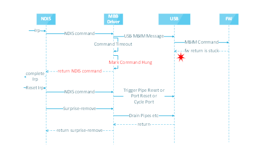
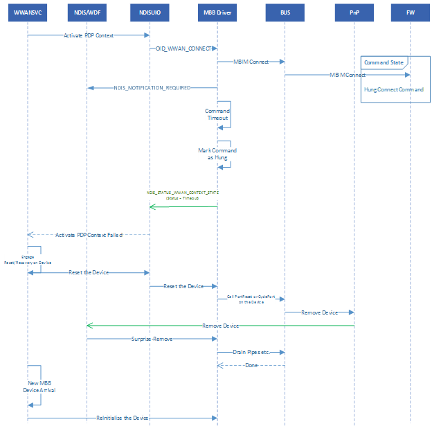

# MB hang detection

Mobile Broadband (MB or MBB) hang detection is a technology in Windows 10, version 1809 and later that assists MBB client drivers in detecting hang conditions in the control path and recovering from them. It is a part of the [Device-based Reset and Recovery](mb-device-based-reset-and-recovery.md) feature that is aimed at recovering from a variety of possible error conditions for MBB devices and drivers. 

The flow diagrams in this topic use USB as the underlying bus, although the reset mechanism is bus agnostic if the ACPI and bus stack define the interfaces described on this page. 

The following flow diagram applies generically to all NDIS object identifiers (OIDs) and callbacks to miniport drivers. There might be cases where the recovery part of this process does not work if NDIS does not fully support reset recovery.

This hang detection and reset flow sequence consists of 3 phases:

1. Hang detection 
2. Any potential logging to get the states for further debugging
3. Reset – surprise removal handling

## Hang detection

The service layer provides a hint to the driver to initiate a recovery whenever something wrong is detected at the user layer, since `WWANSvc` has a state machine managing the connectivity state of the cellular adapter. To support this, a private interface is defined that the driver uses to trigger a reset operation. There are a few cases where the driver originates its own commands down to the device to make sure the state machine is valid. If any of these commands time out, then the reset/recovery is triggered from the driver itself without having to communicate the operation back to user mode to initiate a recovery operation. 

For more information about the private interface that UDE client drivers can use to trigger a reset operation, see [MB Device-based Reset and Recovery](mb-device-based-reset-and-recovery.md#reset-recovery-for-ude-devices).

This example uses [OID_WWAN_CONNECT](oid-wwan-connect.md) as an example for walking through the hang detection flow. 

1. NDIS (via the protocol driver) receives an [OID_WWAN_CONNECT](oid-wwan-connect.md).
2. NDIS passes OID_WWAN_CONNECT down to the class driver.
3. The class driver constructs an MBIM message for the Connect request.
4. The class driver sends the MBIM message to the MBIM function via the USB bus. 
5. The firmware command times out, which could be because the firmware is hung or the MBIM command is taking a long time to complete.
6. The class driver returns the NDIS command without the firmware completion with NDIS_NOTIFICATION_REQUIRED. The result of OID_WWAN_CONNECT is returned with a solicited notification from the driver via [NDIS_STATUS_WWAN_CONTEXT_STATE](ndis-status-wwan-context-state.md) with **Status** set to **Timeout**, indicating that the underlying device didn’t respond to the command. 
7. NDIS completes the OID request to the protocol driver.
8. The protocol driver returns the call back to the service, which sees that the command failed.
9. The service triggers a reset operation on the device using the new OID interface. 
10. After this point, the FDO calls the bus to surprise-remove and re-enumerate the MBB device. If the underlying bus is USB, then the FDO will call appropriate functions to reset the device. 
11. If the appropriate ACPI methods are defined in UEFI, then either FLDR or PLDR will be triggered.

For more information about FLDR and PLDR, see [MB Device-based Reset and Recovery](mb-device-based-reset-and-recovery.md#device-based-resets).

## Reset (Surprise-Removal)

Once the reset recovery can proceed, the bus causes the Plug and Play (PnP) manager to generate a surprise-remove IRP, provided the support is present at the ACPI/UEFI level. NDIS, on receiving the surprise-remove IRP, calls back into `WMBCLASS` for a surprise-remove PnP event callback. `WMBCLASS` handles the surprise-removal operation. At this point, all the commands, etc. must be completed and the data packets must be returned successfully back to NDIS. Otherwise, the surprise-removal operation will not complete. The rest of flow is identical to a real device surprise-remove on a bus, for example USB. 

1. NDIS calls the PnP event for surprise-removal.
2. `WMBCLASS` ignores the return of hung MBIM command and returns the original NDIS command. 
3. `WMBCLASS` returns the NDIS PnP callback for surprise-removal.

## Recovery

After the surprise-removal, all drivers in the stack including `WMBCLASS` must release all resources so that the device object can be removed and re-enumerated by the bus. Failing to do so, the device will not be re-enumerated and will not be recovered.

## Related links

[MB Device-based Reset and Recovery](mb-device-based-reset-and-recovery.md)

[MB Device-based Reset and Recovery Trace](mb-device-based-reset-and-recovery-trace.md)
