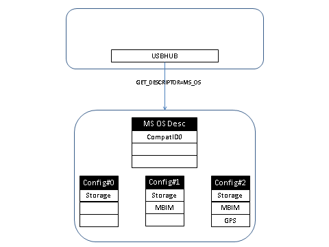
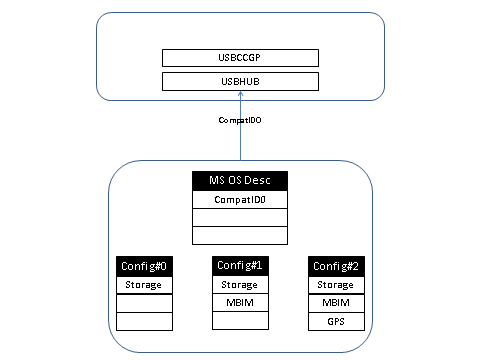
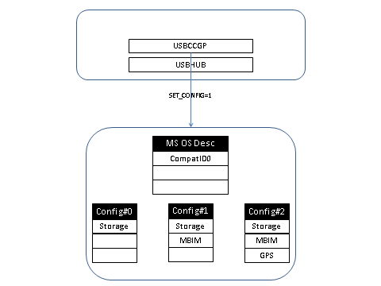
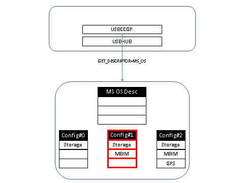
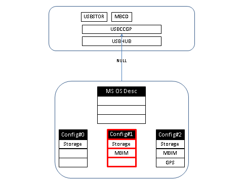

# MB Identity Morphing Solution Details

## Configuration requirements

The order of the functions across transitions in Windows 8 needs to be maintained. For example, if MBIM is the third function in the Windows-8-Configuration, it should also be the third function in the IHV-NCM-2.0-Configuration.

Windows-7-Configuration

The Windows-7-Configuration should be the first configuration in the morphing device. This configuration should have the mass storage function as one of the functions. Windows 8 will not select this configuration. In Windows 7 and earlier versions of Windows, the Windows-7-Configuration is the default configuration selected. This configuration is used to expose a USB mass storage function where IHVs put their driver package, which allows users to install the IHV’s driver.

Windows-8-Configuration

The Windows-7-Configuration exposes the MBIM function as one of the functions on which MBCD is loaded. In Windows 8, the value of this configuration is used in the subCompatibleID value returned to USBCCGP. USBCCGP selects this configuration when it is loaded. The Windows-8-Configuration should be either Configuration 2, 3, or 4. No other configuration is supported as the Windows-8-Configuration. This configuration also exposes the mass storage function as the first function to allow a user to install the IHV’s driver package.

IHV-NCM-2.0-Configuration

The IHV-NCM-2.0-Configuration exposes IHV-specific functions along with MBIM and mass storage functions. This configuration is not set or used by Windows. The IHV software, after installation by the user, can morph to this configuration. Note that the order of the functions in this configuration should be the same as in the Windows-8-Configuration. Although extra functions can be added to the Windows-8-Configuration, the existing functions should be retained in the same order.

IHV-NCM-1.0-Configuration

The IHV-NCM-1.0-Configuration exposes IHV-specific functions along with NCM 1.0 and mass storage functions. This configuration is not set or used by Windows 8. This configuration is used only in Windows 7 and earlier versions of Windows after the IHV software is installed by the user. The IHV software morphs the morphing device from the Windows-7-Configuration to this configuration.

## Compatible IDs

Compatible IDs are 8-character or smaller strings used by the device to indicate the driver loading preference to Windows. Devices can define compatible IDs by using Microsoft OS descriptors. Compatible and subcompatible IDs apply to individual functions. Each configuration can have a separate set of compatible IDs, which map to the set of functions within that configuration. Although compatible and subcompatible IDs apply to individual functions, the morphing device can have a single compatible ID when no configuration is selected. This compatible and subcompatible ID logically applies to the whole morphing device.

**Loading USBCCGP**

In Windows 8, a USBCCGP driver is required to automatically select the Windows-8-Configuration on the morphing device.

To load the USBCCGP driver, the morphing device needs to report the following compatible and subcompatible IDs when no configuration is selected on the morphing device:

-   If the morphing device uses IADs for grouping interfaces into functions, the compatible ID should be reported as "ALTRCFG" and the subcompatible ID as the number of the Windows-8-Configuration.
-   If the morphing device uses WCM UFDs for grouping interfaces into functions, the compatible ID should be reported as "WMCALTR" and the subcompatible ID as the number of the Windows-8-Configuration.

For example, if the Windows-8-Configuration is Configuration 3, the subcompatible ID would be "3" in both of these cases.

**Morphing compatible IDs**

During USB device enumeration, USBHUB queries the morphing device for the compatible ID when no configuration is selected on the morphing device. The morphing device should return the compatible and subcompatible ID used to load USBCCGP, as described in [MB Identity Morphing Solution Overview](mb-identity-morphing-solution-overview.md).

After USBHUB loads USBCCGP, USBCCGP selects the configuration indicated by the subcompatible ID reported earlier. USBCCGP then queries the compatible and subcompatible ID a second time. At this point, the morphing device should return the compatible and subcompatible IDs for the configuration that is currently selected. Therefore, after USBCCGP loads and selects a particular configuration, the morphing device needs to morph the compatible and subcompatible IDs that are reported. The morphing device must not report the compatible and subcompatible IDs that are used to load USBCCGP after a configuration is selected.

USBHUB querying the Microsoft OS descriptor from the device during enumeration.

Device returns CompatId in the not-configured state. This CompatId is used to load USBCCGP.

USBCCGP selects the configuration reported in the subcompatible ID.

Device morphs its Microsoft OS descriptor based on the new configuration. USBCCGP queries for the Microsoft OS descriptor.

Device does not return any CompatID. Based on the Class / Subclass / Protocol, USBCCGP loads USBSTOR and MBCD.

 

 

