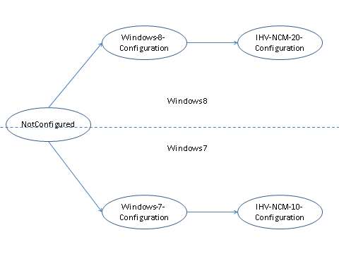
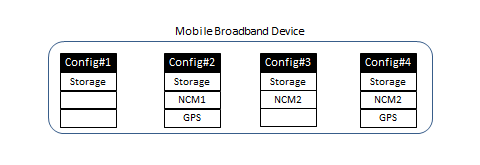
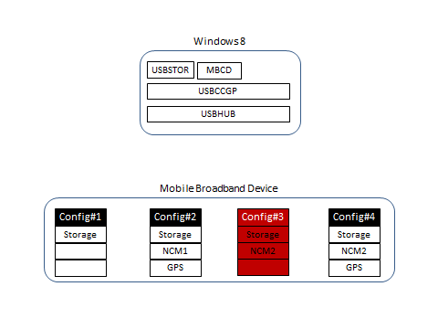
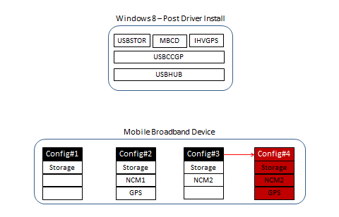
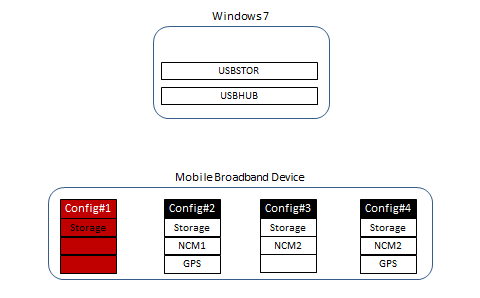
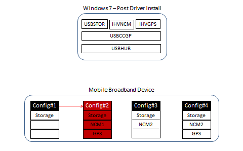

# MB Identity Morphing Solution Overview

The solution maps the morphing device’s USB configuration to a set of USB functions. At any point in time, a single set of functions (by way of a configuration) are exposed to the host. The solution achieves morphing by switching between these configurations.

## Logical configurations

The functions present in the device are grouped into the following logical sets.

*Logical Set of Functions*

<table>
<colgroup>
<col width="50%" />
<col width="50%" />
</colgroup>
<thead>
<tr class="header">
<th align="left">Logical Set of Functions</th>
<th align="left">Description</th>
</tr>
</thead>
<tbody>
<tr class="odd">
<td align="left">
Windows-7-Configuration
</td>
<td align="left">
Configuration selected by Windows 7 and older versions of Windows when the morphing device is inserted into the host for the first time.
</td>
</tr>
<tr class="even">
<td align="left">
Windows-8-Configuration
</td>
<td align="left">
Configuration selected by Windows 8 when the morphing device is inserted into the host.
</td>
</tr>
<tr class="odd">
<td align="left">
IHV-NCM-1.0-Configuration
</td>
<td align="left">
Configuration selected by the IHV software installed on Windows 7 and older versions of Windows after the user installs the driver package.
</td>
</tr>
<tr class="even">
<td align="left">
IHV-NCM-2.0-Configuration
</td>
<td align="left">
Configuration selected by the IHV software installed on Windows 8 after the user installs the driver package.
</td>
</tr>
</tbody>
</table>

 

The following table shows the USB configurations listed in the previous table along with possible interfaces and functions. Additional requirements for each configuration are described in the remaining subtopics.

*USB Configurations*

<table>
<colgroup>
<col width="25%" />
<col width="25%" />
<col width="25%" />
<col width="25%" />
</colgroup>
<thead>
<tr class="header">
<th align="left">Configuration 1 (Windows-7-Configuration)</th>
<th align="left">Configuration 2(IHV–NCM-10-Configuration)</th>
<th align="left">Configuration 3(Windows-8- Configuration)</th>
<th align="left">Configuration 4(IHV–NCM-20- Configuration)</th>
</tr>
</thead>
<tbody>
<tr class="odd">
<td align="left">
Mass CD-ROM

Mass SD
</td>
<td align="left">
Mass CD-ROM

Mass SD

NCM1.0

Modem

TV

GPS

FP

PC/SC smart card

Voice

Diag
</td>
<td align="left">
Mass CD-ROM

Mass SD

MBIM
</td>
<td align="left">
Mass CD-ROM

Mass SD

NCM2.0

Modem

TV

GPS

FP

PC/SC smart card

Voice

Diag
</td>
</tr>
</tbody>
</table>

 

Goals of the solution

-   In Windows 7, users need to perform the extra step of installing driver packages before being able to use the mobile broadband function on morphing devices.
-   In Windows 8, users should not have to perform extra steps for installing driver packages to use the mobile broadband function on morphing devices that conform to the MBIM specification.
-   In Windows 8, users need to perform the extra step of installing driver packages before being able to use IHV functions on morphing devices that do not have inbox drivers.

**Assumptions**

MBIM also includes backward compatibility for NCM 1.0.

## Supported Transitions

For Windows 8

Not-Configured -&gt; Windows-8-Configuration

Windows-8-Configuration -&gt; IHV-NCM-2.0-Configuration

For Windows 7

Not-Configured -&gt; Windows-7-Configuration

Windows-7-Configuration -&gt; IHV–NCM-1.0-Configuration

The configuration transition paths for Windows 7 and Windows 8

Note that any transition not shown previously is not supported.

## Transition Details

Consider a sample USB morphing device with the following functions in its configurations.

USB device with multiple functions

**Windows 8**

Windows-8-Configuration

When the morphing device is plugged into a computer running Windows 8, the Windows-8-Configuration would be selected, which exposes the MBIM function. The Windows 8 Mobile Broadband Class Driver (MBCD) will be loaded on the MBIM function. In the following example, Configuration 3 is the Windows-8-Configuration containing the MBIM function.

Driver stack and device configuration on Windows 8 after device is plugged in

IHV-NCM-2.0-Configuration

In the Windows-8-Configuration, the morphing device also has a mass storage function that will allow the user to install the IHV driver package. After installation of the driver package from the mass storage function, the device will morph to expose the functions in the IHV-NCM-2.0-Configuration. This configuration has an additional IHV function such as GPS, diagnostics, and so on. Configuration 4 in the following diagram represents the IHV-NCM-2.0-Configuration.

Driver stack and device configuration on Windows 8 after user installs IHV driver package

**Windows 7**

Windows-7-Configuration

When the morphing device is plugged into a computer running Windows 7 or an earlier version of Windows, the Windows-7-Configuration would be selected, which exposes the mass storage function. This will allow the user to install the IHV driver package from the mass storage function.

In the following example, Configuration 1 is the Windows-7-Configuration

Driver stack and device configuration on Windows 7 when the user has not installed the IHV driver package

IHV-NCM-1.0-Configuration

In Windows 7, the user can install the driver package from the mass storage function. Along with installing the driver software, the IHV software will also morph the device from the Windows-7-Configuration to the IHV-NCM-1.0-Configuration.

Driver stack and device configuration in Windows 7 after user installs IHV driver package

 

 

