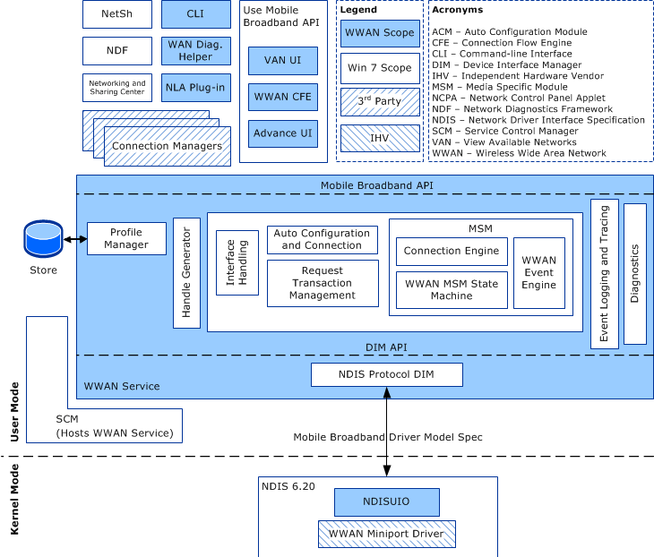

# MB Interface Overview

This documentation describes the Mobile Broadband (MB) driver model. The MB driver model is a software architecture provided with Windows 7 and later versions of Windows. It provides a framework for an integrated set of networking features based on CDMA-based (1xRTT/1xEV-DO/1xEV-DO RevA/1xEvDO RevB) and GSM-based (GPRS/EDGE/UMTS/HSDPA/TD-SCDMA) cellular technologies.

Windows 8 MB miniport drivers are based on the [NDIS 6.30](introduction-to-ndis-6-30.md) interface. Windows 7 MB miniport drivers are based on the [NDIS 6.20](introduction-to-ndis-6-20.md) interface. MB miniport drivers must follow the appropriate "NDIS 6.x Specification" in addition to the device driver interfaces (DDIs) described throughout this documentation.

The following diagram represents the architecture of the MB driver model.

### Terminology

Be aware that the terms *Wireless Wide Area Network* (WWAN) and *Mobile Broadband* (MB) are used interchangeably throughout this documentation to represent the Mobile Broadband technology.

The terms *activate* and *activation* have two different meanings in this documentation. The term *activate* is related to service activation, such as when a network provider must explicitly enable the MB subscription before the provider's services can be used. The term *activation* is specific to setting up a connection in GSM-based (GPRS/EDGE/UMTS/HSDPA/TD-SCDMA) technologies. For example, *PDP context activation* refers to setting up an MB connection according to the parameters specified in the PDP context.

*SIM access* refers to accessing the Subscriber Identity Module (SIM, also known as the R-UIM). If the MB device does not have a SIM/R-UIM as a physical entity but instead has a logical equivalent embedded in the device, this term is applicable to that logical circuit equivalent as well. When SIM access is not required, the miniport driver is not expected to retrieve the information from the SIM in order to complete the request.

### Semantics

The MB Service component in user mode cannot directly exchange data with MB miniport drivers in kernel mode. Intermediaries such as WMI or [NDIS filter drivers](ndis-filter-drivers2.md) are required. For simplicity, these intermediaries are not explicitly discussed in this documentation. However, this omission does not mean that the MB Service and MB miniport drivers can engage in direct data exchanges.

The following topics provide a summary of NDIS 6.20 and MB OID semantics, the procedures that miniport drivers must follow to perform synchronous and asynchronous operations, and an overview of the operations supported by the Mobile Broadband driver model:

[MB / NDIS 6.20 Interfacing Overview](mb---ndis-6-20-interfacing-overview.md)

[MB Data Model](mb-data-model.md)

[MB Operational Semantics](mb-operational-semantics.md)

[MB Driver Model Versioning](mb-driver-model-versioning.md)

[MB Miniport Driver INF Requirements](mb-miniport-driver-inf-requirements.md)

[MB Miniport Driver Types](mb-miniport-driver-types.md)

[MB Adapter General Attribute Requirements](mb-adapter-general-attribute-requirements.md)

[MB Raw IP Packet Processing Support](mb-raw-ip-packet-processing-support.md)

[Guidelines for MB Miniport Driver IP Address Notifications](guidelines-for-mb-miniport-driver-ip-address-notifications.md)

[MB Miniport Driver Error Logging](mb-miniport-driver-error-logging.md)

[MB Miniport Driver Performance Requirements](mb-miniport-driver-performance-requirements.md)

 

 

