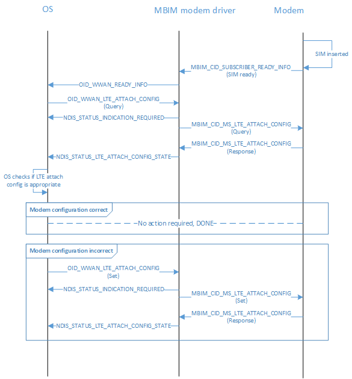

# MB LTE Attach Operations

## LTE Attach APN Configuration for MBIM Modems

Traditionally, LTE attach has been considered part of registration and Windows has not directly been involved in LTE attach procedures. However, unlike typical circuit switch network registrations, LTE is a packet switch-only network and requires a default EPS bearer to be enabled for the device to maintain registration on the LTE network.

To establish a default EPS bearer with the network the device must request a PDP context activation during the LTE attach procedure, which requires Access Point Name (APN) specification. Per the 3GPP standard, there are four scenarios where a device can specify APN when it is trying LTE attach:

1.  The device specifies a specific LTE attach APN.
2.  The device specifies a specific LTE attach APN but the network decides to let the device attach on another APN instead during roaming.
3.  The device does not specify a LTE attach APN and lets network assign one back to the device.
4.  The device registered from a 2G/3G network to LTE and there was already at minimum one active PDP context. The network uses it as the LTE attach APN.

Today, all LTE attach APN information is provided by IHVs and OEMs directly in the modem for each provider for which it has configuration. However, it is not a fully scalable model for IHVs and OEMs to have all possible LTE attach APN settings for all operators around the globe. Starting in Windows 10, version 1703, new interfaces are defined for both NDIS OIDs and MBIM Microsoft proprietary CIDs to support LTE attach APN configuration from the OS. 

Starting in Windows 10, version 1703, if the underlying hardware supports LTE attach APN configuration from the OS then the user will be able to configure the LTE attach APN from Settings. Hardware that has default LTE attach APN configurations must also make its configuration available by the OS.

This feature is supported by adding in two new OIDs and CIDs.  For IHV partners that implement MBIM, only the CID version has to be supported.

## MB Interface Update for LTE Attach Operations

Two new MBIM CIDs have been created to allow for LTE attach APN configuration and for the OS to retrieve the latest LTE attach status of the device. If IHV partners decide to support OS default LTE attach APN management then both commands must be supported.

Service Name = **Basic Connect Extensions**

UUID = **UUID_BASIC_CONNECT_EXTENSIONS**

UUID Value = **3d01dcc5-fef5-4d05-0d3abef7058e9aaf**

| CID | Command Code | Minimum OS Version |
| --- | --- | --- |
| MBIM_CID_MS_LTE_ATTACH_CONFIG | 3 | Windows 10, version 1703 |
| MBIM_CID_MS_LTE_ATTACH_STATUS | 4 | Windows 10, version 1703 |

## MBIM_CID_MS_LTE_ATTACH_CONFIG

### Description

LTE attach contexts can be different , depending on how the network interacts with the device during runtime. For the rest of this documentation, LTE attach context will be referred to as the current PDP context that is being used for LTE attach and default LTE attach context will be referred to as what is configured on the device performing LTE attach with when there is no other existing enabled PDP context.  MBIM_CID_MS_LTE_ATTACH_CONFIG enables the OS to Query and Set the default LTE attach context of the inserted SIM’s provider (MCC/MNC pair). 

Although the LTE attach APN could be technically considered as a context, it differs from all other contexts stored in the modem. For all other contexts activation happens after registration and, based on various conditions, the OS can decide which context is the best fit for connection. However, the LTE attach context is enabled as part of device registration on the LTE network. The OS is unable to retrieve any network-related status before the completion of registration; because of this limitation, the OS must be able to configure LTE attach context for all different roaming conditions of the device to make sure the device can register on the LTE network regardless of what the roaming status is.

LTE attach context activation with the network does not require an OS-explicit connection request as the OS is not aware of any modem self-initiated context activation. Default LTE attach context falls into this category. When the OS issues a MBIM_CID_CONNECT request to enable a PDP context and the given PDP context matches all the following, the modem should complete the CID activation request with success without bringing up a new over-the-air bearer with the network:

1.  There is an existing enabled PDP context that is initiated by the modem and not made available to the OS.
2.  The PDP context matches the specified APN in the CID request.
3.  The IP type of the enabled PDP context is compatible with the requested IP type in the CID.

This is important as the OS is not aware of all the PDP contexts that were initiated by the modem. This will reduce network noise and load. Otherwise, the modem should bring up a new over-the-air bearer matching OS APN specification as per a normal context activation request. The IP type compatibility is specified here:

| IP type of the enabled PDP context within the modem | Compatible with requested IP type(s) | Incompatible with requested IP type |
| --- | --- | --- |
| IPv4 | Default; IPv4; IPv4v6; IPv4 and v6 | IPv6 |
| IPv6 | Default; IPv6; IPv4v6; IPv4 and v6 | IPv4 |
| IPv4v6 | Default; IPv4; IPv6; IPv4v6; IPv4 and v6 | None |

> [!NOTE]
> The modem should not bring up a second PDP context if only one of the IP type is enabled over the air. For example, if IPv4 is enabled and the host requests IPv4 and IPv6 then the modem should complete the activation request without bringing up an IPv6 bearer.

When the OS issues a MBIM_CID_CONNECT request to deactivate a PDP context then the modem should check the following:

1.  Whether the device is LTE attached and the context to be deactivated is the only enabled PDP context to maintain LTE registration
2.  Whether the context to be deactivated is also used by the modem internally for any services that are not exposed to the OS

If either of these are true, then the modem should complete the CID deactivation request but continue to maintain the over-the-air bearer with the network. Otherwise the modem should deactivate the context as per normal deactivation requests.

All default LTE attach APN configuration provided by the OS is per-provider and matches to the inserted SIM card’s home Provider ID (MCC/MNC pair). The modem should only provide configured LTE attach context for the current inserted SIM’s Provider ID when queried. The modem should always return three default LTE attach contexts that matches the inserted SIM’s Provider ID, one for each roaming condition (home/partner/non-partner).

It is expected that across SIM swaps, the modem should clear its default LTE attach context before applying the configuration for the next SIM card. If the newly inserted SIM card has no default LTE attach context configuration, then the device should return NULL empty strings for the APN of the LTE attach context for all roaming conditions while keeping the context enabled. If the context is disabled, it is expected for the device to not attach on LTE because there is no usable configuration for LTE attach. When the user swaps back to a SIM card that was previously configured on the device, the modem should restore its factory default LTE attach configuration for the SIM card. It is not expected for run time configuration to persist across SIM swaps. At any time, there should only be one default LTE attach APN in the modem per roaming condition (home/partner/non-partner).  

The OS will always set all three default LTE attach contexts when a Set command is issued, one for each roaming condition. If the list provided by the OS does not have exactly three then the Set command should be rejected. If one of the provided default LTE attach contexts is configured by the OS where the roaming condition matches the current registration status, then the modem should detach from the network and re-perform LTE attach with the newly specified LTE attach context. Otherwise, the device is expected to use the specified default LTE attach context the next time when roaming conditions match.  If the device-specified default LTE attach context fails to register on LTE network, then the device should fall back to 3G/2G as appropriate. When the modem cannot differentiate between partner and non-partner networks, the modem should use the non-partner default LTE attach context for all roaming scenarios. If the OS configures default LTE attach context as IP type = default, then it is expected for the modem to assign the most appropriate IP type for LTE attach context.  However, the OS expects the modem to still return partner roaming conditions and IP type of LTE attach context that reflects the configuration accurately.

IHVs and OEMs can preconfigure LTE attach context as the default configuration in the modem, but those contexts must be tagged as MBIM_MS_CONTEXT_SOURCE = MbimMsContextSourceModemProvisioned.  

Per the 3GPP standard, the default LTE attach context can be split into two categories: UE-initiated and network-initiated. If the device is configured with a NULL empty access string, the device is expected not to provide any LTE attach context to the network and wait for the network to assign one back to the device. Just as prescribed by MBIM 1.0, if the LTE attach context’s IP type is configured to be default then the modem should select the best IP type based on its internal algorithm.

The following diagram illustrates an example flow of LTE attach configuration.

#### Query

MBIM_MS_LTE_ATTACH_CONFIG_INFO is returned from completed Query and Set messages in the InformationBuffer. For Query, the InformationBuffer is NULL.

#### Set

For Set, the InformationBuffer contains an MBIM_MS_SET_LTE_ATTACH_CONFIG.

#### Unsolicited Events

The Event InformationBuffer contains an MBIM_MS_LTE_ATTACH_CONFIG_INFO structure. In some cases, the default LTE attach context is updated by the network either Over-The-Air (OTA) or by Short Message Service (SMS) that does not go over the MBIM_CID_MS_LTE_ATTACH_CONFIG command from the OS. The function must update default LTE attach contexts and tag MBIM_MS_CONTEXT_SOURCE = MbimMsContextSourceOperatorProvisioned accordingly. After that, functions must notify the Host about updates that use this event with the updated list.

### Parameters

|  | Set | Query | Notification |
| --- | --- | --- | --- |
| Command | MBIM_SET_MS_LTE_ATTACH_CONFIG | Not applicable | Not applicable |
| Response | MBIM_MS_LTE_ATTACH_CONFIG_INFO | MBIM_MS_LTE_ATTACH_CONFIG_INFO | MBIM_MS_LTE_ATTACH_CONFIG_INFO |

### Data Structures

#### Query 

The InformationBuffer shall be NULL and InformationBufferLength shall be zero.

#### Set

The following MBIM_MS_SET_LTE_ATTACH_CONFIG structure shall be used in the InformationBuffer. The Set command is only valid if the list contains an element count of three, one for each roaming condition (home/partner/non-partner).

| Offset | Size | Field | Type | Description |
| --- | --- | --- | --- | --- |
| 0 | 4 | Operation | MBIM_MS_LTE_CONTEXT_OPERATIONS | Specifies the type of operation for which the Set command is used. If set to MbimMsLteAttachContextOperationRestoreFactory then all other fields should be ignored. OS-created or -modified default LTE attach contexts should be removed and the default factory preconfigured default LTE attach contexts should be loaded. If the modem does not have a default configuration, then all roaming condition default LTE attach contexts should be set to an empty APN string and IP type = default. |
| 4 | 4 | ElementCount (EC) | UINT32 | Count of MBIM_MS_LTE_ATTACH_CONTEXT structures that follow in the DataBuffer. This component is currently specified to three, one for each roaming condition (home/partner/non-partner). |
| 8 | 8 * EC | MsLteAttachContextRefList | OL_PAIR_LIST | The first element of the pair is a 4-byte offset, calculated from the beginning (offset 0) of this MBIM_MS_LTE_ATTACH_CONFIG_INFO structure, to an MBIM_MS_LTE_ATTACH_CONTEXT structure (For more information, see the  MBIM_MS_LTE_ATTACH_CONTEXT table). The second element of the pair is a 4-byte size of a pointer to the corresponding MBIM_MS_LTE_ATTACH_CONTEXT structure. |
| 8 + (8 * EC) |  | DataBuffer | DATABUFFER | Array of MBIM_MS_LTE_ATTACH_CONTEXT structures. |

The following structures are used in the preceding table.

MBIM_MS_LTE_ATTACH_CONTEXT_OPERATIONS describes the types of operations that can be used in the Set command.

| Type | Value | Description |
| --- | --- | --- |
| MbimMsLteAttachContextOperationDefault | 0 | Default operation for overwriting existing default LTE attach contexts in the modem. The OS will always replace all three default LTE attach context for roaming conditions. |
| MbimMsLteAttachContextOperationRestoreFactory | 1 | Restore factory preconfigured default LTE attach context for the Provider ID of currently inserted SIM. All default LTE attach contexts replaced or created by the OS should be removed and replaced. If there is no default preconfigured default LTE attach context for the current inserted SIM Provider ID with one or more roaming conditions, then the default LTE attach should return an empty APN string and IP type = default. |

MBIM_MS_LTE_ATTACH_CONTEXT specifies the context to be used for LTE attach configuration.

| Offset | Size | Field | Type | Description |
| --- | --- | --- | --- | --- |
| 0 | 4 | IPType | MBIM_CONTEXT_IP_TYPE | For more information, see the  MBIM_CONTEXT_IP_TYPE table. |
| 4 | 4 | Roaming | MBIM_MS_LTE_ATTACH_CONTEXT_ROAMING_CONTROL | Indicates which roaming condition applies to this default LTE attach context. For more information, see the MBIM_MS_LTE_ATTACH_CONTEXT_ROAMING_CONTROL table. |
| 8 | 4 | Source | MBIM_MS_CONTEXT_SOURCE | Specifies the creation source of the context. For more information, see the MBIM_MS_CONTEXT_SOURCE table. |
| 12 | 4 | AccessStringOffset | OFFSET | Offset in data buffer to a string, AccessString, to access the network. For GSM-based networks, this would be an Access Point Name (APN) string such as "data.thephone-company.com". The size of the string should not exceed 100 characters. If the AccessString is empty, then the device expects the network to assign an access string back to the device. IP type still has to be specified in this case. |
| 16 | 4 | AccessStringSize | SIZE(0..200) | Size used for AccessString. This value should be 0 if the device expects the network to assign an access string back to the device for LTE attach. |
| 20 | 4 | UserNameOffset | OFFSET | Offset in bytes, calculated from the beginning of this structure, to a string, UserName, that represents the username to authenticate. This member can be NULL. |
| 24 | 4 | UserNameSize | SIZE(0..510) | Size used for UserName. |
| 28 | 4 | PasswordOffset | OFFSET | Offset in bytes, calculated from the beginning of this structure, to a string, Password, that represents the username's password. This member can be NULL. |
| 32 | 4 | PasswordSize | SIZE(0..510) | Size used for Password. |
| 36 | 4 | Compression | MBIM_COMPRESSION | Specifies the compression to be used in the data connection for header and data. This member applies only to GSM-based devices. The Host sets this member to MBIMCompressionNone for CDMA-based devices. For more information, see the MBIM_COMPRESSION table. |
| 40 | 4 | AuthProtocol | MBIM_AUTH_PROTOCOL | Authentication type to use for the PDP activation. For more information, see the MBIM_AUTH_PROTOCOL table. |
| 44 |  | DataBuffer | DATABUFFER | The data buffer that contains AccessString, UserName, and Password. |

MBIM_MS_LTE_ATTACH_CONTEXT_ROAMING_CONTROL indicates which roaming condition applies to this default LTE attach context.

| Type | Value | Description |
| --- | --- | --- |
| MbimMsLteAttachContextRoamingControlHome | 0 | Indicates whether the default LTE attach context is allowed to be used on home network or not. |
| MbimMsLteAttachContextRoamingControlPartner | 1 | Indicates whether the context is allowed to be used on partner roaming networks or not. |
| MbimMsLteAttachContextRoamingControlNonPartner | 2 | Indicates whether the context is allowed to be used on non-partner roaming networks or not. |

MBIM_MS_CONTEXT_SOURCE specifies the creation source of the context.

| Type | Value | Description |
| --- | --- | --- |
| MbimMsContextSourceAdmin | 0 | The context was created by an Enterprise IT admin from the OS. |
| MbimMsContextSourceUser | 1 | The context was created by user through the OS settings. |
| MbimMsContextSourceOperator | 2 | The context was created by the operator through OMA-DM or other channels. | 
| MbimMsContextSourceModem | 3 | The context was created by the IHV or OEM. |
| MbimMsContextSourceDevice | 4 | The context was created by the OS APN database. |

#### Response

The following MBIM_MS_LTE_ATTACH_CONFIG_INFO structure shall be used in the InformationBuffer.

| Offset | Size | Field | Type | Description |
| --- | --- | --- | --- | --- |
| 0 | 4 | ElementCount (EC) | UINT32 | Count of MBIM_MS_LTE_ATTACH_CONTEXT structures that follow in the DataBuffer. This component is currently specified to three, one for each roaming condition (home/partner/non-partner). |
| 4 | 8 * EC | MsLteAttachContextRefList | OL_PAIR_LIST | The first element of the pair is a 4-byte offset, calculated from the beginning (offset 0) of this MBIM_MS_LTE_ATTACH_CONFIG_INFO structure, to an MBIM_MS_LTE_ATTACH_CONTEXT structure (For more information, see the MBIM_MS_LTE_ATTACH_CONTEXT table). The second element of the pair is a 4-byte size of a pointer to the corresponding MBIM_MS_LTE_ATTACH_CONTEXT structure. |
| 4 + (8 * EC) |  | DataBuffer | DATABUFFER | Array of MBIM_MS_LTE_ATTACH_CONTEXT structures. |

#### Notification

For more information, see the MBIM_MS_LTE_ATTACH_CONFIG_INFO table.

### Status Codes

For Query and Set operations:

| Status Code | Description |
| --- | --- |
| MBIM_STATUS_READ_FAILURE | The operation failed because the device was unable to retrieve provisioned contexts. |
| MBIM_STATUS_NO_DEVICE_SUPPORT | The operation failed because the device does not support the operation. |

For Set operations only: 

| Status Code | Description |
| --- | --- |
| MBIM_STATUS_INVALID_PARAMETERS | The operation failed because of invalid parameters. |
| MBIM_STATUS_WRITE_FAILURE  | The operation failed because the update request was unsuccessful. |

## MBIM_CID_MS_LTE_ATTACH_STATUS

### Description

Per 3GPP requirement, although a device can specify the default LTE attach context to be used when LTE attaching to the network without any enabled PDP context, there might be situations where the device will LTE-attach on a PDP context that differs from the default LTE attach context configured on the device. The following is a list of all possible scenarios:

1.  The UE specifies a specific LTE attach APN.
2.  The UE specifies a specific LTE attach APN but the network decides to let the device attach on another APN instead during roaming.
3.  The UE does not specify a LTE attach APN and lets network assign one back to the device.
4.  The UE registered from 2G/3G network to LTE and there was already at minimum one active PDP context. The network uses it as the LTE attach APN.

When the device default LTE attaches, it should send a notification of MBIM_CID_MS_LTE_ATTACH_STATUS to the OS to provide details of the PDP context on the latest LTE attachment. Default LTE attach occurs when one of the following scenarios is fulfilled:

1.  Device initially attaches to the LTE network.
2.  Device hands up from 2G/3G to LTE without any prior enabled PDP context.

The LTE attach context returned from MBIM_CID_LTE_ATTACH_STATUS could be one of the following:

1.  Default LTE attach context stored in the modem.
2.  Default LTE attach context that was assigned back from the network.

During runtime, the OS should also be able to query what the last used attach information was for default LTE attach. The modem is expected to return the last known default LTE attach context.  If the device was handed off from LTE to 2G/3G network, it is expected for the modem to return the context that was used for the previous LTE attach. Every time that the device deregisters from the network, it is expected for the APN to become empty.

The below diagram illustrates an example message flow for LTE attach status.

#### Query

MBIM_MS_LTE_ATTACH_STATUS is returned from Query complete messages in the InformationBuffer. For Query, the InformationBuffer is NULL.

#### Set 

Set operations are not supported.

#### Unsolicited Events

The Event InformationBuffer contains an MBIM_MS_LTE_ATTACH_STATUS structure.

### Parameters

|  | Set | Query | Notification |
| --- | --- | --- | --- |
| Command | Not applicable | Not applicable | Not applicable |
| Response | Not applicable | MBIM_MS_LTE_ATTACH_STATUS | MBIM_MS_LTE_ATTACH_STATUS |

### Data Structures

#### Query

The InformationBuffer shall be NULL and InformationBufferLength shall be zero.

#### Set

Set operations are not supported.

#### Response

The following MBIM_MS_LTE_ATTACH_STATUS structure shall be used in the InformationBuffer.

| Offset | Size |       Field        |           Type           |                                                                                                                                                                                                                                                                                                    Description                                                                                                                                                                                                                                                                                                     |
|--------|------|--------------------|--------------------------|--------------------------------------------------------------------------------------------------------------------------------------------------------------------------------------------------------------------------------------------------------------------------------------------------------------------------------------------------------------------------------------------------------------------------------------------------------------------------------------------------------------------------------------------------------------------------------------------------------------------|
|   0    |  4   |   LteAttachState   | MBIM_MS_LTE_ATTACH_STATE |                                                                                                                                                                                                                                    Indicates whether the device is currently attached to a LTE network or not.  For more information, see the  MBIM_MS_LTE_ATTACH_STATE table.                                                                                                                                                                                                                                     |
|   4    |  4   |       IPType       |  MBIM_CONTEXT_IP_TYPES   |                                                                                                                                                                                                                                                                             For more information, see the MBIM_CONTEXT_IP_TYPE table.                                                                                                                                                                                                                                                                              |
|   8    |  4   | AccessStringOffset |          OFFSET          | Offset in data buffer to a string, AccessString, to access the network. For GSM-based networks, this would be an Access Point Name (APN) string such as "data.thephone-company.com". For CDMA-based networks, this might be a special dial code such as "#777" or a Network Access Identifier (NAI) such as "foo@thephone-company.com". This member can be NULL to request that the network assign the default APN. Note: Not all networks support this NULL APN convention. Therefore, a connect failure caused by an invalid APN is a possible outcome. The size of the string should not exceed 100 characters. |
|   12   |  4   |  AccessStringSize  |       SIZE(0..200)       |                                                                                                                                                                                                                                                                                        Size in bytes used for AccessString.                                                                                                                                                                                                                                                                                        |
|   16   |  4   |   UserNameOffset   |          OFFSET          |                                                                                                                                                                                                                          Offset in bytes, calculated from the beginning of this structure, to a string, UserName, that represents the username to authenticate. This member can be NULL.                                                                                                                                                                                                                           |
|   20   |  4   |    UserNameSize    |       SIZE(0..510)       |                                                                                                                                                                                                                                                                                          Size in bytes used for UserName.                                                                                                                                                                                                                                                                                          |
|   24   |  4   |   PasswordOffset   |          OFFSET          |                                                                                                                                                                                                                             Offset in bytes, calculated from the beginning of this structure, to a string, Password, that represents the username's password. This member can be NULL.                                                                                                                                                                                                                             |
|   28   |  4   |    PasswordSize    |       SIZE(0..510)       |                                                                                                                                                                                                                                                                                          Size in bytes used for Password.                                                                                                                                                                                                                                                                                          |
|   32   |  4   |    Compression     |     MBIM_COMPRESSION     |                                                                                                                                                                           Specifies the compression to be used in the data connection for header and data. This member applies only to GSM-based devices. The Host sets this member to MBIMCompressionNone for CDMA-based devices. For more information, see the MBIM_COMPRESSION table.                                                                                                                                                                           |
|   36   |  4   |    AuthProtocol    |    MBIM_AUTH_PROTOCOL    |                                                                                                                                                                                                                                                     Authentication type to use for the PDP activation. For more information, see the MBIM_AUTH_PROTOCOL table.                                                                                                                                                                                                                                                     |
|   40   |  4   |                    |        DataBuffer        |                                                                                                                                                                                                                                                                                                     DATABUFFER                                                                                                                                                                                                                                                                                                     |

The following data structure is used in the preceding table.

MBIM_MS_LTE_ATTACH_STATE indicates whether the device is currently attached to a LTE network or not.

| Type | Value | Description |
| --- | --- | --- |
| MbimMsLteAttachStateDetached | 0 | Indicates the device is not attached to LTE network. |
| MbimMsLteAttachStateAttached | 1 | Indicates the device is attached to LTE network. |

#### Notification

For more information, see the MBIM_MS_LTE_ATTACH_STATUS table.

### Status Codes

For Query and Set operations:

| Status Code | Description |
| --- | --- |
| MBIM_STATUS_READ_FAILURE | The operation failed because the device was unable to retrieve provisioned contexts. |
| MBIM_STATUS_NO_DEVICE_SUPPORT | The operation failed because the device does not support the operation. |
