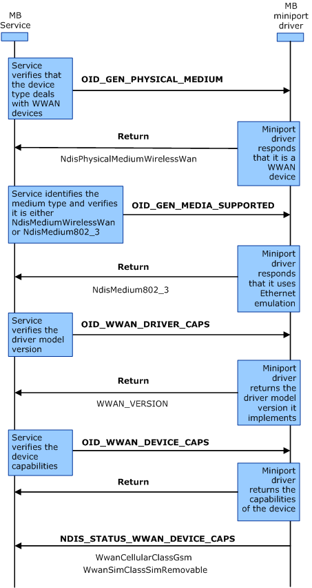

# MB Miniport Driver Initialization

The following diagram represents the process taken to determine whether the interface is qualified as an MB interface and to gather information about the device capabilities. These steps are performed for each enumerated MB interface when the MB Service starts up, as well as for each new interface arrival while the service is running. The labels in bold represent OID identifiers or transactional flow control, and the labels in regular text represent the important flags within the OID structure.

To initialize an MB miniport driver, use the following procedure:

1.  The MB Service sends a synchronous (blocking) [OID\_GEN\_PHYSICAL\_MEDIUM](./oid-gen-physical-medium.md) query request to identify the type of the MB device. The miniport driver responds with **NdisPhysicalMediumWirelessWan** to indicate that the MB device is a WWAN device.

2.  The MB Service sends a synchronous (blocking) [OID\_GEN\_MEDIA\_SUPPORTED](./oid-gen-media-supported.md) query request to the miniport driver to identify what kind of medium the MB device uses. The miniport driver responds with **NdisMedium802\_3** to indicate that it uses Ethernet emulation.

3.  The MB Service sends a synchronous (blocking) [OID\_WWAN\_DRIVER\_CAPS](./oid-wwan-driver-caps.md) query request to the miniport driver to identify what driver model version the miniport driver supports. The miniport driver responds with WWAN\_VERSION.

4.  The MB Service sends an asynchronous (non-blocking) [OID\_WWAN\_DEVICE\_CAPS](./oid-wwan-device-caps.md) query request to the miniport driver to identify the capabilities of the MB device. The miniport driver responds with a provisional acknowledgement that it has received the request, and it will send a notification with the requested information in the future.

5.  The miniport driver sends an [**NDIS\_STATUS\_WWAN\_DEVICE\_CAPS**](./ndis-status-wwan-device-caps.md) notification to the MB Service that indicates the capabilities of the MB device the miniport driver supports. For example, if the miniport driver supports a GSM-based device, it should specify the **WwanCellularClassGsm** value in the **DeviceCaps.WwanCellularClass** member of the [**NDIS\_WWAN\_DEVICE\_CAPS**](/windows-hardware/drivers/ddi/ndiswwan/ns-ndiswwan-_ndis_wwan_device_caps) structure. If the miniport driver supports a CDMA-based device, it should specify **WwanCellularClassCdma**.

 

