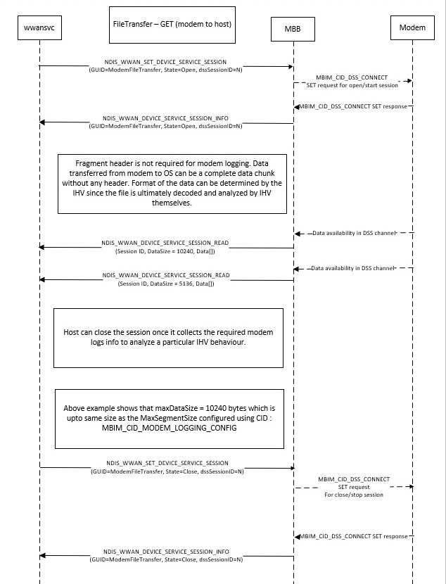

# MB modem logging with DSS

> [!NOTE]
> If you are planning for your modem to support `MBIM_CID_MODEM_LOGGING_CONFIG`, please provide feedback on this page so that we can best support you. This CID is currently experimental and has not been tested with a modem yet, as none support it.

This topic describes a new standard Windows mobile broadband (MBB) logging interface through Microsoft extensions to the USB MBIM 1.0 specification, available in Windows 10, version 1903 and later. 

With this new logging interface, the OS can inform the MBB device to start, stop, and flush the logs to the OS file system through MBIM CID commands. Given the non-IP nature of the modem's logging payload, the data channel that the MBB service uses to transmit logging payloads to the OS uses the MBB Data Service Stream (DSS). DSS is defined in the [Mobile Broadband Interface Model (MBIM) 1.0](https://www.usb.org/sites/default/files/MBIM10Errata1_073013.zip) specification. 

The OS abstracts the modem's diagnostic functionalities and configurations across the entire MBB ecosystem with a set of Windows-specific MBB logging configurations. These MBB logging configs enable a modem's vendor to map the OS MBB logging requirements to the appropriate internal logging configurations. The logging configurations abstracted and defined by the OS include the MBB logging verbosity levels and the maximum flush time. 

A modem keeps filling its logging buffer, up to the max buffer size, until the segment is filled and the MBIM framework transmits the segment to the OS, or it flushes the content of its buffer when the maximum flush time is reached (even if the segment is not filled). The OS defines a set of standard Windows MBB logging configuration levels, described later in this topic. Each config level specifies an OS abstraction of MBB logging details and verbosity.

OS abstraction of MBB config levels is mapped to the appropriate internal modem configuration by modems. The OS does not provide any additional configuration payloads, such as logging filters or masks, to modems other than the OS MBB configuration level. 

For modems that support MBB logging, all MBB logging config levels except for MBIMLoggingLevelOem must be present on all BSP variants. In other words, the IHV or OEM must support PROD or LAB levels of MBB logging in both production and R&D versions of the BSP. LAB levels of MBB logging can only be disabled from the OS.

This new logging interface's design uses the control channel to set the logging parameters, and uses the data channel to receive modem logs because the data channel is designed to transfer bulk modem data. The advantage of this design is that bulk data does not need to be transferred over the control channel, thus keeping device performance consistent. It also scales well for higher throughput. The data channel is operated by DSS commands. An example flow for a modem might look like this:

1. The OS sends the MBIM_CID_MODEM_LOGGING_CONFIG CID to the modem to configure logging parameters such as MaxSegmentSize, MaxFlushTime, and the LoggingLevel.
2. Once the OS receives a successful response from the modem, it sends the MBIM_CID_DSS_CONNECT DSS command to the modem with a specific GUID for modem logging, the MBIMDssLinkActivate state, and a unique DSS session ID.
3. Once it receives a success status code, the OS prepares to receive fragments from the modem. These fragments are called DataServiceSessionRead packets.
4. DataServiceSessionRead packets continue to arrive until the OS issues another MBIM_CID_DSS_CONNECT command with the same DSS session ID and an MBIMDSSLinkDeactivate state.

Once the modem writes any logs to the newly created data channel, the modem calls [**MbbDeviceReceiveDeviceServiceSessionData**](/windows-hardware/drivers/ddi/mbbcx/nf-mbbcx-mbbdevicereceivedeviceservicesessiondata), the data from which is available to apps via the WinRT layer : [**MobileBroadbandDeviceService**](/uwp/api/windows.networking.networkoperators.mobilebroadbanddeviceservice). The modem logs should be formatted as printable string data that can be redirected to an ETW session.

## Modem logging data path

Moddem logging uses the MBIM Data Service Stream (DSS) to transfer the data for logging payloads. For more information about DSS, see Section 10.5.38 of the [MBIM 1.0 specification](https://www.usb.org/sites/default/files/MBIM10Errata1_073013.zip). 

When connecting or disconnecting from DSS, the following GUID is used for modem logging:

| GUID | Value |
| --- | --- |
| ModemFileTransfer GUID | 0EBB1CEB-AF2D-484D-8DF3-53BC51FD162C |

The following flow diagram illustrates the DSS setup and tear down process.

## NDIS interface extension

The following OID has been defined in Windows 10, version 1903, to support modem logging.

- [OID_WWAN_MODEM_LOGGING_CONFIG](oid-wwan-modem-logging-config.md)

## MBIM service and CID values

| Service name | UUID | UUID value |
| --- | --- | --- |
| Microsoft Basic IP Connectivity Extensions | UUID_BASIC_CONNECT_EXTENSIONS | 3d01dcc5-fef5-4d05-9d3a-bef7058e9aaf |

The following table specifies the UUID and command code for each CID, as well as whether the CID supports Set, Query, or Event (notification) requests. See each CID’s individual Section within this topic for more info about its parameters, data structures, and notifications. 

| CID | UUID | Command code | Set | Query | Notify |
| --- | --- | --- | --- | --- | --- |
| MBIM_CID_MODEM_LOGGING_CONFIG | UUID_BASIC_CONNECT_EXTENSIONS | TBD | Y | Y | Y |

## MBIM_CID_MODEM_LOGGING_CONFIG

This CID is used to configure the logs that are collected by the modem and how often they will be sent from the modem to the host over DSS. Logging must be configured before a logging session is started. Because this CID is part of connect extensions, it is optional for IHVs to support this CID. If an IHV supports modem logging via the DSS data channel, it must specify this as a capability. The capability can be advertised using the MBIM_BASIC_CID_DEVICE_SERVICES CID.

### Parameters

| Operation | Set | Query | Notification |
| --- | --- | --- | --- |
| Command | MBIM_MODEM_LOGGING_CONFIG | Not Applicable | Not applicable |
| Response | MBIM_MODEM_LOGGING_CONFIG | MBIM_MODEM_LOGGING_CONFIG | MBIM_MODEM_LOGGING_CONFIG |

### Query

Queries the current modem logging configuration. The InformationBuffer of MBIM_COMMAND_MSG is not used. The following MBIM_MODEM_LOGGING_CONFIG structure is used in the InformationBuffer of MBIM_COMMAND_DONE.

#### MBIM_MODEM_LOGGING_CONFIG

| Offset | Size | Field | Type | Description |
| --- | --- | --- | --- | --- |
| 0 | 4 | Version | UINT32 | The version number of this structure. This field must be set to **1** for version 1 of this structure. |
| 4 | 4 | MaxSegmentSize | UINT32 | Specifies the segment size, in kilobytes, for each fragment sent by the modem. If the maximum fragment size supported by the modem for Device Service Command exceeds the value set, then this value is set to the maximum supported segment size. |
| 8 | 4 | MaxFlushTime | UINT32 | The time, in milliseconds, indicating the maximum time the modem waits before sending a log fragment. If the logs collected don't reach **MaxSegmentSize** within the **MaxFlushTime** duration since the last log fragment sent, then a log fragment is sent regardless of its size. If there is no logging data, then no notification is sent. If the device cannot handle smaller flush times, then the device returns the time that it can handle in the response. The response to a query or set contains the currently configured **MaxFlushTime**. |
| 12 | 4 | LevelConfig | MBIM_LOGGING_LEVEL_CONFIG | Configures the level for which logs are collected. The response to a query or set contains the currently configured **LevelConfig**. |

> [!NOTE]
> If the modem is not able to provide log data to the OS at the requested **MaxSegmentSize** and **MaxFlushTimer**, it can choose its own values for these parameters and update the OS as a set response or an unsolicited event. The OS behavior does not change if **MaxSegmentSize** or **MaxFlushTimer** change, as it receives the data packets regardless and dumps them to a file.

The following MBIM_LOGGING_LEVEL_CONFIG enumeration is used in the preceding MBIM_MODEM_LOGGING_CONFIG structure.

| Type | Value | Description |
| --- | --- | --- |
| MBIMLoggingLevelProd | 0 | Intended for telemetry collection from a retail or production population. The resulting log should be capsule-sized and contains key modem or MBB state or failure information only. |
| MBIMLoggingLevelLabVerbose | 1 | Intended for the development of MBB products with low maturity. Verbose full-stack capture of modems. The resulting modem capture should enable the IHV to replay and fully recover the capture during the log. |
| MBIMLoggingLevelLabMedium | 2 | Intended for verification and field testing of MBB products with relative maturity and stability. The level of detail and verbosity provides enough data points for IHV engineers to triage most MBB failures. |
| MBIMLoggingLevelLabLow | 3 | Intended for self-host-level logging. Summary-level capture of full-stack capture modems. Enables a highlight-level understanding of the modem's state and OS interactions. |
| MBIMLoggingLevelOem | 4 | Reserved for OEM and IHV internal usage. |

### Set

A set command is used to set to configure the level, segment size, and maximum flush time for modem logging. An MBIM_MODEM_LOGGING_CONFIG structure is used in the InformationBuffer.

### Response

The InformationBuffer in MBIM_COMMAND_DONE contains an MBIM_MODEM_LOGGING_CONFIG structure.

### Unsolicited Events

Unsolicited events are supported for scenarios where the modem needs to inform the OS about internal changes. Currently, in Windows 10, version 1903, these scenarios do not occur.

### Status Codes

This CID only uses generic status codes defined in Section 9.4.5 of the [MBIM specification revision 1.0](https://www.usb.org/sites/default/files/MBIM10Errata1_073013.zip).

## DSS session behavior during inactivity

The following table describes how the DSS session behaves during various stages of inactivity:

| Scenario | DSS session state |
| --- | --- |
| System sleep, modem-only sleep, reset and recovery | DSS session kept open |
| System shutdown, restart, hibernation | DSS session closed |
