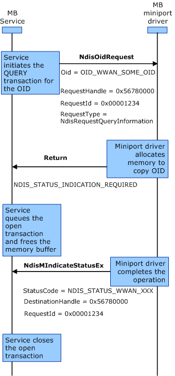
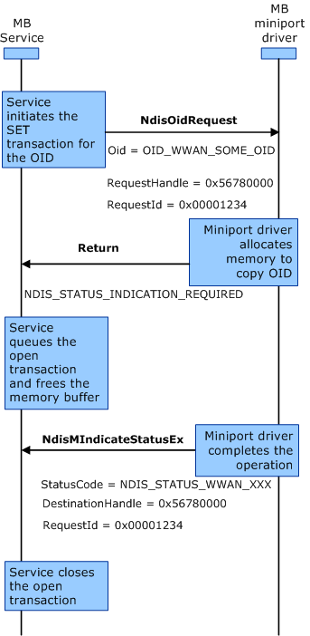

# MB Operational Semantics


### Asynchronous Transactions

The MB driver model assumes non-blocking operational semantics between the MB Service and miniport drivers by using the asynchronous notification mechanism provided in NDIS 6.x. This mechanism allows the MB Service to continue to send OID requests to the miniport driver for processing without waiting for the current operation to complete.

An asynchronous transaction is a three-way handshake that starts with the initial request, followed by a request status response, and then completed by a final transactional indication. The request status response is provisional in that it only acknowledges that the miniport driver has received the request. The follow-up asynchronous indication is transactional in that it signals the completion of the transaction. The miniport driver returns the status code as well as the resulting data in the transactional indication.

### Asynchronous *Set* and *Query* Requests

Many of the *set* and *query* OID requests that are used by the MB Service are processed asynchronously. For more information about *set* and *query* OID requests, see [**NDIS\_OID\_REQUEST**](https://msdn.microsoft.com/library/windows/hardware/ff566710). The "WWAN-specific OIDs" table in the [MB Data Model](mb-data-model.md) topic identifies which OIDs are processed asynchronously.

The following diagram represents the interaction sequence for an asynchronous *query* transaction between the MB Service and the miniport driver. The labels in bold represent OID identifiers, or transactional flow control, and the labels in regular text represent the important flags within the OID structure.



The three-way handshake is the same for both *query* and *set* requests.

Except for [OID\_WWAN\_DRIVER\_CAPS](https://msdn.microsoft.com/library/windows/hardware/ff569825), all other MB-specific OID requests follow the asynchronous transaction mechanism for information exchange between miniport drivers and the MB Service, with the following additional notes:

-   Miniport drivers should immediately fail an OID request on any error condition, such as an invalid OID request.

-   Miniport drivers must return any WWAN-specific error conditions with the correct error code (for example, WWAN\_STATUS\_XXX) specified in the **uStatus** member of the event notification structure. Miniport drivers should also appropriately fill in the members that follow the **uStatus** member, as needed. For example, miniport drivers should fill in the **ContextState.uNwError** member of the [**NDIS\_WWAN\_CONTEXT\_STATE**](https://msdn.microsoft.com/library/windows/hardware/ff567906) structure, if available. However, in the case of a failure when processing OIDs related to PINs, miniport drivers may not necessarily have the current PIN state information to specify in the **PinInfo.PinState** member of [**NDIS\_WWAN\_PIN\_INFO**](https://msdn.microsoft.com/library/windows/hardware/ff567911).

-   Miniport drivers should return NDIS\_STATUS\_INDICATION\_REQUIRED as a provisional response for all asynchronous OID requests.

-   Miniport drivers should be able to distinguish device state changes caused by an OID request from other causes. Miniport drivers should send transactional notifications for state changes resulting from OID requests, and they should send unsolicited event notifications for state changes from other causes.

-   Miniport drivers are responsible for managing kernel-mode memory, although the MB Service initially allocates the memory for requests. After the MB Service receives a response from a miniport driver, the service may release the user-mode memory that it allocated for the OID request.

The following diagram represents the interaction sequence for an asynchronous *set* transaction between the MB Service and the miniport driver. The labels in bold represent OID identifiers, or transactional flow control, and the labels in regular text represent the important flags within the OID structure.



### Asynchronous Response

The *NDIS 6.0 Specification* (released with Windows Vista) introduced a new status code, NDIS\_STATUS\_INDICATION\_REQUIRED, for miniport drivers to convey the asynchronous nature of a transaction to the MB Service in a miniport driver's provisional response to an OID request.

As mentioned in [MB Interface Overview](mb-interface-overview.md), the MB Service does not have direct access to kernel-mode memory that is allocated by an MB miniport driver. The execution result stored in the kernel-mode memory is assumed to be copied and made available to the MB Service by some intermediary, such as WMI or an [NDIS filter driver](ndis-filter-drivers2.md). Hence, miniport drivers can release the allocated kernel-mode memory after the [**NdisMIndicateStatusEx**](https://msdn.microsoft.com/library/windows/hardware/ff563600) function call returns in the transactional indication.

The handshake procedures that miniport drivers and the MB Service must follow are described in the following procedure.

### MB miniport driver procedure

Upon receiving an OID request, miniport drivers should perform the following steps:

1.  Allocate memory in kernel mode to copy the contents of the [**NDIS\_OID\_REQUEST**](https://msdn.microsoft.com/library/windows/hardware/ff566710) data structure associated with the OID request.

2.  Among the request's parameters, ensure that the **RequestId** and **RequestHandle** members of the OID request structure are also copied. These members will be used later in the transactional *indication*.

3.  Return a provisional NDIS\_STATUS\_INDICATION\_REQUIRED status response to inform the MB Service that the miniport driver will complete the request asynchronously.

4.  Upon completion of the operation, store the result in local or driver-allocated memory, as appropriate.

5.  Call the [**NdisMIndicateStatusEx**](https://msdn.microsoft.com/library/windows/hardware/ff563600) function to notify the MB Service that the outstanding operation has been completed. Miniport drivers should fill in the members of the NDIS\_STATUS\_INDICATION structure as follows:
    1.  Set the **StatusCode** member to the type of status notification. For example, NDIS\_STATUS\_WWAN\_XXX.
    2.  Set the **DestinationHandle** member to the **RequestHandle** member that was received in the NDIS\_OID\_REQUEST data structure when the miniport driver received the corresponding OID request.
    3.  Set the **RequestId** member to match the **RequestId** member of the NDIS\_OID\_REQUEST status structure when the miniport driver received the corresponding OID request.
    4.  Set the **StatusBuffer** and **StatusBufferSize** members to point to the miniport driver-allocated memory and the size of the memory buffer, respectively. This memory buffer contains the result of the completed operation.
    5.  If the operation completes successfully, set the **uStatus** member to WWAN\_STATUS\_SUCCESS. Otherwise, set the **uStatus** member to the appropriate WWAN\_STATUS\_XXX value to indicate the type of failure.

6.  When the function call returns, the miniport driver should release the memory it allocated for the OID request.

### MB Service procedure

The MB Service processes asynchronous transactions by using the following procedure:

1.  Allocate buffer memory for the request based on the OID data structure. Fill in the data structure members with appropriate values.

2.  Call the [**NdisOidRequest**](https://msdn.microsoft.com/library/windows/hardware/ff563710) function with the **InformationBuffer** member pointing to the OID data structure for the OID request and wait for the miniport driver to respond.

3.  Upon receipt of an NDIS\_STATUS\_INDICATION\_REQUIRED provisional response from the miniport driver, the MB Service saves the **RequestId**, releases the allocated memory, and marks the transaction as open. At this point, the MB Service is free to process subsequent OID requests and notifications.

4.  Upon receipt of a notification with NDIS\_STATUS\_WWAN\_XXX as the **StatusCode** value, check whether the **RequestId** matches that of any transaction marked as open. If there is a match, the service closes the transaction. If no match is found, treat the notification as an unsolicited event notification.

5.  Process the data returned in the **StatusBuffer** member and make state changes to the MB Service as appropriate.

### Indications

There are two types of WWAN-specific *indications* that miniport drivers can generate:

-   Event notifications that result from an object state change in the MB device.

-   Transactional notifications that signal the completion of an asynchronous operation.

In both cases, miniport drivers should call the NdisMIndicateStatusEx function.

### Event Notification

Event notification is unsolicited in the sense that the miniport driver proactively sends the indication to the MB Service as a state change event. The state change is caused by an action from some entity other than the MB Service. The MB Service assumes miniport drivers are able to detect the cause of the change.

For any WWAN-specific event notification, miniport drivers must set the **RequestId** member of the NDIS\_STATUS\_INDICATION structure to zero. The **StatusCode** member specifies which object in the MB device has changed. The miniport driver can set this object to any of the following values:

[**NDIS\_STATUS\_WWAN\_DEVICE\_CAPS**](https://msdn.microsoft.com/library/windows/hardware/ff567845)

[**NDIS\_STATUS\_WWAN\_READY\_INFO**](https://msdn.microsoft.com/library/windows/hardware/ff567856)

[**NDIS\_STATUS\_WWAN\_RADIO\_STATE**](https://msdn.microsoft.com/library/windows/hardware/ff567855)

[**NDIS\_STATUS\_WWAN\_PIN\_INFO**](https://msdn.microsoft.com/library/windows/hardware/ff567851)

[**NDIS\_STATUS\_WWAN\_PIN\_LIST**](https://msdn.microsoft.com/library/windows/hardware/ff567852)

[**NDIS\_STATUS\_WWAN\_HOME\_PROVIDER**](https://msdn.microsoft.com/library/windows/hardware/ff567848)

[**NDIS\_STATUS\_WWAN\_PREFERRED\_PROVIDERS**](https://msdn.microsoft.com/library/windows/hardware/ff567853)

[**NDIS\_STATUS\_WWAN\_VISIBLE\_PROVIDERS**](https://msdn.microsoft.com/library/windows/hardware/ff567866)

[**NDIS\_STATUS\_WWAN\_REGISTER\_STATE**](https://msdn.microsoft.com/library/windows/hardware/ff567857)

[**NDIS\_STATUS\_WWAN\_PACKET\_SERVICE**](https://msdn.microsoft.com/library/windows/hardware/ff567850)

[**NDIS\_STATUS\_WWAN\_SIGNAL\_STATE**](https://msdn.microsoft.com/library/windows/hardware/ff567859)

[**NDIS\_STATUS\_WWAN\_CONTEXT\_STATE**](https://msdn.microsoft.com/library/windows/hardware/ff567843)

[**NDIS\_STATUS\_WWAN\_PROVISIONED\_CONTEXTS**](https://msdn.microsoft.com/library/windows/hardware/ff567854)

[**NDIS\_STATUS\_WWAN\_SERVICE\_ACTIVATION**](https://msdn.microsoft.com/library/windows/hardware/ff567858)

[**NDIS\_STATUS\_WWAN\_SMS\_CONFIGURATION**](https://msdn.microsoft.com/library/windows/hardware/ff567860)

[**NDIS\_STATUS\_WWAN\_SMS\_RECEIVE**](https://msdn.microsoft.com/library/windows/hardware/ff567862)

[**NDIS\_STATUS\_WWAN\_SMS\_SEND**](https://msdn.microsoft.com/library/windows/hardware/ff567863)

[**NDIS\_STATUS\_WWAN\_SMS\_DELETE**](https://msdn.microsoft.com/library/windows/hardware/ff567861)

[**NDIS\_STATUS\_WWAN\_SMS\_STATUS**](https://msdn.microsoft.com/library/windows/hardware/ff567864)

[**NDIS\_STATUS\_WWAN\_VENDOR\_SPECIFIC**](https://msdn.microsoft.com/library/windows/hardware/ff567865)

The MB Service may also process other event notifications from NDIS. These non-MB event notifications are not necessarily subject to the requirement that their **RequestId** values be set to zero.

### Transactional Notifications

Miniport drivers use transactional notifications to inform the MB Service that an asynchronous transaction has completed, and the MB Service uses transactional notifications to close open transactions and to update its state machine.

The MB Service expects transactional notifications so that it can close open transactions. It is the final exchange of the three-way handshake between the MB Service and the miniport driver in an asynchronous transaction. The value of **RequestId** member of the NDIS\_STATUS\_INDICATION in any transactional notification must be nonzero, which is copied from the corresponding request in the same transaction.

You must set the **RequestId** member of the NDIS\_STATUS\_INDICATION structure correctly for the asynchronous mechanism to function properly. The MB Service ensures that the **RequestId** value is unique and nonzero among all outstanding requests. Miniport drivers must return the same **RequestId** value in the corresponding *indication* in order for the MB Service to correlate the indication with an open transaction.

### Status Indication Structure

Both the asynchronous response for a given OID request and the unsolicited event notification structures share the following structure members that are pointed to by **StatusBuffer** member of the *StatusIndication* parameter to [**NdisMIndicateStatusEx**](https://msdn.microsoft.com/library/windows/hardware/ff563600):

```C++
typedef struct _NDIS_WWAN_XXX {
  NDIS_OBJECT_HEADER Header;
  WWAN_STATUS uStatus;
  ULONG uNwError;//Optional. Only used for network operations.
  WWAN_XXX XxxStruct;
} NDIS_WWAN_XXX, *PNDIS_WWAN_XXX;
```

A value of zero in the **RequestId** member of the NDIS\_STATUS\_INDICATION structure means it is an unsolicited event notification and can occur any time.

If the **uStatus** member in the returned indication of any *set* or *query* OID request does not equal WWAN\_STATUS\_SUCCESS the members of the associated NDIS\_WWAN\_XXX structure do not need to be valid.

In the case of unsolicited event notifications based on network events, miniport drivers must fill in the **uNwError** member as appropriate, if applicable.

The following table shows registration, packet-attach, and packet-detach cause code failure values that are defined in the *3GPP TS 24.008 Specification* for GSM-based networks:

<table>
<colgroup>
<col width="50%" />
<col width="50%" />
</colgroup>
<thead>
<tr class="header">
<th align="left">3GPP 24.008 Cause code</th>
<th align="left">Interpretation of cause code</th>
</tr>
</thead>
<tbody>
<tr class="odd">
<td align="left"><p>2 - International Mobile Subscriber Identity (IMSI) unknown in HLR</p></td>
<td align="left"><p>Either the SIM or the device is not activated, or the subscription has expired, which caused a network deactivation.</p></td>
</tr>
<tr class="even">
<td align="left"><p>4 - IMSI unknown in VLR</p></td>
<td align="left"><p>Roaming feature is not subscribed to.</p></td>
</tr>
<tr class="odd">
<td align="left"><p>6 - Illegal ME</p></td>
<td align="left"><p>MS blocked by network due to stolen report.</p></td>
</tr>
<tr class="even">
<td align="left"><p>7 - GPRS services not allowed</p></td>
<td align="left"><p>User does not have a GPRS subscription. User has only a voice connection subscription.</p></td>
</tr>
<tr class="odd">
<td align="left"><p>8 - GPRS and non-GPRS services not allowed</p></td>
<td align="left"><p>GPRS and non-GPRS services are not allowed.</p></td>
</tr>
<tr class="even">
<td align="left"><p>11 - PLMN not allowed</p></td>
<td align="left"><p>Service is blocked by the network due to an expired subscription or another cause.</p></td>
</tr>
<tr class="odd">
<td align="left"><p>12 - Location area not allowed</p></td>
<td align="left"><p>User subscription does not allow access in the present location area.</p></td>
</tr>
<tr class="even">
<td align="left"><p>13 - Roaming not allowed in this location area</p></td>
<td align="left"><p>The subscription permits roaming, but roaming is not allowed in the present location area.</p></td>
</tr>
<tr class="odd">
<td align="left"><p>14 - GPRS services not allowed in this PLMN</p></td>
<td align="left"><p>Selected network provider does not provide GPRS service to the MS.</p></td>
</tr>
<tr class="even">
<td align="left"><p>15 - No suitable cells in location area</p></td>
<td align="left"><p>No subscription for the service.</p></td>
</tr>
<tr class="odd">
<td align="left"><p>17 - Network failure</p></td>
<td align="left"><p>Registration failed.</p></td>
</tr>
<tr class="even">
<td align="left"><p>22 - Congestion</p></td>
<td align="left"><p>Registration failed due to network congestion.</p></td>
</tr>
</tbody>
</table>

 

For example, if the network initiates a deactivate context event because roaming is not allowed in the location area, miniport drivers should set the **uNwError** member to 13 as per the 3GPP TS 24.008 Cause codes for GSM-based networks.

Similar logic should be applied to CDMA-based networks as well. However, there is no standard for CDMA-based network error codes. CDMA-based devices should use the network -specific or device-specific error codes.

In the case of a miniport driver's asynchronous response to OID requests, the **RequestId** member of the NDIS\_STATUS\_INDICATION structure is a non-zero number that was passed to the miniport driver as part of a *set* or *query* request. The miniport driver must fill the **uStatus** member as appropriate. For example, WWAN\_STATUS\_SUCCESS, or any of the appropriate error values listed in the following section. In addition to this, the miniport driver must fill in the **uNwError** member where appropriate and available.

### Event Notification Status

The following table lists the WWAN\_STATUS codes that MB miniport drivers can specify in the **uStatus** member of the NDIS\_WWAN\_XXX event notification structures.

<table>
<colgroup>
<col width="50%" />
<col width="50%" />
</colgroup>
<thead>
<tr class="header">
<th align="left">Value</th>
<th align="left">Meaning</th>
</tr>
</thead>
<tbody>
<tr class="odd">
<td align="left"><p>WWAN_STATUS_SUCCESS</p></td>
<td align="left"><p>The operation succeeded.</p></td>
</tr>
<tr class="even">
<td align="left"><p>WWAN_STATUS_FAILURE</p></td>
<td align="left"><p>The operation failed (a generic failure).</p></td>
</tr>
<tr class="odd">
<td align="left"><p>WWAN_STATUS_BUSY</p></td>
<td align="left"><p>The operation failed because the device is busy.</p></td>
</tr>
<tr class="even">
<td align="left"><p>WWAN_STATUS_SIM_NOT_INSERTED</p></td>
<td align="left"><p>The operation failed because the SIM card was not inserted fully into the device.</p></td>
</tr>
<tr class="odd">
<td align="left"><p>WWAN_STATUS_BAD_SIM</p></td>
<td align="left"><p>The operation failed because the SIM card is bad and cannot be used any further.</p></td>
</tr>
<tr class="even">
<td align="left"><p>WWAN_STATUS_PIN_REQUIRED</p></td>
<td align="left"><p>The operation failed because a PIN must be entered to proceed.</p></td>
</tr>
<tr class="odd">
<td align="left"><p>WWAN_STATUS_PIN_DISABLED</p></td>
<td align="left"><p>The operation failed because the PIN is disabled.</p></td>
</tr>
<tr class="even">
<td align="left"><p>WWAN_STATUS_NOT_REGISTERED</p></td>
<td align="left"><p>The operation failed because the device is not registered with any network.</p></td>
</tr>
<tr class="odd">
<td align="left"><p>WWAN_STATUS_PROVIDERS_NOT_FOUND</p></td>
<td align="left"><p>The operation failed because no network providers could be found.</p></td>
</tr>
<tr class="even">
<td align="left"><p>WWAN_STATUS_NO_DEVICE_SUPPORT</p></td>
<td align="left"><p>The operation failed because the device does not support the operation.</p></td>
</tr>
<tr class="odd">
<td align="left"><p>WWAN_STATUS_PROVIDER_NOT_VISIBLE</p></td>
<td align="left"><p>The operation failed because the service provider is not currently visible.</p></td>
</tr>
<tr class="even">
<td align="left"><p>WWAN_STATUS_DATA_CLASS_NOT_AVAILABLE</p></td>
<td align="left"><p>The operation failed because the requested data-class was not available.</p></td>
</tr>
<tr class="odd">
<td align="left"><p>WWAN_STATUS_PACKET_SVC_DETACHED</p></td>
<td align="left"><p>The operation failed because packet service is detached.</p></td>
</tr>
<tr class="even">
<td align="left"><p>WWAN_STATUS_MAX_ACTIVATED_CONTEXTS</p></td>
<td align="left"><p>The operation failed because the maximum number of activated contexts has been reached.</p></td>
</tr>
<tr class="odd">
<td align="left"><p>WWAN_STATUS_NOT_INITIALIZED</p></td>
<td align="left"><p>The operation failed because the device is in the process of initializing. Retry the operation after the ready-state of the device changes to <strong>WwanReadyStateInitialized</strong>.</p></td>
</tr>
<tr class="even">
<td align="left"><p>WWAN_STATUS_VOICE_CALL_IN_PROGRESS</p></td>
<td align="left"><p>The operation failed because a voice call is in progress.</p></td>
</tr>
<tr class="odd">
<td align="left"><p>WWAN_STATUS_CONTEXT_NOT_ACTIVATED</p></td>
<td align="left"><p>The operation failed because the context is not activated.</p></td>
</tr>
<tr class="even">
<td align="left"><p>WWAN_STATUS_SERVICE_NOT_ACTIVATED</p></td>
<td align="left"><p>The operation failed because service is not activated.</p></td>
</tr>
<tr class="odd">
<td align="left"><p>WWAN_STATUS_INVALID_ACCESS_STRING</p></td>
<td align="left"><p>The operation failed because the access string is invalid.</p></td>
</tr>
<tr class="even">
<td align="left"><p>WWAN_STATUS_INVALID_USER_NAME_PWD</p></td>
<td align="left"><p>The operation failed because the user name and/or password supplied are invalid.</p></td>
</tr>
<tr class="odd">
<td align="left"><p>WWAN_STATUS_RADIO_POWER_OFF</p></td>
<td align="left"><p>The operation failed because the radio is currently powered off.</p></td>
</tr>
<tr class="even">
<td align="left"><p>WWAN_STATUS_INVALID_PARAMETERS</p></td>
<td align="left"><p>The operation failed because of invalid parameters.</p></td>
</tr>
<tr class="odd">
<td align="left"><p>WWAN_STATUS_READ_FAILURE</p></td>
<td align="left"><p>The operation failed because of a read failure.</p></td>
</tr>
<tr class="even">
<td align="left"><p>WWAN_STATUS_WRITE_FAILURE</p></td>
<td align="left"><p>The operation failed because of a write failure.</p></td>
</tr>
</tbody>
</table>

 

The following table shows SMS specific status values.

<table>
<colgroup>
<col width="50%" />
<col width="50%" />
</colgroup>
<thead>
<tr class="header">
<th align="left">Value</th>
<th align="left">Meaning</th>
</tr>
</thead>
<tbody>
<tr class="odd">
<td align="left"><p>WWAN_STATUS_SMS_OPERATION_NOT_ALLOWED</p></td>
<td align="left"><p>The SMS operation failed because the operation is not allowed.</p></td>
</tr>
<tr class="even">
<td align="left"><p>WWAN_STATUS_SMS_MEMORY_FAILURE</p></td>
<td align="left"><p>The SMS operation failed because of a memory failure.</p></td>
</tr>
<tr class="odd">
<td align="left"><p>WWAN_STATUS_SMS_INVALID_MEMORY_INDEX</p></td>
<td align="left"><p>The SMS operation failed because of an invalid memory index-- <em>WwanSmsFlagIndex</em> for OID_WWAN_SMS_READ.</p></td>
</tr>
<tr class="even">
<td align="left"><p>WWAN_STATUS_SMS_UNKNOWN_SMSC_ADDRESS</p></td>
<td align="left"><p>The SMS operation failed because the service center number is either invalid or unknown.</p></td>
</tr>
<tr class="odd">
<td align="left"><p>WWAN_STATUS_SMS_NETWORK_TIMEOUT</p></td>
<td align="left"><p>The SMS operation failed because of a network timeout.</p></td>
</tr>
<tr class="even">
<td align="left"><p>WWAN_STATUS_SMS_MEMORY_FULL</p></td>
<td align="left"><p>The SMS operation failed because the SMS message store is full.</p></td>
</tr>
<tr class="odd">
<td align="left"><p>WWAN_STATUS_SMS_UNKNOWN_ERROR</p></td>
<td align="left"><p>The SMS operation failed because of an unknown error (a generic error).</p></td>
</tr>
<tr class="even">
<td align="left"><p>WWAN_STATUS_SMS_FILTER_NOT_SUPPORTED</p></td>
<td align="left"><p>The SMS operation failed because the filter type requested is not supported.</p></td>
</tr>
<tr class="odd">
<td align="left"><p>WWAN_STATUS_SMS_MORE_DATA</p></td>
<td align="left"><p>This transaction is not yet complete. Some data has been returned and there is more data to be returned.</p></td>
</tr>
<tr class="even">
<td align="left"><p>WWAN_STATUS_SMS_LANG_NOT_SUPPORTED</p></td>
<td align="left"><p>The SMS operation failed because the SMS language is not supported. This applies to CDMA-based devices only.</p></td>
</tr>
<tr class="odd">
<td align="left"><p>WWAN_STATUS_SMS_ENCODING_NOT_SUPPORTED</p></td>
<td align="left"><p>The SMS operation failed because the SMS encoding is not supported. This applies to CDMA-based devices only.</p></td>
</tr>
<tr class="even">
<td align="left"><p>WWAN_STATUS_SMS_FORMAT_NOT_SUPPORTED</p></td>
<td align="left"><p>The SMS operation failed because the SMS format is not supported.</p></td>
</tr>
</tbody>
</table>

 

**Note**  These WWAN-specific status codes are used only for asynchronous transactions in the **uStatus** member of the NDIS\_WWAN\_XXX structures.

 

Miniport drivers use event notifications to inform the MB Service about an object state change in their MB device without first having received an OID request. The MB Service uses event notifications to update its state machine only.

Be aware that while NDIS serializes all requests that are sent to miniport drivers, miniport drivers might not return the responses in the same order. This is because the queued requests in the miniport driver might be processed in parallel. Hence the MB Service ensures that if two requests are dependent upon each other, it will not send the second request until the miniport driver completes the first request.

### State Change Notification

In general, miniport drivers should always notify the MB Service about the updated state of their MB device either through transactional notifications or through unsolicited event notifications. The following scenarios are some exceptions where miniport drivers are not supposed to respond with updated state information. The MB Service can determine the updated state from the completion status of other operations:

1.  Miniport drivers do not need to send an NDIS\_STATUS\_WWAN\_PIN\_LIST event indication when PIN state changes occur because the MB Service requested to enable or disable the PIN.

2.  Miniport drivers do not need to return the updated list of the provisioned contexts in transactional responses to OID\_WWAN\_PROVISIONED\_CONTEXT *set* operations.

3.  Miniport drivers do not need to respond with the updated list of the preferred providers in transactional responses to OID\_WWAN\_PREFERRED\_PROVIDERS *set* operations. The MB Service can determine this information based on the initial list and success status of the *set* operation.

4.  Miniport drivers do not need to respond with the current WWAN\_SMS\_CONFIGURATION value for OID\_WWAN\_SMS\_CONFIGURATION *set* operations.

 

 


