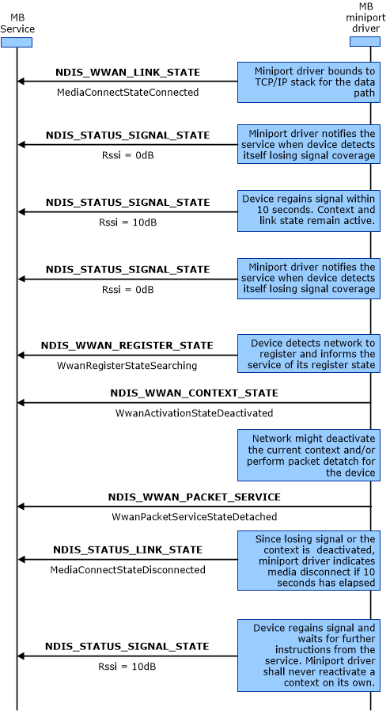

# MB Packet Service Operations

This topic describes the operations for losing and regaining packet data service, packet data service handoffs, and voice calls during packet data service connections.

## Losing and Regaining Packet Data Service

The following diagram shows the process that miniport drivers should follow when they lose signal strength and packet service for various intervals. The labels in bold are OID identifiers or transactional flow control.The labels in regular text are the important flags within the OID structure.

To regain packet data service after it has been lost, use the following procedure:

1.  The miniport driver sends NDIS\_WWAN\_LINK\_STATE to the MB Service.

2.  The miniport driver sends [**NDIS\_WWAN\_SIGNAL\_STATE**](/windows-hardware/drivers/ddi/ndiswwan/ns-ndiswwan-_ndis_wwan_signal_state) to the MB Service.

3.  The miniport driver sends [**NDIS\_WWAN\_SIGNAL\_STATE**](/windows-hardware/drivers/ddi/ndiswwan/ns-ndiswwan-_ndis_wwan_signal_state) to the MB Service.

4.  The miniport driver sends [**NDIS\_WWAN\_SIGNAL\_STATE**](/windows-hardware/drivers/ddi/ndiswwan/ns-ndiswwan-_ndis_wwan_signal_state) to the MB Service.

5.  The miniport driver sends NDIS\_WWAN\_REGISTER\_STATE to the MB Service.

6.  The miniport driver sends [**NDIS\_STATUS\_WWAN\_PACKET\_SERVICE**](ndis-status-wwan-packet-service.md) to the MB Service.

7.  The miniport driver sends [**NDIS\_STATUS\_LINK\_STATE**](ndis-status-link-state.md) to the MB Service.

8.  The miniport driver sends [**NDIS\_WWAN\_SIGNAL\_STATE**](/windows-hardware/drivers/ddi/ndiswwan/ns-ndiswwan-_ndis_wwan_signal_state) to the MB Service.

## Packet Data Service Handoffs

The following diagram shows the steps that miniport drivers should follow when packet service moves between different GSM-based technologies, such as GPRS, EDGE, UMTS, HSDPA, or TD-SCDMA, or moves between different CDMA-based technologies, such as 1xRTT, EV-DO, or EV-DO RevA. The labels in bold are OID identifiers or transactional flow control. The labels in regular text are the important flags within the OID structure.

Be aware that unless the IP address changes in the handoff process, the MB Service handles the handoff event transparently without disrupting the existing connection. However, miniport drivers must still notify the MB Service about media disconnect events if, and only if, the IP address changes.

Miniport drivers and the MB device they manage should be able to handle the layer-2 handoff between different air interfaces automatically, with minimal impact to the MB Service and other overlaying applications. The only possible impact is the change to the IP address that might result from the technology handoff. In this case, miniport drivers should re-establish the MB connection before reporting the packet service change to the MB Service. Miniport drivers that do not implement DHCP functionality should use the [IP Helper](ip-helper.md) and associated [functions](./ip-helper.md). Miniport drivers that do implement DHCP functionality are not required to use the IP Helper functions.

To hand off packet data service, use the following procedure:

1.  The miniport driver sends [**NDIS\_STATUS\_WWAN\_PACKET\_SERVICE**](ndis-status-wwan-packet-service.md) to the MB Service.

2.  The miniport driver sends NDIS\_WWAN\_LINK\_STATE to the MB Service.

3.  The miniport driver sends [**NDIS\_STATUS\_WWAN\_PACKET\_SERVICE**](ndis-status-wwan-packet-service.md) to the MB Service.

4.  The miniport driver calls the [**DeleteUnicastIpAddressEntry**](/previous-versions/windows/hardware/drivers/ff546370(v=vs.85)) helper function with the old IP address

5.  The miniport driver calls the [**CreateUnicastIpAddressEntry**](/previous-versions/windows/hardware/drivers/ff546227(v=vs.85)) helper function with the new IP address

6.  The miniport driver sends [**NDIS\_STATUS\_LINK\_STATE**](./ndis-status-link-state.md) to the MB Service.

7.  The miniport driver sends [**NDIS\_STATUS\_LINK\_STATE**](./ndis-status-link-state.md) to the MB Service.

8.  The miniport driver sends [**NDIS\_STATUS\_WWAN\_PACKET\_SERVICE**](./ndis-status-wwan-packet-service.md) to the MB Service.

## Voice Calls during Packet Data Service Connections

The following diagram represents the process that miniport drivers should follow when a voice call is placed while packet data service is active. The diagram uses 1xRTT as an example, but the procedure applies to other air interfaces as well. The process outlined in the following graphic applies only to miniport drivers that return **WwanVoiceClassSeparateVoiceData** in the **WwanVoiceClass** member in response to an OID\_WWAN\_DEVICE\_CAPS *query* request. The labels in bold represent OID identifiers or transactional flow control. The labels in regular text represent the important flags within the OID structure.

The procedure assumes that accepting an incoming voice call will pre-empt any pre-existing packet connection. For miniport drivers that return **WwanVoiceClassSimultaneousVoiceData** in the **WwanVoiceClass** member in response to an OID\_WWAN\_DEVICE\_CAPS *query* request, the current packet connection should not be affected.

Be aware that, by design, the MB Service does not support circuit voice nor does it prohibit the service. The process outlined in the graphic above applies only when the device can handle both data and circuit voice, but only one at a time. The process assumes that the voice call takes precedence over any potential pre-existing data connection. In this case, miniport drivers should suspend the data connection for the duration of the voice call. Afterwards, miniport drivers should resume the data service by re-establishing the MB connection automatically.

To handle voice calls during packet data service connections, use the following procedure:

1.  For a successful Packet Data service connection, miniport drivers should send an [**NDIS\_WWAN\_PACKET\_SERVICE\_STATE**](/windows-hardware/drivers/ddi/ndiswwan/ns-ndiswwan-_ndis_wwan_packet_service_state) notification to the MB service to indicate the current DataClass followed by an [**NDIS\_STATUS\_LINK\_STATE**](./ndis-status-link-state.md) notification to the MB service to indicate the media connect state as **MediaConnectStateConnected**.

2.  When a voice call is placed or answered, miniport drivers should send an [**NDIS\_STATUS\_LINK\_STATE**](./ndis-status-link-state.md) notification to the MB service to indicate the media connect state as **MediaConnectStateDisconnected**.

3.  Miniport drivers should then send an [**NDIS\_STATUS\_WWAN\_CONTEXT\_STATE**](./ndis-status-wwan-context-state.md) notification to the MB service that indicates the *VoiceCall* state of the device as **WwanVoiceCallStateInProgress**.

4.  On hangup, miniport drivers should send an NDIS\_STATUS\_WWAN\_CONTEXT\_STATE notification to the MB service that indicates the *VoiceCall* state of the device as **WwanVoiceCallStateHangup**.

5.  The device resumes packet connection after the voice call is completed. Miniport drivers should send an [**NDIS\_STATUS\_LINK\_STATE**](./ndis-status-link-state.md) notification to the MB service to indicate the media connect state as **MediaConnectStateConnected**.

6.  Miniport drivers should send an NDIS\_WWAN\_PACKET\_SERVICE\_STATE notification to the MB service that indicates the current DataClass.

## See Also

For more information about packet service operations, see [OID\_WWAN\_PACKET\_SERVICE](oid-wwan-packet-service.md).

 

