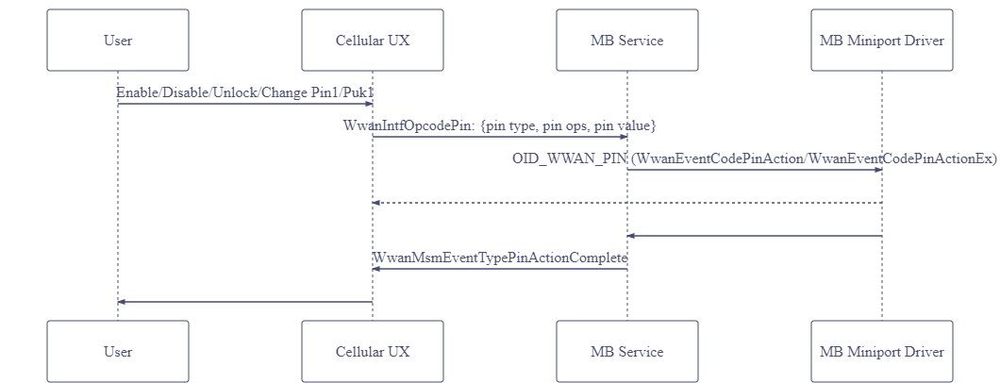
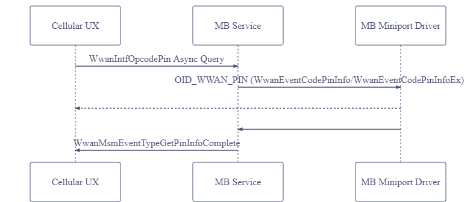
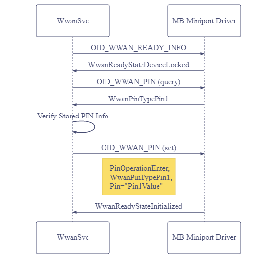

# MB PIN Operations

## Overview

This topic describes the operations related to access control of subscription information stored either in the MB device memory or on the Subscriber Identity Module (SIM) card. This includes enabling, disabling, or changing the Personal Identification Number (PIN), as well as unlocking via PIN or Personal Unlocking Key (PUK). 

## Architecture/Flows
User actions to enable/disable/unlock/change PIN



&nbsp;

Cellular UX query for PIN1/PUK1 state



&nbsp;

Auto-unlock after resuming from hibernation



## MBIM_CID_MS_PIN_EX

This CID is described here: [MBIM_CID_MS_PIN_EX](./mb-uicc-application-and-file-system-access.md#mbim_cid_ms_pin_ex)

## MBIM_CID_PIN_LIST

### Description

This command returns a list of all the different types of Personal Identification Numbers (PINs) that are supported by the MB device and additional details for each PIN type, such as the length of the PIN
(minimum and maximum lengths), PIN format, and PIN-entry mode (enabled/disabled/not-available). This
CID also specifies the current mode of each PIN supported by the function.
Functions must report all the PINs they support. However, PIN1 for multi-mode devices must only be
reported once.

A PIN reported as PIN1 must comply with PIN1 guidelines: For CDMA-based devices this is a PIN that
provides power-on verification or identification functionality, and for GSM-based devices this is a
Subscriber Identity Module (SIM) PIN.

Functions must be able to return this information when the ready-state changes to MBIMSubscriberReadyStateInitialized or when the ready-state is MBIMSubscriberReadyStateDeviceLocked (PIN locked). Functions should also return this information in other ready-states wherever possible.

#### Query only

InformationBuffer of the Query message is empty. InformationBuffer of MBIM_COMMAND_DONE contains
an MBIM_PIN_LIST_INFO.

### Parameters

|   | Set | Query | Notification |
|---|---|---|---|
| **Command**  | N/A | Empty              | N/A |
| **Response** | N/A | MBIM_PIN_LIST_INFO | N/A |

### Data Structures

#### MBIM_PIN_MODE

| Types | Value |
|---|---|
| MBIMPinModeNotSupported | 0 |
| MBIMPinModeEnabled      | 1 |
| MBIMPinModeDisabled     | 2 |

#### MBIM_PIN_FORMAT

| Types | Value |
|---|---|
| MBIMPinFormatUnknown      | 0 |
| MBIMPinFormatNumeric      | 1 |
| MBIMPinFormatAlphaNumeric | 2 |

#### MBIM_PIN_DESC

| Offset | Size | Field | Type | Description | 
|---|---|---|---|---|
| 0 | 4 | PinMode      | MBIM_PIN_MODE | See above table [MBIM_PIN_MODE](#mbim_pin_mode). This shows if the lock is enabled or not. It does not show if the lock state is locked or unlocked. |
| 4 | 4 | PinFormat    | MBIM_PIN_FORMAT | See above table [MBIM_PIN_FORMAT](#mbim_pin_format). |
| 8 | 4 | PinLengthMin | UINT32 | The minimum number of characters in the PIN. Devices should not specify a value that is greater than 16. Devices should specify 0xffffffff, if the PIN length is not available. |
| 12| 4 | PinLengthMax | UINT32 | The maximum number of characters in the PIN. Devices should not specify a value that is greater than 16. Devices should specify 0xffffffff, if the PIN length is not available. |


### Query

The InformationBuffer shall be **null** and InformationBufferLength shall be **zero**.

### Response

The following structure shall be used in the InformationBuffer:

#### MBIM_PIN_LIST_INFO

| Offset | Size | Field | Type | Description | 
|---|---|---|---|---|
| 0 | 16 | PinDescPin1                | MBIM_PIN_DESC | MBIM_PIN_DESC structure describing PIN1. For GSMbased devices, this is a Subscriber Identity Module (SIM) PIN. For CDMA-based devices, power-on device lock is reported as PIN1. |
| 16 | 16 | PinDescPin2               | MBIM_PIN_DESC | MBIM_PIN_DESC structure describing PIN2. This is a SIM PIN2 that protects certain SIM functionality. |
| 32 | 16 | PinDescDeviceSimPin       | MBIM_PIN_DESC | MBIM_PIN_DESC structure describing the device-to-SIM-card PIN. This is a PIN that locks the device to a specific SIM. |
| 48 | 16 | PinDescDeviceFirstSimPin  | MBIM_PIN_DESC | MBIM_PIN_DESC structure describing device-to-very-first-SIM-card PIN. This is a PIN that locks the device to the very first inserted SIM. |
| 64 | 16 | PinDescNetworkPin         | MBIM_PIN_DESC | MBIM_PIN_DESC structure describing the network personalization PIN. This is a PIN that allows the device to be personalized to a network. For more information about this PIN type, see 3GPP specification 22.022. |
| 80 | 16 | PinDescNetworkSubsetPin   | MBIM_PIN_DESC | MBIM_PIN_DESC structure describing the network subset personalization PIN. This is a PIN that allows the device to be personalized to a subset of a network. For more information about this PIN type, see 3GPP specification 22.022. |
| 96 | 16 | PinDescServiceProviderPin | MBIM_PIN_DESC | MBIM_PIN_DESC structure describing the Service Provider (SP) personalization PIN. This is a PIN that allows the device to be personalized to a service provider. For more information about this PIN type, see 3GPP specification 22.022. |
| 112 | 16 | PinDescCorporatePin      | MBIM_PIN_DESC | MBIM_PIN_DESC structure describing the corporate personalization PIN. This is a PIN that allows the device to be personalized to a specific company. For more information about this PIN type, see 3GPP specification 22.022. |
| 128 | 16 | PinDescSubsidyLock       | MBIM_PIN_DESC | MBIM_PIN_DESC structure describing the subsidy unlocks PIN. This is a PIN that allows the device to be restricted to operate on a specific network. For more information about this PIN type, see 3GPP specification 22.022. |
| 144 | 16 | PinDescCustom            | MBIM_PIN_DESC | MBIM_PIN_DESC structure describing the custom PIN. This is a custom vendor-defined PIN type. It is not included in the above list. |

### Status Codes

Status Code | Description
---|---
MBIM_STATUS_PIN_REQUIRED | The PIN list operation failed because a PIN must be entered before this operation can proceed.

## Testing

The following tests are run as part of the **TestPin** HLK test list:

Test Name | Description
---|---
PinListQueryRadioOn | This test attempts a pin list query with the radio on.
PinListQueryRadioOff | This test attempts a pin list query with the radio off.
NoPinSupport | This test verifies a device that does not support PIN1.
PinExSetEnableDisableWithValidPin | This test enables and disables PIN1 with a valid pin.
PinExSetDisableIncorrectPinWithValidLength | This test attempts to enable PIN1 with an incorrect pin with valid length.
PukEnableDisableThroughIncorrectPinExDisable | This test enables PUK1 by entering incorrect PIN1 multiple times and then disables PUK1.
PinExSetChangeWithBothInvalidAndValidPin | This test enables PIN1, immediately changes the PIN, and disables it.
RebootTestMachineToPutPinIntoLockState | This test reboots the device to make the modem enter lock state and prompt valid PIN entry.
PinExSetEnterWithValidPin | This test validates that the device is in lock state to request PIN code entry.


The **TestPowerStates** HLK test list also contains one relevant test -- **SimPinUnlockAfterHibernate**.


## Log Analysis

### Sample Logs:

Auto-unlock:
```
462678 [0]0F3C.1280::2020-05-05 13:03:46.378805100 [Microsoft-Windows-WWAN-SVC-EVENTS][Request=0x53] Received PinInfo, status=WWAN_STATUS_SUCCESS , Type=WwanPinTypePin1  State=WwanPinStateEnter  Attempts=3, miniport={7971731f-33f9-4f1a-9718-087c12e64c5d} 
462753 [7]0F3C.2A6C::2020-05-05 13:03:46.379718400 [Microsoft-Windows-WWAN-SVC-EVENTS]WWAN Service event: [Info] CWwanPinSM::maybeUnlockPin:  Attempting auto-PIN-unlock. Interface: {{7971731f-33f9-4f1a-9718-087c12e64c5d}} 
462809 [7]0F3C.2A6C::2020-05-05 13:03:46.380157500 [Microsoft-Windows-WWAN-SVC-EVENTS]WWAN Service event: [Error] CWwanPinSM::maybeUnlockPin: Attempt to auto-unlock PIN succeeded 
```

Set Pin (WwanPinTypePin1):
```
546408 [3]0F3C.1240::2020/05/02-09:18:09.178460200 [Microsoft-Windows-WWAN-SVC-EVENTS][Request=0x6C] Sent SET PinAction, Type=2(WwanPinTypePin1), Operation=0(WwanPinOperationEnter), miniport={7971731f-33f9-4f1a-9718-087c12e64c5d}, ErrorCode=3407873(WIN=The request will be completed later by NDIS status indication.)
546425 [1]3DB0.12EC::2020/05/02-09:18:09.178564700 [Microsoft.Windows.CellCore.MBBSettingsUX]{"meta":{"provider":"Microsoft.Windows.CellCore.MBBSettingsUX","event":"MBCategory::_SetPinAction. WwanSetInterface succeeded","time":"2020-05-02T16:18:09.1785647Z","cpu":1,"pid":15792,"tid":4844,"channel":11,"level":4}}
546644 [2]0F3C.39E4::2020/05/02-09:18:09.426362600 [Microsoft-Windows-WWAN-SVC-EVENTS]WWAN Service event: [Info] CWwanPinSM::processPinActionResponse: SetPin rsp rcvd (result:0x0) PIN Info (state:1, type:3, attemptsRemaining:3) IsPin1Blocked 0
546645 [2]0F3C.39E4::2020/05/02-09:18:09.426364800 [Microsoft-Windows-WWAN-SVC-EVENTS]WWAN Service event: [Info] CWwanPinSM::maybeCapturePin: Capturing PIN for PIN ENTER/ENABLE operation Interface: {{7971731f-33f9-4f1a-9718-087c12e64c5d}}
546688 [7]3B64.2A80::2020/05/02-09:18:09.426727000 [MbaeApiLogging]{"NotificationCode":"WwanMsmEventTypePinActionComplete: Success","AdapterID":"{7971731f-33f9-4f1a-9718-087c12e64c5d}","NotificationSize":24,"meta":{"provider":"MbaeApiLogging","event":"CWwanTranslator::ProcessWwanNotification","time":"2020-05-02T16:18:09.4267270Z","cpu":7,"pid":15204,"tid":10880,"channel":11,"level":5}}
546702 [0]3B64.242C::2020/05/02-09:18:09.426762000 [Microsoft.Windows.CellCore.MBBSettingsUX]{"meta":{"provider":"Microsoft.Windows.CellCore.MBBSettingsUX","event":"MBMediaManager::ProcessWwanNotification WwanMsmEventTypePinActionComplete","time":"2020-05-02T16:18:09.4267620Z","cpu":0,"pid":15204,"tid":9260,"channel":11,"level":4}}
546710 [7]0F3C.1208::2020/05/02-09:18:09.426809700 [Microsoft-Windows-WWAN-SVC-EVENTS]WWAN Service event: [Info] _PublishSebNotification: Event Source=WwanNotificationSourceMsm, Code=WwanMsmEventTypePinActionComplete
547064 [2]3DB0.1194::2020/05/02-09:18:09.427921200 [MbaeApiLogging]{"NotificationCode":"WwanMsmEventTypePinActionComplete: Success","AdapterID":"{7971731f-33f9-4f1a-9718-087c12e64c5d}","NotificationSize":24,"meta":{"provider":"MbaeApiLogging","event":"CWwanTranslator::ProcessWwanNotification","time":"2020-05-02T16:18:09.4279212Z","cpu":2,"pid":15792,"tid":4500,"channel":11,"level":5}}
547106 [2]3DB0.0B38::2020/05/02-09:18:09.428040100 [Microsoft.Windows.CellCore.MBBSettingsUX]{"meta":{"provider":"Microsoft.Windows.CellCore.MBBSettingsUX","event":"MBMediaManager::ProcessWwanNotification WwanMsmEventTypePinActionComplete","time":"2020-05-02T16:18:09.4280401Z","cpu":2,"pid":15792,"tid":2872,"channel":11,"level":4}}
```

Pin List:
```
465632 [4]0F3C.47F4::2020-05-05 13:03:46.395488200 [Microsoft-Windows-WWAN-SVC-EVENTS]WWAN Service event: [Info] CWwanPinSM::tracePinDesc: PIN1 (mode:1, format:1, pinlnmin:4, pinlnmax:8) 
465633 [4]0F3C.47F4::2020-05-05 13:03:46.395489800 [Microsoft-Windows-WWAN-SVC-EVENTS]WWAN Service event: [Info] CWwanPinSM::tracePinDesc: PIN2 (mode:1, format:1, pinlnmin:4, pinlnmax:8) 
465634 [4]0F3C.47F4::2020-05-05 13:03:46.395491400 [Microsoft-Windows-WWAN-SVC-EVENTS]WWAN Service event: [Info] CWwanPinSM::tracePinDesc: DEVSIMPIN (mode:0, format:0, pinlnmin:0, pinlnmax:0) 
465635 [4]0F3C.47F4::2020-05-05 13:03:46.395492800 [Microsoft-Windows-WWAN-SVC-EVENTS]WWAN Service event: [Info] CWwanPinSM::tracePinDesc: DEVFIRSTSIMPIN (mode:0, format:0, pinlnmin:0, pinlnmax:0) 
465636 [4]0F3C.47F4::2020-05-05 13:03:46.395494200 [Microsoft-Windows-WWAN-SVC-EVENTS]WWAN Service event: [Info] CWwanPinSM::tracePinDesc: NWPIN (mode:0, format:0, pinlnmin:0, pinlnmax:0) 
465637 [4]0F3C.47F4::2020-05-05 13:03:46.395495800 [Microsoft-Windows-WWAN-SVC-EVENTS]WWAN Service event: [Info] CWwanPinSM::tracePinDesc: NWSUBSETPIN (mode:0, format:0, pinlnmin:0, pinlnmax:0) 
465641 [5]0F3C.47F4::2020-05-05 13:03:46.395510100 [Microsoft-Windows-WWAN-SVC-EVENTS]WWAN Service event: [Info] CWwanPinSM::tracePinDesc: SVCPROVIDERPIN (mode:0, format:0, pinlnmin:0, pinlnmax:0) 
465643 [5]0F3C.47F4::2020-05-05 13:03:46.395513700 [Microsoft-Windows-WWAN-SVC-EVENTS]WWAN Service event: [Info] CWwanPinSM::tracePinDesc: CORPORATEPIN (mode:0, format:0, pinlnmin:0, pinlnmax:0) 
465644 [5]0F3C.47F4::2020-05-05 13:03:46.395515200 [Microsoft-Windows-WWAN-SVC-EVENTS]WWAN Service event: [Info] CWwanPinSM::tracePinDesc: SUBSIDYLOCK (mode:0, format:0, pinlnmin:0, pinlnmax:0) 
```

## WinRT API
[MobileBroadbandPin Class](/uwp/api/windows.networking.networkoperators.mobilebroadbandpin?view=winrt-18362&preserve-view=true)

## See Also

[OID_WWAN_PIN_EX2](./oid-wwan-pin-ex2.md)

[OID_WWAN_PIN_LIST](./oid-wwan-pin-list.md)

[MB UICC application and file system access](./mb-uicc-application-and-file-system-access.md)

For additional information about PIN operations, see [OID\_WWAN\_PIN](oid-wwan-pin.md).