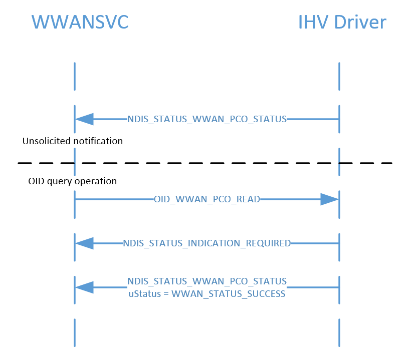
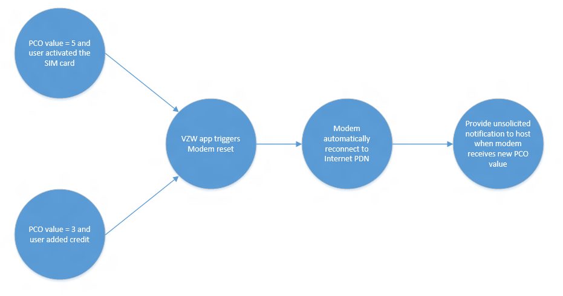

# MB Protocol Configuration Options (PCO) operations

## Overview

The purpose of Protocol Configuration Options (PCO) is to transfer the external network protocol options associated with a packet data protocol (PDP) context activation. Windows NDIS definitions for PCO values have typically been generic in order to receive full PCO values from the modem and network in the future. However starting with Windows 10 version 1709 some modems are only able to pass up operator specific PCO elements to the OS. This topic defines the behavior of the current operator specific-only PCO implementation.

## Flows

There are three scenarios where the PCO value will be passed to the host:

- When a new PCO value has arrived on an activated connection
- When an app or service queries for the latest PCO value from the modem
- When a connection is bridged or activated for the first time and a PCO value already exists in the modem

For the first scenario, the modem should send an [NDIS_STATUS_WWAN_PCO_STATUS](ndis-status-wwan-pco-status.md) notification to the OS indicating a new PCO value change whenever a new PCO value is received from the network, with the appropriate NDIS port number to represent the corresponding PDN. To avoid draining the battery unnecessarily, the modem should avoid noisy notifications, as described in [Modem behavior with Selective Suspend and Connected Standby](#modem-behavior-with-selective-suspend-and-connected-standby).

For the second scenario, when an app or service queries for PCO value from the modem on an activated PDN connection, the host will send the modem an [OID_WWAN_PCO](oid-wwan-pco.md) query request to read the latest cached PCO value in the modem.

For the third scenario, when a connection is activated or bridged on the host, the modem should send an **NDIS_STATUS_WWAN_PCO_STATUS** notification when a PCO value already exists in the modem for the activated or bridged connection the host requested. The notification should be passed up from the corresponding NDIS port number of the PDN.

The following figure shows the scenario flow:

## Modem behavior with Selective Suspend and Connected Standby

When Selective Suspend is enabled, the modem can notify the OS whenever it receives a PCO data structure from the network. However, the modem should avoid unnecessary device wakeup. Otherwise, noisy PCO notifications from the network will wake the device up frequently and drain the battery unnecessarily.

When Connected Standby is enabled, the modem shouldn’t notify the OS when it receives PCO data structures from the network because it will not only wake up the device, but it will also wake up the OS, which is not necessary. Instead, the modem should cache all the latest PCO elements from the data structure and notify the OS once the OS exits Connected Standby. For an MBIM modem, it should cache all PCO data structures and only send PCO notifications to the OS after the host has subscribed to it. This will be done using the MBIM_CID_DEVICE_SERVICE_SUBSCRIBE_LIST CID when system power has returned to full power after coming out of Connected Standby.

## Resetting the modem based on PCO values

Based on PCO values received from the network, the modem will be reset in the following scenarios:

- The user completed self-activation after receiving PCO = 5 from the network. A new PCO value (3, 0 or anything Mobile Operator App can recognize) will be sent to the OS and the OS will pass it to Mobile Operator App.
- The user added more credit to their account after receiving PCO = 3. A new PCO value (0, or anything Mobile Operator App can recognize) will be sent to the OS and the OS will pass it to Mobile Operator App.

The host is not aware of the modem being reset, so the activated connections from the host will not be deactivated and the modem should automatically re-establish connection with those PDN after resetting. Upon establishing connection and receiving a new incoming PCO value from the network, the modem will provide an unsolicited [NDIS_STATUS_WWAN_PCO_STATUS](ndis-status-wwan-pco-status.md) notification to the host.

The following diagram illustrates the modem’s reset flow when one of these scenarios occurs, with Verizon Wireless as the example MO:

## NDIS interface to the modem

For querying the status and payload of a PCO value the modem received from the operator network, see [OID_WWAN_PCO](oid-wwan-pco.md). **OID_WWAN_PCO** uses the [**NDIS_WWAN_PCO_STATUS**](/windows-hardware/drivers/ddi/ndiswwan/ns-ndiswwan-_ndis_wwan_pco_status) structure, which in turn contains a [**WWAN_PCO_VALUE**](/windows-hardware/drivers/ddi/wwan/ns-wwan-_wwan_pco_value)  structure representing the PCO information payload from the network.

For the status notification sent by a modem miniport driver to inform the OS of the current PCO state in the modem, see [NDIS_STATUS_WWAN_PCO_STATUS](ndis-status-wwan-pco-status.md).

## MB CID to the modem

Service = **MBB_UUID_BASIC_CONNECT_EXT_CONSTANT**

Service UUID = **3d01dcc5-fef5-4d05-0d3a-bef7058e9aaf**

The following CIDs are defined for PCO:

| CID | Command code | Minimum OS Version |
| --- | --- | --- |
| MBIM_CID_PCO | 9 | Windows 10, version 1709 |

### MBIM_CID_PCO

This command is used to query the PCO data cached in modem from the mobile operator network.

#### Query

The InformationBuffer contains an **MBIM_PCO_VALUE** in which the only relevant field is *SessionId*. *SessionId* is reserved for future use and will always be 0 in Windows 10, version 1709. The *SessionId* in a query indicates which IP data stream’s PCO value is to be returned by the function.

#### Set

Not applicable.

#### Unsolicited Event

Unsolicited events contain an MBIM_PCO_VALUE and are sent when a new PCO value has arrived on an activated connection.

#### Parameters

| Operation | Set | Query | Notification |
| --- | --- | --- | --- |
| Command | Not applicable | MBIM_PCO_VALUE | Not applicable |
| Response | Not applicable | MBIM_PCO_VALUE | MBIM_PCO_VALUE |

#### Data Structures

##### MBIM_PCO_TYPE

| Type | Value | Description |
| --- | --- | --- |
| MBIMPcoTypeComplete | 0 | Specifies that the complete PCO structure will be passed up as received from the network and the header realistically reflects the protocol in octet 3 of the PCO structure, defined in the 3GPP TS24.008 spec. |
| MBIMPcoTypePartial | 1 | Specifies that the modem will only be passing up a subset of PCO structures that it received from the network. The header matches the PCO structure defined in the 3GPP TS24.008 spec, but the “Configuration protocol” of octet 3 may not be valid. |

##### MBIM-PCO-TYPE

| Offset | Size | Field | Type | Description |
| --- | --- | --- | --- | --- |
| 0 | 4 | SessionId | UINT32 | The SessionId in a query indicates which IP data stream’s PCO value is to be returned by the function. |
| 4 | 4 | PcoDataSize | UINT32 | The length of PcoData, from 0 to 256. This value will be 0 in a query. |
| 8 | 4 | PcoDataType | UINT32 | The PCO data type. For more info, see [MBIM_PCO_TYPE](#mbim_pco_type). |
| 12 | | PcoDataBuffer | DATABUFFER | The PCO structure from the 3GPP TS24.008 spec. |

#### Status Codes

This CID only uses Generic Status Codes.

## Hardware Lab Kit (HLK) Tests
See [Steps for installing HLK](https://microsoft.sharepoint.com/teams/HWKits/SitePages/HWLabKit/Manual%20Controller%20Installation.aspx). 

In HLK Studio connect to the device Cellular modem driver and run the test: [TestPco](/windows-hardware/test/hlk/testref/c7f8c2c2-ba87-4f51-8666-3fa06dc01451).

## WinRT API

[PCO](/uwp/api/windows.networking.networkoperators.mobilebroadbandpco)

[PCO Background Trigger](/uwp/api/windows.applicationmodel.background.mobilebroadbandpcodatachangetrigger)

## See Also

[NDIS_STATUS_WWAN_PCO_STATUS](ndis-status-wwan-pco-status.md)

[**NDIS_WWAN_PCO_STATUS**](/windows-hardware/drivers/ddi/ndiswwan/ns-ndiswwan-_ndis_wwan_pco_status)

[**WWAN_PCO_VALUE**](/windows-hardware/drivers/ddi/wwan/ns-wwan-_wwan_pco_value)

[OID_WWAN_PCO](oid-wwan-pco.md)
