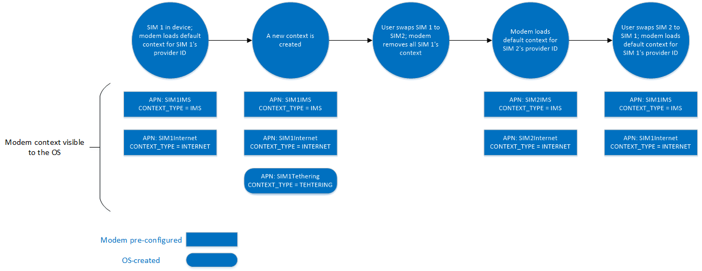
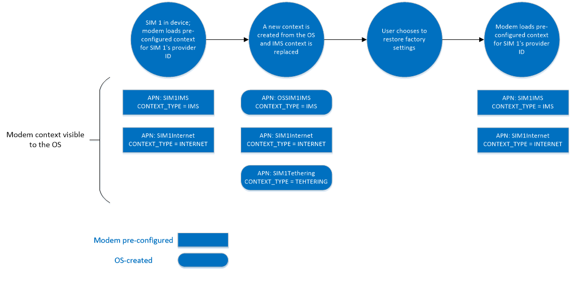

# MB Provisioned Context Operations

Provisioning is vital for cellular-connectable devices because each mobile operator has different APN configurations for its network. APN configurations can generally be split into two categories:

1. APN configurations that are known to the OS because there are applications or clients above the OS that requires those connections.
2. APN configurations that are not made known to the OS because they are internally consumed by the modem for connections that are not leveraged by the OS and its clients.

Ideally, the modem should only store the APN configurations the OS does not have to know. However, IHV and OEM partners have traditionally provided the Internet and Purchase APNs, configurations known to the OS, in the modem as well. Before Windows 10, version 1703’s release, Windows only read the Internet and Purchase APN configurations from the modem to establish Internet connections. Starting in Windows 10, version 1703, there might be additional cases in which the modem’s APN configuration would have to be managed by Windows, especially if there are clients in the OS such as user settings or OMA-DM that want to change cellular configuration. This in turn could also affect the modem’s APN configuration. For example, there might be an IMS stack in the modem that is using the IMS APN for SMS over IMS. Typically, those connections are not exposed to the OS, but under certain scenarios the IMS APN configuration may have to be changed. This change could be done through the OS. In order to support this, starting in Windows 10, version 1703 the OS can configure different types of APNs into the modem.

The USB forum’s MBIM 1.0 and Microsoft NDIS each have an existing CID and OID respectively to allow the OS to set and query the APN configurations in the modem. For MBIM 1.0 it does this through  MBIM_CID_PROVISIONED_CONTEXT while for NDIS it does this through [OID_WWAN_PROVISIONED_CONTEXTS](https://msdn.microsoft.com/library/windows/hardware/ff569831). However, the existing CID and OID were not designed with clear guidance on how the modem is expected to behave in various situations such as a power cycle or SIM swap. Devices that want to support OS configuring and updating of modem-provisioned contexts going forward will have to implement the newer version of the CID and OID in Windows 10, version 1703. To ensure backward compatibility, for IHVs/OEMs that want to support new hardware on OS versions older than 1703, they will have to continue to support the existing MBIM_CID_PROVISIONED_CONTEXT and OID_WWAN_PROVISIONED_CONTEXTS.  Starting from Windows 10, version 1703, if the device supports the new version of the CID and OID then the OS will only use the newer version of the command to query and set APN context configuration in the modem. 

## MB Interface Update for Provisioned Context Operations

While MBIM has a command for retrieving and replacing contexts stored in the modem, it does not have a field to “disable” or “enable” a profile.  Therefore, the existing MBIM_CID_PROVISIONED_CONTEXT must be updated for Windows 10, version 1703 to include this capability. Because MBIM does not have a versioning mechanism, a new MSFT proprietary CID is defined as MBIM_CID_MS_PROVISIONED_CONTEXT_V2.

Service Name = **Basic Connect Extensions**

UUID = **UUID_BASIC_CONNECT_EXTENSIONS**

UUID Value = **3d01dcc5-fef5-4d05-0d3abef7058e9aaf**

| CID | Command Code | Minimum OS Version |
| --- | --- | --- |
| MBIM_CID_MS_PROVISIONED_CONTEXT_V2 | 1 | Windows 10, version 1703 |

### MBIM_CID_MS_PROVISIONED_CONTEXT_V2

#### Description

Although MBIM 1.0 has defined MBIM_CID_PROVISIONED_CONTEXT for the OS and its upper clients to manage provisioned contexts in the modem, Windows traditionally only queried the context in the modem but did not set it from the OS. Starting in Windows 10, version 1703, there is increasing need for the OS to be able to configure the contexts in the modem. For example, if there is an IMS stack in the modem that is opaque to the OS, the OS should be able to specify the IMS APN that the modem should use. Because each modem IHV can have its own proprietary way to store contexts in the modem, it is impossible for the OS to manage profiles on the ContextId level the way MBIM_CID_PROVISIONED_CONTEXT might suggest. Instead, from the OS’s perspective it is more important to prescribe which context to use for each context type. Returning to the IMS example, regardless of how many existing provisioned contexts are in the modem, if the OS sets a context that has MBIM_CONTEXT_TYPE = IMS then all IMS traffic initiated by the modem should only be attempted on that context.

MBIM 1.0 specifies that MBIM_CID_PROVISIONED_CONTEXT can only call Query on contexts that match the Provider ID (MCC/MNC pair) of the inserted SIM card. For Set requests, MBIM_CID_PROVISIONED_CONTEXT can specify the Provider ID of the context that it wants to be stored.  MBIM_CID_MS_PROVISIONED_CONTEXT_V2 specifies a similar but different behavior from MBIM 1.0. For each Query, the OS continues to expect the modem to only return contexts that match the Provider ID of the inserted SIM card. For Set, the command will no longer enable the OS to Set contexts that do not match the current Provider ID in the SIM card. It is expected that the Set request is to create a context for the current Provider ID of the presented SIM card. As an example, the user swaps from SIM 1 to SIM 2, then back to SIM 1. It is expected that during first SIM swap, the modem should resolve all its contexts before loading the context for SIM 2. When the user swaps back to SIM 1, SIM 1’s factory default configuration should be restored.  It is not expected for the modem to save runtime configuration across SIM swaps.

The following diagram illustrates a sample flow for when a user swaps from one SIM to another, then back to the first one.

OEMs and IHVs that have preconfigured the modem should keep the original factory configuration in case the OS or user wants to restore the context settings in the modem to the original settings. Only the original factory contexts for the currently inserted SIM’s Provider ID should be restored. The original factory setting preconfigured contexts should never be overwritten by the OS’s configuration. The following diagram is an example flow for when a user chooses to restore factory settings:

It is expected for the modem to fail Query or Set requests when the SIM is missing, locked, or the Provider ID is inaccessible. The modem should have only one context per CONTEXT_TYPE per Provider ID. If the IHV or OEM decides to preconfigure modem contexts in the modem, it is important for it to make sure that the contexts are configured correctly for each provider for which it chooses to do so. In the case that the inserted SIM card has no IHV preconfigured contexts, the modem should not have any contexts without the OS’s configuration. IHVs and OEMs have to make sure MBIM_MS_CONTEXT_SOURCE = MbimMsContextSourceModemProvisioned so that the OS will use the modem’s context for connection, if it exists, and not overwrite it from Windows’s APN database.

How the modem maps handle the context and present it back through the existing MBIM_CID_PROVISIONED_CONTEXT is up to each IHV and is out of scope of this documentation.

The new MBIM_CID_MS_PROVISONED_CONTEXT_V2 command is almost identical to MBIM 1.0’s existing MBIM_CID_PROVISIONED_CONTEXT command, but with several additions. The first provides the OS with the ability to enable or disable the context associated with a context type in the modem. When the context is disabled in the modem, the modem is expected not to use the stored context for any connection with the network, even those not made aware to the OS. If the OS requests a connection matching a disabled context in the modem, the modem should fail the request immediately without signaling to the network. The matching process should match all fields in the MBIM_MS_CONTEXT_V2 structure.

The MBIM_CONTEXT_IP_TYPE structure from MBIM 1.0 is only used for MBIM_CID_CONNECT. In MBIM_CID_MS_PROVISIONED_CONTEXT_V2, Microsoft has added the IP type as one of the parameters for each context. The modem should report MBIMContextIPTypeDefault if it is not configured for the given context. 

In Windows 10, version 1703, with new hardware that supports MBIM_CID_MS_PROVISIONED_CONTEXT_V2, the legacy MBIM_CID_PROVISIONED_CONTEXT will not be used from first party components. If there are other legacy client/OS components that send down MBIM_CID_PROVISIONED_CONTEXT, the modem is expected to return results as it did in versions of Windows earlier than Windows 10, version 1703.

##### Query

MBIM_MS_PROVISIONED_CONTEXTS_INFO is returned from both Query and Set complete messages in the InformationBuffer. 

For Query, the InformationBuffer is null.

##### Set

For Set, the InformationBuffer contains an MBIM_MS_SET_PROVISIONED_CONTEXT_V2 structure. In the Set operation, because each modem IHV can have proprietary ways of managing context storage, the OS no longer specifies the ContextId field and expects the modem to map the contexts to the appropriate slot. When the OS Sets contexts, it expects the modem to use it for all connections that match the MBIM_CONTEXT_TYPE of the given context. If the MBIM_CONTEXT_TYPE is not recognized by the modem, it should still store it even though it may not connect with it.

##### Unsolicited Event

The Event InformationBuffer contains an MBIM_MS_PROVISIONED_CONTEXTS_INFO_V2 structure. In some cases, the list of provisioned contexts is updated by the network either Over-The-Air (OTA) or by Short Message Service (SMS) that does not go over the MBIM_CID_MS_PROVISIONED_CONTEXT_V2 command from the OS. The function must update the list of provisioned contexts and tag MBIM_MS_CONTEXT_SOURCE = MbimMsContextSourceOperatorProvisioned accordingly. After that, functions must notify the host about updates using this event with the updated list.

#### Parameters

|  | Set | Query | Notification |
| --- | --- | --- | --- |
| Command | MBIM_SET_MS_PROVISIONED_CONTEXT_V2 | Not applicable | Not applicable |
| Response | MBIM_MS_PROVISIONED_CONTEXT_INFO_V2 | MBIM_MS_PROVISIONED_CONTEXT_INFO_V2 | MBIM_MS_PROVISIONED_CONTEXT_INFO_V2 |

#### Data Structures

##### Query

The InformationBuffer shall be NULL and InformationBufferLength shall be zero.

##### Set

The following MBIM_SET_MS_PROVISIONED_CONTEXT_V2 data structure shall be used in the InformationBuffer.

| Offset | Size |       Field        |              Type               |                                                                                                                                                                                                                                                                                                   Description                                                                                                                                                                                                                                                                                                   |
|--------|------|--------------------|---------------------------------|-----------------------------------------------------------------------------------------------------------------------------------------------------------------------------------------------------------------------------------------------------------------------------------------------------------------------------------------------------------------------------------------------------------------------------------------------------------------------------------------------------------------------------------------------------------------------------------------------------------------|
|   0    |  4   |     Operation      |   MBIM_MS_CONTEXT_OPERATIONS    |                                             Specifies the type of operation for which the SET command is used. If set to MbimMsContextOperationDelete then the context for the specified MBIM_CONTEXT_TYPES should be deleted and all other fields in MBIM_SET_MS_PROVISIONED_CONTEXT_V2 should be ignored.  If set to MbimMsContextOperationRestoreFactory then all OS-created or modified contexts should be removed, the default factory preconfigured contexts should be loaded, and all other fields in MBIM_SET_MS_PROVISIONED_CONTEXT_V2 should be ignored.                                              |
|   4    |  16  |    ContextType     |       MBIM_CONTEXT_TYPES        |                                                                                                                                                                                                Specifies the type of context being represented; for example, Internet connectivity, VPN (a connection to a corporate network), or Voice-over-IP (VOIP). For more information, see the  MBIM_CONTEXT_TYPES table.                                                                                                                                                                                                |
|   20   |  4   |       IPType       |      MBIM_CONTEXT_IP_TYPES      |                                                                                                                                                                                               Specifies the type of context being represented; for example, Internet connectivity, VPN (a connection to a corporate network), or Voice-over-IP (VOIP). For more information, see the MBIM_CONTEXT_IP_TYPES table.                                                                                                                                                                                               |
|   24   |  4   |       Enable       |     MBIM_MS_CONTEXT_ENABLE      |                                                                                                                                                                     Specifies whether the context could be used by the modem. If it is set to MbimMsContextDisabled, then any OS connection request that matches the context should be failed without signaling to the network. For more information, see the MBIM_MS_CONTEXT_ENABLE table.                                                                                                                                                                     |
|   28   |  4   |      Roaming       | MBIM_MS_CONTEXT_ROAMING_CONTROL |                                                                                                                                                                                                                                       Specifies whether roaming is allowed or not for this context. For more information, see the MBIM_MS_CONTEXT_ROAMING_CONTROL table.                                                                                                                                                                                                                                        |
|   32   |  4   |     MediaType      |   MBIM_MS_CONTEXT_MEDIA_TYPE    |                                                                                                                                                                                                                                         Specifies what type of media transport the context is used for. For more information, see the MBIM_MS_CONTEXT_MEDIA_TYPE table.                                                                                                                                                                                                                                         |
|   36   |  4   |       Source       |     MBIM_MS_CONTEXT_SOURCE      |                                                                                                                                                                                                                                                    Specifies the creation source of the context. For more information, see the MBIM_MS_CONTEXT_SOURCE table.                                                                                                                                                                                                                                                    |
|   40   |  4   | AccessStringOffset |             OFFSET              | Offset in the data buffer to a string,  AccessString, to access the network. For GSM-based networks, this would be an Access Point Name (APN) string such as "data.thephone-company.com". For CDMA-based networks, this might be a special dial code such as "#777" or a Network Access Identifier (NAI) such as "foo@thephone-company.com". This member can be NULL to request that the network assign the default APN. Note: Not all networks support this NULL APN convention, so a connect failure caused by an invalid APN is a possible outcome. The size of the string should not exceed 100 characters. |
|   44   |  4   |  AccessStringSize  |          SIZE(0..200)           |                                                                                                                                                                                                                                                                                           Size used for AccessString.                                                                                                                                                                                                                                                                                           |
|   48   |  4   |   UserNameOffset   |             OFFSET              |                                                                                                                                                                                                                         Offset in bytes, calculated from the beginning of this structure, to a string, UserName, that represents the username to authenticate. This member can be NULL.                                                                                                                                                                                                                         |
|   52   |  4   |    UserNameSize    |          SIZE(0..510)           |                                                                                                                                                                                                                                                                                            Size used for UserName .                                                                                                                                                                                                                                                                                             |
|   56   |  4   |   PasswordOffset   |             OFFSET              |                                                                                                                                                                                                                           Offset in bytes, calculated from the beginning of this structure, to a string, Password, that represents the username's password. This member can be NULL.                                                                                                                                                                                                                            |
|   60   |  4   |    PasswordSize    |          SIZE(0..510)           |                                                                                                                                                                                                                                                                                             Size used for Password.                                                                                                                                                                                                                                                                                             |
|   64   |  4   |    Compression     |        MBIM_COMPRESSION         |                                                                                                                                                                         Specifies the compression to be used in the data connection for header and data. This member applies only to GSM-based devices. The Host sets this member to MBIMCompressionNone for CDMA-based devices. For more information, see the MBIM_COMPRESSION table.                                                                                                                                                                          |
|   68   |  4   |    AuthProtocol    |       MBIM_AUTH_PROTOCOL        |                                                                                                                                                                                                                                                   Authentication type to use for the PDP activation. For more information, see the MBIM_AUTH_PROTOCOL table.                                                                                                                                                                                                                                                    |
|   72   |  4   |     DataBuffer     |           DATABUFFER            |                                                                                                                                                                                                                                                                       The data buffer that contains AccessString, UserName, and Password.                                                                                                                                                                                                                                                                       |

The following data structures are used in the preceding table.

MBIM_MS_CONTEXT_ROAMING_CONTROL specifies the per-context roaming policy. The OS can specify whether the given context can be enabled during roaming or not. The modem should not self-activate the context without OS intervention if the roaming state does not satisfy the specified conditions. In cases in which the modem does not support partners, then all partner configurations should be treated as equivalent to home.

| Type | Value | Description |
| --- | --- | --- |
| MbimMsContextRoamingControlHomeOnly | 0 | Indicates whether the context is only allowed to be used in the home network or not. |
| MbimMsContextRoamingControlPartnerOnly | 1 | Indicates whether the context is only allowed to be used in partner roaming networks or not. |
| MbimMsContextRoamingControlNonPartnerOnly | 2 | Indicates whether the context is only allowed to be used in non-partner roaming networks or not. | 
| MbimMsContextRoamingControlHomeAndPartner | 3 | Indicates whether the context is allowed to be used in home and partner roaming networks. |
| MbimMsContextRoamingControlHomeAndNonPartner | 4 | Indicates whether the context is allowed to be used in home and non-partner roaming networks. |
| MbimMsContextRoamingControlPartnerAndNonPartner | 5 | Indicates whether the context is allowed to be used in partner and non-partner roaming networks. |
| MbimMsContextRoamingControlAllowAll | 6 | Indicates whether the context is allowed to be used in any roaming condition. |

MBIM_MS_CONTEXT_MEDIA_TYPE has been added to be able to specify whether the context is used for cellular or iWLAN when Wi-Fi offload becomes supported in future platforms. For example, if a context is set as cellular and the modem is currently Wi-Fi offloading then it should not initiate a connection by using that context.

| Type | Value | Description |
| --- | --- | --- |
| MbimMsContextMediaTypeCellularOnly | 0 | Indicates whether the context is only allowed to be used when registered over cellular. |
| MbimMsContextMediaTypeWifiOnly | 1 | Indicates whether the context is only allowed to be used when registered over iWLAN (Wi-Fi offload). |
| MbimMsContextMediaTypeAll | 2 | Indicates whether the context is allowed to be used when registered either through Cellular or Wi-Fi. |

MBIM_MS_CONTEXT_ENABLE specifies whether a context is enabled or disabled.

| Type | Value | Description |
| --- | --- | --- |
| MbimMsContextDisabled | 0 | The provisioned context is disabled. The modem should not enable activation on this context from the OS and itself. |
| MbimMsContextEnabled | 1 | The provisioned context is enabled. The context can be enabled if other conditions are met; for example, if roaming is disallowed then the context should not be enabled during roaming. |

MBIM_MS_CONTEXT_SOURCE has been added to give the OS visibility on how the modem context was created. This helps the OS to behave correctly after various situations such as factory reset, so it can know what should persist and what should be returned to default state based on various operator requirements.

| Type | Value | Description |
| --- | --- | --- |
| MbimMsContextSourceAdmin | 0 | The context was created by an Enterprise IT admin from the OS. |
| MbimMsContextSourceUser | 1 | The context was created by the user through OS settings. | 
| MbimMsContextSourceOperator | 2 | The context was created by the operator through OMA-DM or other channels. |
| MbimMsContextSourceModem | 3 | The context was created by the IHV or OEM that was included with the modem firmware. |
| MbimMsContextSourceDevice | 4 | The context was created by the OS APN database. |

MBIM_MS_CONTEXT_OPERATIONS specifies the operations the OS can perform to configure contexts in the modem.

| Type | Value | Description |
| --- | --- | --- |
| MbimMsContextOperationDefault | 0 | Default operation including adding or replacing an existing context in the modem. |
| MbimMsContextOperationDelete | 1 | Delete operation requires the modem to delete an existing context in the modem. | 
| MbimMsContextOperationRestoreFactory | 2 | Restore factory preconfigured context for the Provider ID of currently inserted SIM. All contexts replaced or created by OS should be removed and replaced. If there is no default preconfigured OS context for the current inserted SIM Provider ID, then the provisioned context in the modem should be removed. |

The original MBIM_CONTEXT_TYPES from MBIM 1.0 is still valid. Microsoft is adding additional context types as more types of contexts were introduced since MBIM 1.0 was defined. The following table defines the new types being introduced. IHVs and OEMs may define other proprietary context types with other unique UUID values that will not be recognizable by the OS for its own purposes.

| Type | Value | Description |
| --- | --- | --- |
| MBIMMsContextTypeAdmin | 5f7e4c2e-e80b-40a9-a239-f0abcfd11f4b | The context is used for administrative purposes such as device management. |
| MBIMMSContextTypeApp | 74d88a3d-dfbd-4799-9a8c-7310a37bb2ee | The context is used for certain applications whitelisted by mobile operators. |
| MBIMMsContextTypeXcap | 50d378a7-baa5-4a50-b872-3fe5bb463411 | The context is used for XCAP provisioning on IMS services. |
| MBIMMsContextTypeTethering | 5e4e0601-48dc-4e2b-acb8-08b4016bbaac | The context is used for Mobile Hotspot tethering. |
| MBIMMsContextTypeEmergencyCalling | 5f41adb8-204e-4d31-9da8-b3c970e360f2 | The context is used for IMS emergency calling. |

##### Response

The following MBIM_MS_PROVISIONED_CONTEXT_INFO_V2 structure shall be used in the InformationBuffer.

| Offset | Size | Field | Type | Description |
| --- | --- | --- | --- | --- |
| 0 | 4 | ElementCount (EC) | UINT32 | Count of MBIM_MS_CONTEXT_V2 structures that follow in the DataBuffer. |
| 4 | 8 * EC | MsProvisionedContextV2RefList | OL_PAIR_LIST | The first element of the pair is a 4 byte Offset in bytes, calculated from the beginning (offset 0) of this MBIM_MS_PROVISIONED_CONTEXTS_INFO_V2 structure, to an MBIM_MS_CONTEXT_V2 structure (for more information, see the MBIM_MS_CONTEXT_V2 table). The second element of the pair is a 4-byte size of a pointer to the corresponding MBIM_MS_CONTEXT_V2 structure. |
| 4 + 8 * EC |  | DataBuffer | DATABUFFER | Array of MBIM_MS_CONTEXT_V2 structuers. |

MBIM_MS_CONTEXT_V2, used in the preceding table, provides information about a given context.

| Offset | Size |       Field        |              Type               |                                                                                                                                                                                                                                                                                                 Description                                                                                                                                                                                                                                                                                                  |
|--------|------|--------------------|---------------------------------|--------------------------------------------------------------------------------------------------------------------------------------------------------------------------------------------------------------------------------------------------------------------------------------------------------------------------------------------------------------------------------------------------------------------------------------------------------------------------------------------------------------------------------------------------------------------------------------------------------------|
|   0    |  4   |     ContextId      |             UINT32              |                                                                                                                                                                                                                                                                                        A unique ID for this context.                                                                                                                                                                                                                                                                                         |
|   4    |  16  |    ContextType     |       MBIM_CONTEXT_TYPES        |                                                                                                                                                      Specifies the type of context being represented; for example, Internet connectivity, VPN (a connection to a corporate network), or Voice-over-IP (VOIP). Devices should specify MBIMContextTypeNone for empty or un-provisioned contexts. For more information, see the MBIM_CONTEXT_TYPES table.                                                                                                                                                       |
|   20   |  4   |       IPType       |      MBIM_CONTEXT_IP_TYPES      |                                                                                                                                                                                                                                                                         For more information, see the  MBIM_CONTEXT_IP_TYPES table.                                                                                                                                                                                                                                                                          |
|   24   |  4   |       Enable       |     MBIM_MS_CONTEXT_ENABLE      |                                                                                                                                                                   Specifies whether the context could be used by the modem. If it is set to MbimMsContextDisabled, then any OS connection request that matches the context should be failed without signaling to the network. For more information, see the MBIM_MS_CONTEXT_ENABLE table.                                                                                                                                                                    |
|   28   |  4   |      Roaming       | MBIM_MS_CONTEXT_ROAMING_CONTROL |                                                                                                                                                                                                                                      Specifies whether roaming is allowed or not for this context. For more information, see the MBIM_MS_CONTEXT_ROAMING_CONTROL table.                                                                                                                                                                                                                                      |
|   32   |  4   |     MediaType      |   MBIM_MS_CONTEXT_MEDIA_TYPE    |                                                                                                                                                                                                                                       Specifies what type of media transport the context is used for. For more information, see the MBIM_MS_CONTEXT_MEDIA_TYPE table.                                                                                                                                                                                                                                        |
|   36   |  4   |       Source       |     MBIM_MS_CONTEXT_SOURCE      |                                                                                                                                                                                                                                                  Specifies the creation source of the context. For more information, see the MBIM_MS_CONTEXT_SOURCE table.                                                                                                                                                                                                                                                   |
|   40   |  4   | AccessStringOffset |             OFFSET              | Offset in data buffer to a string,  AccessString, to access the network. For GSM-based networks, this would be an Access Point Name (APN) string such as "data.thephone-company.com". For CDMA-based networks, this might be a special dial code such as "#777" or a Network Access Identifier (NAI) such as "foo@thephone-company.com". This member can be NULL, to request that the network assign the default APN. Note: Not all networks support this NULL APN convention, so a connect failure caused by an invalid APN is a possible outcome. The size of the string should not exceed 100 characters. |
|   44   |  4   |  AccessStringSize  |          SIZE(0..200)           |                                                                                                                                                                                                                                                                                         Size used for AccessString.                                                                                                                                                                                                                                                                                          |
|   48   |  4   |   UserNameOffset   |             OFFSET              |                                                                                                                                                                                                                       Offset in bytes, calculated from the beginning of this structure, to a string, UserName, that represents the username to authenticate. This member can be NULL.                                                                                                                                                                                                                        |
|   52   |  4   |    UserNameSize    |          SIZE(0..510)           |                                                                                                                                                                                                                                                                                           Sized used for UserName.                                                                                                                                                                                                                                                                                           |
|   56   |  4   |   PasswordOffset   |             OFFSET              |                                                                                                                                                                                                                          Offset in bytes, calculated from the beginning of this structure, to a string, Password, that represents the username's password. This member can be NULL.                                                                                                                                                                                                                          |
|   60   |  4   |    PasswordSize    |          SIZE(0..510)           |                                                                                                                                                                                                                                                                                           Size used for Password.                                                                                                                                                                                                                                                                                            |
|   64   |  4   |    Compression     |        MBIM_COMPRESSION         |                                                                                                                                                                        Specifies the compression to be used in the data connection for header and data. This member applies only to GSM-based devices. The Host sets this member to MBIMCompressionNone for CDMA-based devices. For more information, see the MBIM_COMPRESSION table.                                                                                                                                                                        |
|   68   |  4   |    AuthProtocol    |       MBIM_AUTH_PROTOCOL        |                                                                                                                                                                                                                                                  Authentication type to use for the PDP activation. For more information, see the MBIM_AUTH_PROTOCOL table.                                                                                                                                                                                                                                                  |
|   72   |      |     DataBuffer     |           DATABUFFER            |                                                                                                                                                                                                                                                                     The data buffer that contains AccessString, UserName, and Password.                                                                                                                                                                                                                                                                      |

##### Notification

For more information, see the MBIM_MS_PROVISIONED_CONTEXT_V2 table.

#### Status Codes

For Query and Set operations:

| Status Code | Description |
| --- | --- |
| MBIM_STATUS_READ_FAILURE | The operation failed because the device was unable to retrieve provisioned contexts. |
| MBIM_STATUS_NO_DEVICE_SUPPORT | The operation failed because the device does not support the operation. |

For Set operations only:

| Status Code | Description |
| --- | --- |
| MBIM_STATUS_INVALID_PARAMETERS | The operation failed because of invalid parameters. |
| MBIM_STATUS_WRITE_FAILURE | The operation failed because the update request was unsuccessful. |

