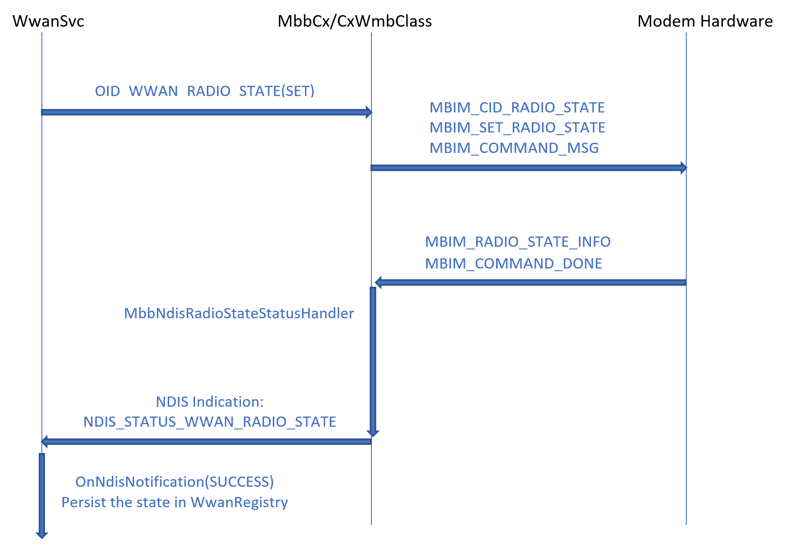
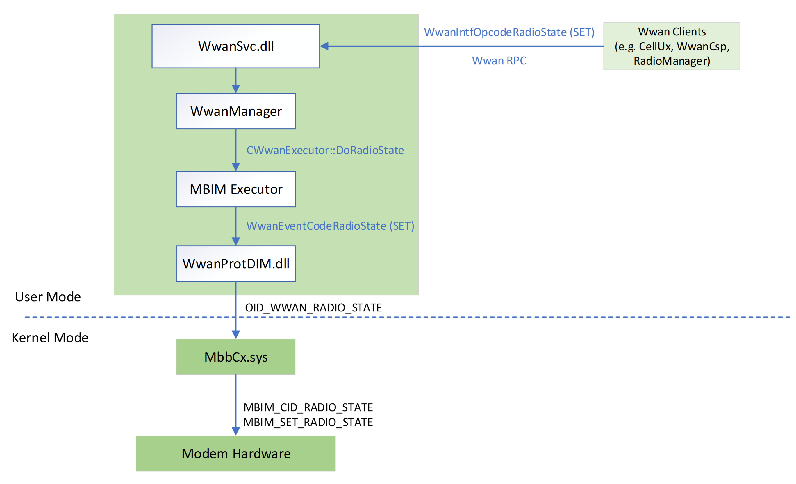
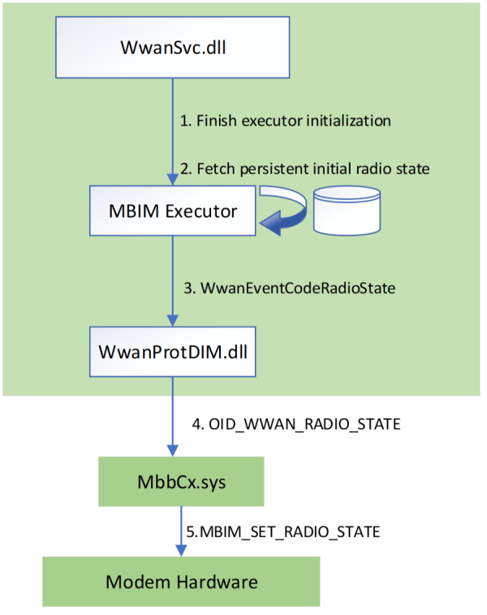

# MB Radio State

## Overview

This topic describes the operations that are used to set and read an MB device's radio power state(s). These states can be controlled through software (airplane mode) or hardware (if the appropriate switch is present). This topic explains how the radio power states are controlled, how to test radio power state functionality, and how to investigate radio power state issues. 

### Terminology

*System Radio State* - System Radio State is a system-wide state. It is the most evident indicator of airplane mode state. System Radio State is managed by the Radio Management Service (RmSvc).

*Radio Manager* - RmSvc iterates several RadioManagers (MediaManagers) in the system like WlanRadioManager, BlueTooth, and WwanRadioManager. WwanRadioManager(.lib) is hosted in RmSvc.dll and manages the wwan side of the radio logic. WwanRadioManager uses the WWAN Service (WwanSvc) RPC to: 
1. Query and set cellular radio.
1. Control the flow before and after airplane mode.

*Radio Instance* - Each RadioManager can include multiple radio instances. For example, WwanRadioManager can have two radio instances if there are two cellular modems in the system. Each radio instance is an abstract object and should map to one hardware radio module. In most cases, each radio instance maps to one cellular modem.

### Relevant Services and Drivers

*RmSvc.dll* - Manages system-wide radio events like airplane mode. It also hosts all radio managers, including WwanRadioManager.

*WwanSvc.dll* - Cellular modems are managed by WwanSvc. Therefore, commands (OID/CID) are issued via WwanSvc. External requests from RmSvc or other components (UI) go via the WwanSvc RPC to query or set cellular radio state.

*MbbCx.sys* - The kernel-mode driver that manages device power state especially between D0 and Dx transition. On some system setups, the device is allowed to transition to Dx state and recover to D0 only when needed. MbbCx.sys manages the logic and control of radio state recovery before D0 and Dx.

## Architecture/Flows

### Radio Control from WwanSvc to Modem Hardware


### SET Radio via WwanSvc API


### Initial Radio State upon Device Arrival


## MBIM_CID_RADIO_STATE

As seen in the above diagrams, the CID used in airplane mode operations is **MBIM_CID_RADIO_STATE**. This CID sets or returns information about a MB device's radio power state.

### Query
The InformationBuffer on MBIM_COMMAND_MSG is not used. MBIM_RADIO_STATE_INFO is returned in the
InformationBuffer of MBIM_COMMAND_DONE.

### Set
The InformationBuffer on MBIM_COMMAND_MSG contains MBIM_SET_RADIO_STATE. MBIM_RADIO_STATE_INFO is returned in the InformationBuffer of MBIM_COMMAND_DONE.

### Unsolicited Event
The Event InformationBuffer contains an MBIM_RADIO_STATE_INFO structure.

### Parameters

|   | Set | Query | Notification |
|---|---|---|---|
| **Command**  | MBIM_SET_RADIO_STATE  | Empty                 | N/A                   |
| **Response** | MBIM_RADIO_STATE_INFO | MBIM_RADIO_STATE_INFO | MBIM_RADIO_STATE_INFO |

### Data Structures

#### Set

| Offset | Size | Field | Type | Description | 
|---|---|---|---|---|
| 0 | 4 | RadioState | MBIM_RADIO_SWITCH_STATE | Sets the software controlled radio state. See table below. |

**MBIM_RADIO_SWITCH_STATE**

| Types        | Value |
|--------------|-------|
| MBIMRadioOff | 0     |
| MBIMRadioOn  | 1     |

#### Query
 The InformationBuffer will be **null** and InformationBufferLength will be **zero**.

#### Response
**MBIM_RADIO_STATE_INFO**

| Offset | Size | Field | Type | Description | 
|---|---|---|---|---|
| 0 | 4 | HwRadioState | MBIM_RADIO_SWITCH_STATE | The state of the W_DISABLE switch. If the device does not have a W_DISABLE switch, the function must return MBIMRadioOn in this field. |
| 4 | 4 | SwRadioState | MBIM_RADIO_SWITCH_STATE | Software configured radio state. |

#### Notification
See the **MBIM_RADIO_STATE_INFO** table above.

#### Status Codes
This CID only uses Generic Status Codes.


## Testing

### Cellular Radio Tests

| Function Name   | Description |
|:----------------|:------------|
|CellularRadioWinrtTest::VerifyCellularModemExistence                 | Assert winrt api can query cellular modem and radio state                   |
|CellularRadioWinrtTest::VerifyCellularRadioToggle                    |Assert winrt api can toggle radio state on each wwan adapter                 |
|CellularRadioRecoveryTest::VerifyCellularRadioRecoveryToOnAfterAPM   |Assert cellular radio states are recovered to On when leaving Airplane Mode  |
|CellularRadioRecoveryTest::VerifyCellularRadioRecoveryToOffAfterAPM  |Assert cellular radio states remain off when leaving Airplane Mode           |
|CellularRadioRecoveryTest::VerifyCellularRadioAcrossSvcRestart       |Assert cellular radio states stay consistent across WwanSvc restarting       |
|CellularRadioRecoveryTest::VerifyCellularRadioAcrossDevNodePnp       |Assert cellular radio states stay consistent across device arrival/removal   |

**CellularRadioTest.dll** contains these tests.

## Hardware Lab Kit (HLK) Tests

See [Steps for installing HLK](https://microsoft.sharepoint.com/teams/HWKits/SitePages/HWLabKit/Manual%20Controller%20Installation.aspx).

In HLK Studio connect to the device Cellular modem driver and run these tests:

- [**TestRadioStateSoftware**](/windows-hardware/test/hlk/testref/0aa9981a-e556-4338-a568-b17289dd9742) 
- [**TestRadioStateHardware**](/windows-hardware/test/hlk/testref/fa0bd189-b332-4651-8eda-e89866d2e2f1) 

Alternatively you can run the **TestRadioStateHardware** and **TestRadioStateSoftware** HLK testlist by [**netsh-mbn**](/windows-server/networking/technologies/netsh/netsh-mbn) and [**netsh-mbn-test-installation**](mb-netsh-mbn-test.md).
```
netsh mbn test feature=radio testpath="C:\data\test\bin" taefpath="C:\data\test\bin" param="AccessString=internet"
```
The two files showing the HLK test results should have been generated in the directory that the 'netsh mbn test' command was ran from: `TestRadioStateSoftware.htm` and `TestRadioStateHardware.htm`.

Logs can be collected and decoded using these instructions: [MB Collecting Logs](mb-collecting-logs.md).

## Analyzing Logs
### Useful keywords/regexp for filtering traces
	
- OID_WWAN_RADIO_STATE
- CWwanRadioInstance::OnSysRadioChange
- Entering CUIRadioManager::_SetSysRadio
- Leaving CUIRadioManager::_SetSysRadio
- CWwanRadioInstance::_SetSoftwareRadioState
- [WwanRadioManager]
- PostD0Entry: previousPowerState

- CWwanRadioManager::OnSystemRadioStateChange(.)+sysradiostate
- RMAPI(.)+OnSystemRadioStateChange
- RMAPI(.)+OnSystemRadioStateChange
- Wwan-svc(.)+radio
- mbbcx(.)+radio


### Investigation tips
- Identify whether this is a global (system-wide) or local (cellular-only) radio issue.
- Differentiate device power state (D0-Dx) from radio state. They are different concepts but highly-correlated.
- Ensure necessary ETW providers are included in the log.
- Narrow down the area by using the scenario. For example:
	- If it's related to airplane mode, focus on RmSvc and WwanRadioManager.
	- If it's related to D0<->Dx, hibernation, or sleep transitions, focus on MBBCx.
	- If it's related to UI displays or state out-of-sync, start with WwanSvc.

## WinRT API

### Windows.Devices.Radios
[Windows.Devices.Radios](/uwp/api/windows.devices.radios) is owned by the Radio Management Service which manages all radio managers and instances. For the WWAN side, the RadioKind is RadioKind::MobileBroadband.
- GetRadiosAsync( )
- SetStateAsync( )
### Windows.Networking.NetworkOperators
[Windows.Networking.NetworkOperators documentation page](/uwp/api/windows.networking.networkoperators.mobilebroadbanddeviceinformation.currentradiostate)

The only useful utility under this namespace for radio management is MobileBroadbandDeviceInformation.CurrentRadioState.

## See Also
[OID_WWAN_RADIO_STATE](./oid-wwan-radio-state.md)