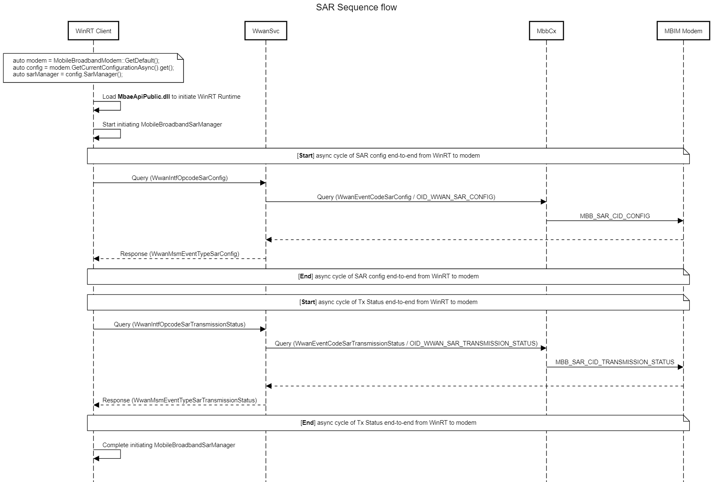

# MB SAR Platform Support

## Overview

Specific Absorption Rate (SAR) is the capability to change the MBB radio transmitter power in reaction to the proximity of the MBB antenna to the user. Traditionally, OEMs have implemented proprietary solutions for SAR. This requires the OEM to implement a device service command that is either only identified between their User Mode Driver (UMDF) and the modem or requires kernel mode components to directly interact with the modem. Some OEMs may even have a hybrid solution where they have both UMDF-modem and kernel mode-modem components. As radio radiation awareness has increased, standardizing the interface for OEM software components to pass through the SAR command to the modem introduces the following benefits:

1.	OEMs can move toward user mode components and makes the system more stable, as errors in user mode are not fatal to the system compared to kernel mode.
2.	Windows provides a platform standard interface and reduces the proprietary implementation from OEMs.
3.	Services in the platform that want to take advantage of SAR can retrieve the information from the modem.

Starting in Windows 10, version 1703, Windows supports passing through SAR configuration and modem transmission status. Windows will continue to leave the SAR business logic to IHVs and OEMs to use as a self-differentiating factor but will provide an interface to streamline the platform. Two new NDIS OIDs and two new MBIM CIDs have been defined to support this interface. Devices that want to take advantage of OS support must implement both commands.

This feature is supported by adding in two new OIDs and CIDs. For IHV partners that implement MBIM, only the CID version needs to be supported.

> [!NOTE]
> This topic defines the interface for IHV partners to implement SAR platform support in their modem device drivers. If you are looking for info about customizing the SAR mapping table for a device, see [Customize a Specific Absorption Rate (SAR) mapping table](/windows-hardware/customize/desktop/customize-sar-mapping-table).

## Flow

## MB Interface Update for SAR Platform Support

An MBIM-compliant device implements and reports the following device service when queried by CID_MBIM_DEVICE_SERVICES. The existing well-known services are defined in section 10.1 of the USB NCM MBIM 1.0 specification. Microsoft extends this to define the following service.

Service Name = **Microsoft SAR Control**

UUID = **UUID_MS_SARControl**

UUID Value = **68223D04-9F6C-4E0F-822D-28441FB72340**

| CID | Minimum OS Version |
| --- | --- |
| MBIM_CID_MS_SAR_CONFIG | Windows 10, version 1703 |
| MBIM_CID_MS_TRANSMISSION_STATUS | Windows 10, version 1703 |

## MBIM_CID_MS_SAR_CONFIG

### Description

This command sets or returns information about a MB device’s SAR back off mode and level. The MB device must act on the SAR back off command immediately by overwriting the current Transmit power limits and applying them to the transmitting antennas. If an antenna’s SAR configuration was not changed by the operating system, it should maintain its current setting. For example, if the operating system sets antenna 1 to be SAR back off index 1, then antenna 2’s configuration should be kept the same without any changes.

It is expected for devices that support this command to implement Query so they provide device information to the OS and its clients. For the Set command, it is between the IHV and the OEM to define which value of each field is acceptable. The typical expectation is that the SAR back off index is configurable for all antennas as a minimum baseline. If a Set request is sent with fields that are not supported by the device, then MBIM_STATUS_INVALID_PARAMETERS must be returned as the status code.

After each Query or Set response, the modem should return a MBIM_MS_SAR_CONFIG structure that contains information for all antennas on the device associated with Mobile Broadband.

#### Query

The InformationBuffer on MBIM_COMMAND_MSG is not used. MBIM_MS_SAR_CONFIG is returned in the InformationBuffer of MBIM_COMMAND_DONE.

#### Set

The InformationBuffer on MBIM_COMMAND_MSG contains a MBIM_MS_SAR_CONFIG. MBIM_MS_SAR_CONFIG is returned in the InformationBuffer of MBIM_COMMAND_DONE.

#### Unsolicited Events

Not applicable.

### Parameters

| Operation | Set | Query | Notification |
| --- | --- | --- | --- |
| Command | MBIM_MS_SET_SAR_CONFIG | Not applicable | Not applicable |
| Response | MBIM_MS_SAR_CONFIG | MBIM_MS_SAR_CONFIG | Not applicable |

### Data Structures

#### Query

The InformationBuffer shall be NULL and InformationBufferLength shall be zero.

#### Set

The following MBIM_MS_SET_SAR_CONFIG structure shall be used in the InformationBuffer.

| Offset | Size | Field | Type | Description |
| --- | --- | --- | --- | --- |
| 0 | 4 | SARMode | MBIM_MS_SAR_CONTROL_MODE | For more information, see the MBIM_MS_SAR_CONTROL_MODE table. |
| 4 | 4 | SARBackOffStatus | MBIM_MS_SAR_BACKOFF_STATE | For more information, see the MBIM_MS_SAR_BACKOFF_STATE table.  If MBIM_MS_SAR_CONTROL_MODE is set to be device-controlled, then the OS will not be able set this field. |
| 8 | 4 | ElementCount (EC) | UINT32 | Count of MBIM_MS_SAR_CONFIG structures that follow in the DataBuffer. |
| 12 | 8 * EC | SARConfigStatusRefList | OL_PAIR_LIST | The first element of the pair is a 4-byte offset, calculated from the beginning (offset 0) of this MBIM_MS_SET_SAR_CONFIG structure, to an MBIM_MS_SAR_CONFIG_STATE structure. For more information, see the MBIM_MS_SAR_CONFIG_STATE table. The second element of the pair is a 4-byte size of a pointer to the corresponding MBIM_MS_SAR_CONFIG_STATE structure. |
| 12 + (8 * EC) |  | DataBuffer | DATABUFFER | Array of MBIM_MS_SAR_CONFIG_STATE structures. |

The following structures are used in the preceding table.

MBIM_MS_SAR_CONTROL_MODE specifies how the SAR back off mechanism is controlled.

| Type | Value | Description |
| --- | --- | --- |
| MBIMMsSARControlModeDevice | 0 | SAR back off mechanism is controlled by the modem device directly. |
| MBIMMsSARControlModeOS | 1 | SAR back off mechanism is controlled and managed by the operating system. |

MBIM_MS_SAR_BACKOFF_STATE describes the state of SAR back off.

| Type | Value | Description |
| --- | --- | --- |
| MBIMMsSARBackOffStatusDisabled | 0 | SAR back off is disabled in the modem. |
| MBIMMsSARBackOffStatusEnabled | 1 | SAR back off is enabled in the modem. |

MBIM_MS_SAR_CONFIG_STATE describes the possible states for SAR backoff for the antennas.

| Offset | Size | Field | Type | Description |
| --- | --- | --- | --- | --- |
| 0 | 4 | SARAntennaIndex | UINT32 | An antenna index that corresponds to the **SARBackOffIndex** field in this table. It corresponds to the antenna number and is left to OEM implementation to index each antenna on the device. Any index is valid for this value. If this value is set to **0xFFFFFFFF** in a *Set* command, the **SARBackOffIndex** should be applied to all antennas. If this value is set to **0xFFFFFFFF** in response, it indicates that **SARBackOffIndex** is applied to all antennas. |
| 4 | 4 | SARBAckOffIndex | UINT32 | A back off index that corresponds to the back off table that is defined by the OEM or modem vendor. The table has individual bands and associated back off parameters. |

#### Response

The following MBIM_MS_SAR_CONFIG structure shall be used in the InformationBuffer. MBIM_MS_SAR_CONFIG specifies the configuration for SAR.

| Offset | Size | Field | Type | Description |
| --- | --- | --- | --- | --- |
| 0 | 4 | SARMode | MBIM_MS_SAR_MODE | For more information, see the MBIM_MS_SAR_CONTROL_MODE table. |
| 4 | 4 | SARBackOffStatus | MBIM_MS_SAR_BACKOFF_STATE | For more information, see the MBIM_MS_SAR_BACKOFF_STATE table. |
| 8 | 4 | SARWifiIntegration | MBIM_MS_SAR_ WIFI_HARDWARE_INTEGRATION | For more information, see the MBIM_MS_SAR_HARDWARE_WIFI_INTEGRATION table. This implies the device’s Wi-Fi and Cellular SAR is integrated at the hardware layer and the device will automatically adjust SAR control for both radios. |
| 12 | 4 | ElementCount (EC) | UINT32 | Count of MBIM_MS_SAR_CONFIG_STATE structures that follow in the DataBuffer. |
| 16 | 8 * EC | SARConfigStatusRefList | OL_PAIR_LIST | The first element of the pair is a 4 byte offset, calculated from the beginning (offset 0) of this MBIM_MS_SAR_CONFIG structure, to an MBIM_MS_SAR_CONFIG_STATE structure. For more information, see the  MBIM_MS_SAR_CONFIG_STATE table. The second element of the pair is a 4 -byte size of a pointer to the corresponding MBIM_MS_SAR_CONFIG_STATE structure. |
| 16 + (8 * EC) |  | DataBuffer | DATABUFFER | Array of MBIM_MS_SAR_CONFIG_STATE structures. |

The following MBIM_MS_SAR_HARDWARE_WIFI_INTEGRATION structure is used in the preceding table. It specifies whether Wi-Fi and Cellular are integrated at the hardware level.

| Type | Value | Description |
| --- | --- | --- |
| MBIMMsSARWifiHardwareIntegrated  | 0 | Wi-Fi and Cellular modem SAR is integrated in the device. |
| MBIMMsSARWifiHardwareNotIntegrated | 1 | Wi-Fi and Cellular modem SAR is not integrated in the device. |

#### Notification

Not applicable.

### Status Codes

| Error Code | Description |
| --- | --- |
| MBIM_STATUS_SUCCESS | The request was successfully processed. |
| MBIM_STATUS_BUSY | The device is currently busy. |
| MBIM_STATUS_FAILURE | The request failed. |
| MBIM_STATUS_NO_DEVICE_SUPPORT | Device does not support this command. |
| MBIM_STATUS_INVALID_PARAMETERS | The operation failed because of invalid parameters. |
| MBIM_STATUS_OPERATION_NOT_ALLOWED | The operation failed because the operation is not allowed. |

## MBIM_CID_MS_TRANSMISSION_STATUS

### Description

This command is used to enable or disable the notification from the modem on transmit state. It is a per-executor command as each executor can have different channel transmit state. For example, a dual SIM modem might have one on LTE and the other on GSM. At the same time, it can be used to provide the transmit status of the modem. This notification could be used for clients that are interested in whether the modem is transmitting data or not. The modem should provide notification any time there is a start or end of TX traffic. If the duty cycle is too small and cannot be provided in real time to the host, then the TX state can be kept as active for a set time with a hysteresis timer before it sends an update of the state. As an example, it might be that there was a short burst of TX and the modem could not provide the start and end notification in time. The modem should send up notification when the TX traffic starts and should continue to monitor its TX traffic during the hysteresis timer. If no more TX traffic was generated within the timer’s timeframe, then it should report that TX traffic has ended.

This is very useful in scenarios where both Wi-Fi and LTE are connected.  If both LTE and Wi-Fi are in a transmitting state and proximity was detected, then Wi-Fi back off may be required. If LTE is not in transmitting state but Wi-Fi is, then Wi-Fi back off may not be required. This applies to general Wi-Fi/LTE connection and mobile hot spot scenarios.  

The Wi-Fi back off mechanism and command is out of scope of this specification. 

OEMs that use this command should be aware of the potential power impact as the modem may be sending up transmission-related notifications at all times, including reduced power states. The OS, by default, will not allow this notification to awake the AP during Modern Standby to improve power performance.

#### Query

The InformationBuffer on MBIM_COMMAND_MSG is not used. MBIM_MS_TRANSMISSION_STATUS_INFO is returned in the InformationBuffer of MBIM_COMMAND_DONE.

#### Set

The InformationBuffer on MBIM_COMMAND_MSG contains MBIM_MS_SET_TRANSMISSION_STATUS. MBIM_MS_TRANSMISSION_STATUS_INFO is returned in the InformationBuffer of MBIM_COMMAND_DONE.

#### Unsolicited Events

Unsolicited events contain MBIM_MS_TRANSMISSION_STATUS_INFO and are sent when there is a change to the active over-the-air (OTA) channels. For example, if a modem started uploading packet data, it would be required to set up uplink channels when it uses the network data channel so that it can upload payloads. This would trigger the notification to be provided to the operating system.

### Parameters

| Operation | Set | Query | Notification |
| --- | --- | --- | --- |
| Command | MBIM_MS_SET_TRANSMISSION_STATUS | Not applicable | Not applicable |
| Response | MBIM_MS_TRANSMISSION_STATUS_INFO | MBIM_MS_TRANSMISSION_STATUS_INFO | MBIM_MS_TRANSMISSION_STATUS_INFO |

### Data Structures

#### Query

The InformationBuffer on MBIM_COMMAND_MSG is not used. MBIM_MS_TRANSMISSION_STATUS_INFO is returned in the InformationBuffer of MBIM_COMMAND_DONE. 

#### Set

The following MBIM_MS_SET_TRANSMISSION_STATUS structure shall be used in the InformationBuffer.

| Offset | Size | Field | Type | Description |
| --- | --- | --- | --- | --- |
| 0 | 4 | ChannelNotification | MBIM_MS_TRANSMISSION_STATUS_NOTIFICATION | For more information, see the MBIM_MS_TRANSMISSION_STATUS_NOTIFICATION table. |
| 4 | 4 | HysteresisTimer | UINT32 | Hysteresis Indicator that is used by the modem to determine when to send the MBIMMsTransmissionStateInactive to the host. This value is the timer the modem sees as a continuous no-transmit activity before it sends an OFF indicator to host. This timer should be set in seconds, ranging from 1 second to 5 seconds. |

The following MBIM_MS_TRANSMISSION_STATUS_NOTIFICATION structure is used in the preceding table. It specifies whether modem channel transmission is disabled or enabled.

| Type | Value | Description |
| --- | --- | --- |
| MBIMMsTransmissionNotificationDisabled | 0 | Modem channel transmission status notification disabled. |
| MBIMMsTransmissionNotificationEnabled | 1 | Modem channel transmission status notification enabled. |

#### Response

The following MBIM_MS_TRANSMISSION_STATUS_INFO structure is used for response.

| Offset | Size | Field | Type | Description |
| --- | --- | --- | --- | --- |
| 0 | 4 | ChannelNotification | MBIM_MS_TRANSMISSION_STATUS_NOTIFICATION | For more information, see the MBIM_MS_TRANSMISSION_STATUS_NOTIFICATION table. |
| 4 | 4 | TransmissionStatus | MBIM_MS_TRANSMISSION_STATUS | For more information, see the  MBIM_MS_TRANSMISSION_STATUS table. This indicates whether the modem has TX traffic every 5 seconds. |
| 8 | 4 | HysteresisTimer | UINT32 | Hysteresis Indicator that is used by the modem to determine when to send the MBIMMsTransmissionStateInactive to the host. This value is the timer the modem sees as a continuous no-transmit activity before it sends an OFF indicator to host. This timer should be set in seconds, ranging from 1 second to 5 seconds. |

The following MBIM_MS_TRANSMISSION_STATUS structure is used in the preceding table. It indicates whether modem is having TX traffic every 5 seconds.

| Type | Value | Description |
| --- | --- | --- |
| MBIMMsTransmissionStateInactive | 0 | The modem was not actively transmitting data without any continuous lapse of transmission for the last HysteresisTimer value. |
| MBIMMsTransmissionStateActive | 1 | The modem was actively transmitting data. |

#### Notification

For more information, see the MBIM_MS_TRANSMISSION_STATUS_INFO table.

### Status Codes

| Error Code | Description |
| --- | --- |
| MBIM_STATUS_SUCCESS | The request was successfully processed. |
| MBIM_STATUS_BUSY | The device is currently busy. | 
| MBIM_STATUS_FAILURE | The request failed. |
| MBIM_STATUS_NO_DEVICE_SUPPORT | Device does not support this command. |
| MBIM_STATUS_INVALID_PARAMETERS | The operation failed because of invalid parameters. |
| MBIM_STATUS_OPERATION_NOT_ALLOWED | The operation failed because the operation is not allowed. |

## Hardware Lab Kit (HLK) Tests
See [Steps for installing HLK](https://microsoft.sharepoint.com/teams/HWKits/SitePages/HWLabKit/Manual%20Controller%20Installation.aspx). 

In HLK Studio connect to the device Cellular modem driver and run the test: [Win6_4.MB.GSM.Data.TestSAR](/windows-hardware/test/hlk/testref/aaa1f042-8535-4d09-b19e-082bef24f517). 

This test contains the following tests:

| Test name | Description |
|---|---|
| QuerySarConfig | This test verifies the test can successfully query SAR configurations. |
| SetSarConfig | This test verifies the test can successfully set SAR configurations. |
| QuerySarTransmissionStatus | This test verifies the test can successfully query SAR transmission status. |
| SetSarTransmissionStatus | This test verifies the test can successfully set SAR transmission status. |

## WinRT API

[MobileBroadbandSarManager](/uwp/api/windows.networking.networkoperators.mobilebroadbandsarmanager)

## Log Analysis

Logs can be collected and decoded using these instructions: [MB Collecting Logs](mb-collecting-logs.md).

### Important providers and corresponding keywords
	
**Microsoft-Windows-WWAN-SVC-EVENTS (3cb40aaa-1145-4fb8-b27b-7e30f0454316)**

Keywords for filtering:

1. SarConfig
2. CWwanSar::OnNdisNotification
3. LoadSemiStaticOEMSARTable
4. AttemptAutoConfigureSAR
5. PreCheckSemiStaticOEMSARTable
6. WwanIntfOpcodeSarConfig
7. WwanIntfOpcodeSarTransmissionStatus
8. WwanMsmEventTypeSarConfig
9. WwanMsmEventTypeSarTransmissionStatus

**MobileBroadband WinRT WPP (56dd9c57-06cc-48ba-b123-876a6495ba13)**

Keywords for filtering: MobileBroadbandSarManager

**WwanProtDIM (3a07e1ba-3a6b-49bf-8056-c105b54dd7fb)**

Keywords for filtering:

1. NDIS_WWAN_SAR_CONFIG_INFO
1. SarMode
1. NDIS_WWAN_SAR_TRANSMISSION_STATUS_INFO
1. HysteresisTimer

## See Also

[Customize a Specific Absorption Rate (SAR) mapping table](/windows-hardware/customize/desktop/customize-sar-mapping-table)
