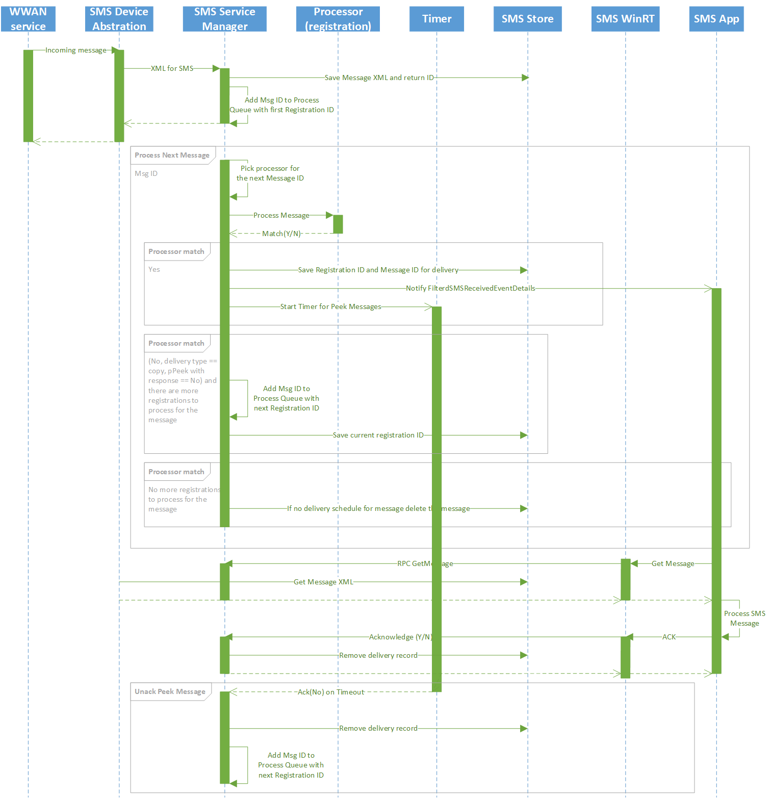

# MB SMS Operations


This topic describes the operations to configure, read/receive, send, and delete messages using Short Message Service (SMS) capabilities of an MB device.

SMS support is mandatory. Miniport drivers must set the appropriate send and receive SMS capability flags that they support when processing [OID\_WWAN\_DEVICE\_CAPS](./oid-wwan-device-caps.md) query requests in the **WwanSmsCaps** member of the [**WWAN\_DEVICE\_CAPS**](/windows-hardware/drivers/ddi/wwan/ns-wwan-_wwan_device_caps) structure. If miniport drivers do not support SMS, they should specify WWAN\_SMS\_CAPS\_NONE and return WWAN\_STATUS\_SMS\_UNKNOWN\_ERROR for all SMS-related OIDs.

Miniport drivers should only process SMS operations after [OID\_WWAN\_READY\_INFO](./oid-wwan-ready-info.md) returns **WwanReadyStateInitialize** as the device ready-state. Miniport drivers should process some SMS operations, such as sending a SMS message, only after the device is registered on a provider network (though not necessarily data service registration).

The MB Service does not differentiate between different message stores available in the device. Therefore, miniport drivers must handle all message stores and project a single virtual message store accessed by means of a virtual index. For example, if the device has three message stores, the miniport driver must handle all of them collectively and present them as a single message store to the service.

The MB driver model supports the following SMS Operations:

-   SMS configuration

-   Read SMS

-   Send SMS

-   Delete SMS

We recommend miniport drivers support SMS configuration, read, send, and delete operations, as well as notifying the user of any new SMS message received by a device.

For more information about SMS operations, see [OID\_WWAN\_SMS\_CONFIGURATION](./oid-wwan-sms-configuration.md), [OID\_WWAN\_SMS\_READ](./oid-wwan-sms-read.md), [OID\_WWAN\_SMS\_SEND](./oid-wwan-sms-send.md), [OID\_WWAN\_SMS\_DELETE](./oid-wwan-sms-delete.md), and [OID\_WWAN\_SMS\_STATUS](./oid-wwan-sms-status.md).

### Relevant Services and Drivers

*SmsRouterSvc.dll* - The service that interacts with WwanSvc to handle sending and receiving images

*MbSmsApi.dll* - Implementation of WinRT SMS API

*UT_SmsRouter.dll* - Is onboarded to Real Device Testing


## SMS Architecture/Flows

### SMS Block Diagram


### SMS App Registration


### Send SMS


### API Receive Message


### App Lifecycle


### Service Lifecycle


## Testing

### Automated SMS Tests

The following tests are automated and onboarded to the RI-TP. They are run daily and should pass 100%.

* MobilebroadbandExperience\SmsApi

* MobilebroadbandExperience\SMSCDMA

* MobilebroadbandExperience\SMSDecodingTests

* MobilebroadbandExperience\SMSEncodingTests

* WWAN\SMS\Service\UnitTests

*SmsApi* Tests have different versions that run on desktop and onecoreuap. Desktop still uses *vnelib.dll* (C++  version) because the CDMA part of SMS is not ported to *vnelibrary.dll* (C# version). Therefore you will find two versions of functional test lists.

## Hardware Lab Kit (HLK) Tests

These are all the currently available HLK tests related to MB-SMS:

* TestSms
    - [CDMA](/windows-hardware/test/hlk/testref/d089c8f6-8973-4cd0-8931-cdc851dd1ee3), [GSM](/windows-hardware/test/hlk/testref/0045e280-e26a-44fe-88ec-98c6975a713b)

* TestSmsStoreFull
    - [CDMA](/windows-hardware/test/hlk/testref/fe377fdd-5fd6-40c4-a032-37f5d14a4c37), [GSM](/windows-hardware/test/hlk/testref/836c93b2-d6f4-4b23-b4af-d14d01547f08)

* TestWake
    - CDMA: [IncomingDataPacket](/windows-hardware/test/hlk/testref/eab2386a-1936-48d9-bdc2-3c89d5372fc5), [RegisterStateChange](/windows-hardware/test/hlk/testref/d10ef539-a40f-4496-8183-c4d57c7eaf40)
    - GSM: [IncomingDataPacket](/windows-hardware/test/hlk/testref/dab51ae1-91fc-4ce8-87e7-954a9128fce7), [RegisterStateChange](/windows-hardware/test/hlk/testref/0f3f0b8f-356c-4434-ab35-3208e6e1631f) 

* TestSimBad
    - [GSM](/windows-hardware/test/hlk/testref/2be175c8-69a0-45a8-ad8a-01efa2cb393c)

* TestDeviceCapsEx
    - [CDMA](/windows-hardware/test/hlk/testref/e4ec5199-0841-4864-ac17-b6b71f81cdf3)
    - [GSM](/windows-hardware/test/hlk/testref/75c812d5-8c7d-4589-8336-7d72f2feb987)

* TestSIMNotInserted
    - [GSM](/windows-hardware/test/hlk/testref/92b164f7-c0e6-4231-99e7-e51070c4bdf6)

### Running Tests 

Via netsh, you can run the test lists and HLK tests. For more information on using the netsh tool see [**netsh mbn**](/windows-server/networking/technologies/netsh/netsh-mbn)  and [**netsh mbn test installation**](mb-netsh-mbn-test.md).

```
netsh mbn test feature=sms testpath="C:\data\test\bin" taefpath="C:\data\test\bin" param="AccessString=internet"
```

Logs can be collected and decoded using these instructions: [MB Collecting Logs](mb-collecting-logs.md).

## Special Messages

### Operator Messages

Operators can provision devices to handle particular messages earlier. This is no longer available, but the feature has not been completely removed yet. The code ProvisioningEngine processes the Operator Notifications. For more information see [Operator Notifications](../mobilebroadband/enabling-mobile-operator-notifications-and-system-events.md) and 
[Operator Events](../mobilebroadband/mobile-operator-notification-event-technical-details.md).

### Broadcast Messages

For more information on emergency alerts through SMS see [SmsBroadcastMessage](/uwp/api/windows.devices.sms.smsbroadcastmessage) and [SmsBroadcastType](/uwp/api/windows.devices.sms.smsbroadcasttype).


## UWP Capabilities for SMS

### Legacy SMS API
There are two legacy SMS APIs, *sms* and *smsSend*.

### Latest SMS API

* *cellularMessaging*

For more information see [UWP SMS](/uwp/api/Windows.Devices.Sms).

## Other Relevant Links

* [Developing SMS apps](../mobilebroadband/developing-sms-apps.md)