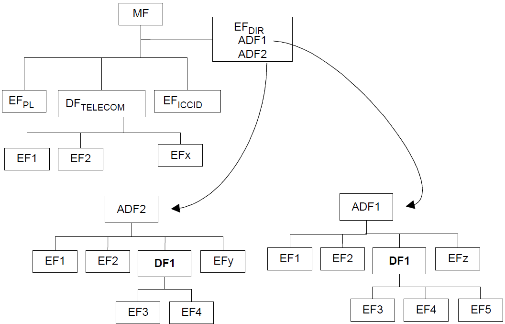

# MB UICC application and file system access

## Overview

This topic specifies an extension to the Mobile Broadband Interface Model (MBIM) interface to permit accessing UICC smart card application and file systems. This extension to MBIM exposes logical access to the UICC's [ETSI TS 102 221 technical specification](https://go.microsoft.com/fwlink/p/?linkid=864594)-compliant applications and filesystems, and is supported in Windows 10, version 1903 and later.

## UICC access and security

The UICC provides a file system and supports a set of applications that can run concurrently. These include the USIM for UMTS, CSIM for CDMA, and ISIM for IMS. The SIM is a legacy portion of the UICC that can be modeled as one of these applications (for GSM).

The following diagram from Section 8.1 of the [ETSI TS 102 221 technical specification](https://go.microsoft.com/fwlink/p/?linkid=864594) shows an example card application structure.

The UICC file system can be regarded as a forest of directory trees. The legacy SIM tree is rooted at a Master File (MF) and contains up to two levels of subdirectories (Dedicated Files, or DFs) containing Elemental Files (EFs) that hold various types of information. The SIM defines DFs under the MF, one of which, DFTelecom, contains information common to multiple access types such as the common phone book. Additional applications are effectively implemented as separate trees, each rooted in its own Application Directory File (ADF). Each ADF is identified by an application identifier that can be up to 128 bits long. A file under the card root (EFDir under the MF in the diagram) contains the application names and corresponding identifiers. Within a tree (the MF or an ADF), DFs and EFs might be identified by a path of file IDs, where a file ID is a 16-bit integer.

## NDIS interface extensions

The following OIDs have been defined to support UICC application and file system access.

- [OID_WWAN_UICC_APP_LIST](oid-wwan-uicc-app-list.md)
- [OID_WWAN_UICC_FILE_STATUS](oid-wwan-uicc-file-status.md)
- [OID_WWAN_UICC_ACCESS_BINARY](oid-wwan-uicc-access-binary.md)
- [OID_WWAN_UICC_ACCESS_RECORD](oid-wwan-uicc-access-record.md)
- [OID_WWAN_PIN_EX2](oid-wwan-pin-ex2.md)

## MBIM service and CID values

| Service name | UUID | UUID value |
| --- | --- | --- |
| Microsoft Low-Level UICC Access | UUID_MS_UICC_LOW_LEVEL | C2F6588E-F037-4BC9-8665-F4D44BD09367 |
| Microsoft Basic IP Connectivity Extensions | UUID_BASIC_CONNECT_EXTENSIONS | 3D01DCC5-FEF5-4D05-9D3A-BEF7058E9AAF |

The following table specifies the UUID and command code for each CID, as well as whether the CID supports Set, Query, or Event (notification) requests. See each CID’s individual Section within this topic for more info about its parameters, data structures, and notifications. 

| CID | UUID | Command code | Set | Query | Notify |
| --- | --- | --- | --- | --- | --- |
| MBIM_CID_MS_UICC_APP_LIST | UUID_MS_UICC_LOW_LEVEL | 7 | N | Y | N |
| MBIM_CID_MS_UICC_FILE_STATUS | UUID_MS_UICC_LOW_LEVEL | 8 | N | Y | N |
| MBIM_CID_MS_UICC_ACCESS_BINARY | UUID_MS_UICC_LOW_LEVEL | 9 | Y | Y | N |
| MBIM_CID_MS_UICC_ACCESS_RECORD | UUID_MS_UICC_LOW_LEVEL | 10 | Y | Y | N |
| MBIM_CID_MS_PIN_EX | UUID_BASIC_CONNECT_EXTENSIONS | 14 | Y | Y | N |

## MBIM_CID_MS_UICC_APP_LIST

This CID retrieves a list of applications in a UICC and information about them. When the UICC in the modem is fully initialized and ready to register with the mobile operator, a UICC application must be selected for registration and a query with this CID should return the selected application in the **ActiveAppIndex** field in the MBIM_UICC_APP_LIST structure used in response.

### Parameters

| Operation | Set | Query | Notification |
| --- | --- | --- | --- |
| Command | Not applicable | Empty | Not applicable |
| Response | Not applicable | MBIM_UICC_APP_LIST | Not applicable |

### Query

The InformationBuffer of MBIM_COMMAND_MSG is empty.

### Set

Not applicable.

### Response

The InformationBuffer in MBIM_COMMAND_DONE contains the following MBIM_UICC_APP_LIST structure.

#### MBIM_UICC_APP_LIST (version 1)

| Offset | Size | Field | Type | Description |
| --- | --- | --- | --- | --- |
| 0 | 4 | Version | UINT32 | The version number of the structure that follows. This field must be set to **1** for version 1 of this structure. |
| 4 | 4 | AppCount | UINT32 | The number of UICC application **MBIM_UICC_APP_INFO** structures being returned in this response. |
| 8 | 4 | ActiveAppIndex | UINT32(0..NumApp - 1) | The index of the application selected by the modem for registration with the mobile network. This field must be between **0** and the **AppCount - 1**. It indexes to the array of applications returned by this response. If no application is selected for registration, this field contains **0xFFFFFFFF**. |
| 12 | 4 | AppListSize | UINT32 | The size of the app list data, in bytes. |
|  | 8\*AppCount | AppList | OL_PAIR_LIST | First element of the pair is a 4-byte field with the Offset of an app info in the DataBuffer. Second element of the pair is a 4-byte field with the size of the app info. |
|  | AppListSize | DataBuffer | DATABUFFER | An array of **AppCount** * **MBIM_UICC_APP_INFO** structures. |

#### MBIM_UICC_APP_INFO

| Offset | Size | Field | Type | Description |
| --- | --- | --- | --- | --- |
| 0 | 4 | AppType | MBIM_UICC_APP_TYPE | The type of the UICC application. |
| 4 |	4	| AppIdOffset | OFFSET | Offset for the application ID in the databuffer. Only the first AppIdSize bytes are meaningful. If the application ID is longer than MBIM_MAXLENGTH_APPID bytes, then AppIdSize specifies the actual length but only the first MBIM_MAXLENGTH_APPID bytes are in this field. This field is valid only when AppType is not MBIMUiccAppTypeMf, MBIMUiccAppTypeMfSIM, or MBIMUiccAppTypeMfRUIM. |
| 8 |	4	| AppIdSize | SIZE (0..16) | The size of the application ID, in bytes, as defined in Section 8.3 of the ETSI TS 102 221 technical specification. This field is set to zero for the MBIMUiccAppTypeMf, MBIMUiccAppTypeMfSIM, or MBIMUiccAppTypeMfRUIM app types. |
| 12 |  | AppNameOffset | OFFSET | Offset for the application name in the databuffer. A UTF-8 string specifying the name of the application. The length of this field is specified by AppNameLength. If the length is greater than or equal to MBIM_MAXLENGTH_APPNAME bytes, this field contains the first MBIM_MAXLENGTH_APPNAME - 1 bytes of the name. The string is always null-terminated. |
| 16 | 4 | AppNameLength | SIZE (0..256) | The length, in characters, of the application name. |
| 20 | 4 | NumPinKeyRefs | SIZE (0..8) | The number of application PIN key references. In other words, the number of elements of PinKeyRef that are valid. Applications on a virtual R-UIM have no PIN key references. |
| 24 | 4 | KeyRefOffset | OFFSET | Offset of the PinKeyRef in the DataBuffer. The PinKeyRef is a byte array specifying the application’s PIN key references for different levels of verification (keys for PIN1, PIN2, and possibly a universal PIN), as defined in Table 9.3 and Section 9.4.2 of the ETSI TS 102 221 technical specification. In the case of a single-verification card, or an MBB driver and/or modem that does not support different application keys for different applications, the first byte of the PinKeyRef field must be 0x01 (PIN1) and the second byte must be 0x81 (PIN2), as described in Section 9.5.1 of ETSI TS 102 221. |
| 28 | 4 | KeyRefSize | SIZE (0..8) | The size of PinKeyRef. |
| 32 |  | DataBuffer | DATABUFFER | The data buffer containing AppId, AppName, and PinKeyRef.of a single-verification card, or an MBB driver and/or modem that does not support different application keys for different applications, this field must be **0x01**. |

#### MBIM_UICC_APP_TYPE

| Type | Value | Description |
| --- | --- | --- |
| MBIMUiccAppTypeUnknown | 0 | Unknown type. |
| MBIMUiccAppTypeMf | 1 | Legacy SIM directories rooted at the MF. |
| MBIMUiccAppTypeMfSIM | 2 | Legacy SIM directories rooted at the DF_GSM. |
| MBIMUiccAppTypeMfRUIM | 3 | Legacy SIM directories rooted at the DF_CDMA. |
| MBIMUiccAppTypeUSIM | 4 | USIM application. |
| MBIMUiccAppTypeCSIM | 5 | CSIM applicaton. |
| MBIMUiccAppTypeISIM | 6 | ISIM application. |

#### Constants

The following constants are defined for MBIM_CID_MS_UICC_APP_INFO.

`const int MBIM_MAXLENGTH_APPID = 32`  
`const int MBIM_MAXLENGTH_APPNAME = 256`  
`const int MBIM_MAXNUM_PINREF = 8`  

### Unsolicited Events

Not applicable.

### Status Codes

The following status codes are applicable:

| Status code | Description |
| --- | --- |
| MBIM_STATUS_SUCCESS | Basic MBIM status as defined for all commands. |
| MBIM_STATUS_BUSY | Basic MBIM status as defined for all commands. |
| MBIM_STATUS_FAILURE | Basic MBIM status as defined for all commands. |
| MBIM_STATUS_NO_DEVICE_SUPPORT | Basic MBIM status as defined for all commands. |
| MBIM_STATUS_SIM_NOT_INSERTED | Unable to perform the UICC operation because the UICC is missing. |
| MBIM_STATUS_BAD_SIM | Unable to perform the UICC operation because the UICC is in an error state. |
| MBIM_STATUS_NOT_INITIALIZED | Unable to perform the UICC operation because the UICC is not yet fully initialized. |

## MBIM_CID_MS_UICC_FILE_STATUS

This CID retrieves information about a specified UICC file.

### Parameters

| Operation | Set | Query | Notification |
| --- | --- | --- | --- |
| Command | Not applicable | MBIM_UICC_FILE_PATH | Not applicable |
| Response | Not applicable | MBIM_UICC_FILE_STATUS | Not applicable |

### Query

The InformationBuffer of MBIM_COMMAND_MSG contains the target EF as an MBIM_UICC_FILE_PATH structure.

#### MBIM_UICC_FILE_PATH (version 1)

| Offset | Size | Field | Type | Description |
| --- | --- | --- | --- | --- |
| 0 | 4 | Version | UINT32 | The version number of the structure that follows. This field must be **1** for version 1 of this structure. |
| 4 | 4 | AppIdOffset | OFFSET | The offset, in bytes, calculated from the beginning of this structure to the buffer containing the application ID. |
| 8 | 4 | AppIdSize | SIZE (0..16) | The size of the application ID, in bytes, as defined in Section 8.3 of the [ETSI TS 102 221 technical specification](https://go.microsoft.com/fwlink/p/?linkid=864594). For 2G cards, this field must be set to zero (0). |
| 12 | 4 | FilePathOffset | OFFSET | The offset, in bytes, calculated from the beginning of this structure to the buffer containing the file path. The file path is an array of 16-bit file IDs. The first ID must be either **0x7FFF** or **0x3F00**. If the first ID is **0x7FFF**, then the path is relative to the ADF of the application desginated by **AppId**. Otherwise, it is an absolute path starting from the MF. |
| 16 | 4 | FilePathSize | SIZE (0..8) | The size of the file path, in bytes. |
| 20 |   | DataBuffer | DATABUFFER | The data buffer containing AppId and FilePath. |

### Set

Not applicable.

### Response

The following MBIM_UICC_FILE_STATUS structure is used in the InformationBuffer.

#### MBIM_UICC_FILE_STATUS (version 1)

| Offset | Size | Field | Type | Description |
| --- | --- | --- | --- | --- |
| 0 | 4 | Version | UINT32 | The version number of the structure that follows. This field must be **1** for version 1 of this structure. |
| 4 | 4 | StatusWord1 | UINT32(0..256) | A return parameter specific to the UICC command. |
| 8 | 4 | StatusWord2 | UINT32(0..256) | A return parameter specific to the UICC command. |
| 12 | 4 | FileAccessibility | MBIM_UICC_FILE_ACCESSIBILITY | The UICC file accessibility. |
| 16 | 4 | FileType | MBIM_UICC_FILE_TYPE | The UICC file type. |
| 20 | 4 | FileStructure | MBIM_UICC_FILE_STRUCTURE | The UICC file structure. |
| 24 | 4 | ItemCount | UINT32 | The number of items in the UICC file. For transparent and TLV files, this is set to **1**. |
| 28 | 4 | Size | UINT32 | The size of each item, in bytes. For transparent or TLV files, this is the size of the entire EF. For record-based files, this represents the total number of records. |
| 32 | 16 | FileLockStatus | MBIM_PIN_TYPE_EX\[4\] | An array of type MBIM_PIN_TYPE_EX that describes the access condition for each operation (READ, UPDATE, ACTIVATE, and DEACTIVATE in that order) on that file. |

#### MBIM_UICC_FILE_ACCESSIBILITY

The MBIM_UICC_FILE_ACCESSIBILITY enumeration is used in the preceding MBIM_UICC_FILE_STATUS structure.

| Type | Value | Description |
| --- | --- | --- |
| MBIMUiccFileAccessibilityUnknown | 0 | File shareability unknown. |
| MBIMUiccFileAccessibilityNotShareable | 1 | Not shareable file. |
| MBIMUiccFileAccessibilityShareable | 2 | Shareable file. |

#### MBIM_UICC_FILE_TYPE

The MBIM_UICC_FILE_TYPE enumeration is used in the preceding MBIM_UICC_FILE_STATUS structure.

| Type | Value | Description |
| --- | --- | --- |
| MBIMUiccFileTypeUnknown | 0 | File type unknown. |
| MBIMUiccFileTypeWorkingEf | 1 | Working EF. |
| MBIMUiccFileTypeInternalEf | 2 | Internal EF. |
| MBIMUiccFileTypeDfOrAdf | 3 | Dedicated file, a directory that is the parent of other nodes. This may be a DF or ADF. |

#### MBIM_UICC_FILE_STRUCTURE

The MBIM_UICC_FILE_STRUCTURE enumeration is used in the preceding MBIM_UICC_FILE_STATUS structure.

| Type | Value | Description |
| --- | --- | --- |
| MBIMUiccFileStructureUnknown | 0 | An unknown file structure. |
| MBIMUiccFileStructureTransparent | 1 | A single record of variable length. |
| MBIMUiccFileStructureCyclic | 2 | A cyclic set of records, each of the same length. |
| MBIMUiccFileStructureLinear | 3 | A linear set of records, each of the same length. |
| MBIMUiccFileStructureBerTLV | 4 | A set of data values accessible by tag. |

#### MBIM_PIN_TYPE_EX

The MBIM_PIN_TYPE_EX enumeration is used in the preceding MBIM_UICC_FILE_STATUS structure.

| Type | Value | Description |
| --- | --- | --- |
| MBIMPinTypeNone | 0 | No PIN is pending to be entered. |
| MBIMPinTypeCustom | 1 | The PIN type is a custom type and is none of the other PIN types listed in this enumeration. |
| MBIMPinTypePin1 | 2 | The PIN1 key. |
| MBIMPinTypePin2 | 3 | The PIN2 key. |
| MBIMPinTypeDeviceSimPin | 4 | The device to SIM key. |
| MBIMPinTypeDeviceFirstSimPin | 5 | The device to very first SIM key. |
| MBIMPinTypeNetworkPin | 6 | The network personalization key. |
| MBIMPinTypeNetworkSubsetPin | 7 | The network subset personalization key. |
| MBIMPinTypeServiceProviderPin | 8 | The service provider (SP) personalization key. |
| MBIMPinTypeCorporatePin | 9 | The corporate personalization key. |
| MBIMPinTypeSubsidyLock | 10 | The subsidy unlock key. | 
| MBIMPinTypePuk1 | 11 | The Personal Identification Number 1 Unlock Key (PUK1). |
| MBIMPinTypePuk2 | 12 | The Personal Identification Number 2 Unlock Key (PUK2). |
| MBIMPinTypeDeviceFirstSimPuk | 13 | The device to very first SIM PIN unlock key. |
| MBIMPinTypeNetworkPuk | 14 | The network personalization unlock key. |
| MBIMPinTypeNetworkSubsetPuk | 15 | The network subset personalization unlock key. |
| MBIMPinTypeServiceProviderPuk | 16 | The service provider (SP) personalization unlock key. |
| MBIMPinTypeCorporatePuk | 17 | The corporate personalization unlock key. |
| MBIMPinTypeNev | 18 | The NEV key. |
| MBIMPinTypeAdm | 19 | The administrative key. |

### Unsolicited Events

Not applicable.

### Status Codes

The following status codes are applicable:

| Status code | Description |
| --- | --- |
| MBIM_STATUS_BUSY | Basic MBIM status as defined for all commands. |
| MBIM_STATUS_FAILURE | Basic MBIM status as defined for all commands. |
| MBIM_STATUS_SIM_NOT_INSERTED | Unable to perform the UICC operation because the UICC is missing. |
| MBIM_STATUS_BAD_SIM | Unable to perform the UICC operation because the UICC is in an error state. |
| MBIM_STATUS_SHAREABILITY_CONDITION_ERROR | The file cannot be selected because it is not shareable and is currently being accessed by another application. The status word returned by the SIM is 6985. |

## MBIM_CID_MS_UICC_ACCESS_BINARY

This CID sends a specific command to access a UICC binary file, with structure type **MBIMUiccFileStructureTransparent** or **MBIMUiccFileStructureBerTLV**.

### Parameters

| Operation | Set | Query | Notification |
| --- | --- | --- | --- |
| Command | Not applicable | MBIM_UICC_ACCESS_BINARY | Not applicable |
| Response | Not applicable | MBIM_UICC_RESPONSE | Not applicable |

### Query

Reads a binary file. The InformationBuffer for MBIM_COMMAND_MSG contains an MBIM_UICC_ACCESS_BINARY structure. An MBIM_UICC_RESPONSE structure is returned in the InformationBuffer of MBIM_COMMAND_DONE.

#### MBIM_UICC_ACCESS_BINARY (version 1)

| Offset | Size | Field | Type | Description |
| --- | --- | --- | --- | --- |
| 0 | 4 | Version | UINT32 | The version number of the structure that follows. This field must be set to **1** for version 1 of this structure. |
| 4 | 4 | AppIdOffset | OFFSET | The offset, in bytes, from the beginning of this structure to the buffer containing the application ID. |
| 8 | 4 | AppIdSize | SIZE (0..16) | The size of the application ID, in bytes, as defined in Section 8.3 of the [ETSI TS 102 221 technical specification](https://go.microsoft.com/fwlink/p/?linkid=864594). For 2G cards, this field must be set to zero (0). |
| 12 | 4 | FilePathOffset | OFFSET | The offset, in bytes, calculated from the beginning of this structure to the buffer containing the file path. The file path is an array of 16-bit file IDs. The first ID must be either **0x7FFF** or **0x3F00**. If the first ID is **0x7FFF**, then the path is relative to the ADF of the application desginated by **AppId**. Otherwise, it is an absolute path starting from the MF. |
| 16 | 4 | FilePathSize | SIZE | The size of the file path, in bytes. |
| 20 | 4 | FileOffset | UINT32 | The offset to be used when reading from the file. This field can be bigger than 256, and it combines both offset high and offset low as defined in the [ETSI TS 102 221 technical specification](https://go.microsoft.com/fwlink/p/?linkid=864594). |
| 24 | 4 | NumberOfBytes | UINT32 | The number of bytes to be read. For example, a client driver could use this function to read a transparent (binary) file that is larger than 256 bytes, although the maximum amount that can be read or written in a single UICC operation is 256 bytes per the [ETSI TS 102 221 technical specification](https://go.microsoft.com/fwlink/p/?linkid=864594). It is the function's responsibility to split this into multiple APDUs and send back the result in a single response. |
| 28 | 4 | LocalPinOffset | OFFSET | The offset, in bytes, calculated from the beginning of this structure to the buffer containing the password. This is the local PIN (PIN2) and is used in case the operation requires local PIN validation. |
| 32 | 4 | LocalPinSize | SIZE (0..16) | The size of the password, in bytes. |
| 36 | 4 | BinaryDataOffset | OFFSET | The offset, in bytes, calculated from the beginning of this structure to the buffer containing the command-specific data. Binary data is only used for SET operations. |
| 40 | 4 | BinaryDataSize | SIZE (0..32768) | The size of the data, in bytes. |
| 44 |   | DataBuffer | DATABUFFER | The data buffer containing AppId, FilePath, LocalPin, and BinaryData. |

### Set

Not applicable.

### Response

The following MBIM_UICC_RESPONSE structure is used in the InformationBuffer.

#### MBIM_UICC_RESPONSE (version 1)

| Offset | Size | Field | Type | Description |
| --- | --- | --- | --- | --- |
| 0 | 4 | Version | UINT32 | The version number of the structurethat follows. This field must be **1** for version 1 of this structure. |
| 4 | 4 | StatusWord1 | UINT32(0..256) | A return parameter specific to the UICC command. |
| 8 | 4 | StatusWord2 | UINT32(0..256) | A return parameter specific to the UICC command. |
| 12 | 4 | ResponseDataOffset | OFFSET | The offset, in bytes, calculated from the beginning of this structure to the buffer containing the response data. The response data is only used for QUERY operations. |
| 16 | 4 | ResponseDataSize | SIZE (0..32768) | The size of the data, in bytes. |
| 20 |   | DataBuffer | DATABUFFER | The data buffer containing ResponseData. |

### Unsolicited Events

Not applicable.

### Status Codes

The following status codes are applicable:

| Status code | Description |
| --- | --- |
| MBIM_STATUS_BUSY | Basic MBIM status as defined for all commands. |
| MBIM_STATUS_FAILURE | Basic MBIM status as defined for all commands. |
| MBIM_STATUS_SIM_NOT_INSERTED | Unable to perform the UICC operation because the UICC is missing. |
| MBIM_STATUS_BAD_SIM | Unable to perform the UICC operation because the UICC is in an error state. |
| MBIM_STATUS_SHAREABILITY_CONDITION_ERROR | The file cannot be selected because it is not shareable and is currently being accessed by another application. The status word returned by the SIM is 6985. |
| MBIM_STATUS_PIN_FAILURE | The operation failed due to a PIN error. |

## MBIM_CID_MS_UICC_ACCESS_RECORD

This CID sends a specific command to access a UICC linear fixed or cyclic file, with structure type of **MBIMUiccFileStructureCyclic** or **MBIMUIccFileStructureLinear**.

### Parameters

| Operation | Set | Query | Notification |
| --- | --- | --- | --- |
| Command | Not applicable | MBIM_UICC_ACCESS_RECORD | Not applicable |
| Response | Not applicable | MBIM_UICC_RESPONSE | Not applicable |

### Query

Reads contents of a record. The InformationBuffer for MBIM_COMMAND_MSG contains the following MBIM_UICC_ACCESS_RECORD structure. MBIM_UICC_RESPONSE is returned in the InformationBuffer of MBIM_COMMAND_DONE.

#### MBIM_UICC_ACCESS_RECORD (version 1)

| Offset | Size | Field | Type | Description |
| --- | --- | --- | --- | --- |
| 0 | 4 | Version | UINT32 | The version number of the structure that follows. This field must be set to **1** for version 1 of this structure. |
| 4 | 4 | AppIdOffset | OFFSET | The offset, in bytes, from the beginning of this structure to the buffer containing the application ID. |
| 8 | 4 | AppIdSize | SIZE (0..16) | The size of the application ID, in bytes, as defined in Section 8.3 of the [ETSI TS 102 221 technical specification](https://go.microsoft.com/fwlink/p/?linkid=864594). For 2G cards, this field must be set to zero (0). |
| 12 | 4 | FilePathOffset | OFFSET | The offset, in bytes, calculated from the beginning of this structure to the buffer containing the file path. The file path is an array of 16-bit file IDs. The first ID must be either **0x7FFF** or **0x3F00**. If the first ID is **0x7FFF**, then the path is relative to the ADF of the application desginated by **AppId**. Otherwise, it is an absolute path starting from the MF. |
| 16 | 4 | FilePathSize | SIZE | The size of the file path, in bytes. |
| 20 | 4 | RecordNumber | UINT32(0..256) | The record number. This represents the absolute record index at all times. Relative record access is not supported because the modem can perform multiple accesses on a file (NEXT, PREVIOUS). |
| 24 | 4 | LocalPinOffset | OFFSET | The offset, in bytes, calculated from the beginning of this structure to the buffer containing the password. The lock password is a null-terminated UTF-8 string of decimal digits. | 
| 28 | 4 | LocalPinSize | SIZE (0..16) | The size of the password, in bytes. |
| 32 | 4 | RecordDataOffset | OFFSET | The offset, in bytes, calculated from the beginning of this structure to the buffer containing the command-specific data. Record data is only used for SET operations. |
| 36 | 4 | RecordDataSize | SIZE (0..256) | The size of the data, in bytes. |
| 40 |   | DataBuffer | DATABUFFER | The data buffer containing AppId, FilePath, LocalPin, and RecordData. |

### Set

Not applicable.

### Response

An MBIM_UICC_RESPONSE structure is used in the InformationBuffer.

### Unsolicited Events

Not applicable.

### Status Codes

The following status codes are applicable:

| Status code | Description |
| --- | --- |
| MBIM_STATUS_BUSY | Basic MBIM status as defined for all commands. |
| MBIM_STATUS_FAILURE | Basic MBIM status as defined for all commands. |
| MBIM_STATUS_SIM_NOT_INSERTED | Unable to perform the UICC operation because the UICC is missing. |
| MBIM_STATUS_BAD_SIM | Unable to perform the UICC operation because the UICC is in an error state. |
| MBIM_STATUS_SHAREABILITY_CONDITION_ERROR | The file cannot be selected because it is not shareable and is currently being accessed by another application. The status word returned by the SIM is 6985. |
| MBIM_STATUS_PIN_FAILURE | The operation failed due to a PIN error. |

## MBIM_CID_MS_PIN_EX

This CID is used to perform all PIN security operations as defined in Section 9 of the [ETSI TS 102 221 technical specification](https://go.microsoft.com/fwlink/p/?linkid=864594). The CID is similar to MBIM_CID_MS_PIN, but extends it to support multi-app UICC cards. Only single-verification-capable UICCs are supported. Multi-verification-capable UICCs that support more than one application PIN are not supported. One application PIN (PIN1) is assigned to all ADFs/DFs and files on the UICC. However, each application can specify a local PIN (PIN2) as a level 2 user verification requirement, resulting in the need for additional validation for every access command. This scenario is what MBIM_CID_MS_PIN_EX supports.

Just like MBIM_CID_MS_PIN, with MBIM_CID_MS_PIN_EX the device only reports one PIN at a time. If multiple PINs are enabled and reporting multiple PINs is also enabled, then functions must report PIN1 first. For example, if subsidy lock reporting is enabled and the SIM's PIN1 is enabled, then the subsidy lock PIN should be reported in a subsequent query request only after PIN1 has been successfully verified. An empty PIN is permitted together with MBIMPinOperationEnter. An empty PIN is specified by setting the PinSize to zero. In this case, a SET command is similar to a QUERY and returns the state of the PIN referenced. This is fully aligned to the behavior of the VERIFY command as specified in Section 11.1.9 of the [ETSI TS 102 221 technical specification](https://go.microsoft.com/fwlink/p/?linkid=864594).

### Parameters

| Operation | Set | Query | Notification |
| --- | --- | --- | --- |
| Command | MBIM_SET_PIN_EX | MBIM_PIN_APP | Not applicable |
| Response | MBIM_PIN_INFO_EX | MBIM_PIN_INFO_EX | Not applicable |

### Query

The following MBIM_PIN_APP structure is used in the InformationBuffer.

#### MBIM_PIN_APP (version 1)

| Offset | Size | Field | Type | Description |
| --- | --- | --- | --- | --- |
| 0 | 4 | Version | UINT32 | The version number of the structure that follows. This field must be set to **1** for version 1 of this structure. |
| 4 | 4 | AppIdOffset | OFFSET | The offset, in bytes, from the beginning of this structure to the buffer containing the application ID. |
| 8 | 4 | AppIdSize | SIZE (0..16) | The size of the application ID, in bytes, as defined in Section 8.3 of the [ETSI TS 102 221 technical specification](https://go.microsoft.com/fwlink/p/?linkid=864594). For 2G cards, this field must be set to zero (0). |
| 12 |   | DataBuffer | DATABUFFER | The AppId as defined in the [ETSI TS 102 221 technical specification](https://go.microsoft.com/fwlink/p/?linkid=864594). |

### Set

The following MBIM_SET_PIN_EX structure is used in the InformationBuffer.

#### MBIM_SET_PIN_EX

| Offset | Size | Field | Type | Description |
| --- | --- | --- | --- | --- |
| 0 | 4 | PinType | MBIM_PIN_TYPE_EX | The PIN type. See the MBIM_PIN_TYPE_EX table in this topic. |
| 4 | 4 | PinOperation | MBIM_PIN_OPERATION | The PIN operation. See MBIM 1.0. |
| 8 | 4 | PinOffset | OFFSET | The offset, in bytes, calculated from the beginning of this structure to a string PIN that represents the PIN value with which to perform the action, or the PIN value required to enable or disable PIN settings. This field applies for all values of **PinOperation**. |
| 12 | 4 | PinSize | SIZE (0..32) | The size, in bytes, used for the PIN. |
| 16 | 4 | NewPinOffset | OFFSET | The offset, in bytes, calculated from the beginning of this structure to the **NewPin** string that represents the new PIN value to set when **PinOperation** is MBIMPinOperationChange or MBIMPinOperationEnter, for PinTypeMBIMPinTypePuk1 or PinTypeMBIMPinTypePuk2. |
| 20 | 4 | NewPinSize | SIZE (0..32) | The size, in bytes, used for the NewPin. |
| 24 | 4 | AppIdOffset | OFFSET | The offset, in bytes, calculated from the beginning of this structure to the buffer containing the application ID. |
| 28 | 4 | AppIdSize | SIZE (0..16) | The size of the application ID, in bytes, as defined in Section 8.3 of the [ETSI TS 102 221 technical specification](https://go.microsoft.com/fwlink/p/?linkid=864594). For 2G cards, this field must be set to zero (0). |
| 32 |   | DataBuffer | DATABUFFER | The data buffer containing the Pin, NewPin, and AppId. |

### Response

The following MBIM_PIN_INFO_EX structure is used in the InformationBuffer.

| Offset | Size | Field | Type | Description |
| --- | --- | --- | --- | --- |
| 0 | 4 | PinType | MBIM_PIN_TYPE_EX | The PIN type. See the MBIM_PIN_TYPE_EX table in this topic. |
| 4 | 4 | PinState | MBIM_PIN_STATE | The PIN state. See MBIM 1.0. |
| 8 | 4 | RemainingAttempts | UINT32 | The number of remaining attempts for any PIN-related operations such as enter, enable, or disable. Devices that do not support this information must set this member to 0xFFFFFFFF. |

### Unsolicited Events

Not applicable.

### Status Codes

The following status codes are applicable:

| Status code | Description |
| --- | --- |
| MBIM_STATUS_BUSY | Basic MBIM status as defined for all commands. |
| MBIM_STATUS_FAILURE | Basic MBIM status as defined for all commands. |
| MBIM_STATUS_SIM_NOT_INSERTED | Unable to perform the UICC operation because the UICC is missing. |
| MBIM_STATUS_BAD_SIM | Unable to perform the UICC operation because the UICC is in an error state. |
| MBIM_STATUS_PIN_DISABLED | The operation failed because the PIN is disabled. |
| MBIM_STATUS_PIN_REQUIRED | The operation failed because a PIN must be entered to proceed. |
| MBIM_STATUS_NO_DEVICE_SUPPORT | The operation failed because a SET on a corresponding PIN type is not supported by the device. |
