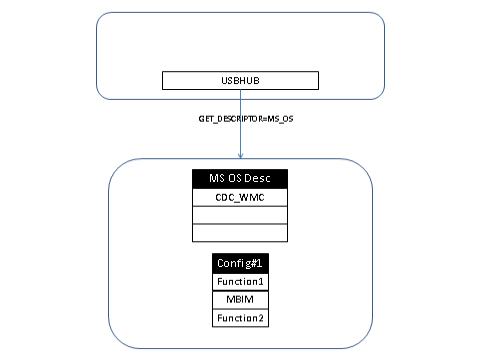
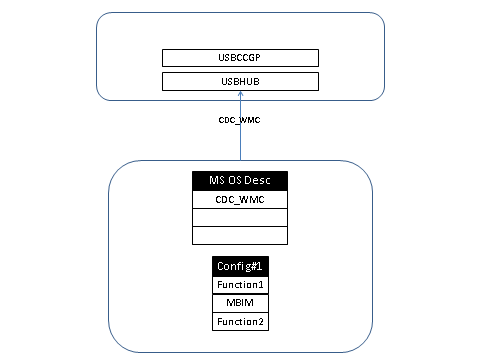
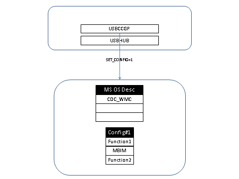
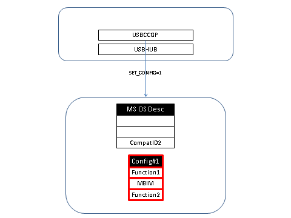
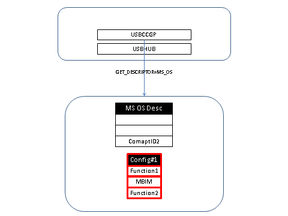
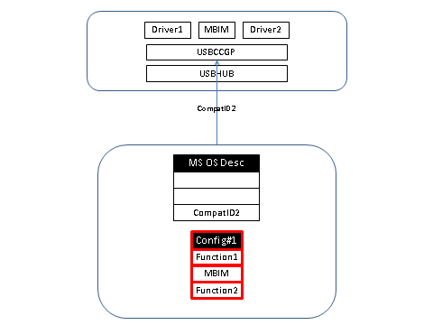

# MB Union Function Descriptors

## Union Function Descriptors

Mobile broadband devices that implement UFDs have Device Class / Subclass / Protocol of 2 / 0 / 0 as required for CDC devices. This prevents Windows from loading USBCCGP on the device. For information on how Windows loads USBCCGP on composite devices, see [USB Generic Parent Driver (Usbccgp.sys)](https://msdn.microsoft.com/library/windows/hardware/ff539234).

To allow Windows to load USBCCGP, the device needs to report a Microsoft OS compatible ID of "CDC\_WMC" when the device is not configured. After detecting the compatible ID of "CDC\_WMC", Windows loads USBCCGP, and USBCCGP sets the configuration on the device to 1. USBCCGP will then query again for the Microsoft OS compatible IDs. This time, however, the device should not report the Microsoft OS compatible ID of "CDC\_WMC". The device may report Microsoft OS compatible IDs for functions in the selected configuration.

USBHUB queries for the Microsoft OS descriptor when the device is not configured

The device responds with "CDC\_WMC", which causes Windows to load USBCCGP

USBCCGP selects Configuration \#1 on the device.

The device selects the configuration and morphs the list of compatible IDs. The device may include CompatID2, which is necessary for Function2.

After loading, USBCCGP queries for Microsoft OS compatible IDs again.

The device reports any compatible ID that it has for its function. USBCCGP then creates child device nodes for each function in the device.

## MBIM Backward-Compatible Functions

MBIM functions that are backward compatible with the NCM 1.0 specification will come up as NCM 1.0 functions by default. Mobile broadband devices that consist of an MBIM backward-compatible function should report a Microsoft OS compatible ID of "MBIM" for the MBIM function. This allows Windows 8 to detect the NCM 1.0 function as the MBIM function and load MBCD as the function driver.

 

 

