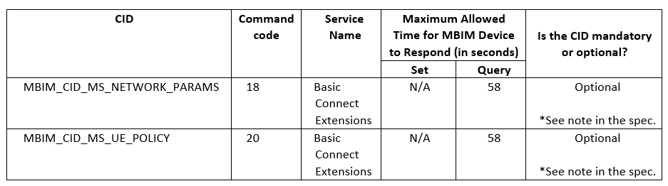

# MBIMEx 4.0 – 5G SA Phase 2 support

Windows 11 Insider Preview Build 22610 previews the 5G SA Phase 2 feature set. Additionally, it supports all Windows 11 cellular features such as 5G SA Phase 1. The 5G SA Phase 2 feature set includes support for end-to-end URSP handling and multiple concurrent eMBB network slices. 

MBIM Extensions Release number 4.0 introduces support for 5G SA Phase 2 features. This Extensions Release number is commonly referred to as MBIMEx 4.0. URSP handling/usage and multiple concurrent eMBB network slices are the main additions in MBIMEx 4.0. All valid slice types (SST) are supported at the MBIM interface level in MBIMEx 4.0, but non-eMBB slice functionality is not implied in the current release and is subject to additional host and device-level support and features. [Download the MBIMEx 4.0 specification here](https://download.microsoft.com/download/d/8/a/d8ad97b9-83bd-4ab2-bcea-7500dfaf22b4/MBIMEx%204.0%20spec%20and%20Errata%20to%20MBIMEx%203.0%20Rev%201.46%2020220426.docx). Section 4 “MBIM Interface Extensions for 5G NGC – Phase 2” contains the MBIMEx 4.0 specification.

MBIMEx 4.0 adds the following new CIDs:

MBIMEx 4.0 modifies the following existing CIDs:

By default, the Windows 11 Insider Preview Build 22610 release announces MBIMEx 3.0 as the highest supported MBIMEx version by the host. A special capability is available to change the default to MBIMEx 4.0 for IHVs and driver developers. Contact your TAM for support if a Microsoft engineering partner needs the capability for testing and development.