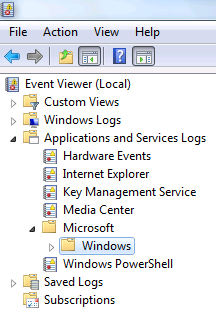
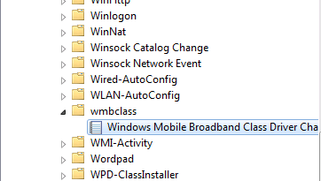
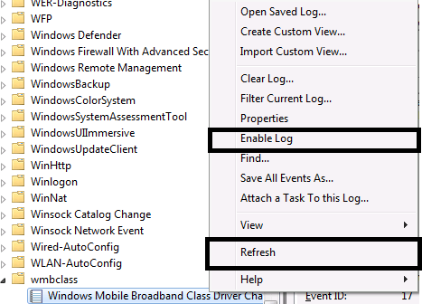
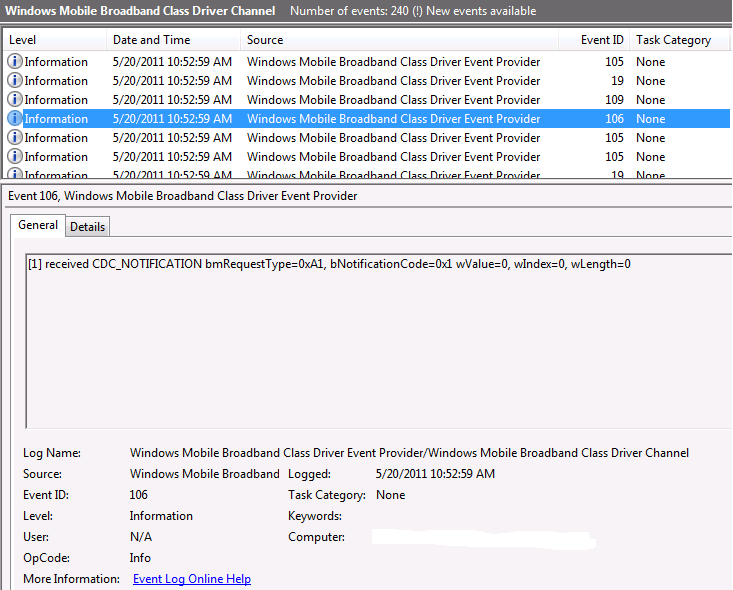
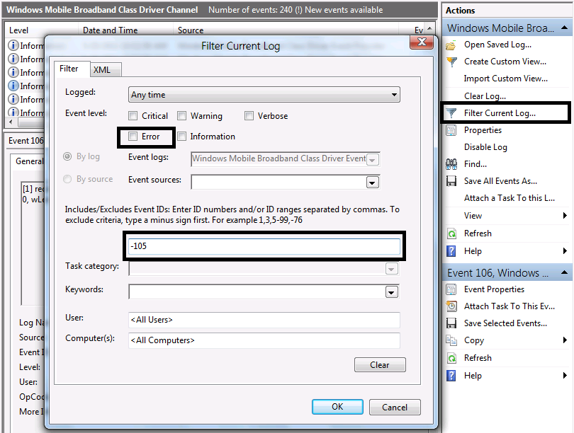

# Mobile Broadband Class Driver Logs: Event Trace Log Tracing

This topic provides information to help engineers work with the Mobile Broadband Class Driver event trace logs to review and troubleshoot issues.

The information in this topic applies to:

-   Windows 8

## ETL Tracing

The following procedure describes how to review Event Trace Logs (ETL):

1.  Open EventViewer by clicking **Start** &gt; **Run** &gt; **EventVwr**.
2.  In the left pane, navigate to **Applications and Services Logs** &gt; **Microsoft** &gt; **Windows**.

    

3.  Navigate further under **Windows** to **wmbclass.**

    

4.  Right-click **Windows Mobile Broadband Class Driver Channel** and click **Enable Log**. If you see **Disable Log**, the log is already enabled.

    

5.  Reproduce the issue and press **Refresh**. After **Refresh**, the logs appear in the central pane.

    

6.  You can filter the logs using the **Actions Pane** on the right.

    

## Mobile Broadband Logs

Depending on the issue and the scenario, different pieces of information are required in order to determine a solution, including the following:

**Control path**

If you are having issues with connecting, sending or receiving SMS, sending or receiving USSD messages, or using profiles, please collect the following information:

1.  **netsh trace start wwan\_dbg**
2.  Execute task(s) that leads to unexpected behavior of the system
3.  **netsh trace stop**
4.  Upload all files under `%localappdata%\temp\nettraces\`

**IP configuration**

If you are having problems with IP address configuration, please perform the following:

1.  1. **netsh trace start wwan\_dbg**
2.  2. &lt;Execute task(s) that leads to unexpected behavior of the system
3.  3.**netsh trace stop**
4.  4. Upload the following information:

    • All files under `%localappdata%\temp\nettraces\`

    • Output of **ipconfig /all**

**Data path**

If you are troubleshooting issues related to data packet drops, retries, throughput issues, or limited connectivity, please perform the following:

1.  **netsh trace start wwan\_dbg,InternetClient,nid\_wpp provider={c5aa495b-8432-4de5-9d7c-8afc7d3b522a} 0xFFFFFFFF 255**
2.  Start netmon traces on the mobile broadband adapter.
3.  Execute task(s) that leads to unexpected behavior of the system
4.  Stop netmon traces and save the netmon capture.
5.  **netsh trace stop**
6.  Upload the following information:
    -   All files under `%localappdata%\temp\nettraces\`
    -   Upload the netmon capture.

**Device enumeration**

If you are troubleshooting issues related to device enumeration at the USB layer, including driver load issues (not driver failing to start), please perform the following:

1.  **logman start USBTrace -p Microsoft-Windows-USB-USBPORT -ets -nb 128 640 -bs 128 -o USBTrace.etl**
2.  **logman update USBTrace -p Microsoft-Windows-USB-USBHUB -ets -nb 128 640 -bs 128**
3.  **logman update trace USBTrace -p {bc6c9364-fc67-42c5-acf7-abed3b12ecc6} 0xFFFFFFFF 255 –ets**
4.  Execute task(s) that leads to unexpected behavior of the system
5.  **Logman stop USBTrace -ets**
6.  Upload the following information:
    -   `USBTrace.etl` created using logman
    -   `c:\windows\inf\setupapi.dev.log`
    -   Output of **devcon hwids "USB\\VID\_DeviceVendorID\*"**
        -   The latest version of Devcon.exe is part of the WDK.
        -   An older version exists at http://support.microsoft.com/kb/311272

 

 

