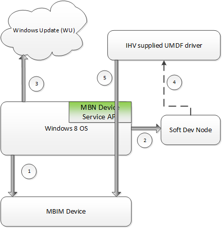

# Mobile Broadband Device Firmware Update


This topic provides guidance to Mobile Broadband (MB) module manufacturers intending to support firmware upgrade devices via Windows Update (WU). The devices must be compliant with the [USB NCM Mobile Broadband Interface Model (MBIM) V1.0 specification](http://go.microsoft.com/fwlink/p/?linkid=320791) released by the USB-IF Device Working Group.

The information in this topic applies to:

-   Windows 8

## Device Requirements


To support firmware updates on Mobile Broadband using Windows Update, module or device manufacturers need to comply with the following requirements:

-   UMDF (User Mode Driver Framework) based driver developed by the module or device manufacturer, packaged along with the INF file and firmware payload. Sample INF file and details are provided in the later part of this document
-   Device firmware to implement the following functionalities:
    -   Firmware ID Device Service (FID). For more information, see **FID Device Service**.
    -   Firmware to support a firmware update device service. This is a device manufacturer specific device service that provides the ability for an UMDF driver to call into and execute/download the firmware payload and start the firmware update process.

**Operational Overview**

The following diagram shows the high level design and interaction between the three components involved: MBIM device, Windows 8 Operating System and IHV supplied firmware upgrade driver.



-   When the WWAN Service detects the arrival of new MB device, it will check if device support Firmware ID (FID) Device Service. If it is present, it will retrieve the FID, which is defined to be GUID. The Firmware Device Service specification that the IHV needs to the support on the device is described **below**.
-   WWAN Service (Windows OS) will generate “soft device-node” using the FID obtained above as the device hardware Id. This referred to as “Soft Dev Node” in the diagram above. The creation of the dev-node will kick start PnP subsystem (Windows OS) to find the best matched driver. In Windows 8, PnP system will first attempt to install a driver from the local store, if one is available, and in parallel OS will attempt to fetch a better matched driver from WU. The inbox NULL driver will used be used as default if better match driver is not available to eliminate “Driver Not Found” issue.
-   The IHV WU package, based on the FID match, is pulled down to the machine and installed. It is expected that the FID represents a unique firmware SKU (uniqueness here is defined by combination device VID/PID/REV and MNO). WU package would contain an IHV authored UMDF driver as well as a firmware payload.
-   Once the IHV UMDF is loaded on the soft dev-node it is responsible for controlling the firmware update flow. It should be noted that the life time of the soft dev-node is tied to physical presence of the MBIM device. The UMDF driver shall perform the following steps to performing firmware updates
    -   It is acceptable for the device to reboot multiple times during the firmware update process, but would cause the UMDF driver to get unloaded/reloaded
    -   The entire firmware upgrade process, including reboots, should take place no more than 60 seconds.
    -   After the firmware update is completed and device has reverted to MBIM mode, Windows should be notified. This is done by clearing the previously set DEVPKEY\_Device\_PostInstallInProgress property. **https://msdn.microsoft.com/library/windows/hardware/hh451399(v=vs.85).aspx** describes how to set a property on dev-node. A previously set property can be cleared using DEVPROP\_TYPE\_EMPTY.
    -   During OnPrepareHardware UMDF callback, the UMDF driver shall check if the firmware on the device needs to be updated. This is done by comparing the version of the firmware on the device against the one that came in via Windows Update. Additional guidance is provided later in the document regarding placement location of firmware binary. If firmware update is required, the UMDF driver should:
        -   Schedule a work-item as described in **https://msdn.microsoft.com/library/windows/hardware/hh463997(v=VS.85).aspx**. The actual firmware upgrade happens in the context of the work-item.
        -   Once the work-item is successfully scheduled, notify Windows about the start of firmware update. It is done by setting the DEVPKEY\_Device\_PostInstallInProgress property on the soft dev-node in the context of OnPrepareHardware UMDF callback.
        -   It is important not to block the OnPrepareHardware callback while the firmware update is in progress. It is expected that OnPrepareHardware callback is completed within a second or two at the most.

**Sample INF file for the WU Package**

This section provides a sample INF that is part of the WU package. The key points to note in INF file are:

-   The firmware binaries are independent of the UMDF driver.
-   The firmware binaries are located a well-known, pre-defined location as shown below to filename collisions. The binaries cannot be not be executable files containing PE/COFF headers.
-   `%windir%\Firmware\<IHVCompanyName>\<UniqueBinaryName>.bin`
-   The UMDF driver is aware of this predefined well-known location.
-   The sample INF template below has highlighted items that need to be filled by the IHV.

```cpp
[Version]
Signature       = "$WINDOWS NT$"
Class           = Firmware
ClassGuid       = {f2e7dd72-6468-4e36-b6f1-6488f42c1b52}
Provider        = %Provider%
DriverVer       = 06/21/2006,6.2.8303.0
CatalogFile     = MBFWDriver.cat
PnpLockdown     = 1

[Manufacturer]
%Mfg%           = Firmware,NTx86

[Firmware.NTx86]
%DeviceDesc%    = Firmware_Install,MBFW\{FirmwareID}    ; From Device Service
;eg.%DeviceDesc%=Firmware_Install,MBFW\{2B13DD42-649C-3442-9E08-D85B26D7825C}

[Firmware_Install.NT]
CopyFiles       = FirmwareDriver_CopyFiles,FirmwareImage_CopyFiles

[Firmware_Install.NT.Services]
AddService      = WUDFRd,0x000001fa,WUDFRD_ServiceInstall

[WUDFRD_ServiceInstall]
DisplayName     = %WudfRdDisplayName%
ServiceType     = 1
StartType       = 3
ErrorControl    = 1
ServiceBinary   = %12%\WUDFRd.sys
LoadOrderGroup  = Base

[Firmware_Install.NT.CoInstallers]
CopyFiles       = WudfCoInstaller_CopyFiles

[WudfCoInstaller_AddReg]
HKR,,CoInstallers32,0x00010000,"WUDFCoinstaller.dll"

[Firmware_Install.NT.Wdf]
UmdfService      = MBIHVFirmwareDriver,MBIHVFirmwareDriver_Install
UmdfServiceOrder = MBIHVFirmwareDriver


[MBIHVFirmwareDriver_Install]
UmdfLibraryVersion  = 1.11
ServiceBinary       = %12%\UMDF\MBFWDriver.dll
DriverCLSID         = {<DriverClassGuid>} ; From UMDF driver

[FirmwareImage_CopyFiles]
MBIHVFirmware-XYZ-1.0.bin   ; Firmware Image

[FirmwareDriver_CopyFiles]
MBFWDriver.dll          ; UMDF driver for SoftDevNode

[DestinationDirs]
FirmwareImage_CopyFiles  = 10,Firmware\MBIHV ; %SystemRoot%\Firmware\MBIHV
FirmwareDriver_CopyFiles = 12,UMDF     ;%SystemRoot%\System32\drivers\UMDF

[SourceDisksFiles]
MBIHVFirmware-XYZ-1.0.bin = 1

[SourceDisksNames]
1 = %DiskName%

; ================== Generic ==================================

[Strings]
Provider        = "MBIHV"
Mfg             = "MBIHV"
DeviceDesc      = "MBIHV Mobile Broadband Firmware Device"
DiskName        = "Firmware Driver Installation Media"
```

**Firmware Identification Device Service (FID Device Service)**

The MBIM compliant device will implement and report the following device service when queried by CID\_MBIM\_DEVICE\_SERVICES. The existing well-known services are defined in the NCM MBIM spec in section 10.1. Microsoft Corporation extends this to define the following service.

Service Name = **Microsoft Firmware ID**

UUID = **UUID\_MSFWID UUID**

Value = **e9f7dea2-feaf-4009-93ce-90a3694103b6**

Specifically, the following CID is defined for UUID\_MSFWID device service:

CID = **CID\_MBIM\_MSFWID\_FIRMWAREID**

Command Code = **1**

Query = **Yes**

Set = **No**

Event = **No**

Set InformationBuffer payload = **N/A**

Query InformationBuffer payload = **N/A**

Completion InformationBuffer payload = **UUID**

**CID\_MBIM\_MSFWID\_FIRMWAREID**

The command returns the MNO or IHV assigned Firmware ID for the device. The UUID is encoded based on the guidelines in the MBIM specification.

Query = **InformationBuffer on MBIM\_COMMAND\_MSG not used. UUID returned in InformationBuffer MBIM\_COMMAND\_DONE.**

Set = **Unsupported**

Unsolicited Event = **Unsupported**

**Code snippets for behavior of UMDF driver**

As indicated earlier, the UMDF driver should indicate to the Windows when it starts and completes firmware upgrade. This section provides code snippets that show how the driver should notify Windows of these events.

```cpp
/**
 * This is the IPnpCallbackHardware*:OnPrepareHardware handler 
 * in the UMDF driver. This is called everytime the firmware 
 * update is device is started. Since this handler should be 
 * blocked from returning actual the firmware update process 
 * should be done in a workitem 
 */
HRESULT
CMyDevice::OnPrepareHardware(IWDFDevice* pDevice)
{
    HRESULT hr = S_OK;
    BOOL bFirmwareUpdateInProgress = FALSE;
    BOOL bFirmwareUpdateNeeded = FALSE;
    BOOL bFirmwareUpdateIsDone = FALSE;

    //
    // The snippets below demonstrates the steps for firmware 
    // update against a MB device that loads the updated firmware 
    // on device boot. So the firmware update driver needs to
    // send the new firmware down to the device and then tell 
    // the device to initate a stop/start. Once the device has
    // reappeared, it would have automatically loaded the 
    // new firmware
    // 


    //
    // First, determine if firmware update is in progress. This 
    // can be based on some registry key that is saved when
    // firmware update is started
    //

    // Assuming this status is returned in bFirmwareUpdateInProgress
    if (bFirmwareUpdateInProgress)
    {
        //
        // If firmware update is in progress, check if its done. For
        // this it may be necessary to access the MB device. Note that 
        // if the MB device (& hence the Firmware update device) needs
        // multiple stop/starts to do the firmware update. In that case
        // it will be marked as done at the end of the process
        //

        // Assuming this status is returned in bFirmwareUpdateIsDone
        if (bFirmwareUpdateIsDone)
        {
            //
            // Signal the completion of the firmware update
            // process.
            //
            SignalFirmwareUpdateComplete(pDevice);
        }
        else
        {
            //
            // Take appropriate steps to get notified when
            // firmware update is done. Call SignalFirmwareUpdateComplete
            // when that notification is received
            //
        }
    }
    else
    {
        //
        // Determine if firmware update is needed. This can be 
        // based on checking state in the registry of the last
        // firmware version set on the device to the firmware
        // version associated with this driver
        //
        
        // Assuming this status is returned in bFirmwareUpdateNeeded
        if (bFirmwareUpdateNeeded)
        {
            // 
            // Create and queue a workitem to perform the firmware
            // update process. IWDFWorkItem can be used for this
            //
            
            // Assuming the creation/enquing status
            // is returned in hr
            
            if (SUCCEEDED(hr))
            {
                //
                // Work item queued. It will do the firmware update
                // Tell the OS that firmware update is in progress
                //
                SignalFirmwareUpdateInProgress(pDevice);
            }
        }
    }

    //
    // If we have a failure, we clear the firmware update
    // in progress state
    //
    if (FAILED(hr))
    {
        SignalFirmwareUpdateComplete(pDevice);
    }
    return S_OK;
}

/**
 * This function tells the OS that firmware update is in progress.
 * It should be called from the firmware update UMDF driver&#39;s 
 * IPnpCallbackHardware*:OnPrepareHardware handler after it has
 * successfully queued a workitem to perform the firmware update
 */
HRESULT
CMyDevice::SignalFirmwareUpdateInProgress(
    __in IWDFDevice* pDevice
    )
{
    HRESULT hr = S_OK;    
    IWDFUnifiedPropertyStoreFactory* spPropertyStoreFactory = NULL;
    IWDFUnifiedPropertyStore* spPropStore = NULL;
    WDF_PROPERTY_STORE_ROOT wdfPropRoot = { sizeof(WDF_PROPERTY_STORE_ROOT), WdfPropertyStoreRootClassHardwareKey };
    DEVPROP_BOOLEAN boolValue = DEVPROP_TRUE;
    
    do
    {
       
        hr = pDevice->QueryInterface(IID_PPV_ARGS(&spPropertyStoreFactory));
        if (FAILED(hr))
        {
            Trace(TRACE_LEVEL_ERROR, "Failed to query for property store factory. Error = 0x%x", hr);
            break;

        }
        
        hr = spPropertyStoreFactory->RetrieveUnifiedDevicePropertyStore(
            &wdfPropRoot,
            &spPropStore
            );
        if (FAILED(hr))
        {
            Trace(TRACE_LEVEL_ERROR, "Failed to query for device property store. Error = 0x%x", hr);
            break;
        }

        // Set the OS flag
        hr = spPropStore->SetPropertyData(
            reinterpret_cast<const DEVPROPKEY*>(&DEVPKEY_Device_PostInstallInProgress),
            0, // this property is language neutral
            0,
            DEVPROP_TYPE_BOOLEAN,
            sizeof(DEVPROP_BOOLEAN),
            &boolValue
            );
        if (FAILED(hr))
        {
            Trace(TRACE_LEVEL_ERROR, "Failed to set device property for PostInstallInProgress. Error = 0x%x", hr);
            break;
        }

        //
        // Save some state so that we know we are in the process
        // of firmware update
        //
    } while (FALSE);        

    if (spPropStore)
    {
        spPropStore->Release();
    }

    if (spPropertyStoreFactory)
    {
        spPropertyStoreFactory->Release();
    }

    return hr;
}


/**
 * This function tells the OS that firmware update is done
 * It should be called only after the full firmware update process
 * (including any MB device stop/start) has finished
 */
HRESULT
CMyDevice::SignalFirmwareUpdateComplete(
    __in IWDFDevice* pDevice
    )
{
    HRESULT hr = S_OK;    
    IWDFUnifiedPropertyStoreFactory* spPropertyStoreFactory = NULL;
    IWDFUnifiedPropertyStore* spPropStore = NULL;
    WDF_PROPERTY_STORE_ROOT wdfPropRoot = { sizeof(WDF_PROPERTY_STORE_ROOT), WdfPropertyStoreRootClassHardwareKey };
    
    do
    {
        hr = pDevice->QueryInterface(IID_PPV_ARGS(&spPropertyStoreFactory));
        if (FAILED(hr))
        {
            Trace(TRACE_LEVEL_ERROR, "Failed to query for property store factory. Error = 0x%x", hr);
            break;

        }

        hr = spPropertyStoreFactory->RetrieveUnifiedDevicePropertyStore(
            &wdfPropRoot,
            &spPropStore
            );
        if (FAILED(hr))
        {
            Trace(TRACE_LEVEL_ERROR, "Failed to query for device property store. Error = 0x%x", hr);
            break;
        }

        hr = spPropStore->SetPropertyData(
            reinterpret_cast<const DEVPROPKEY*>(&DEVPKEY_Device_PostInstallInProgress),
            0, // this property is language neutral
            0,
            DEVPROP_TYPE_BOOLEAN,
            0,
            NULL
            );
        if (FAILED(hr))
        {
            Trace(TRACE_LEVEL_ERROR, "Failed to clear device property for PostInstallInProgress. Error = 0x%x", hr);
            break;
        }

        //
        // Save some state so that we can do quick check on 
        // whether firmware update is needed or not
        //

    } while (FALSE);        

    if (spPropStore)
    {
        spPropStore->Release();
    }

    if (spPropertyStoreFactory)
    {
        spPropertyStoreFactory->Release();
    }

    return hr;
}
```

 

 


