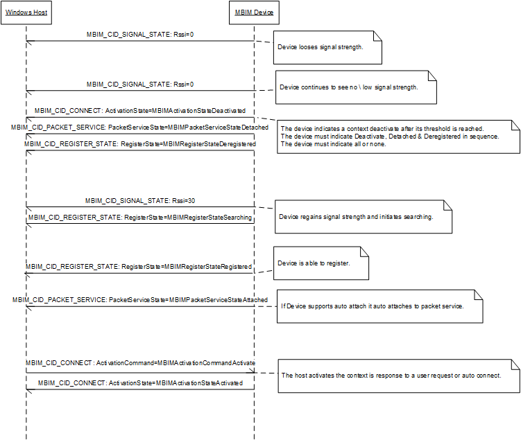

# Mobile Broadband Implementation Guidelines for USB Devices

This topic provides specific implementation guidance to help mobile broadband device manufacturers produce compliant USB devices for Windows. It should be used in conjunction with the [USB NCM Mobile Broadband Interface Model (MBIM) V1.0 specification](https://usb.org/document-library/mobile-broadband-interface-model-v10-errata-1-and-adopters-agreement) released by the USB-IF Device Working Group.

The information in this topic applies to:

-   Windows 8
-   Windows 8.1

## Delaying MBIM Open

MBIM devices may require time to complete initialization when they receive MBIM OPEN message from the host. The device should wait for its initialization to complete before responding to the MBIM OPEN message. The device should not respond to the message with error status like MBIM\_STATUS\_BUSY and expect the host to poll the device with MBIM OPEN messages. Responding to MBIM OPEN with a status other than MBIM\_STATUS\_SUCCESS terminates the initialization process on the host.

## Multi-carrier\\Multi-subscription

Please refer to **IHV Guidance for Implementing Multimode- and Multicarrier- Capable MB Devices** for details.

**MBIM\_CID\_HOME\_PROVIDER**

MBIM devices must not fail a SET MBIM\_CID\_HOME\_PROVIDER request with the following listed status codes under the mentioned circumstances. The following statuses are valid for the QUERY MBIM\_CID\_HOME\_PROVIDER request but are not applicable for a SET request.

-   **MBIM\_STATUS\_SIM\_NOT\_INSERTED** - MBIM devices must not fail a SET MBIM\_CID\_HOME\_PROVIDER request with status as MBIM\_STATUS\_SIM\_NOT\_INSERTED if the SIM for the new home provider is present but the SIM for the old home provider is not inserted.
-   **MBIM\_STATUS\_BAD\_SIM** - MBIM devices must not fail SET MBIM\_CID\_HOME\_PROVIDER request with MBIM\_STATUS\_BAD\_SIM if the SIM for the new home provider is good but the SIM for the old home provider is not bad.
-   **MBIM\_STATUS\_PIN\_REQUIRED** - MBIM devices must not fail SET MBIM\_CID\_HOME\_PROVIDER request with MBIM\_STATUS\_PIN\_REQUIRED regardless of whether the old or new SIM is pin locked.

**MBIM\_CID\_VISIBLE\_PROVIDERS**

-   **MBIM\_STATUS\_SIM\_NOT\_INSERTED** - When MBIM\_VISIBLE\_PROVIDERS\_ACTION is set to MBIMVisibleProvidersActionRestrictedScan the MBIM device must not fail MBIM\_CID\_VISIBLE\_PROVIDERS request with MBIM\_STATUS\_SIM\_NOT\_INSERTED because the SIM for the current home provider is not present.
-   **MBIM\_STATUS\_PIN\_REQUIRED** - When MBIM\_VISIBLE\_PROVIDERS\_ACTION is set to MBIMVisibleProvidersActionRestrictedScan the MBIM device must not fail MBIM\_CID\_VISIBLE\_PROVIDERS request with MBIM\_STATUS\_PIN\_REQUIRED because the SIM for the current home provider is PIN locked.

## Responding to Pin Operations

MBIM devices must follow these guidelines when responding to **MBIMPinOperationEnter** requests:

-   For successful **MBIMPinOperationEnter** requests, when the device no longer requires a PIN, the device must set status to MBIM\_STATUS\_SUCCESS and **MBIM\_PIN\_INFO::Pin Type** to **MBIMPinTypeNone.**
-   The device must set status to MBIM\_STATUS\_SUCCESS for PIN-enable and PIN-disable operations when the PIN is already in the requested state. The device must set **MBIM\_PIN\_INFO::PinType** to **MBIMPinTypeNone**. Other members are ignored.
-   When a PIN mode is changed from Disabled to Enabled, the PIN state should be **MBIMPinStateUnlocked**.
-   If PIN1 is enabled, the PIN state becomes **MBIMPinStateLocked** when the device is power cycled.
-   For all other PINs, the PIN state can change from **MBIMPinStateUnlocked** to **MBIMPinStateLocked** depending on mobile broadband device specific conditions.
-   PIN Not Supported: If a PIN operation is not supported by the device, the device must set status to MBIM\_STATUS\_NO\_DEVICE\_SUPPORT. For example, enabling and disabling PIN2 is not typically supported by mobile broadband devices so the above error code must be returned. All other members are ignored.
-   PIN Must be Entered: If a PIN operation requires a PIN to be entered, the device must set status to MBIM\_STATUS\_PIN\_REQUIRED and **MBIM\_PIN\_INFO::PinType** to **MBIMPinTypeXxx**. Other members are ignored.
-   PIN Change Operation: If the device restricts the change of PIN value only when it is in enabled state, a request to change in disabled state must be returned with MBIM\_STATUS\_PIN\_DISABLED.
-   PIN Retrial: On failure, the device must set status to MBIM\_STATUS\_FAILURE, and **MBIM\_PIN\_INFO::PinType** to the same value as specified in **MBIM\_SET\_PIN**. Other members are ignored except for **MBIM\_PIN\_INFO::RemainingAttempts**. This may occur when an incorrect PIN is entered.
-   PIN Blocking: The PIN is blocked when the number of **MBIM\_PIN\_INFO::RemainingAttempts** is zero. If the PIN unblock operation is not available, the device must set status to MBIM\_STATUS\_FAILURE and **MBIM\_PIN\_INFO::PinType** to **MBIMPinTypeNone**. **MBIM\_PIN\_INFO::RemainingAttempts** should be set to 0 and all the other members are ignored.
    **Note**  If the device supports PIN unblock operations, the device should follow the PIN Unblocking step to respond to the request.

     

-   Unblocking PIN: The PIN is blocked when **MBIM\_PIN\_INFO::RemainingAttempts** is zero. To unblock the PIN, the device may request a corresponding PUK, if applicable. In this case, the device must set status to MBIM\_STATUS\_FAILURE, **MBIM\_PIN\_INFO::PinType** to the corresponding **MBIMPinTypeXxxPUK**, **PinState** to **MBIMPinStateLocked**, and **MBIM\_PIN\_INFO::RemainingAttempts** should have the number of attempts allowed to enter a valid PUK.
-   If PIN blocking results in the device or SIM becomes blocked, the device must send a MBIM\_CID\_SUBSCRIBER\_READY\_STATUS notification with **ReadyState** set to **MBIMSubscriberReadyStateDeviceLocked.**
-   If there is an active PDP context at the time of PIN1 blocking, the device must deactivate the PDP context and send notifications to the operating system about the PDP deactivation and link state change.
-   For successful requests, the device must set status to MBIM\_STATUS\_SUCCESS. Other members are ignored.
-   For failed **MBIMPinOperationEnter** requests, the device must set status to MBIM\_STATUS\_FAILURE and include applicable data as per the following details:
    -   PIN Disabled or PIN Not Expected: For MBIMPinOperationEnter set requests, when the corresponding PIN is either disabled or currently not expected by the device, the device must set **MBIM\_PIN\_INFO::PinType** to **MBIMPinTypeNone**. All other members are ignored.
    -   PIN Not Supported: If the given PIN is not supported by the device, the device must set status to MBIM\_STATUS\_NO\_DEVICE\_SUPPORT.
    -   PIN Retrial: In this mode, the device requires the PIN to be re-entered as the **MBIM\_PIN\_INFO::RemainingAttempts** value is still non-zero for this particular type of PIN. The device must set **MBIM\_PIN\_INFO::PinType** to the same value as that of **MBIM\_PIN\_INFO::PinType** in **MBIM\_SET\_PIN**.
    -   PIN Blocking: The PIN is blocked when **MBIM\_PIN\_INFO::RemainingAttempts** is zero. If the PIN unblock operation is not available, the device must set status to MBIM\_STATUS\_FAILURE and **MBIM\_PIN\_INFO::PinType** to **MBIMPinTypeNone**. All the other members are ignored.
        **Note**  If the device supports PIN unblock operations, the device should follow the PIN Unblocking step to respond to the request.

         

    -   PIN Unblocking: The PIN is blocked when **MBIM\_PIN\_INFO::RemainingAttempts** is zero. To unblock the PIN, the device may request a corresponding PIN Unlock Key (PUK), if applicable. In this case, the device must set **MBIM\_PIN\_INFO::PinType** to the corresponding **MBIMPinTypeXxxPUK** with the relevant details.
    -   Blocked PUK: If the number of failed trials exceeds the preset value for entering the **MBIMPinTypeXxxPUK**, then the PUK becomes blocked. The device must signal this by setting status to MBIM\_STATUS\_FAILURE and **MBIM\_PIN\_INFO::PinType** to **MBIMPinTypeNone**. In case PUK1 is blocked, the device must send a MBIM\_CID\_SUBSCRIBER\_READY\_STATUS with **ReadyState** set to **MBIMSubscriberReadyStateBadSim**.
    -   MBIM devices must follow these guidelines when responding to **MBIMPinOperationEnable**, **MBIMPinOperationDisable**, or **MBIMPinOperationChange** requests.

## Auto Packet Service Attach

MBIM devices that support Auto Packet Service Attach manage the attachment and detachment of packet service from the mobile network at their discretion. The host may still send an attach request to such a device on user request. When the device receives the attach request from the host it should handle as follows:

-   • If the device is not attached and not in the middle of an attach operation and is capable of attaching then it should initiate a new attach procedure with the mobile network.
-   • If the device is not attached but in the middle of an auto attach operation then it should wait for the auto attach operation to complete and complete the attach request from the host with the status of the auto attach operation.
-   • If the device is already attached then it should complete the attach request from the host successfully.

## Signal Strength Loss and Data Connection Loss

When a device loses signal strength the device must indicate **MBIMActivationStateDeactivated** followed by **MBIMPacketServiceStateDetached** followed by **MBIMRegisterStateDeregistered** in that order. If the device loses packet service while it is context activated the device must indicate **MBIMActivationStateDeactivated** followed by **MBIMPacketServiceStateDetached** in that order. The following sequence diagram shows the interaction between the host and the device.

## DNS Server Information

When Basic IP information (as defined in MBIM section 10.5.20.1) is provided via MBIM\_CID\_IP\_CONFIGURATION, DNS server information (as defined in MBIM section 10.5.20.1) can also be provided via MBIM\_CID\_IP\_CONFIGURATION. When DNS server information is updated, MBIM\_CID\_IP\_CONFIGURAITON must have the complete Basic IP information obtained before. DNS server information can be provided solely via MBIM\_CID\_IP\_CONFIGURATION even if the Basic IP information is not provided via MBIM\_CID\_IP\_CONFIGURATION. This applies to both IPv4 and IPv6.

## IPv6

For basic IP information (as defined in MBIM section 10.5.20.1), the expected IP Layer configuration mechanism is from router advertisement (RA). For DNS server information (as defined in MBIM section 10.5.20.1), the expected IP Layer configuration mechanism is DHCPv6.

-   **Basic IP information from RA** - If a mobile network provides Basic IP information (as defined in MBIM section 10.5.20.1) via RA, then MBIM devices must allow RA packets to be forwarded to the host and must not intercept the RA packets or provide the Basic IP information present in the RA packets via MBIM\_CID\_IP\_CONFIGURATION.
-   **DNS server information from RA** - The only IP Layer configuration mechanism for DNS server information (as defined in MBIM section 10.5.20.1) supported by Windows is DHCPv6. MBIM devices must configure DNS server information, even if present in RA, via MBIM\_CID\_IP\_CONFIGURATION.
-   **Basic IP information and DNS server information from DHCPv6** - If a mobile network provides basic IP information and DNS server information (as defined in MBIM section 10.5.20.1) from DHCPv6, then MBIM devices must allow DHCPv6 packets to be forwarded to the host and must not intercept the DHCPv6 packets or provide the basic IP information and DNS server information present in the DHCPv6 packets via MBIM\_CID\_IP\_CONFIGURATION.

## MBIM\_CID\_RADIO\_STATE

MBIM devices must not fail MBIM\_CID\_RADIO\_STATE operations with status of MBIM\_STATUS\_SIM\_NOT\_INSERTED when SIM is not present. Radio operations must not be failed due to SIM absence.

## Byte-Ordering Requirements for Authentication CIDs

Data in the byte array fields listed below must be in host-byte order.

**MBIM\_CID\_SIM\_AUTH**

MBIM\_SIM\_AUTH\_REQ

1.  Rand1
2.  Rand2
3.  Rand3

**MBIM\_CID\_AKA\_AUTH**

MBIM\_AKA\_AUTH\_REQ

1.  Rand
2.  Autn

MBIM\_AKA\_AUTH\_INFO

1.  Res
2.  IK
3.  CK
4.  Auts

**MBIM\_CID\_AKAP\_AUTH**

MBIM\_AKAP\_AUTH\_REQ

1.  Rand
2.  Autn

MBIM\_AKAP\_AUTH\_INFO

1.  Res
2.  IK
3.  CK
4.  Auts

## Setting Link MTU

Windows supports configuring Link Maximum Transmission Unit (MTU) only during device initialization. Windows does not update the Link MTU based on the MTU reported using MBIM\_CID\_IP\_CONFIGURATION. Devices must communicate the network supported link MTU using the MBIM\_FUNCTIONAL\_DESCRIPTOR.wMaxSegmentSize. Link MTU values reported in this manner should be at least 1280 and at most 1500.

 

 

