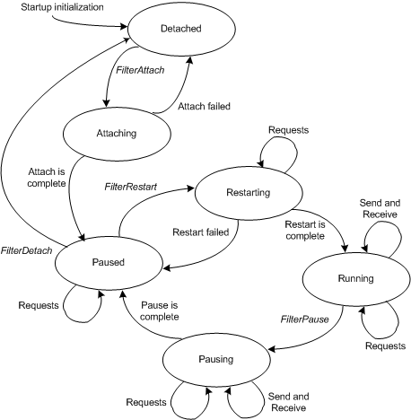

# Module States of a Filter Driver

An [NDIS filter driver](ndis-filter-drivers.md) must support the following operational states for each filter module (instance of a filter driver) that the driver manages:

-   Detached

-   Attaching

-   Paused

-   Restarting

-   Running

-   Pausing

The following figure shows the relationships between these states.

The following defines the filter module states:

Detached  
The *Detached* state is the initial state of a filter module. When a filter module is in this state, NDIS can call the filter driver's [*FilterAttach*](https://msdn.microsoft.com/library/windows/hardware/ff549905) function to attach the filter module to the driver stack. When NDIS calls a filter driver's *FilterAttach* function, the filter module enters the Attaching state. If the attach operation fails, the filter module returns to the Detached state. When the module is in the Paused state and NDIS calls the [*FilterDetach*](https://msdn.microsoft.com/library/windows/hardware/ff549918) function, the module returns to the Detached state.

Attaching  
When a filter module is in the *Attaching* state, a filter driver prepares to attach the module to the driver stack. After the filter module preparation is complete, the filter module enters the Paused state. If a failure occurs (for example, because the required resources are not available), the filter module returns to the Detached state.

Paused  
When a filter module is in the *Paused* state, the filter module does not perform send or receive operations. When a filter module is in the *Attaching* state and [*FilterAttach*](https://msdn.microsoft.com/library/windows/hardware/ff549905) is successful, the filter module enters the *Paused* state. When a filter module is in the *Pausing* state and the pause operation completes, the filter module enters the *Paused* state. When a filter module is in the *Paused* state and NDIS calls the filter driver's [**FilterRestart**](https://msdn.microsoft.com/library/windows/hardware/ff549962) function, the filter module enters the *Restarting* state. When a filter module is in the *Paused* state and NDIS calls the driver's *FilterDetach* handler, the filter module enters the *Detached* state.

Restarting  
In the *Restarting* state, a filter driver completes any operations that are required to restart send and receive operations for a filter module. When a filter module is in the Paused state and NDIS calls the driver's *FilterRestart* function, a filter module enters the Restarting state. If the restart fails, the filter module returns to the Paused state. If the restart is successful, the filter module enters the Running state.

Running  
In the *Running* state, a filter driver performs normal send and receive processing for a filter module. When the filter module is in the Restarting state and the driver is ready to perform send and receive operations, the filter module enters the Running state.

Pausing  
In the *Pausing* state, a filter driver completes any operations that are required to stop send and receive operations for a filter module. The filter driver must wait for all its outstanding send requests to complete and for NDIS to return all its outstanding receive indications. When a filter module is in the Running state and NDIS calls the driver's [*FilterPause*](https://msdn.microsoft.com/library/windows/hardware/ff549957) function, the filter module enters the Pausing state. A filter driver cannot fail a pause operation. After the pause operation is complete, the filter module enters the Paused state.

## Related topics

[Driver Stack Management](driver-stack-management.md)

[NDIS Filter Drivers](ndis-filter-drivers.md)

 

 

