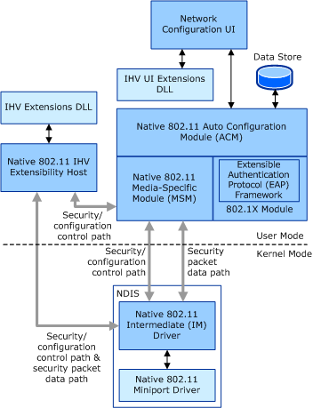

# Native 802.11 Software Architecture

**Important**  The [Native 802.11 Wireless LAN](native-802-11-wireless-lan4.md) interface is deprecated in Windows 10 and later. Please use the WLAN Device Driver Interface (WDI) instead. For more information about WDI, see [WLAN Universal Windows driver model](wifi-universal-driver-model.md).

 

The following figure shows the Native 802.11 software architecture, including modules necessary to support independent hardware vendor (IHV) extensions. The modules in the lighter shade are supplied by the IHV.

**Network Configuration User Interface (UI)**  
This module provides an interface through which the user can configure a network profile. The profile consists of standard 802.11 connectivity settings, as well as security settings for the encryption and authentication algorithms supported by the operating system.

**IHV Extensions UI DLL**   
The IHV Extensions UI DLL provides an interface through which a user can configure the proprietary connectivity and security settings supported by the IHV Extensions DLL and Native 802.11 miniport driver. The IHV Extensions UI DLL can alert the user with events or notifications generated by the IHV Extensions DLL.

**Native 802.11 Auto Configuration Module (ACM)**   
This module manages network access to the 802.11 wireless LAN (WLAN) media. It provides a public API through which the Network Configuration UI or other applications can:

-   Enumerate 802.11 NICs.

-   Process the events for 802.11 NIC arrival and removal.

-   Query 802.11 NIC capabilities and status.

-   Query or set ACM configuration settings.

-   Create, modify, or validate network profiles.

-   Discover the basic service set (BSS) networks within range of an 802.11 station.

-   Connect to or disconnect from a BSS network.

-   Register for notifications, such as BSS network connect or disconnect notifications.

For more information about the ACM and its API, refer to the Microsoft Windows SDK documentation.

**Native 802.11 Media Specific Module (MSM)**  
This module interfaces with the ACM and provides a private API for:

-   Starting or stopping MSM services.

-   Managing the IHV Extensions DLL, which includes starting or stopping the IHV Extensions DLL.

-   Issuing requests to the Native 802.11 intermediate (IM) driver to discover BSS networks, as well as requests to connect or disconnect from a BSS network. The Native 802.11 IM driver forwards all requests to the underlying Native 802.11 miniport driver.

-   Issue requests to the Native 802.11 IM driver to query or set the connectivity, security and configuration settings of the underlying Native 802.11 miniport driver. The MSM issues these requests based on the data within a network profile.

The Native 802.11 MSM provides an interface to a control path between the Native 802.11 IHV Extensions host and the Native 802.11 IM driver for the exchange of security and configuration data.

The MSM also provides an interface to a data path with the IM driver for sending and receiving security data packets through the underlying Native 802.11 miniport driver. For example, the 802.1X module interfaces with the MSM to access the data path for the exchange of EAP frames encapsulated using the EAP over LAN (EAPOL) format. For more information about EAPOL, refer to Clause 7 of the IEEE 802.1X-2001 standard.

**EAP Framework**  
This module provides the framework for the implementation of the EAP protocols that are supported by the operating system, such as:

-   Standard EAP protocols, such as EAP-TLS (as defined in IETF RFC 2716).

-   De facto EAP protocols, such as PEAP and EAP-SIM.

**802.1X Module**  
This module implements the port-based network access control as defined by the IEEE 802.1X-2001 standard. This module processes the EAPOL packets that are exchanged between the 802.11 station and the access point (AP) or peer station.

The 802.1X module also provides the interface to the EAP Framework the process the EAP data that is delivered through EAPOL packets. This interface is also available to the IHV Extensions DLL and allows the DLL to use the EAP protocols that are supported by the operating system for user authentication. For more information about how the IHV Extensions DLL uses this interface, see [Interface to the Microsoft 802.1X Module](interface-to-the-native-802-11-802-1x-module.md).

**IHV Extensions DLL**  
Through the IHV Extensions DLL, the IHV can do the following:

-   Add support for proprietary or non-standard security protocols.

-   Replace support for security protocols provided by the operating system. For example, the IHV Extensions DLL can implement its own version of the PEAP protocol and use it in place of the protocol supported by the operating system.

-   Process and validate the connectivity, security, and 802.11 configuration settings within a network profile.

-   Process received security packets for the protocols that the IHV Extensions DLL supports.

-   Request user input or notification through the IHV UI Extensions DLL.

The IHV Extensions DLL implements a set of defined callback functions (IHV handler functions), which are called by the Native 802.11 IHV Extensibility Host in response to events from the Native 802.11 MSM or miniport driver. The IHV Extensions DLL returns a list of pointers to the IHV handler functions through a call to the [*Dot11ExtIhvInitService*](https://msdn.microsoft.com/library/windows/hardware/ff547470) function.

For more information about the IHV handler functions, see [Native 802.11 IHV Handler Functions](https://msdn.microsoft.com/library/windows/hardware/ff560627).

**Native 802.11 IHV Extensibility Host**  
This process provides a public API to the IHV Extensions DLL for accessing various 802.11 MSM services, such as:

-   Sending and receiving security packets to the BSS network through the underlying Native 802.11 miniport driver.

-   Configuring security settings, such as cipher keys, on a Native 802.11 miniport driver.

-   Setting or querying ports for access to peers within the BSS network.

-   Registering the types of security packets processed by the IHV Extensions DLL.

The Native 802.11 IHV Extensibility Host provides an interface to a control path managed by the Native 802.11 Intermediate (IM) driver. This interface supports the exchange of security, connectivity, and 802.11 configuration settings through the IM driver to the underlying Native 802.11 miniport driver.

The Native 802.11 IHV Extensibility Host also provides an interface to a data path managed by the Native 802.11 IM driver for the transmission and reception of security data packets through the underlying Native 802.11 miniport driver.

The Native 802.11 IHV Extensibility Host exports its API, which are called the IHV Extensibility functions, to the IHV Extensions DLL through a list of pointers passed as a parameter to the [*Dot11ExtIhvInitService*](https://msdn.microsoft.com/library/windows/hardware/ff547470) function.

For more information about the IHV Extensibility functions, see [Native 802.11 IHV Extensibility Functions](https://msdn.microsoft.com/library/windows/hardware/ff560609).

**Native 802.11 Miniport Driver**  
The miniport driver developed by the IHV provides access to the IEEE 802.11 wireless LAN (WLAN) media.

The driver is developed as an NDIS 6.0 or later miniport driver and must conform to the interface requirements for a Native 802.11 miniport driver that are discussed in other topics in this section.

If the IHV has developed Native 802.11 extensions to the operating system, the miniport driver must support the Extensible Station (ExtSTA) operation mode.

**Note**  For the Windows Vista operating system, only the ExtSTA operation mode is supported by the operating system.

 

For more information about these operation modes, see [Native 802.11 Operation Modes](native-802-11-operation-modes.md).

**Native 802.11 Intermediate (IM) Driver**  
The Native 802.11 IM driver:

-   Invokes the 802.11 MAC service primitives on the miniport driver that is supported by the ExtSTA operation mode.

-   Exposes its upper miniport edge as a legacy 802.3 device and handles all 802.3-802.11 transformations for packets sent or received from a Native 802.11 miniport driver.

-   Forwards security packets between a Native 802.11 miniport driver and IHV Extensions DLL over the security packet data path managed by the 802.11 IHV Extensions host service. The IM driver forwards only those packets that match a packet type registered by the service with the 802.11 IHV Extensions host service.

-   Forwards security and device configuration data from the IHV Extensions DLL to a Native 802.11 miniport driver over the security/configuration control path managed by the 802.11 IHV Extensions host service.

 

 

