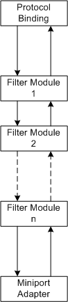
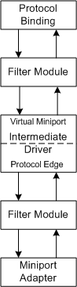

# NDIS Driver Stack

### Basic Stack Configuration

The following figure shows a basic configuration of the logical elements in an NDIS 6.0 driver stack. The figure illustrates a driver stack with an unspecified number of filter modules. The arrows represent information flow between the elements of the stack.

As the preceding figure shows, you can stack any number of filter modules over a miniport adapter. These modules can be instances of different filter drivers and/or multiple instances of the same filter driver. If a miniport driver manages more than one miniport adapter, a separate driver stack can exist over each miniport adapter.

Protocol drivers bind to miniport adapters. Therefore, underlying filter modules in a driver stack are transparent to protocol drivers. To obtain information about underlying filter modules, protocol drivers can enumerate the filter modules in a driver stack.

If more than one protocol driver binds to an miniport adapter, the filter modules are the same for both protocol drivers. Based upon the binding, NDIS routes requests to the correct protocol driver.

### NDIS 6.0 Stack with Intermediate Driver

The following figure shows an NDIS 6.0 driver stack with an intermediate driver.

If you include an NDIS intermediate driver in the driver stack, the stack is essentially two stacks: one above the other.

The intermediate driver's virtual miniport provides the miniport adapter for the upper stack, whereas the intermediate driver's protocol edge provides the protocol binding for the lower stack.

A virtual miniport has the same states as any other miniport adapter. For more information about miniport adapter states, see [Adapter States of a Miniport Driver](adapter-states-of-a-miniport-driver.md).

The protocol edge of the intermediate driver should implement the same binding states as a protocol driver. For more information about binding states, see [Binding States of a Protocol Driver](binding-states-of-a-protocol-driver.md).

## Related topics

[Adapter States of a Miniport Driver](adapter-states-of-a-miniport-driver.md)

[Binding States of a Protocol Driver](binding-states-of-a-protocol-driver.md)

[Driver Stack Management](driver-stack-management.md)

[NDIS Filter Drivers](ndis-filter-drivers.md)

[NDIS Intermediate Drivers](ndis-intermediate-drivers.md)

[NDIS Miniport Drivers](ndis-miniport-drivers2.md)

[NDIS Protocol Drivers](ndis-protocol-drivers2.md)

 

 

