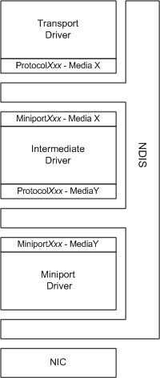

# Intermediate drivers

As the following figure illustrates, intermediate drivers are typically layered between miniport drivers and transport protocol drivers.

Because of its intermediate position in the driver hierarchy, an intermediate driver must communicate with both overlying protocol drivers and underlying miniport drivers in order to expose:

-   Protocol entry points.

    At its lower edge, NDIS calls the *ProtocolXxx* functions to communicate requests from underlying miniport drivers. The intermediate driver looks like a protocol driver to an underlying miniport driver.

-   Miniport driver entry points.

    At its upper edge, NDIS calls the *MiniportXxx* functions to communicate the requests of one or more overlying protocol drivers. The intermediate driver looks like a miniport driver to an overlying protocol driver.

An intermediate driver exports a subset of the *MiniportXxx* functions at its upper edge. It also exports one or more virtual adapters, to which overlying protocol drivers can bind. To a protocol driver, a virtual adapter that was exported by an intermediate driver appears to be a physical NIC. When a protocol driver sends packets or requests to a virtual adapter, the intermediate driver propagates these packets and requests to the underlying miniport driver. When the underlying miniport driver indicates received packets, responds to a protocol driver's requests for information, or indicates status, the intermediate driver propagates such packets, responses, and status up to the protocol drivers that are bound to the virtual adapter.

You can use intermediate drivers to:

-   Translate between different network media.

-   Balance packet transmission across more than one NIC. A load balancing driver exposes one virtual adapter to overlying transport protocols and distributes send packets across more than one NIC.

## Related topics

[NDIS Intermediate Drivers](ndis-intermediate-drivers2.md)

[NDIS Intermediate Driver Reference](https://msdn.microsoft.com/library/windows/hardware/ff565782)

 

 

