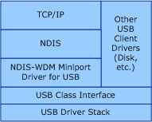

# Miniport drivers

An *NDIS miniport driver* has two basic functions:

-   Managing a network interface card (NIC), including sending and receiving data through the NIC.

-   Interfacing with higher-level drivers, such as filter drivers, intermediate drivers, and protocol drivers.

A miniport driver communicates with its NICs and with higher-level drivers through the NDIS library. The NDIS library exports a full set of functions (**NdisM*Xxx*** and other **Ndis*Xxx*** functions) that encapsulate all of the operating system functions that a miniport driver must call. The miniport driver, in turn, must export a set of entry points (*MiniportXxx* functions) that NDIS calls for its own purposes, or on behalf of higher-level drivers, to access the miniport driver.

The following send and receive operations illustrate the interaction of miniport drivers with NDIS and with higher-level drivers:

- When a transport driver has a packet to transmit, it calls an **Ndis*Xxx*** function exported by the NDIS library. NDIS then passes the packet to the miniport driver by calling the appropriate *MiniportXxx* function exported by the miniport driver. The miniport driver then forwards the packet to the NIC for transmission by calling the appropriate **Ndis*Xxx*** functions.

- When a NIC receives a packet addressed to itself, it can post a hardware interrupt that is handled by NDIS or the NIC's miniport driver. NDIS notifies the NIC's miniport driver by calling the appropriate *MiniportXxx* function. The miniport driver sets up the transfer of data from the NIC and then indicates the presence of the received packet to bound higher-level drivers by calling the appropriate **Ndis*Xxx*** function.

## Connectionless and Connection-Oriented Miniport Drivers

NDIS supports miniport drivers for both connectionless environments and connection-oriented environments.

*Connectionless miniport drivers* control NICs for connectionless network media, such as Ethernet. Connectionless miniport drivers are further divided into deserialized and serialized drivers:

**Note**  All NDIS 6.0 and later drivers are deserialized.

 

-   *Deserialized drivers* serialize the operation of their own *MiniportXxx* functions and that internally queue all incoming send packets. This results in significantly better full-duplex performance, provided that the driver's critical sections (code that only a single thread at a time can run) are kept small.

-   *Serialized drivers* rely on NDIS to serialize calls to their *MiniportXxx* functions and to manage their send queues.

*Connection-oriented miniport drivers* control NICs for connection-oriented network media, such as ISDN. Connection-oriented miniport drivers are always deserialized -- they always serialize the operation of their own *MiniportXxx* functions and queue internally all incoming send packets.

An NDIS miniport driver can have a non-NDIS lower edge (see the following figure).

Through its non-NDIS lower edge, a miniport driver uses the class interface for a bus, such as the Universal Serial Bus (USB) to control a device on the bus. The miniport driver communicates with the device by sending I/O request packets (IRPs) either to the bus or directly to remote devices that are attached to the bus. At its upper edge, the miniport driver exposes a standard NDIS miniport driver interface, which enables the miniport driver to communicate with overlying NDIS drivers.

## Related topics

[NDIS Miniport Drivers](ndis-miniport-drivers.md)

[NDIS Miniport Driver Reference](https://msdn.microsoft.com/library/windows/hardware/ff565969)

 

 

