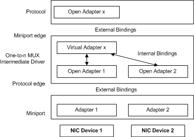
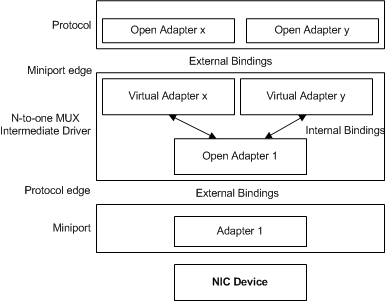

# NDIS MUX Intermediate Drivers

The number of virtual miniports that are exposed by a MUX intermediate driver can be different than the number of lower physical adapters that are bound to the driver. A MUX intermediate driver exposes virtual miniports in a one-to-*n*, *n*-to-one, or even an *m*-to-*n* relationship with underlying adapters. This variety results in complicated internal bindings and data paths.

In a one-to-*n* configuration, a single MUX intermediate driver can bind to many physical adapters below. Transport drivers bind to the virtual miniport of the MUX intermediate driver in the same way that they bind to nonvirtual miniports. The MUX intermediate driver repackages and passes down all requests and send packets that are submitted to the intermediate driver for a specific connection. A Load Balancing Failover (LBFO) driver is an example of this type of MUX intermediate driver.

The following figure illustrates a one-to-*n* MUX intermediate driver configuration.

In an *n*-to-one configuration, a MUX intermediate driver can expose many virtual miniports for a single physical adapter below. Overlying protocol drivers bind to these virtual miniports of the MUX intermediate driver in the same way that they bind to nonvirtual miniports. The MUX intermediate driver handles requests and sends that are submitted to the driver for specific connections at each virtual miniport. The driver repackages and transfers these requests and sends down to the NDIS miniport driver for the bound physical adapter.

The following figure illustrates an *n*-to-one MUX intermediate driver configuration.

MUX intermediate drivers require a notify object DLL. When a MUX intermediate driver is initialized, its bindings are determined by the configuration established by its notify object DLL. For more information about installing MUX intermediate drivers, see [MUX Intermediate Driver Installation](mux-intermediate-driver-installation.md).

The following list describes examples of *n*-to-one MUX intermediate drivers:

-   802 and proprietary virtual LANs are technologies that could be implemented as intermediate drivers similar to the MUX sample.

-   The MUX Intermediate Driver Sample is an n-to-one MUX intermediate driver. MUX creates multiple virtual miniports layered above a single underlying miniport adapter.

 

 

