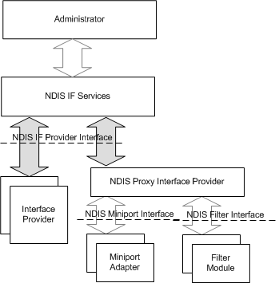

# NDIS Network Interface Architecture

NDIS provides a set of services to support network interfaces and interface stacks. In the WDK, this set of services is referred to as *NDIS network interface (NDISIF)* services.

The following figure shows the NDIS 6.0 network interfaces architecture.

The NDISIF components of the architecture include:

NDIS IF services  
An NDIS component that handles registration of interface providers and interfaces, implements provider OID query and set services, and provides other NDISIF services.

NDIS IF provider interface  
An interface that the NDIS IF Services component provides to allow NDIS drivers to implement interface providers.

NDIS proxy interface provider  
An NDIS component that implements the NDISIF provider services on behalf of NDIS miniport drivers (for each miniport adapter) and filter drivers (for each filter module).

Interface provider  
An NDIS driver that provides the NDISIF provider services for interfaces that the NDIS proxy interface provider cannot service. For example, a MUX intermediate driver can have internal interfaces between its virtual miniports and underlying adapters.

The NDIS proxy interface provider uses the standard NDIS miniport driver and NDIS filter driver interfaces to provide NDISIF services for miniport adapters and filter modules. Therefore, miniport drivers and filter drivers are not required to provide any additional support for NDISIF.

 

 

