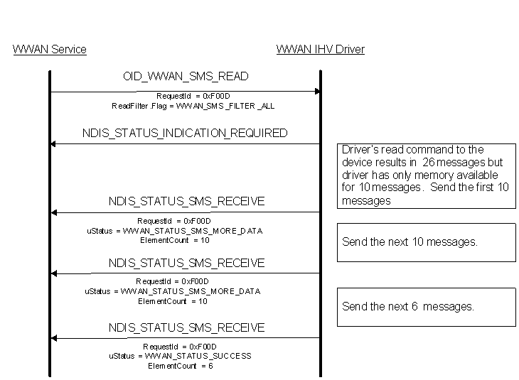

# NDIS\_STATUS\_WWAN\_SMS\_RECEIVE

Miniport drivers use the NDIS\_STATUS\_WWAN\_SMS\_RECEIVE notification to inform the MB Service about either the completion of a previous read request through a [OID\_WWAN\_SMS\_READ](oid-wwan-sms-read.md) query request, or the arrival of a new class-0 (flash/alert) message from the network provider as an event notification.

Miniport drivers can also send unsolicited events with this notification.

This notification uses the [**NDIS\_WWAN\_SMS\_RECEIVE**](https://msdn.microsoft.com/library/windows/hardware/ff567942) structure.

Remarks
-------

RequestId is set to "0" by the miniport driver to indicate the arrival of the new class-0 (flash/alert) message. Arrival of new class-0 (flash/alert) messages is dependent on the current network registration state.

If the request for read results in retrieval of large number of SMS records that can't be accommodated in a pre-allocated buffer of miniport driver, then the SMS records can be sent to the MB Service in multiple indications. The uStatus in this case must be set to WWAN\_STATUS\_SMS\_MORE\_DATA for the intermediate transactions and the final transaction must end with WWAN\_STATUS\_SUCCESS.

The following diagram represents the usage of the multiple indication method for large number of SMS record retrieval:

Requirements
------------

<table>
<colgroup>
<col width="50%" />
<col width="50%" />
</colgroup>
<tbody>
<tr class="odd">
<td>
Version
</td>
<td>
Available in Windows 7 and later versions of Windows.
</td>
</tr>
<tr class="even">
<td>
Header
</td>
<td>Ndis.h</td>
</tr>
</tbody>
</table>

## See also

[OID\_WWAN\_SMS\_READ](oid-wwan-sms-read.md)

[**NDIS\_WWAN\_SMS\_RECEIVE**](https://msdn.microsoft.com/library/windows/hardware/ff567942)

 

 

