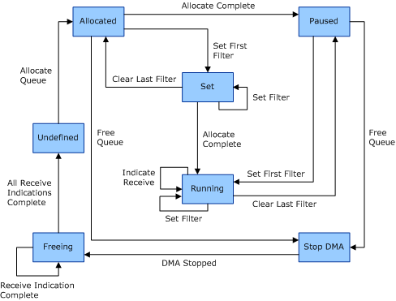

# NDIS Virtual Machine Queue States

This topic provides an overview of the operational states of NDIS virtual machine queues (VMQs). For more information about queue states, see the [Queue States and Operations](queue-states-and-operations.md) topic in the [Writing VMQ Drivers](writing-vmq-drivers.md) section.

For each queue, a network adapter must support the following set of operational states:

-   Undefined

-   Allocated

-   Set

-   Paused

-   Running

-   Stop DMA

-   Freeing

The following figure shows the relationships between these states.

The following defines the adapter states:

Undefined  
*Undefined* is the initial state of a queue. In this state, the queue is not allocated. A queue (except the default queue which always exists) is undefined until the miniport driver receives a queue allocation request. Also, it is undefined after the free operation is complete and any receive indications that had been started are complete.

Allocated  
A queue is in the *Allocated* state after an allocation request and before there are any filters set on the queue. The filter can also enter the Allocated state if the queue is in the Set state and the last filter is cleared on the queue. The queue enters the Paused state if the miniport driver receives an allocation complete request while the miniport driver is in the Allocated state. The queue enters the Stop DMA state if the miniport driver receives a free queue request.

Set  
In the *Set* state, a queue is allocated and a least one filter is set on the queue but the miniport driver did not receive an allocation complete OID yet. The queue enters the Running state if it receives an allocation complete request. The queue enters the Allocated state if the last filter on the queue is cleared. Note that the queue cannot be freed while there are filters set on the queue.

Paused  
In the *Paused* state, the queue is allocated but its miniport driver does not indicate received packets because there are no filters set on the queue. The miniport driver can enter the Paused state either from the Allocated state or from the Running state. The queue enters the Running state when it receives a filter set request. The queue enters the Stop DMA state when it receives a free queue request.

Running  
In the *Running* state, a queue has filters set, the queue allocation is complete, and the network adapter indicates receive packets. The queue enters the Paused state if the last filter on the queue is cleared. Note that the queue cannot be freed while there are filters set on the queue. Also, the miniport driver can stop the DMA if the last filter is cleared. However, the miniport driver should not send the DMA stopped state indication in this case.

Stop DMA  
In the *Stop DMA* state, the miniport driver received a free queue request and the DMA activity must be stopped. The miniport driver must send a DMA stopped state indication. After the miniport driver sends the status indication, the queue is in the Freeing state. Note that the DMA was probably already stopped when the last filter was cleared. However, the miniport driver should only send the status indication when it receives the free queue request.

Freeing  
In the *Freeing* state, a miniport driver is waiting for all of the outstanding receive indications on a queue to complete and freeing the resources that are associated with the queue. After all of the resources are freed, the queue enters the Undefined state.

 

 

