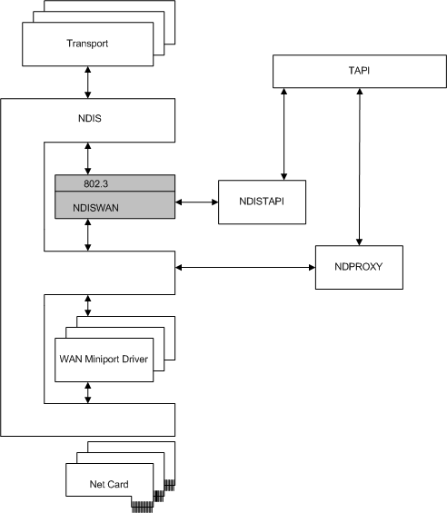

# NDISWAN Overview

NDISWAN is a system-supplied NDIS intermediate driver that provides functionality such as data compression, encryption, loopback, and simple PPP framing that is used by WAN miniport drivers. WAN miniport drivers are therefore required to implement only those features that are specific to the medium (for example, Q931 signaling is required for ISDN).

The following figure shows how NDISWAN interfaces with other components in the RAS architecture.

To overlying protocol drivers, NDISWAN presents both NDIS and CoNDIS miniport driver interfaces. To underlying WAN miniport drivers, NDISWAN presents both NDIS and CoNDIS protocol interfaces that include some WAN-specific elements.

In a CoNDIS environment, the WAN miniport driver can be a connection-oriented miniport driver or an integrated miniport call manager (MCM).

NDISWAN provides the following functionality:

-   **Packet conversion**

    NDISWAN converts send packets that are passed to it by protocol drivers from LAN to PPP format. NDISWAN performs the reverse conversion for receive packets passed to it by WAN miniport drivers. NDISWAN uses simple HDLC framing. Most of the media-specific framing must be done by the miniport driver. For more information about WAN packet framing, see [WAN Packet Framing](wan-packet-framing.md).

-   **Packet processing**

    Send packets include configuration options for header compression, data compression, and encryption. NDISWAN applies these operations in that order on send packets. NDISWAN applies these options in the reverse order on receive packets. If NDISWAN determines that a configuration option such as compression or encryption is enabled, NDISWAN sends an OID to inform the underlying WAN miniport driver.

-   **Simplified binding for drivers**

    NDISWAN simplifies the bindings between protocol drivers and WAN miniport drivers. For more information about WAN driver bindings, see [WAN Driver Bindings and Connections](wan-driver-bindings-and-connections.md).

-   **Data forwarding**

    In an NDIS WAN environment, NDISWAN examines the header of the descriptor of a send packet and determines over which link the packet will be sent. NDISWAN copies the packet into a contiguous buffer and forwards it to the underlying miniport driver. In a CoNDIS WAN environment, NDISWAN forwards packets based on the packet's associated virtual connection (VC). For more information about WAN driver links and connections, see [WAN Driver Bindings and Connections](wan-driver-bindings-and-connections.md).

 

 

