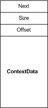

# NET\_BUFFER\_LIST\_CONTEXT Structure

NDIS drivers use [**NET\_BUFFER\_LIST\_CONTEXT**](/windows-hardware/drivers/ddi/nbl/ns-nbl-net_buffer_list_context) structures to store additional data that is associated with a [**NET\_BUFFER\_LIST**](/windows-hardware/drivers/ddi/nbl/ns-nbl-net_buffer_list) structure. The **Context** member of the NET\_BUFFER\_LIST structure is a pointer to a NET\_BUFFER\_LIST\_CONTEXT structure. The information stored in the NET\_BUFFER\_LIST\_CONTEXT structures is opaque to NDIS and other drivers in the stack.

The following figure shows the fields in a NET\_BUFFER\_LIST\_CONTEXT structure.

The [**NET\_BUFFER\_LIST\_CONTEXT**](/windows-hardware/drivers/ddi/nbl/ns-nbl-net_buffer_list_context) structure includes **ContextData** member that contains the context data. This data can be any context information that a driver requires for the [**NET\_BUFFER\_LIST**](/windows-hardware/drivers/ddi/nbl/ns-nbl-net_buffer_list) structure.

Drivers should use the following NDIS macros and functions to access and manipulate members in a NET\_BUFFER\_LIST\_CONTEXT structure:

[**NdisAllocateNetBufferListContext**](/windows-hardware/drivers/ddi/nblapi/nf-nblapi-ndisallocatenetbufferlistcontext)

[**NdisFreeNetBufferListContext**](/windows-hardware/drivers/ddi/nblapi/nf-nblapi-ndisfreenetbufferlistcontext)

[**NET\_BUFFER\_LIST\_CONTEXT\_DATA\_START**](/windows-hardware/drivers/ddi/ndis/nf-ndis-net_buffer_list_context_data_start)

[**NET\_BUFFER\_LIST\_CONTEXT\_DATA\_SIZE**](/windows-hardware/drivers/ddi/ndis/nf-ndis-net_buffer_list_context_data_size)

 

