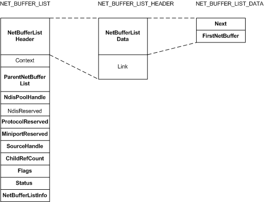

# NET\_BUFFER\_LIST Structure

A [**NET\_BUFFER\_LIST**](https://msdn.microsoft.com/library/windows/hardware/ff568388) structure packages a linked list of NET\_BUFFER structures.

The following figure shows the fields in a NET\_BUFFER\_LIST structure.

The NET\_BUFFER\_LIST structure includes a [**NET\_BUFFER\_LIST\_HEADER**](https://msdn.microsoft.com/library/windows/hardware/ff568400) structure in the **NetBufferListHeader** member. The NET\_BUFFER\_LIST\_HEADER structure includes a [**NET\_BUFFER\_LIST\_DATA**](https://msdn.microsoft.com/library/windows/hardware/ff568393) structure in the **NetBufferListData** member. You should use NDIS macros to access NET\_BUFFER\_LIST structure members. For more information about these macros, see the [**NET\_BUFFER\_LIST**](https://msdn.microsoft.com/library/windows/hardware/ff568388) structure reference page.

Some of the members are only used by NDIS. The members that drivers are most likely to use are defined in the following list:

**ParentNetBufferList**  
If a NET\_BUFFER\_LIST structure is a child that was derived from a parent(cloned, fragmented, or reassembled), **ParentNetBufferList** specifies a pointer to the parent NET\_BUFFER\_LIST structure. Otherwise, this parameter is **NULL**.

**NdisPoolHandle**  
Specifies a pool handle that identifies the NET\_BUFFER\_LIST pool from which the NET\_BUFFER\_LIST structure was allocated.

**ProtocolReserved**  
Reserved for use by protocol drivers.

**MiniportReserved**  
Reserved for use by miniport drivers.

**SourceHandle**  
A handle that NDIS provided to the driver in a binding or attaching operation by using one of the following driver-supplied routines:

Miniport Driver  
[*MiniportInitializeEx*](https://msdn.microsoft.com/library/windows/hardware/ff559389)

Protocol Driver  
[*ProtocolBindAdapterEx*](https://msdn.microsoft.com/library/windows/hardware/ff570220)

Filter Driver  
[*FilterAttach*](https://msdn.microsoft.com/library/windows/hardware/ff549905)

NDIS uses **SourceHandle** to return the NET\_BUFFER\_LIST structure to the driver that sent the NET\_BUFFER\_LIST structure. NDIS drivers should not read this handle.

**ChildRefCount**  
If a [**NET\_BUFFER\_LIST**](https://msdn.microsoft.com/library/windows/hardware/ff568388) structure is a parent (has children derived by clone, fragment, or reassemble operations), **ChildRefCount** specifies the number of existing children. Otherwise, this parameter is zero.

**Flags**  
Reserved for future specification of attributes for the NET\_BUFFER\_LIST structure. There are currently no flags available to drivers.

**Status**  
Specifies the final completion status of a network data operation for this NET\_BUFFER\_LIST structure. Miniport drivers write this value before completing a send operation.

**NetBufferListInfo**  
Specifies [**NET\_BUFFER\_LIST**](https://msdn.microsoft.com/library/windows/hardware/ff568388) structure information that is common to all [**NET\_BUFFER**](https://msdn.microsoft.com/library/windows/hardware/ff568376) structures in the list. This information is often referred to as "out-of-band (OOB) data."

**Next**  
Specifies a pointer to the next NET\_BUFFER\_LIST structure in a linked list of NET\_BUFFER\_LIST structures. If a NET\_BUFFER\_LIST structure is the last structure in the list, this member is **NULL**.

**FirstNetBuffer**  
Specifies a pointer to the first NET\_BUFFER structure in a linked list of NET\_BUFFER structures that is associated with this NET\_BUFFER\_LIST structure.

**Note**  **Context** is a pointer to a [**NET\_BUFFER\_LIST\_CONTEXT**](https://msdn.microsoft.com/library/windows/hardware/ff568389) structure. NDIS provides macros and functions to manipulate the data at **Context** . For more information about the NET\_BUFFER\_LIST\_CONTEXT structure, see [NET\_BUFFER\_LIST\_CONTEXT Structure](net-buffer-list-context-structure.md).

 

 

 

