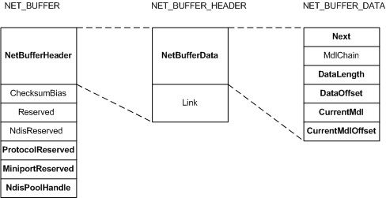
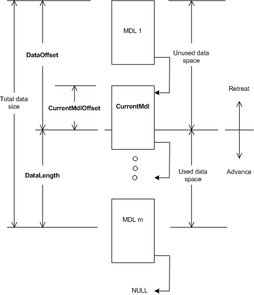

# NET\_BUFFER Structure

NDIS 6.0 and later [**NET\_BUFFER**](https://msdn.microsoft.com/library/windows/hardware/ff568376) structures are analogous to the [**NDIS\_PACKET**](https://msdn.microsoft.com/library/windows/hardware/ff557086) structures used by NDIS 5.*x* and earlier drivers. Each NET\_BUFFER structure packages a packet of network data.

The following figure shows the fields in a NET\_BUFFER structure.

The NET\_BUFFER structure includes a [**NET\_BUFFER\_HEADER**](https://msdn.microsoft.com/library/windows/hardware/ff568387) structure in the **NetBufferHeader** member. The NET\_BUFFER\_HEADER structure includes a [**NET\_BUFFER\_DATA**](https://msdn.microsoft.com/library/windows/hardware/ff568381) structure in the **NetBufferData** member. You should use NDIS macros to access NET\_BUFFER structure members. For a complete list of these macros, see the [**NET\_BUFFER**](https://msdn.microsoft.com/library/windows/hardware/ff568376) structure reference page.

Some of the [**NET\_BUFFER**](https://msdn.microsoft.com/library/windows/hardware/ff568376) structure members are only used by NDIS. The members that drivers typically use are:

**ProtocolReserved**  
Reserved for use by protocol drivers.

**MiniportReserved**  
Reserved for use by miniport drivers.

**NdisPoolHandle**  
Specifies a pool handle that identifies the NET\_BUFFER pool from which the NET\_BUFFER structure was allocated.

**Next**  
Specifies a pointer to the next NET\_BUFFER structure in a linked list of NET\_BUFFER structures. If this is the last NET\_BUFFER structure in the list, this member is **NULL**.

**DataLength**  
Specifies the length in bytes of the network data in the MDL chain.

**DataOffset**  
Specifies the offset, in bytes, from the start of memory in the MDL chain to the start of the network data in the MDL chain.

**CurrentMdl**  
Specifies a pointer to the first MDL that the current driver is using. This pointer provides an optimization that improves performance by skipping over any MDLs that the current driver is not using.

**CurrentMdlOffset**  
Specifies the offset, in bytes, to the beginning of the used data space in the MDL that is specified by the **CurrentMdl** member of the NET\_BUFFER structure.

The following figure shows the relationship between the **CurrentMdl**, **CurrentMdlOffset**, **DataOffset**, and **DataLength** members and the data space.

NDIS provides functions to manage the data space in the MDL chain. How drivers use the data space changes dynamically with the current driver. Sometimes there is data space that is currently unused by the current driver. Although the *unused data space* is currently unused, it can contain valid data. For example, on the receive path, the *unused data space* can contain header information that was used by a lower level driver.

Drivers perform retreat and advance operations to increase and decrease the *used data space*. For more information about retreat and advance operations, see [Retreat and Advance Operations](retreat-and-advance-operations.md).

The following terms and definitions describe elements of the [**NET\_BUFFER**](https://msdn.microsoft.com/library/windows/hardware/ff568376) data space:

Used data space  
*Used data space* contains data that the current driver is using at the current time. Drivers increase *used data space* with retreat operations and reduce *used data space* with advance operations.

Unused data space  
The current driver is not using this data space at the current time.

Total data size  
The total data size is the sum of the size of the *used data space* and *unused data space*. To calculate the total size, add the **DataOffset** to the **DataLength** .

Retreat  
Retreat operations increase the size of the *used data space*.

Advance  
Advance operations decrease the size of the *used data space*.

 

 

