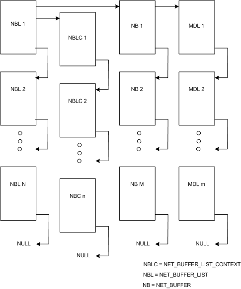

# Network Data Structures

Network data consists of packets of data that are sent or received over the network. NDIS provides data structures to describe and organize such data. The primary network data structures for NDIS 6.0 and later are:

-   [**NET\_BUFFER**](https://msdn.microsoft.com/library/windows/hardware/ff568376)
-   [**NET\_BUFFER LIST**](https://msdn.microsoft.com/library/windows/hardware/ff568388)
-   [**NET\_BUFFER\_LIST\_CONTEXT**](https://msdn.microsoft.com/library/windows/hardware/ff568389)

The following figure illustrates the relationships between these structures.

In NDIS 6.0 and later, the [**NET\_BUFFER**](https://msdn.microsoft.com/library/windows/hardware/ff568376) is the basic building block for packaging network data. Each NET\_BUFFER structure has an MDL chain. The MDLs map the addresses of data buffers to the data space that the NET\_BUFFER structures specify. This data mapping is identical to the MDL chains that NDIS 5.*x* and earlier drivers use in the [**NDIS\_PACKET**](https://msdn.microsoft.com/library/windows/hardware/ff557086) structure. NDIS provides functions to manipulate the MDL chain.

Multiple NET\_BUFFER structures can be attached to a NET\_BUFFER\_LIST structure. The NET\_BUFFER structures are organized as a NULL-terminated singly linked list. Only the driver that originates a NET\_BUFFER\_LIST structure, or NDIS, should modify the linked list directly to insert and delete NET\_BUFFER structures.

[**NET\_BUFFER LIST**](https://msdn.microsoft.com/library/windows/hardware/ff568388) structures contain information that describes all the [**NET\_BUFFER**](https://msdn.microsoft.com/library/windows/hardware/ff568376) structures that are attached to a list. If a driver requires additional space for context information, the driver can store such information in the NET\_BUFFER\_LIST\_CONTEXT structures. NDIS provides functions to allocate, free and access the data in the NET\_BUFFER\_LIST\_CONTEXT structures.

Multiple NET\_BUFFER\_LIST structures can be attached to form a list of NET\_BUFFER\_LIST structures. The NET\_BUFFER\_LIST structures are organized as a NULL-terminated singly linked list. Drivers can modify the linked list directly to insert and delete NET\_BUFFER\_LIST structures.

## Related topics

[**NET\_BUFFER**](https://msdn.microsoft.com/library/windows/hardware/ff568376)

[NET\_BUFFER Structure](net-buffer-structure.md)

[**NET\_BUFFER LIST**](https://msdn.microsoft.com/library/windows/hardware/ff568388)

[NET\_BUFFER\_LIST Structure](net-buffer-list-structure.md)

[**NET\_BUFFER\_LIST\_CONTEXT**](https://msdn.microsoft.com/library/windows/hardware/ff568389)

[NET\_BUFFER\_LIST\_CONTEXT Structure](net-buffer-list-context-structure.md)

 

 

