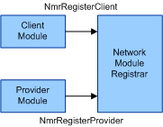
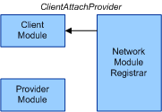
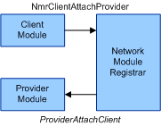
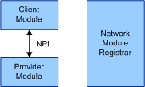

# Network Module Attachment

Before a [client module](client-module.md) and a [provider module](provider-module.md) can be attached to one another, they each must register themselves with the NMR. A client module registers with the NMR by calling the [**NmrRegisterClient**](/windows-hardware/drivers/ddi/netioddk/nf-netioddk-nmrregisterclient) function and a provider module registers with the NMR by calling the [**NmrRegisterProvider**](/windows-hardware/drivers/ddi/netioddk/nf-netioddk-nmrregisterprovider) function. The following diagram illustrates network module registration.

If the client module and the provider module both specify the same [Network Programming Interface (NPI)](network-programming-interface.md) when they register with the NMR, the NMR will initiate attaching the two network modules together. The NMR initiates the attachment process by calling the client module's [*ClientAttachProvider*](/windows-hardware/drivers/ddi/netioddk/nc-netioddk-npi_client_attach_provider_fn) callback function. The following diagram illustrates the Network Module Registrar (NMR) initiating the attachment.

A client module's [*ClientAttachProvider*](/windows-hardware/drivers/ddi/netioddk/nc-netioddk-npi_client_attach_provider_fn) callback function can examine the registration data for the provider module to determine if it will attach to the provider module. If the client module determines that it will attach to the provider module, it continues the attachment process by calling the [**NmrClientAttachProvider**](/windows-hardware/drivers/ddi/netioddk/nf-netioddk-nmrclientattachprovider) function. When a client module calls the **NmrClientAttachProvider** function, the NMR in turn calls the provider module's [*ProviderAttachClient*](/windows-hardware/drivers/ddi/netioddk/nc-netioddk-npi_provider_attach_client_fn) callback function. The following diagram illustrates the client module continuing the attachment.

A provider module's [*ProviderAttachClient*](/windows-hardware/drivers/ddi/netioddk/nc-netioddk-npi_provider_attach_client_fn) callback function can examine the registration data for the client module to determine if it will attach to the client module. If the provider module determines that it will attach to the client module, the provider module and client module exchange pointers to their respective NPI dispatch table structures. After the client module and provider module are attached, they can interact with each other through their NPI functions independent of the NMR. The following diagram illustrates the network modules attached.

