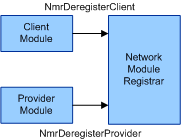
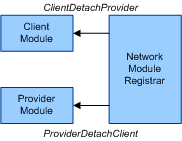
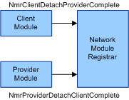
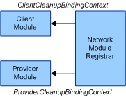
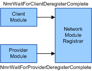

# Network Module Detachment

An attached pair of network modules are detached from each other when either the client module or the provider module deregisters with the Network Module Registrar (NMR). A client module deregisters with the NMR by calling the [**NmrDeregisterClient**](/windows-hardware/drivers/ddi/netioddk/nf-netioddk-nmrderegisterclient) function and a provider module deregisters with the NMR by calling the [**NmrDeregisterProvider**](/windows-hardware/drivers/ddi/netioddk/nf-netioddk-nmrderegisterprovider) function. The following diagram illustrates the network modules initiating deregistration.

When either network module deregisters with the NMR, the NMR calls both the client module's [*ClientDetachProvider*](/windows-hardware/drivers/ddi/netioddk/nc-netioddk-npi_client_detach_provider_fn) callback function and the provider module's [*ProviderDetachClient*](/windows-hardware/drivers/ddi/netioddk/nc-netioddk-npi_provider_detach_client_fn) callback function to initiate detaching the network module. The following diagram illustrates the NMR initiating the detachment.

If the client module is unable to detach itself from the provider module immediately, it calls the [**NmrClientDetachProviderComplete**](/windows-hardware/drivers/ddi/netioddk/nf-netioddk-nmrclientdetachprovidercomplete) function after it completes detaching itself from the provider module. Likewise, if the provider module cannot detach itself from the client module immediately, it calls the [**NmrProviderDetachClientComplete**](/windows-hardware/drivers/ddi/netioddk/nf-netioddk-nmrproviderdetachclientcomplete) function after it completes detaching itself from the client module. The following diagram illustrates the network modules completing the detachment.

After both the client module and the provider module have completed detachment from each other, the NMR calls the client module's [*ClientCleanupBindingContext*](/windows-hardware/drivers/ddi/netioddk/nc-netioddk-npi_client_cleanup_binding_context_fn) callback function and the provider module's [*ProviderCleanupBindingContext*](/windows-hardware/drivers/ddi/netioddk/nc-netioddk-npi_provider_cleanup_binding_context_fn) callback function so that the network modules can clean up their respective binding contexts for the attachment. The following diagram illustrates the NMR initiating cleanup.

If the client module deregistered with the NMR, the deregistration of the client module is not complete until the client module has completely detached from all of the provider modules that it was previously attached to and all of those provider modules have completely detached from the client module. The client module waits for the deregistration to complete by calling the [**NmrWaitForClientDeregisterComplete**](/windows-hardware/drivers/ddi/netioddk/nf-netioddk-nmrwaitforclientderegistercomplete) function. Likewise, if the provider module deregistered with the NMR, the deregistration of the provider module is not complete until the provider module has completely detached from all of the client modules that it was previously attached to and all of those client modules have completely detached from the provider module. The provider module waits for the deregistration to complete by calling the [**NmrWaitForProviderDeregisterComplete**](/windows-hardware/drivers/ddi/netioddk/nf-netioddk-nmrwaitforproviderderegistercomplete) function. The following diagram illustrates the network modules waiting for deregistration to complete.

