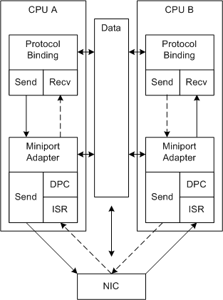

# Non-RSS Receive Processing

Miniport drivers that do not support RSS handle receive processing as described in this topic.

The following figure illustrates non-RSS receive processing.

In the figure, the dashed paths represent an alternate path for the send and receive processing. Because the system controls the scaling, the processing doesn't always occur on the CPU that provides the best performance. Connections are processed on the same CPU over successive interrupts only by chance.

The following process repeats for each non-RSS interrupt cycle:

1.  The NIC uses DMA to fill a buffer with received data and interrupts the system.

    The miniport driver allocated the receive buffers in shared memory during initialization.

2.  The NIC can continue to fill additional receive buffers at any time in this interrupt cycle. However, the NIC does not interrupt again until the miniport driver enables interrupts.

    The received buffers that the system handles in one interrupt cycle can be associated with many different network connections.

3.  NDIS calls the miniport driver's [*MiniportInterrupt*](https://msdn.microsoft.com/library/windows/hardware/ff559395) function (ISR) on a system-determined CPU.

    Ideally, the ISR should go to the least busy CPU. However, in some systems, the system assigns the ISR to an available CPU or to a CPU that is associated with the NIC.

4.  The ISR disables the interrupts and requests NDIS to queue a deferred procedure call (DPC) to process the received data.

5.  NDIS calls the [*MiniportInterruptDPC*](https://msdn.microsoft.com/library/windows/hardware/ff559398) function (the DPC) on the current CPU.

6.  The DPC builds receive descriptors for all of the received buffers and indicates the data up the driver stack. For more information, see [Receiving Network Data](receiving-network-data.md).

    There can be many buffers for many different connections and there is potentially a lot of processing to complete. The received data associated with subsequent interrupt cycles can be processed on other CPUs. The send processing for a given network connection can also run on a different CPU.

7.  The DPC enables the interrupts. This interrupt cycle is complete and the process starts again.

 

 

