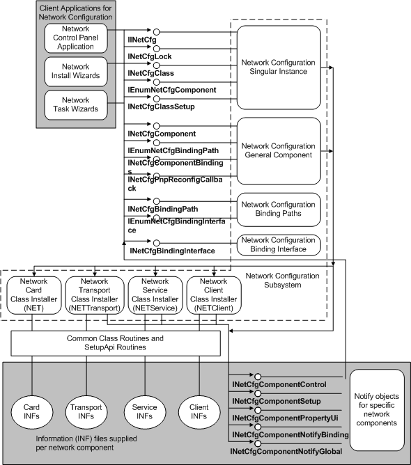

# Notify Object Diagram

The following diagram shows how client applications that install or control networking call the *network configuration subsystem*. This subsystem calls network class installers to install network components and to register notify objects for those components. Notify objects call back to the subsystem to configure the network on behalf of those components that own the objects.

 

 

