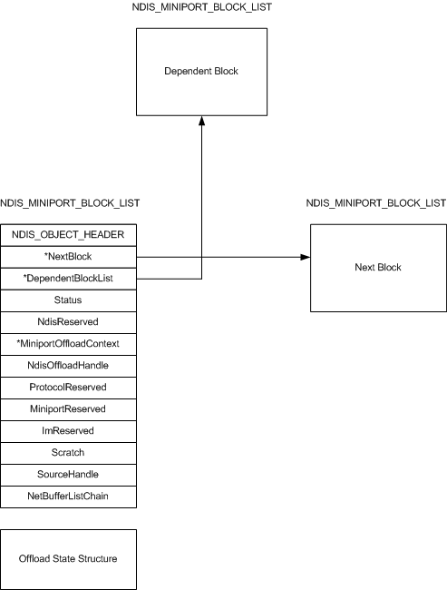

# Offload Block Lists

\[The TCP chimney offload feature is deprecated and should not be used.\]

The basic building block of an [offload state tree](offload-state-tree.md) is the [**NDIS\_MINIPORT\_OFFLOAD\_BLOCK\_LIST**](https://msdn.microsoft.com/library/windows/hardware/ff566469) structure, which is also called an *offload block list*. The following figure shows the members of an NDIS\_MINIPORT\_OFFLOAD\_BLOCK\_LIST structure.

The [**NDIS\_OBJECT\_HEADER**](https://msdn.microsoft.com/library/windows/hardware/ff566588) member contains a **Type** member that specifies the type of offload state and, by implication, the [offload state structures](offload-state-structures.md) or structures that immediately follow the NDIS\_MINIPORT\_OFFLOAD\_BLOCK\_LIST structure in memory. This offload state is either all or part of a [neighbor, path, or TCP state object](offload-state-objects.md).

The **NextBlock** member points to another NDIS\_MINIPORT\_OFFLOAD\_BLOCK\_LIST structure that is the next block at that layer (neighbor, path, or TCP) of the offload state. The next block and the block that points to it are always at the same layer of offload state. For example, a block that is at the TCP offload layer can point only to a next block that is also at the TCP offload layer. A value of **NULL** in **NextBlock** indicates that there is no additional NDIS\_MINIPORT\_OFFLOAD\_BLOCK\_LIST structure at the same offload layer.

The **DependentBlockList** member points to another NDIS\_MINIPORT\_OFFLOAD\_BLOCK\_LIST structure that is at a dependent layer of offload state. That is, a block list at the neighbor layer can point only to a dependent block list that is at the path layer. Or, a block list at the path layer can point only to a dependent block list that is at the TCP layer. A value of **NULL** in **DependentBlockList** indicates that there is no dependent NDIS\_MINIPORT\_OFFLOAD\_BLOCK\_LIST structure that is linked to the block list.

Before completing an offload, query, invalidate, update, or terminate operation on the state that is associated with an NDIS\_MINIPORT\_OFFLOAD\_BLOCK\_LIST structure, an offload target writes the completion status of the operation to the **Status** member of the block list.

The host stack and offload target also use the **MiniportOffloadContext** and **NdisOffloadHandle** members to reference an offloaded state object. For more information about an offload target uses the **MiniportOffloadContext** and **NdisOffloadHandle** members, see [Storing and Referencing Offloaded State](storing-and-referencing-offloaded-state.md).

 

 

