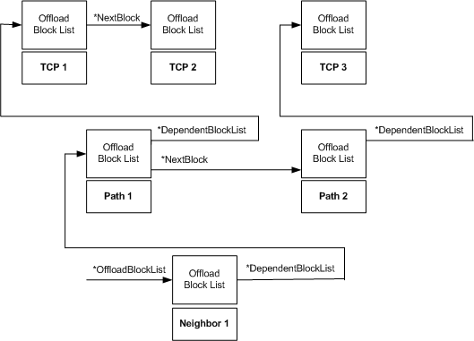

# Offload State Tree

\[The TCP chimney offload feature is deprecated and should not be used.\]

The host stack can link [**NDIS\_MINIPORT\_OFFLOAD\_BLOCK\_LIST**](https://msdn.microsoft.com/library/windows/hardware/ff566469) structures to create a tree of state objects. By conveying a state tree to an offload target, the host stack can efficiently offload or reference multiple TCP connections, the path and neighbor state objects that are associated with such connections, or both.

The following figure shows an example of an offload state tree.

To convey a state tree to an offload target, the host stack passes an *OffloadBlockList* pointer that points to the root block list in the tree. The rest of the block lists in the tree are ultimately linked to the root block lists through dependent links and next block links.

Dependent block links create the vertical dimension of the tree. Next block links create the horizontal dimension of the tree. A TCP chimney tree can have only the following three levels in the vertical dimension:

-   Neighbor (bottom layer)

-   Path (middle layer)

-   TCP connection (top layer)

There is no theoretical limit to the number of state objects that can be linked at a particular state layer.

As the preceding figure shows, multiple state objects at one level in the tree can share (that is, be linked to) a single state object at the next lower level in the tree, as follows:

-   More than one TCP state object can share the same path state object. For example, the TCP1 and TCP2 state objects share the Path1 state object. All of the TCP connections that share the same path state object use the same network interface and use the same path maximum transmission unit (MTU). The TCP connections that share the same path state are said to *depend* on that path state.

-   More than one path state object can share the same neighbor state object. For example, the Path1 and Path2 state objects share the Neighbor1 state object. All of the paths that share the same neighbor have the same next hop destination.

 

 

